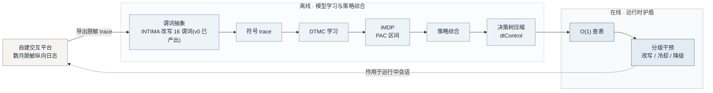
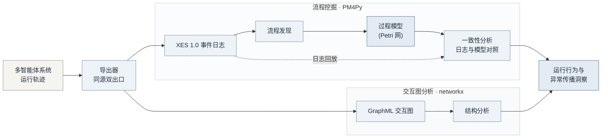

<!-- 草稿,配合 onepager_draft_v1.md 使用;外发前须经用户确认 -->

# diagram/ — 一页纸配套管线示意图(mermaid 源)

> 2026-08-13 产出。两张图分别配合一页纸 Research Statement 的两个受众版本,用于面谈展示或嵌入一页纸/幻灯。
> 本目录只含 mermaid 源与本说明;本机无离线 mermaid 渲染工具(探测记录见下),SVG/PNG 需按"出图方法"自行导出。

## 一、两图用途与受众

| 文件 | 标题 | 受众 / 场合 | 要点 |
|---|---|---|---|
| `pipeline_shield.mmd` | 概率行为护盾管线(通用版) | 通用学术场合,配合 `onepager_draft_v1.md` 研究兴趣段 | 完整方法链条:平台日志 → 谓词抽象 → DTMC → iMDP → 策略综合 → 决策树 → O(1) 查表 → 分级干预;subgraph 区分离线/在线两域 |
| `pipeline_lu.mmd` | 多智能体行为日志分析管线(鲁版) | 鲁法明老师(Petri 网 / 流程挖掘方向)面谈 | 只讲"轨迹 → XES/GraphML 双出口 → PM4Py 流程发现·一致性分析(含 Petri 网过程模型)/ networkx 结构分析 → 行为与异常传播洞察";**全图不出现护盾 / DTMC / iMDP / PAC / 概率保证等词**(对齐 `OE1_lu_email_v4.md` §3 雷区) |

两图均守脱敏口径:自有系统只称"自建交互平台"(全称"自建长期人机交互平台");无"全球唯一 / 保证安全"类禁语。

> **导出命名纪律**:对外发送/投屏的导出文件请用**中性文件名**(如 `mas_log_analysis.svg`、`method_pipeline.svg`),不得沿用 `pipeline_lu` / `pipeline_shield` 等带受众/内部叙事的名字;鲁场景只用图 2,且 `pipeline_shield` 的任何导出不得出现在鲁场景。

## 二、图 1 源码(通用版,可整块粘贴)

与 `pipeline_shield.mmd` 一致(略去文件头注释):



## 三、图 2 源码(鲁版,可整块粘贴)

与 `pipeline_lu.mmd` 一致(略去文件头注释):



## 四、渲染工具探测记录(2026-08-13,本机 WSL2)

- `mmdc`(mermaid-cli):**未安装**。
- `node` v24.5.0、`npx` 11.10.1:存在,但本地无 `@mermaid-js/mermaid-cli` 包,`npx` 执行需联网下载(按纪律禁止联网安装),故**本次未渲染 SVG/PNG**。
- 后续如需本地渲染:在可联网环境 `npm install -g @mermaid-js/mermaid-cli` 后执行:

```bash
cd MAS_Safety_Project/research/map/proposals/diagram
mmdc -i pipeline_shield.mmd -o pipeline_shield.svg -b white
mmdc -i pipeline_shield.mmd -o pipeline_shield.png -b white -s 2
mmdc -i pipeline_lu.mmd -o pipeline_lu.svg -b white
mmdc -i pipeline_lu.mmd -o pipeline_lu.png -b white -s 2
```

## 五、无本地渲染时的出图方法(任选其一)

1. **mermaid.live(推荐,最快)**:打开 <https://mermaid.live>,把上面源码块整块粘贴进左侧编辑器,右侧实时预览;右上 Actions → 导出 PNG(选高分辨率)或 SVG。白底默认即是。
2. **Cursor / VS Code 预览截图**:直接打开本 README 的 Markdown 预览(Cursor 内置 mermaid 渲染;VS Code 可用 "Markdown Preview Mermaid Support" 插件),对渲染结果截图。适合快速嵌幻灯,清晰度略逊于导出 SVG。
3. **GitHub 预览**:若仓库推到 GitHub,本 README 中的 mermaid 块会自动渲染,可直接截图。
4. 图内文字均已脱敏,粘贴到上述第三方页面无额外泄露风险;但仍建议优先本地/离线方式。

## 六、嵌入一页纸 HTML 的说明

`proposals/render/` 目前只有 `onepager.css`(A4 学术排版),尚无 HTML 生成脚本落地。两种通用嵌法:

1. **静态图(推荐,打印最稳)**:按上节导出 SVG 后,在一页纸 HTML 中 ``(或将 SVG 内联进 HTML)。SVG 矢量打印不糊,且不依赖运行时脚本,配合 `onepager.css` 的 `@page` A4 打印无副作用。
2. **mermaid.js 动态渲染**:在 HTML 中引入 mermaid.js(CDN 或本地拷贝),把源码放入 `<pre class="mermaid">…</pre>` 并初始化:

```html
<script type="module">
  import mermaid from "https://cdn.jsdelivr.net/npm/mermaid@11/dist/mermaid.esm.min.mjs";
  mermaid.initialize({ startOnLoad: true, theme: "neutral" });
</script>
```

   注意:动态渲染依赖打开时联网(或本地存一份 mermaid.esm.min.mjs);打印前需等渲染完成。对外发 PDF 的场景,仍以方式 1 静态 SVG 为准。

两张图均为 `flowchart LR` 横向布局,适合一页纸内嵌为通栏图(建议置于"研究兴趣 / 方法"段之后,宽度 100%、高度自适应)。
