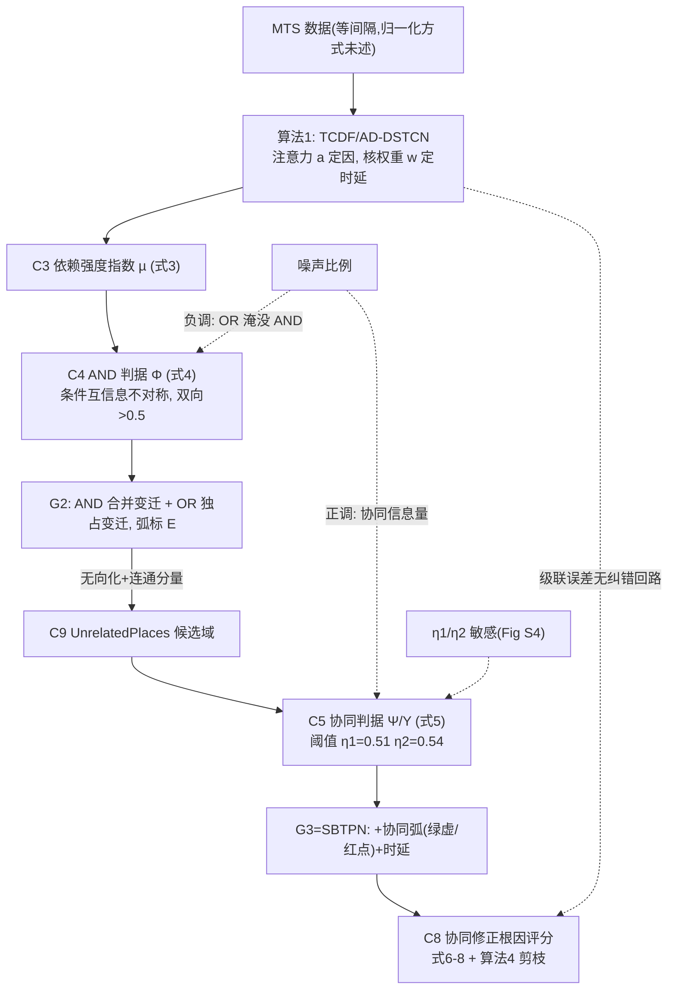

# 01b · SBTPN:六点第一性原理 + 张力结构 + 知识图谱 + 批判四审视(完整框架分析卡)

- 论文:X. Wang, F. Lu, M. C. Zhou, Q. Zeng, "A new knowledge mining and root cause analysis methodology for multivariate time series," IEEE/CAA J. Autom. Sinica, vol. 13, no. 5, pp. 1054–1067, May 2026, DOI 10.1109/JAS.2026.125837(身份卡、作者线、代码与补充材料清单见 01 卡卷首)
- 分析对象文本:_launch/pdftxt/SBTPN.txt(正文 14 页,全文通读)+ _launch/pdftxt/SBTPN_supp.txt(补充材料 PDF 共 7 页,页界已用 pdftotext 分页抽取逐一核定);前身论文 SBPN(Inf. Sci. 680:121019, 2024)仅按需检索其文本层用于特命切割
- 分析角色:为 01 卡(事实层,R7 复审判定高可信)补分析层。事实与方法细节一律"见 01 卡 §X",本卡不复写;本卡增量 = 六点分析、张力结构、知识图谱、四审视、SBPN/SBTPN 首发权切割
- 页锚约定:[SBTPN p.N] = 正文 PDF 第 N 页(N=1..14,对应刊页 1053+N;如 [SBTPN p.4] = 刊页 1057);[supp p.X] = 补充材料第 X 页(X=1..7);[SBPN p.X] = 前身论文 PDF 第 X 页(=刊页,X=1..25,按其文本层页脚行映射法核定,方法:独立数字行为该页末、其后紧跟下一页页眉)
- 符号约定:公式全部纯文本。•ri = 节点 ri 的前集;ri• = 后集;p̂ / p̌ = β(p) 真/假,t̂ / ť = 变迁使能/未使能(同 06b 惯例);µ = 依赖强度指数(定义 3 原文符号;01 卡记作 Θ,同一物);协同判定阈值在正文文本层显示为 η1/η2、在 06/01 卡记作 η1/η2〔08-22 字形已核:原文为 η,视觉读 PDF p.1058,原记 θ 系字形误读〕(见附·存疑清单 S2 已销)
- 重审注入声明:本卡吸收 _review_20260815/R7_legacy_cards_recheck.md 中关于 01 卡的全部条目(1-1~1-4 首发归属误读面、1-5a RP 域内协同被弃、1-7 T4 借力改道)与 bridge/SBPN_T4_bridge.md §0 的两个定性(SBPN 是静态截面方法非时序方法;"等间隔时序假设"属 SBTPN;SBPN 本体无根因反演层)。旧卡的"首发"语感不再出现,归属判定全部收拢到本卡特命节

---

## 一、六点第一性原理分析

> 编排说明:06 卡七节结构中的"方法逐式恢复"(其 §4)与"实验基础数据"(其 §5)两点已由 01 卡 §2/§3 承担且经 R7 复审,本卡按任务规格折叠为交叉引用;六点的其余四点(Task/Challenge/Insight&Novelty/Potential flaw/Motivation 问句链)全幅展开。

### 1. Task:解决什么问题(形式化)

**输入**:
- 多变量时序数据集 D:X = {x1, …, xm},每条序列 ζ 个时间步([SBTPN p.5] "total number of time steps ζ";等间隔采样隐含——bridge 定性一确认该假设属于本文的 TCDF 底座,而非 PN 方法族共性);
- 超参:AND 判定双向阈值(固定 0.5,[SBTPN p.5])、协同判定阈值 η1/η2 ∈〔08-22 字形勘误:原文为 η,原记 θ〕 [0.5,1)([SBTPN p.5];实验取 0.51/0.54,[supp p.4])、TCDF 卷积核窗宽 R(决定可检时延上限 R−1,[SBTPN p.4]);
- 异常事件:异常状态对应的库所集 PA(算法 4 输入,[supp p.5])。

**输出**(两级):
- (a) SBTPN 九元组 (X, P, β, T, F, S, E, Pr, M)(定义 1,[SBTPN p.4];形式语义见 01 卡 §2.1)= 一张同时携带 AND/OR 分组、协同弧、时延标注与概率语义的时间因果规则网;
- (b) 每个异常库所 pj 的根因集 RootCause(pj)(算法 4,[supp p.5])。

**约束**(文面可见的预设):
- 观测数据即可,不要求外部干预(干预只出现在 TCDF 内部的置换验证里,[SBTPN p.4]);
- |pi• ∩ •pj| = 1:每个直接因-效对只许共享一个变迁(定义 1 注 2,[SBTPN p.4]);
- 判定量按 [0.5,1) 截断为真([SBTPN p.5])——方法实际运行在二值化语义上,原始连续量的归一化/离散化工序全文未述(grep 核实无 normalize/discretize 类词;[需验证]);
- 时延为非负整数步,E: P×P → [0,+∞)([SBTPN p.4]);
- 初始标记 = 变量先验概率,由样本频率计算,数据稀缺时专家给定([SBTPN p.4])。

**评价口径**:12 个挖掘指标(d/a/s/e × Recall/Precision/F1,[SBTPN p.9])+ RCA 余弦相似度均值(式 9,[SBTPN p.9]);对手 TCDF [39]、PCMCI [43][44]、MTE [34]、MLP-GC [45]([SBTPN p.7])。

=第一性原理思考=(推断,非原文)这个 task 的本质是把"异常归因"从"两两因果图上的打分"改造成"规则级带调制网上的搜索 + 重打分"。它内置两个赌注:(i) 表示赌注——AND/OR+协同这一表示层增量足以翻转归因结论(表 III 支持,x20 上对手崩到 0.24 vs 本文 0.97,[SBTPN p.10]);(ii) 底座赌注——TCDF 的注意力分数与核权重是可靠的强度/时延传感器,其在第一步的漏检不会在二级挖掘中被放大或纠正(全文无级联误差的隔离实验,见 四.2 L3)。

### 2. Challenge:传统方法的困难

1. **时序因果发现只产出两两带时滞的有向边,组合结构不可辨**。五族方法(constraint/score/结构方程/Granger/深度学习,[SBTPN p.2])无一表达 AND/OR;原文对 PCMCI 结果的判语适用于全体:"all existing temporal causal discovery methods suffer from this issue"([SBTPN p.8]);Fig 4(b) 中 PCMCI 无法区分 IF p7 AND p8 AND p9 THEN p13 与 IF p11 OR p12 THEN p15([SBTPN p.7-8])。
2. **协同效应缺位导致两种系统性错法**。MTE 与 PCMCI 把多数协同效应误标为因果关系,TCDF 忽略全部、MLP-GC 忽略多数,"These two ways of dealing with synergy effects can weaken the reliability of RCA"([SBTPN p.9]);具体后果:PCMCI 把质检库所 p31 当作 p19 的因,无法刻画"质检阻止缺陷品流转"([SBTPN p.7-8]);四个对手把 x14^(τ−3) 判为 x20^τ 的根因,因学不出 p29 对 p14→p17 规则的抑制([SBTPN p.10],配 Fig 6)。
3. **AND 结构盲区的直接误报**:问题描述案例中 x1∧x2→x6 被拆成两条独立边,x1^(τ−5) 合格时现有方法仍可能把 x2^(τ−4) 判为根因,"inconsistent with the fact"([SBTPN p.3])。
4. **BN 的表达极限与其常规补法的死结**。BN 不显式表达时间约束的 AND/OR 与协同([SBTPN p.4]);常规补法是增设一个聚合 AND 的中间 BN 变量,但该变量不在原始数据中、"impossible to directly discover the causal relation between it and other variables in the BN from the data"([supp p.1])。
5. **组合因挖掘的复杂度墙**:已有挖 AND 关系的方法 [40][41] 复杂度分别为 O(m^m)、O(2^m),大网络不可行([SBTPN p.6])。
6. **噪声的双面夹击**:指向同一效应变量的 OR 结构越多,AND 越难辨("The 'OR' structure can weaken the correlation between the cause variables in the 'AND' structure and the effect variable",[SBTPN p.9];机理段 [supp p.5]);而噪声又是协同效应存在的前提([supp p.5])——同一参数在不同数据性质下被要求向相反方向调(详见 四.1 M4)。
7. **可解释性缺口**:深度学习类 RCA 黑箱、解释性差(引 [14][15],[SBTPN p.2]);多元统计类受线性/正态假设与数据质量限制([SBTPN p.1])。

### 3. Insight & Novelty

#### 3.1 Inspiration 来源

- **Insp-1(TCDF [39] 的副产物传感器)**:注意力分数 aij 定因、核权重 wij 定时延,是现成框架免费输出的两类统计量([SBTPN p.4-5])。TCDF 是全文唯一指名的学习底座("SBTPN is presented based on TCDF",[SBTPN p.9])。
- **Insp-2(PN 的规则语义)**:变迁天然是多输入合取规则,"指向同一变迁的输入库所间即 AND";库所/变迁二分把变量与规则分开建模(PN 文献 [27]-[29]、时序 PN [37][38],[SBTPN p.2-3])。
- **Insp-3(BN 的证据推理与低数据质量容忍)**:"BNs can perform interpretable probabilistic reasoning under uncertainty and have low data quality requirements [14]"([SBTPN p.3];注意"低数据质量要求"这一承重论断的唯一定位是 [14],见 三.6)。
- **Insp-4(化学反应的催化/抑制现象)**:催化剂/抑制剂改变反应发生概率却不是反应物——"非因变量调制规则"的领域原型(抑制剂定义与例,[supp p.1-2])。
- **Insp-5(条件互信息探测交互)**:用"另一因真/假两种条件下互信息的不对称"判定两因绑定,数学骨架与前身 SBPN 式(6)+定理 1 同型([SBPN p.10-11]);本文文面未标注此来源(SBTPN 参考文献表 pp.13-14 无 SBPN 引用,grep 核实),首发权切割见特命节第 3 行。

#### 3.2 每个 Insight 是什么、在什么方面、被哪个 Inspiration 启发

| # | Insight | 在什么方面 | 被谁启发 | 原文锚 |
|---|---------|-----------|---------|--------|
| A | "因果规则"应升格为一等图节点(而不只是边的属性),从而可进入概率因子化 | 知识表示方面 | Insp-2 + Insp-3 | 式(2):Pr(r1,…,r_(m+n)) = ∏ Pr(ri | •ri),ri 遍历库所与变迁,[SBTPN p.4] |
| B | 调制 ≠ 因果:改变"规则成立概率"的非前件变量需要第三种身份(独立弧类),不能并入因/非因二分 | 因果语义方面 | Insp-4 | S ⊆ P×T 协同关系弧,绿虚线=催化、红点线=抑制,[SBTPN p.2-4; supp p.2] |
| C | 交互可由条件互信息的条件不对称检出:ϕ1 = I(µik; xk | µ̌jk) < ϕ2 = I(µik; xk | µ̂jk) 当且仅当"另一因为真时本因的信息量骤增",即 AND 绑定信号 | 统计检验方面 | Insp-5 | 式(4):Φ(xi,xj,xk) = 1/(1+exp(ϕ1−ϕ2)),双向 > 0.5 判 AND,[SBTPN p.5] |
| D | 现成因果 CNN 的注意力/核权重可复用为时延与依赖强度的传感器,不必另造估计器 | 组件复用方面 | Insp-1 | 定义 2(w^τ−k_ij = max 则时延为 k)、定义 3(µ 指数 = 时延窗内按核权重加权的输入均值),[SBTPN p.4-5] |
| E | 协同候选只应在结构无关变量里找(G2 无向化后不同连通分量),既符合"非因"定义又剪掉大部分假协同来源 | 搜索空间剪枝方面 | 由 B 推导的设计决策(本文自设) | UnrelatedPlaces(tk) = P − RelatedPlaces(tk),[SBTPN p.5; supp p.4] |

#### 3.3 Novelty 属哪一层

- **架构层**:SBTPN 九元组——对经典 PN 与 BN 各做一处结构改造:S 从无到有进入元组(协同从系数升格为弧集)、E 时延函数进元组、Pr 的定义域扩到 P∪T(变迁进联合分布)([SBTPN p.4])。相对前身 SBPN 八元组的增量边界见特命节第 1/2/6 行。
- **方法层**:三段挖掘管线(简单时序因果 → AND/OR → 时序协同)+ 协同感知 RCA(式(6)-(8) 修正 + 算法 4 剪枝)([SBTPN p.4-6; supp p.3-5]),以及复杂度论证(O(m²) 对 [40] O(m^m)/[41] O(2^m),靠"合并指向同一效应变量的冗余变迁",[SBTPN p.6])。
- **策略层**:µ 指数复用核权重(Def 3)、η1=0.51/η2=0.54 取值〔08-22 字形勘误〕([supp p.4])、0.5 二值化边界、初始标记由频率或专家给出([SBTPN p.4])。

#### 3.4 逐创新点(严格三段格式)

- **N1 复杂时序因果关系挖掘框架**(对应论文贡献 1,[SBTPN p.2]):【解决的问题】现有时序因果发现只能给两两边,AND/OR 分组与时延不可辨识(Challenge 1/3)→【受哪个 insight 启发】C + D →【设计了什么创新点】在 AD-DSTCN 底座上定义依赖强度指数 µ(式 3,核权重加权时窗均值)作为一切二级判定的统一原料;AND 用 Φ(式 4)双向判据检出并经子集去冗余("删小留大")合并为共享变迁,OR 成员各占变迁;所有弧按定义 2 标注整数步时延(算法 1-2,[SBTPN p.4-5; supp p.3-4])。
- **N2 SBTPN 知识表示模型**(对应论文贡献 2 的表示半边,[SBTPN p.2]):【解决的问题】BN 表达不了时间约束 AND/OR 与协同、AND 中间变量法陷入"学不出不存在于数据中的变量"死结(supp p.1);PN 有结构无概率推理(Challenge 4)→【受哪个 insight 启发】A + B →【设计了什么创新点】九元组定义 1:变迁作为规则节点直接进入联合分布式(2);S 协同弧集 + E 时延函数入元组;变迁使能语义连续化——Pr(t̂k | 全部输入有影响) = Pr(∪{µ̂aj}),任一输入缺失则为 0(§V-E,[SBTPN p.5-6])。
- **N3 时间约束下的协同效应挖掘算法**:【解决的问题】调节者要么被误判为因(MTE/PCMCI 型错误)要么被丢弃(TCDF/MLP-GC 型错误)(Challenge 2),且协同的产生本身有时延要标定 →【受哪个 insight 启发】B + E(+C 的 sigmoid 归一形式)→【设计了什么创新点】UnrelatedPlaces 候选域上以 Ψ = 1/(1+exp(ψ1−ψ2)) 判催化、Υ = 1/(1+exp(ψ2−ψ1)) 判抑制(ψ1 = Pr(p̂j | 全部因为真),ψ2 = Pr(p̂j | 全部因为真且候选为真)),过 η1/η2 即建弧,弱弧同样按定义 2 标时延(算法 3,[SBTPN p.5; supp p.4])。
- **N4 协同效应感知的 RCA 算法**:【解决的问题】抑制效应阻断异常传播导致误归因(x14^(τ−3) 被 four peers 误判为 x20^τ 根因,[SBTPN p.10]),现有 RCA 方法无一考虑协同("not seen in any existing RCA methods",[SBTPN p.2],该全称断言的批判见 四.2 L2)→【受哪个 insight 启发】A + B →【设计了什么创新点】根因分 Pr(p̂i|p̂j) 经催化上调(式 6:加 λ+x·Pr(p̂x|p̂j)(1−Pr(p̂i|p̂j)))与抑制下调(式 7:减 λ−y·Pr(p̂y|p̂j)·Pr(p̂i|p̂j))后取算术平均(式 8,λ± 为 ψ1/ψ2 差的函数;pdftxt 中式(6)(7) 的 λ 表达式乱码,校正转写见 01 卡 §2.3);再经算法 4 三道工序:[0.5, δ] 门槛入候选 → 因果路径完整性剪枝(路径上有变迁输入不全异常则剔)→ 沿输入链取最深候选为根因([SBTPN p.6; supp p.5])。

### 4. Potential flaw

#### 4.1 情境局限与延伸架构可能

- **二值化语义与预处理黑箱**:全部判定量(µ、ψ1/ψ2、Pr)在 [0,1] 上以 0.5 为界运行([SBTPN p.5]),但原始连续 MTS 如何进入该区间(归一化?离散化?)正文与补充材料均未述(grep 核实;[需验证] 是否只在代码里)。故障的"程度"信息在此丢失,只剩"是/否异常"。延伸架构:模糊/连续标识(组内模糊 PN 谱系 [32][33] 的方向,[SBTPN p.13-14]),或给库所挂多级状态。
- **等间隔采样 + 有限时延窗**:时延 = 非负整数步且上限 R−1([SBTPN p.4]);超出窗宽的因果不可见。bridge 定性一已裁定:此假设属 SBTPN(TCDF 卷积底座),不是 PN 方法族共性——事件型/非等间隔数据(MAS 轨迹、告警流)需窗口聚合或换事件序列底座(bridge/SBPN_T4 §1.1)。延伸:自适应/多尺度核,或对齐 SBPN 的静态模式做双模。
- **单变迁假设**:|pi• ∩ •pj| = 1(定义 1 注 2,[SBTPN p.4])排除一对因效间多条并行机制——真实工业过程中同一上游可经不同机理影响同一下游。
- **环语义未定义**:PN 结构允许环,BN 式因子化(式 2)默认 DAG 语义;若学得的网含反馈回路(闭环控制过程常态),式(2) 分解的良定性无任何讨论(全文 grep 无 cycle/acyclic 断言;[⚠️存疑] 可能隐含假设 TCDF 输出无环而未明言)。TE 过程本身就有反馈控制系统([SBTPN p.10]),这是论文自己的实验对象与自身形式化的潜在冲突点。
- **规模墙**:O(m²l) + 三处 O(m³)([SBTPN p.6]);31 变量的案例可行,数百变量即受限——作者自认大规模 MTS 效率是未来工作并点名 GNN 方案([SBTPN p.13])。

#### 4.2 数据坏性质导致的特别困难

- **噪声比例的非单调可控区**(supp p.5-6):太少 → 协同无信息量(确定性因果无协同);太多 → AND 被 OR 淹没 + η 低时假协同涌入。最优噪声区间存在但随系统而变,固定 η 无法跨数据集迁移。
- **近确定性系统退化**:强一致流水线、硬实时控制环等近似确定性场景下协同前提消失(supp p.5),方法实质退化为 TCDF + AND 挖掘。
- **闭环反馈混淆**:TE 类过程带控制器回路([SBTPN p.10]),Granger/卷积类底座在闭环下的伪因果风险全文未讨论——学到的"x7(H)→x16(H)"类边可能混入控制回路效应。
- **稀有异常与先验失真**:初始标记靠样本频率([SBTPN p.4]),异常稀有则先验概率趋零,RCA 打分的基准被压低。
- **缺失值与不规则采样**:未处理;对比文献 [11](gated RNN RCA)反而明确处理 irregular sampling([SBTPN p.2])——对手谱系覆盖了本文不覆盖的坏性质。

#### 4.3 哪个困难值得深挖写 paper

1. **【R7 指定评估】弃用 tan 滤波与 η1/η2 阈值敏感是否相关?** 判定:有关联,但机制不是简单"删了一道防线",而是"职能转移+残余风险重新集中"。证据链:(i) SBPN 引入滤波的动机原文:"incorrect antecedent-consequence relations learned from data can affect the effectiveness of identifying synergy effects. To address this issue, a filter function, y = tan(k(x − 0.5)) (0 < k < π), is presented to capture the synergy effects imposed on a rule with high credibility"[SBPN p.13]——软门控,专门压制步骤 1 误学边上的假协同信号(06 卡 §4.7 称之为软门控,k=2π/3);(ii) SBTPN 式(5) 直接对 ψ1/ψ2 差取 sigmoid,无此道工序 [SBTPN p.5];(iii) supp Fig S4 显示 η 过高 → 完全丧失协同识别(强协同与因果难分)、η2 过低 → 噪声干扰,"the thresholds … should be determined cautiously"[supp p.6]。评估:弃 tan 后,压制假协同的职能由两个部件分摊——候选集收窄(UnrelatedPlaces 只留不同连通分量,supp p.4;误学因果边的两端库所天然同连通分量,恰是 SBPN RP 域内模式的高发区 [SBPN p.13],故 UP-only 结构性排除了大部分假信号源)+ 硬阈值。因此更准确的假说是:**tan 的软门控被 UP-only 候选集部分替代,未被替代的残余风险转移到硬阈值上,表现为 η 敏感**。定论需一个论文可写的消融:{tan, no-tan} × {UP, UP∪RP} 网格下的 η 敏感曲线;顺带回答"SBPN 的 tan 到底买到了什么"。配套的自动定阈(置换检验/稳定性选择校准,01 卡 §5 面谈话术 1 已列)是现成的第二篇小论文。
2. **评测口径循环性的方法学反击**:合成数据生成函数(Table I)用变量乘积编码 AND、用条件概率增减编码协同([SBTPN p.7]),与 Φ/Ψ 的检测统计量同构;Syn500 真值由自家 Rules 1-4 推导(supp p.6-7);TE 真值借自 [49]([SBTPN p.12])。值得做:异构生成器 + 含"无 AND/无协同"负控网络的对抗评测——这是 06b M1 对 SBPN 批评在时序版的延续,SBTPN 未缓解,谁先做谁占方法学高地。
3. **增量消融缺失**:Table II 中 d 组指标 SBTPN 与 TCDF 完全相同(0.95/1.00/0.97,[SBTPN p.9])——简单因果层全是底座的功劳;a/s/e 与 RCA 的领先来自二级机制,但"仅 AND 无协同""仅协同无 AND"两个中间变体从未测出(Table II/III 均无,pp.9-10)。哪级机制贡献多少,是审稿人必问而论文未答的问题,也是复现线(repro/)性价比最高的第一刀。

### 5. Motivation 还原(问句链)

- Q0(本质):异常已经发生,要从观测时序回溯根因——归因质量的上限由因果模型的表达粒度决定。
- Q1:现有时序因果发现只给两两边,x6 异常时 x1/x2/x3 看起来都像根因(p.3 案例反推),那可不可以让模型自己长出"x1∧x2 同时成立才致 x6"的结构?→ 把"规则"升为图节点:变迁建模因果规则,Fig 2 范式([SBTPN p.2-3])。
- Q2:规则成了节点,不确定性推理怎么算?→ 让变迁直接进入 BN 的联合分布:Pr(r1,…,r_(m+n)) = ∏ Pr(ri | •ri)(式 2,[SBTPN p.4])。
- Q3:还有些变量不是因却能改变规则成立的概率——质检拦下缺陷品、运输静电催化次品率(p.3 案例),当因处理或直接丢弃都会错判,能不能给它第三种身份?→ 协同弧 S ⊆ P×T,绿虚=催化、红点=抑制([SBTPN p.2-4];抑制剂原型 [supp p.2])。
- Q4:这些结构能否不靠专家、直接从 MTS 里挖出来?→ 站到 TCDF 肩上:注意力定因、核权重定时延(定义 2)、再加权成 µ 指数(定义 3)([SBTPN p.4-5]);AND 用条件互信息不对称判(式 4);协同在无关变量域内用条件概率升降判(式 5)([SBTPN p.5])。
- Q5:模型有了,RCA 怎么把协同吃进归因?→ 根因分按催化上调/抑制下调后平均(式 6-8),加路径完整性剪枝与最深链条件(算法 4)([SBTPN p.6; supp p.5])。
- Q6(投稿动机层,文面之外的重构):这套增量怎么够一篇 JAS?→ 时序化正是前身点名的 future work("discover the 'AND/OR' relations and synergy effects from temporal data",[SBPN p.24]),交付这份答卷 + 双案例五基线十二指标的实证程序。(Q6 为本卡推断,原文无此句;前身关联的证据见特命节。)

## 二、张力结构

**文献综述制造的张力(显性)**:"细粒度 RCA 需求 vs 时序因果发现的粗粒度输出"。A-But-B 链三条:
- A1:时序因果发现方法五族俱全、各有成熟代表(constraint [17][18]、score [8][19]、结构方程 [20][21]、Granger [9][22]、深度 [10][23],[SBTPN p.2])。**But**:只产出两两带时滞的有向边,AND/OR 与协同双盲区([SBTPN p.2-3])。
- A2:BN 有不确定性推理能力([SBTPN p.2])。**But**:表达不了时间约束的 AND/OR 与协同;常规的 AND 中间变量补法陷入"该变量不在数据中、学不出"的死结([SBTPN p.4; supp p.1])。
- A3:深度学习 RCA 性能好([SBTPN p.2])。**But**:过拟合倾向与解释性差(引 [14][15],[SBTPN p.2])。
- 合题:PN+BN 融合的 SBTPN,四个 But 各留一个填空位——鲁组标准立论结构(与 03b §二、06 卡 §8 的观察一致)。

**在改变谁的想法**:(a) 时序因果发现社区——两两边不够,评价指标应新增 AND/协同/时延维度(12 指标,[SBTPN p.9]);(b) 工业 RCA 社区——忽视协同会系统性误归因,"质检≠缺陷成因"的叙事贯穿全文(pp.3, 7-8, 10);(c) 未言明的第三方:作者组自身谱系——本文实际是 SBPN(2024)的时序续篇(证据见特命节),这一层张力全文零管理。

**核心 But 信号(本卡独立判定,对任务候选方向的回应)**:
- 候选一"前身 SBPN 已把融合机制发完"——**成立,且是本文最大的未声明张力**。证据链:(i) 参考文献表(pp.13-14)无 SBPN(Inf. Sci. 680:121019)条目——grep 全文核实零引用,而两篇共享四位作者;(ii) 建模两论证(CPT 压缩、协同必要性)与 SBPN 正文立论同构,补充材料近乎换字母复述(supp p.1-2 vs [SBPN p.1-3],特命节第 4 行逐句对照);(iii) AND/协同判定式的数学骨架(条件互信息 sigmoid 双向判 + 条件概率差 sigmoid)与 SBPN 式(6)(7) 同型(特命节第 3/5 行);(iv) "噪声是协同前提"结论原样继承([SBPN p.20-21] → [supp p.5])。
- 候选二"时序增量是否可辨识"——**可辨识,增量是实物而非修辞**:E 时延函数入元组([SBTPN p.4])、定义 2/3 的时延与强度量化([SBTPN p.4-5])、RCA 的 τ−eij 时间对齐匹配([SBTPN p.12])、学习底座从 PC+ANM 换为 TCDF(06 卡 §9-2)、TE 报警变量案例([SBTPN p.10-12]);且 SBPN 结论亲自把 temporal data 列为 future work [SBPN p.24],本文交付了这份答卷。
- 候选三"是否撑得起一篇 JAS"——**撑得起,但撑起它的是"时序化 + 实证程序规模",不是新原理**。JAS 是应用刊:双案例(自建 31 变量制造过程 + TE)、五基线、12 指标、RCA 任务闭环、代码与数据脚注两处([SBTPN p.7, p.9]),实证体量在该刊属充分供给;原理层增量(协同弧 + 变迁进联合分布)是 2024 年 SBPN 的。同样的 delta 若投理论向刊物,会被以"渐进式自我延长线"质疑(06b 对 SBPN 的同类判词)。**一句话判定:增量真实、可辨识、级别为工程-实证级;对前身的张力靠"不引前身"的沉默管理,而非靠论证消化——这是本卡对该文最重要的批评性发现**(对 T4 的含义:借力对象裁定与建模判据见特命节末)。

## 三、知识图谱(对齐 06b 规格)

### 3.1 核心概念清单(9 个)

| # | 概念 | 内容 | 出处 |
|---|------|------|------|
| C1 | SBTPN 九元组 | (X, P, β, T, F, S, E, Pr, M):变量集、库所集、一一映射 β:P→X、变迁集(规则)、流关系 F、协同弧集 S ⊆ P×T、时延函数 E:P×P→[0,+∞)、概率函数 Pr:P∪T→[0,1]、概率标记 M;单变迁假设 \|pi• ∩ •pj\| = 1 | [SBTPN p.4] |
| C2 | 简单 vs 复杂时序因果 | 不考虑 AND/OR 与协同的叫简单关系,考虑的叫复杂关系;现有方法只挖简单关系,本文管线两级递进 | [SBTPN p.4] |
| C3 | 依赖强度指数 µ(定义 3,式 3) | µ^τ_ij = Σ_(l=τ−eij..τ) x_i^l · w_ij^l / Σ w_ij^l:时延窗内按 TCDF 核权重加权的输入均值;一切二级判定与 RCA 的统一原料 | [SBTPN p.5] |
| C4 | AND 判据 Φ(式 4) | Φ(xi,xj,xk) = 1/(1+exp(ϕ1−ϕ2)),ϕ1 = I(µik; xk \| µ̌jk),ϕ2 = I(µik; xk \| µ̂jk);双向 > 0.5 判 AND,AND 集合"删小留大"去冗余后映射为共享变迁 | [SBTPN p.5; supp p.3-4] |
| C5 | 协同判据 Ψ/Υ 与阈值 η1/η2 〔08-22 字形勘误:原文为 η〕| Ψ = 1/(1+exp(ψ1−ψ2)) 判催化、Υ = 1/(1+exp(ψ2−ψ1)) 判抑制;ψ1 = Pr(p̂j\|全部因为真)、ψ2 = Pr(p̂j\|全部因为真且候选为真);Ψ > η1 建催化弧、Υ > η2 建抑制弧,η1=0.51/η2=0.54 | [SBTPN p.5; supp p.4] |
| C6 | 时延函数 E(定义 2) | w^(τ−k)_ij 为窗内最大核权重则时延为 k;E 标注在所有实线弧与协同弧上,RCA 按 τ−eij 对齐匹配 | [SBTPN p.4-5, p.12] |
| C7 | 概率语义(式 2 + §V-E) | 联合分布沿库所与变迁分解 Pr(ri\|•ri);变迁使能连续化:Pr(t̂k) = Pr(∪{µ̂aj}),任一输入缺失为 0;Pr(p̂j\|ťk) = 0;初始标记 = 频率先验或专家给定 | [SBTPN p.4-6] |
| C8 | 协同修正根因评分(式 6-8 + 算法 4) | Pr(p̂i\|p̂j) 经催化上调(λ+x)/抑制下调(λ−y)后取 1/(g+q) 算术平均;算法 4:[0.5, δ] 入候选 → 路径完整性剪枝 → 最深链为根因 | [SBTPN p.6; supp p.5] |
| C9 | UnrelatedPlaces 剪枝域 | G2 无向化后与 tk 不同连通分量的库所才是协同候选;前身 SBPN 的 UP 模式(RP 域内模式被放弃) | [SBTPN p.5; supp p.4; SBPN p.13] |

### 3.2 概念间关系(邻接表)

- C3 →(作为定义域)→ C4:ϕ1/ϕ2 定义在 µ 上 [SBTPN p.5];C3 →(经 ψ1/ψ2 的条件化)→ C5 同理。
- C4 →(分组+映射)→ 变迁集 T 与 G2(supp p.4);G2 →(无向化+连通分量)→ C9 候选域 →(限定搜索范围)→ C5 输出协同弧 → 得 G3。
- C6 →(标注权值于)→ 全部实线弧与协同弧 →(决定)→ C8 中 τ−eij 时间对齐匹配的正确性 [SBTPN p.12]——底座核权重错则对齐错,级联无纠错回路(01 卡 §4 记现象,此处记通路)。
- C7 →(支配)→ ψ1/ψ2 的可计算性 → C5 判定 →(经 λ± = ψ 差的函数)→ C8 根因分调节 [SBTPN p.5-6]。
- η1/η2 →(调节)→ C5 判定松紧 →(决定催化/抑制弧数 g+q)→ 反馈入式(8) 平均项数 [SBTPN p.6];η 过高/过低的两端失效见 [supp p.6] Fig S4。
- 噪声 →(负调)→ C4(OR 结构淹没 AND 信号,supp p.5)且(正调)→ C5(协同信息量随噪声比例在一定区间上升,supp p.5)——同一因素双通道反向调节,是全文最值得记住的系统耦合。
- TCDF 底座误差 →(级联)→ C3 → C4/C5 → C8:上游漏检的边在下游任何一级都无法恢复(01 卡 §4 已记判断,此处给出误差传播的具体路径)。

### 3.3 Mermaid 图

### 3.4 理论框架(论文无统一框架图,以下为本卡依内容重构,推断声明)

原文最接近框架图的是 Fig 1 四模块架构([SBTPN p.2]:simple temporal causality mining → "AND/OR" relation mining → synergy effect mining → SBTPN-based RCA)与 Fig S3 管线示意(G1→G2→G3,[supp p.3])。重构出的隐含四层框架:

1. **数据层**:等间隔 MTS,二值化语义([0.5,1) 截断),频率先验初始化([SBTPN p.4-5])。
2. **发现层**:三段挖掘(TCDF 底座 → Φ 判 AND → Ψ/Υ 判协同),原料统一为 µ 指数([SBTPN p.4-5; supp p.3-4])。
3. **表示层**:九元组网的结构语义(PN:库所/变迁/实线弧/协同弧)+ 概率语义(BN:式 2 因子化 + 使能连续化)([SBTPN p.4-6])。
4. **归因层**:协同修正评分 + 三道剪枝工序输出根因集([SBTPN p.6; supp p.5])。

**枢纽是变迁**:AND 结构的载体(多输入合取)、CPT 复杂度的压缩单元(相对 BN 中间变量法,[supp p.1])、协同效应的唯一挂载对象(S ⊆ P×T)、概率因子化的分解项(式 2)——四重身份集中在一个节点类型上,这是全文表示层真正的承重墙。

### 3.5 关键表格逐值解读(表 II 与表 III;文本层数值完整,可直接抄录)

**表 II:时序知识挖掘性能([SBTPN p.9])**。12 指标 = 直接因果(d)/AND(a)/协同(s)/时延(e)各配 Recall/Precision/F1。对手的 N.A. 不是"没测",是方法论上不支持该任务——这是全表最重要的结构性信息。

| 模型 | d 组 R/P/F1 | a 组 R/P/F1 | s 组 R/P/F1 | e 组 R/P/F1 |
|---|---|---|---|---|
| SBTPN | 0.95/1.00/0.97 | 0.75/1.00/0.86 | 0.89/0.73/0.80 | 0.87/0.84/0.85 |
| TCDF [39] | 0.95/1.00/0.97 | N.A. | N.A. | 0.67/1.00/0.80 |
| MTE [34] | 0.90/0.54/0.68 | N.A. | N.A. | 0.63/0.54/0.58 |
| PCMCI [43] | 0.90/0.63/0.74 | N.A. | N.A. | 0.63/0.06/0.63 |
| MLP-GC [45] | 1.00/0.55/0.71 | N.A. | N.A. | 0.53/0.42/0.47 |

逐格解读:(a) SBTPN 与 TCDF 的 d 组完全相同(0.95/1.00/0.97)——简单因果层全部功劳归底座,本文增量只在 a/s/e 三组(四.3-3 的消融缺口即由此而来)。(b) SBTPN 短板格:a 组 Recall 0.75(约 1/4 的 AND 结构漏检,与"OR 多则 AND 难辨"的自认限制一致,supp p.5);s 组 Precision 0.73(约 1/4 判出的协同是假的,与 Fig S4 的 η 敏感互为印证,supp p.6)。(c) TCDF 的 e 组 Precision 1.00 / Recall 0.67:保守型——报得少但全对,因为其核权重只覆盖它确信的边。(d) PCMCI 的 Precision_e = 0.06 是全表最差格:每 16 个报出的时延只有 1 个对,说明其对协同的系统性误判(Fig 4b 把 p31 当因,p.7-8)连带污染了时延估计。(e) MTE 的 d 组 Precision 0.54:一半因果边是假的;MLP-GC 的 Recall_d 1.00 但 Precision 0.55:滥报型。两类失败模式(MTE/PCMCI 把协同当因 vs TCDF/MLP-GC 忽略协同)在正文均有定性叙述(p.9),本表给出其量化。

**表 III:x20/x21/x22 的 RCA 精度([SBTPN p.10])**。口径注意:所谓 accuracy 实为根因二值向量与真值向量的余弦相似度均值(式 9,[SBTPN p.9]),不是分类正确率。

| 模型 | x20 | x21 | x22 |
|---|---|---|---|
| SBTPN | 0.97 | 0.97 | 1.00 |
| TCDF | 0.74 | 0.83 | 0.89 |
| MTE | 0.74 | 0.84 | 0.88 |
| PCMCI | 0.24 | 0.83 | 0.88 |
| MLP-GC | 0.35 | 0.75 | 0.78 |

逐格解读:(a) x20 一列散差最大(0.24–0.97):x20 处于最深级联末端且中段有质检抑制弧 p29→(p14→p17 规则),PCMCI 崩到 0.24、MLP-GC 0.35——学不出抑制弧就把被拦截的上游 x14 当根因(Fig 6 逐模型对照,[SBTPN p.10]);这正是论文核心叙事的定量落点。(b) "outperforms … by 23% to 73%, 13% to 22%, and 11% to 22%"([SBTPN p.10])核验:为绝对百分点差(x20:max 0.97−0.24=73pp,min 0.97−0.74=23pp;x22:min 1.00−0.89=11pp),不是相对提升;摘要"over 11%"同口径([SBTPN p.1])——表述易被读成相对增益,属修辞层弱点(四.2 L2)。(c) x21/x22 两列五法差距收窄(≤22pp):链短、无抑制弧拦截问题,协同机制的边际价值随结构复杂度递减——外推到浅层告警网络时应预期优势缩水。

### 3.6 引用网络(TOP5 关键文献,全部取自论文参考文献表 pp.13-14)

| 排序 | 文献 | 角色 | 使用位置 |
|---|---|---|---|
| 1 | [39] M. Nauta, D. Bucur, C. Seifert, "Causal discovery with attention-based convolutional neural networks," Mach. Learn. Knowl. Extr., vol. 1, no. 1, pp. 312–340, 2019(TCDF) | 理论基础+方法基座:整条管线的第一步与全部量化原料(注意力、核权重)的来源;"SBTPN is presented based on TCDF"[SBTPN p.9];Fig 5(c) 直接由 Fig 5(b) 去掉 AND/OR 与协同弧得到 [SBTPN p.9] | [SBTPN p.4, p.7, p.9, p.13] |
| 2 | [44] J. Runge et al., "Detecting and quantifying causal associations in large nonlinear time series datasets," Sci. Adv., 2019(PCMCI;[43] 为其 2024 扩展) | 最强对比对象+误判叙事的证据源:唯一能部分表达结构的对手,Fig 4(b)/5(e) 展示其把质检当因、时延 precision 仅 0.06 | [SBTPN p.7-9] |
| 3 | [41] S. Ma et al., "Mining combined causes in large data sets," Knowl.-Based Syst., 2016(+[40] Zhang et al. 2021 CCI 同组) | AND 挖掘最近邻竞品+复杂度对比对象:O(2^m)([41])/O(m^m)([40]) vs 本文 O(m²)[SBTPN p.6];注意口径差异——对比的是"指向单效应变量的 AND 挖掘",非全管线 | [SBTPN p.6] |
| 4 | [46] J. J. Downs, E. F. Vogel, "A plant-wide industrial process control problem," Comput. Chem. Eng., 1993(TE 过程) | 实验基准来源:第二案例的全部数据、变量体系(XMEAS/XMV/IDV)与 IDV(1) 设定 | [SBTPN p.10-12] |
| 5 | [49] Y. Luo et al., "A novel approach to alarm causality analysis using active dynamic transfer entropy," Ind. Eng. Chem. Res., 2020 | TE 案例的真值依据:"According to [49], x4(L) … is the root cause of the alarms under IDV(1)"[SBTPN p.12]——全文唯一真实数据集的 ground truth 外部锚点 | [SBTPN p.10, p.12] |

次关键:[34] IDTxl/MTE 工具包与 [45] neural Granger 包(纯对比对象);[14] ensemble BN RCA("BN 低数据质量要求"这一承重论断的唯一出处,[SBTPN p.3]);[48] 3σ 报警化原则(TE 预处理依据,p.10);[32][33] 模糊 PN 反向推理(PN 选型的谱系交代,p.2)。值得注意的缺席:参考文献表中没有任何 2024 年后同类"AND/协同挖掘"工作(最近的概念近亲是 2016/2021 的 [40][41])——综述只对标时序因果发现主流,不呈现组合因挖掘小领域的近期进展,这使"not seen in any existing RCA methods"(p.2)的全称断言处于低竞争辩护环境(见 四.2 L2)。

## 四、批判性四审视

### 1 方法论审视(内部效度 / 样本代表性 / 统计恰当性 / 混淆变量)

- **M1(最大内部效度威胁)生成机制与被评估模型的假设同构,自证循环**。Table I 的因果函数用变量乘积编码 AND("The 'AND' relations among the cause variables are depicted by the product of these variables",[SBTPN p.7])、用条件概率增减编码协同(p.7 末段的更新规则),恰为 Φ/Ψ 所度量的统计量;Syn500 的 RCA 真值由作者自己的 Rules 1-4 推导([supp p.6-7]);TE 真值借 [49]([SBTPN p.12])。这是 06b M1 对 SBPN 批评的时序延续,本文未做任何缓解(无异构生成器、无负控网络)。
- **M2 样本代表性窄**:合成侧只有一个数据族(Syn1000/Syn500 同出 Table I,[SBTPN p.7, p.9]);真实侧只有 TE 的 IDV(1) 一个故障——20 个可用故障用了 1 个([SBTPN p.10]),且 TE 本身是仿真平台而非现场数据。01 卡 §4"没有真实工业数据"的判断在此补齐量化口径。
- **M3 统计恰当性弱**:全部结果单次运行,grep 全文无 variance/confidence/significance 报告;"accuracy"实为余弦相似度均值(式 9,p.9);百分点差写作百分数(p.10 与摘要 p.1);12 指标只报单点值不报区间。与 06b M2 对 SBPN 的批评同型,程度相同。
- **M4 混淆变量未隔离**:(a) 底座能力与增量机制混在一起——d 组指标与 TCDF 完全持平(Table II),说明简单因果层零贡献,但 RCA 提升中 AND 与协同各占多少无消融(四.3-3);(b) η1=0.51/η2=0.54 如何定出未述(supp 只给敏感性曲线和"谨慎确定"的告诫,supp p.4-6),若在评估所用同一案例上调参则有过拟合风险([需验证] 论文未说明调参集与评估集的关系);(c) 二值化边界 0.5、AND 双向阈值固定 0.5 无敏感性分析(01 卡 §4 已记)。

### 2 逻辑审视(最薄弱一步 / 过度概括 / 替代解释)

- **L1(数据到结论的最薄弱一步)从"条件概率随非前件变量升降"推"存在催化/抑制效应",缺可识别性论证**。ψ1/ψ2 的差(式 5 定义,[SBTPN p.5])对至少四种替代机制不设防:未观测共因的代理、与前件交互的真调节变量、步骤 1 漏掉的真实因果边、闭环控制回路的反馈效应(M4c)。前身 SBPN 自带的证据(协同库所 p32 被误判为因,[SBPN p.17];06b L1 已析)在本文场景依然成立,而全文无一节讨论区分手段。化学隐喻("inhibitory effect"的质检叙事)赋予了这个统计量超出其识别力的机制语义。
- **L2 过度概括三处**:(i) "which is not seen in any existing RCA methods"([SBTPN p.2])是强全称断言,而综述未覆盖组合因挖掘小领域近十年进展(三.6 末);(ii) 摘要"outperforms … by over 11%"建立在单故障(IDV(1))单平台(TE)+自建仿真上(pp.1, 10);(iii) x22 列满分 1.00 的个案被并入总括性结论"considering such relations and effects can enhance the credibility of RCA"(p.13)——浅链路上的优势缩水(3.5 表 III-c)未进入结论限定。
- **L3 替代解释未排除**:RCA 领先可能主要来自 AND 结构挖掘(把必要共因绑进候选判定,算法 4 的路径完整性剪枝)而非协同修正本身——两个部件从未分开测(四.3-3);同理,x4(L) 判为根因的结论依赖 [49] 的外部真值,若该真值有误,TE 叙事整体失效——论文以引用代替了独立验证。
- **L4 式(6)-(8) 的聚合规则无公理化推导**:λ± 取 ψ 差的特定函数形式、多重协同取算术平均(式 8),均为 ad hoc 选择,无任何公理或边界情形讨论(如强抑制被多个弱催化稀释的行为是否符合领域语义——06b L5 对 SBPN 同一平均结构的质疑原样适用,因为平均骨架是从式(9) 原样继承的,06 卡 §9-7)。pdftxt 中 λ± 表达式乱码,校正转写见 01 卡 §2.3,[存疑待核原 PDF p.6]。

### 3 贡献审视(实际增量 / novelty 定位 / 对后续研究启发)

- **实际增量分对象**:(a) 相对时序因果发现主流(TCDF/PCMCI/MTE/MLP-GC):真实且大——AND/OR 分组、协同弧、时延标注、协同感知 RCA 四件无人同时提供,Table II 的 a/s 组 N.A. 是结构性差异而非程度差异([SBTPN p.9]);(b) 相对前身 SBPN:中等——时序化(E、定义 2/3、时间对齐)+ 学习底座替换 + 实证扩容,核心机制同构(特命节);(c) 相对组合因挖掘 [40][41]:任务定义不同(时序+规则级调制 vs 静态+变量级组合),复杂度对比成立但口径需打折(p.6)。
- **Novelty 定位**:架构层为继承性扩展(SBPN 九元组化),方法层为改良(阈值显式化+敏感性分析+候选集收窄),策略层为工程选择;真正的原理级新意是"变迁使能连续化"(§V-E 把 SBPN 的 0/1 硬合取换成 µ 指数上的概率语义,06 卡 §9-6)与 RCA 反演层(算法 4,bridge 定性二:此层是本文首创)。综合定位:**应用旗舰型论文——以成熟的表示思想换赛道(静态→时序)并补齐任务闭环**。
- **对后续研究的启发**:(a) 协同感知归因的评测口径(a/s/e 三组指标+余弦相似度)可直接移植到任何"结构化因果发现"评测;(b) 公开数据与代码脚注(pp.7, p.9)给了复现线抓手;(c) 自认局限清单诚实且具体(supp Fig S4 敏感性、OR 干扰 AND、大规模效率,p.13)——每一条都是后续论文的立项位(四.3 已排前三)。

### 4 可复现性审视(描述充分性 / 数据代码公开)

**已给足的**:算法 1-4 伪码齐全(supp p.3-5);合成数据完全可再生成(Table I 全部 31 条因果函数公开,[SBTPN p.7];u ~ U(0,1)、ε 白噪声 mean 0 std 0.005,p.7);η1=0.51/η2=0.54 显式(supp p.4);TE 为公开平台,预处理原则(3σ 报警化,[48])指明(p.10);数据与代码 GitHub 脚注两处([SBTPN p.7 脚注 1, p.9 脚注 2],github.com/netlearninglabs/SBTPN)。
**缺失的关键细节**(文本层不可复现项):(i) AD-DSTCN 的网络超参、训练细节与 TCDF 原文设定的沿用关系未述(正文与补充材料均无,[需验证] 只能查代码仓);(ii) 随机种子与重复次数未述(M3);(iii) η1/η2 的选取程序未述(supp 只告诫"谨慎");(iv) 原始连续量的归一化方式未述(一.1 约束条);(v) Fig 8/9 与 Table V 的 TE 结果依赖运行产物,文本层无法独立核对数值间一致性(如 Fig 9 各条概率与 Table V 因子概率的对应关系只有叙述句,p.12)。
**结论**:合成侧"半可复现"(有生成函数、缺训练细节),TE 侧依赖代码仓;较 SBPN(γ/δ 数值从未给出,06b §4)在参数披露上是实质进步。

### 5 总评(模拟审稿人立场)

**判定:大修(Major Revision)**。表示思想清晰、管线完整、局限自认诚实、实证体量在应用刊属充分;但以下三点在现有证据下不可辩护:

1. **评估自证循环**:生成机制与检测统计量同构(Table I 乘积 AND + 条件概率增减协同 vs Φ/Ψ,[SBTPN p.7]);真值由自家规则推导(supp p.6-7);唯一外部真值靠引用代替验证([49],[SBTPN p.12])。请补异构生成器 + 含负控网络的假阳性测试 + IDV 多故障。
2. **统计效力与消融缺失**:单次运行无方差显著性;AND/协同两级机制对 RCA 的贡献无分解实验;"23%–73%"的百分点差被写作百分数。请补重复实验与 {仅 AND}/{仅协同} 消融。
3. **谱系不透明**:与前身 SBPN 的关系零交代(参考文献表无引用,grep 核实),而建模论证、判定式骨架、噪声结论均与其同构(特命节逐行对照)——审稿人与读者无从判断哪些是 2024 年已有结论。请在相关工作明确切割并引用。

次要修订:η1/η2 定阈程序、"根因应对抑制不敏感"这一领域启发是否应形式化进算法 4(现为解释话术,[SBTPN p.12];01 卡 §5 面谈话术 3 已列)、环语义说明、归一化细节披露。

## 五、特命节:SBPN(2024)vs SBTPN(2026)novelty 首发权切割

前置两个裁定(bridge/SBPN_T4 §1.1,本卡吸收为切割基准):**定性一**——SBPN 是静态截面方法(全部实验"一个样本=一次独立截面"),时序化是它点名的 future work [SBPN p.24];"等间隔时序假设"属于 SBTPN 的 TCDF 底座,不属于 SBPN。**定性二**——SBPN 本体只有前向推理(式 8-9 预测,[SBPN p.14-15]),无根因反演;反演层(式 6-8+算法 4)是 SBTPN 首创。另:SBTPN 参考文献表零引 SBPN(grep 核实,pp.13-14)——下表所有"继承"判定均无文面标注,系本卡对照两篇原文独立建立。

### 归属表(10 行,双页锚)

| # | 机制项 | SBPN(2024)锚与内容 | SBTPN(2026)锚与内容 | 首发与判定 |
|---|--------|---------------------|----------------------|-----------|
| 1 | 协同效应弧(催化/抑制弧) | [SBPN p.2](Fig 1(b) 绿虚/红点弧图例)、[SBPN p.6](定义 1 条目 7:λ:P×T→[−1,1] 协同系数函数,λ>0 催化、λ<0 抑制) | [SBTPN p.4](定义 1 条目 7:S ⊆ P×T 协同弧集入元组)、[SBTPN p.2-3](同一图例) | **首发 SBPN**;SBTPN 为表示层封装升级(系数函数→一等弧集,λ 数值移到挖掘/推理期动态计算) |
| 2 | 概率标记/联合分布 | [SBPN p.7](式(4):JPD 沿库所与变迁分解 ∏Pr(xi|•xi);式(5):变迁使能 0/1 硬判)、[SBPN p.6-7](紧凑 CPT m(p)) | [SBTPN p.4](式(2) 同构因子化,符号改 r)、[SBTPN p.5-6](§V-E 使能连续化为 µ 指数上的概率) | **JPD 骨架首发 SBPN,SBTPN 原样继承**;SBTPN 的真增量是使能语义从 0/1 阶跃改连续(06 卡 §9-6) |
| 3 | AND-OR 关系挖掘 | [SBPN p.10-11](式(6):Φ(x,y,z)=1/(1+exp(ωa−ωb)) 条件互信息+sigmoid;定理 1:无噪声+恰两前提下充要)、[SBPN p.11-12](算法 2,ε=0.5,lmax=3,子集闭包) | [SBTPN p.5](式(4) 同型判据移到 µ 指数上,双向 >0.5)、[supp p.3-4](算法 2,"删小留大"去冗余) | **机制首发 SBPN 且带定理保证;SBTPN 换判定量后定理保证消失**——"理论保证换成了工程流程"(06 卡 §9-4,R7 1-3) |
| 4 | 建模论证方式(CPT 复杂度+化学反应例) | [SBPN p.1-3](引言立论:BN 不直接表达 AND → CPT 复杂度高 M1;催化剂 D/抑制剂 E 例;协同效应定义句)、[SBPN p.5-7](§3 正文复述+Fig 2) | [supp p.1](CPT 论证+R1: A→D、R2: B AND C→D 例;"额外变量不可从数据发现"论证)、[supp p.2](A→C 抑制剂 B 例+Fig S2) | **论证首发 SBPN;SBTPN 补充材料换字母复述**(SBPN 例:A+B→F、催化剂 D、抑制剂 E;SBTPN 例拆成 A→D/B+C→D 与 A→C 抑制剂 B——论证结构相同,本卡逐句对照的独立发现) |
| 5 | tan 滤波 | [SBPN p.13](式(7):σa/σb = tan(k(Pr−0.5)),k=2π/3;动机原句:压制误学前件-后果关系上的假协同) | **弃用**:[SBTPN p.5](式(5) 直接对 ψ1/ψ2 差取 sigmoid,无滤波工序) | **SBPN 独有件,SBTPN 移除**;与 η 敏感的可能关联及评估见本卡 四.3-1(R7 面谈话题 6 子问) |
| 6 | 时序与时延扩展 | [SBPN p.24](结论明言"discover the 'AND/OR' relations and synergy effects from temporal data"是 future work;全文无时延机制) | [SBTPN p.4](E:P×P→[0,+∞) 入元组)、[SBTPN p.4-5](定义 2 核权重 argmax 时延、弧上标 E)、[SBTPN p.12](RCA 按 τ−eij 时间对齐匹配) | **首发 SBTPN**——这是 JAS 投稿的立身增量,也是 bridge 定性一的落点 |
| 7 | 协同候选集 | [SBPN p.13](UP=域间(不同连通分量)+RP=域内(同分量非因果),按用户需求三模式可选) | [SBTPN p.5; supp p.4](仅 UnrelatedPlaces,对应 SBPN 的 UP;RP 被放弃) | **首发与扩展均在 SBPN;SBTPN 收窄**——R7 1-5a:域内协同(防御/审计类调制常在域内)场景需回 SBPN 模式,T4 建模选型的实质判据 |
| 8 | 阈值体系与披露 | [SBPN p.11](ε=0.5,lmax=3)、[SBPN p.13](k=2π/3;γ/δ 仅给区间 0.5<γ<1,数值从未给出) | [SBTPN p.5](AND 双向阈值固定 0.5;η1/η2 ∈ [0.5,1))、[supp p.4](η1=0.51、η2=0.54 显式)、[supp p.6](Fig S4 敏感性分析,SBPN 无对应物) | **数值披露与敏感性分析是 SBTPN 的实质进步**;但定阈程序仍缺(四.4) |
| 9 | RCA 反演层 | **无**:[SBPN p.14-15](式(8) leaky noisy-OR 前向预测+式(9) 协同修正 rj';§6.3 实验为预测精度) | [SBTPN p.6](式(6)-(8) 反向归因修正;式(8) 算术平均骨架自 SBPN 式(9) 原样继承)、[supp p.5](算法 4:0.5 门槛+路径完整性剪枝+最深链) | **反演层首发 SBTPN**(bridge 定性二);但平均聚合的骨架是继承件,06b L5 对平均稀释的质疑随之继承 |
| 10 | 噪声前提论 | [SBPN p.6]("necessary prerequisite for a synergy effect to work")、[SBPN p.20-21](实验段:"Noise is a prerequisite for the synergy effects"+机理:协同信息藏在规则的概率性失败里) | [supp p.5](噪声段:确定性因果无协同;噪声比例在一定区间内越高协同信息越多)、[supp p.6](η2 过低时噪声干扰协同识别) | **结论首发 SBPN;SBTPN 继承并升级为 η 阈值敏感问题**(R7 1-4) |

### 与 06 卡 §9 结论的出入标注(显式)

- **出入 1(页锚口径,不影响归属)**:R7 1-2 记 SBPN 建模论证在"PDF p.3-5";本卡按 SBPN 文本层页脚行映射法重算,化学反应用例与 CPT 论证主体在第 2 页块(行 79-108),引言定义句在第 1 页,正文 §3 复述在 p.5-7。故上表第 4 行锚为 [SBPN p.1-3]+[SBPN p.5-7]。证据:SBPN.txt 行 71(第 2 页页眉)与行 126(页脚数字 2)之间恰含该论证段落。
- **出入 2(表述校准,不推翻结论)**:06 卡 §9-3 称 SBTPN"新增协同关系弧集 S(协同从系数非零升格为一等弧集)"。严格说 SBPN 的 λ:P×T→[−1,1] 本就以 (p,t) 对为定义域,弧集与系数函数是同一关系的两种封装;"升格"的实质是**把 λ 数值从元组常量改为挖掘期(ψ 差)与推理期(式 6-8)动态计算**,维度上并无新增。此为措辞校准,06 卡的差分结论本身成立。
- 其余各项(判定量替换、候选集收窄、复杂度分析、评测换装、自认局限接力)与 06 卡 §9 一致,本卡独立复核无出入。

### 对 T4 的两点含义(吸收 R7 1-5a/1-7 与 bridge §0,一句话版)

1. 借力对象已裁定为 SBPN(静态、无等间隔假设),但 SBPN 无反演层——要么新造反演,要么从 SBTPN 搬式(6)-(8)+算法 4 再去时序化(bridge 定性二)。
2. 建模选型判据:MAS 防御/审计位多与被防御规则同连通分量(域内),SBTPN 的 UP-only 候选集会漏掉它们——该场景必须回 SBPN 的 RP 模式;若走时序路线则需先解决等间隔假设(窗口聚合或事件型底座)。

## 附:安全门自检 + 存疑清单 + 覆盖声明

### 存疑清单(存疑待核原 PDF / 未验证项)

- ~~S1 正文式(6)(7) 的 λ± 表达式在 pdftxt 中乱码(残片"λ+x = 2 ψ1/(−ψ1(∪))");本卡采用 01 卡 §2.3(R7 复审通过)的校正转写 λ+x=(ψ2−ψ1)/(1−ψ1)、λ−y=(ψ1−ψ2)/ψ1;[存疑待核原 PDF p.6]~~〔08-22 已核销(TASK-20260821-001 W3 波视觉读 PDF p.1059 式(6)(7)):校正转写与原文逐字吻合〕。
- ~~S2 协同判定阈值的希腊字形:正文文本层显示 η1/η2、supp 文本层符号脱落("We set  1  0.51 and  2  0.54"),06/01/R7 卡均记 θ1/θ2;本卡统一写 θ1/θ2,[字形待核原 PDF p.5]~~〔08-22 已核销(TASK-20260821-001 W3 波视觉读 PDF):p.1058 正文实锤 **η1/η2 ∈ [0.5,1)**,本卡全文 θ→η 已统一改正〕。
- S3 AD-DSTCN 训练超参/随机种子/η 定阈程序〔08-22 字形勘误随 S2〕:正文与补充材料文本层均未见;[需验证] 只能查 GitHub 仓内容——本任务禁联网,未验证仓库是否含代码。
- S4 supp 内 Fig S3/S4/S5/S6 为位图,数值不可读;Fig S4 敏感性曲线的形状只有叙述句(supp p.6),本卡所有相关论断锚定叙述句而非图面读数。
- S5 SBPN 建模论证页锚与 R7 口径差异(p.1-3 vs p.3-5):已在特命节出入 1 说明,系页界口径差异非事实分歧。

### 三门自查

- **不编造**:本卡每个数字与引文带页锚([SBTPN p.N]/[supp p.X]/[SBPN p.X]);SBPN 锚经其文本层页脚行映射法独立核验(定义 1 → p.6、tan 滤波 → p.13、噪声前提 → p.20-21、future work 时序 → p.24,与 06b 已核锚一致);supp 页界经 pdftotext 分页抽取核定(7 页);"SBTPN 零引 SBPN"经参考文献表(pp.13-14)grep 核实。推断性内容(=第一性原理思考=、3.4 框架重构、Q6、张力判定)均已标明性质,与原文陈述分离。
- **不过度承诺**:R7 新问题(tan 弃用 vs η 敏感〔08-22 字形勘误〕)的评估落在"有关联但机制是职能转移,定论需消融"而非断言因果;可复现性区分了"半可复现"(合成侧)与"依赖代码仓"(TE 侧);对前身张力的判定明确区分"成立的事实"(零引用、同构证据)与"动机推断"(沉默管理策略,Q6 级重构);全部 [需验证]/[⚠️存疑]/[存疑待核原 PDF] 标注见上表与本卡正文。
- **全覆盖**:见下。

### 覆盖勾选(对照验收自查)

| 要求 | 状态 |
|------|------|
| 四大节齐(六点/张力/知识图谱/四审视) | 齐(一/二/三/四节) |
| 六点五小节齐(Task 形式化、Challenge 逐条、Insight&Novelty 3.1-3.4、Potential flaw 4.1-4.3 含 R7 新问题、Motivation 问句链) | 齐(一.1-一.5;"方法逐式恢复/实验数据"两点按任务规格折叠为 01 卡引用,已在节首声明) |
| 张力结构含候选方向独立判定+综述张力+改变谁的想法 | 齐(二节,三候选逐一判定) |
| 知识图谱四件齐(概念关系/框架文字版声明推断/1-2 张表逐值/TOP5 角色) | 齐(三.1-3.2+3.3 图、三.4、三.5 双表逐格、三.6 五行+次关键) |
| 四审视四维+模拟审稿人总评 | 齐(四.1-四.5,总评为大修+三条理由) |
| 特命归属表每行双页锚、至少覆盖指定六项 | 齐(10 行,协同弧/概率标记/AND-OR 挖掘/建模论证/tan 滤波/时延时延全覆盖,另加候选集/阈值/RCA 反演/噪声前提四行) |
| 与 06 卡 §9 出入显式标注并给证据 | 齐(出入 1 页锚口径给行号证据;出入 2 措辞校准;其余声明无出入) |
| 吸收 R7 条目(1-1~1-4、1-5a、1-7)与 bridge §0 | 齐(特命节第 1/3/4/5/7/9/10 行+前置裁定+T4 含义两则;旧卡"首发"语感未复刻) |
| 不复写 01 卡已有事实 | 齐(方法细节/实验数字一律交叉引用,本卡只引不抄;表 II/III 为逐值解读所需的最小抄录且加了原文没有的解读层) |
| 公式纯文本禁 LaTeX | 齐 |
| 引用 TOP5 仅取自论文参考文献列表、禁外网 | 齐(全程未联网;GitHub 内容未验证已声明) |

### 落盘声明

- 本卡为本次任务唯一落盘文件;除本文件外未创建/修改任何文件;未执行任何 git 写命令。
- 篇幅说明:按发射增补块 A,以 03b 为量级参照而非目标;全卡无注水段,各节密度以证据支撑度为限。

