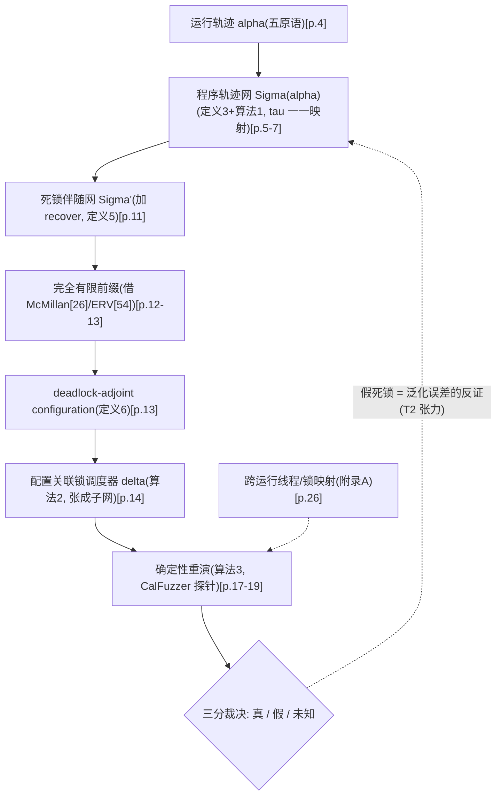

# 02b · PNULock(PN 展开死锁检测与重演):六点第一性原理 + 知识图谱 + 批判性四审视(完整框架分析卡)

> 论文:Lu F., Lv F., Cui M., Bao Y., Zeng Q. "Petri Net Unfolding-based Detection and Replay of Program Deadlocks." *IEEE Access*, vol. 12, pp. 53713–53738, 2024. DOI: 10.1109/ACCESS.2024.3384489 [p.1]
> 作者线:鲁法明(一作)/ 吕凤华 / 崔明浩 / 包云霞(通讯)/ 曾庆田;基金 National Key R&D 2022ZD0119501、NSFC 52374221、山东 ZR2022MF288/ZR2023MF097、泰山学者 ts20190936 [p.1]
> 主输入:`_launch/pdftxt/PNULOCK.txt`(pdftotext 全文,2514 行,已全读)
> 页锚约定:[p.X] 指作者版 PDF(`../Deadlock-2024-IEEEAccess.pdf`)物理页,共 29 页——页界由每页页脚 CC-BY-NC-ND 许可行逐页核定后映射;刊内页码(53713 起)与之不对齐,故不使用;pdftxt 页脚自带页码为模板占位(VOLUME XX 2017 与重复出现的 2/3/7),不可作锚。个别处补 [TXT L###] 行锚。对照锚:[SEGLOCK.txt L###] 指 `_launch/pdftxt/SEGLOCK.txt`(组内后作 SegLock,TST 2026,附刊内页码);"04 卡"指 `04_DEADLOCKSEG_SEGLOCK.md`,"08 卡"指 `08_MHP.md`;03b/06b 为格式母版。
> 与旧卡关系:方法逐式恢复、实验基础数据、复现路径与 T 课题映射见 `02_DEADLOCK_PNULOCK.md`(2026-08-13,R7 判"高可信几乎无损"),同一事实引"02 卡 §X"不复写;本卡增量 = 六点框架、特命节、张力结构、知识图谱、四审视及六项独立新发现(F1-F6)。
> 公式约定:全部纯文本;alpha=运行轨迹,Sigma(alpha)=程序轨迹网,tau=变迁到操作的映射,delta(o)=锁 o 的授权线程序列,C=配置,cut-off=截断事件,M0=初始标记,"p•=空集"表示库所无出弧;O(|PL|^2·|C|) 类记法中 ^2 为上标。

---

## 〇、特命节:重模型剩余价值推演——SegLock 之后,PN 展开路线还剩什么不可替代

**任务**:组内后作 SegLock 主张精度持平 PNULock、检测开销降至约 1/2-1/6(04 卡 §3;[SEGLOCK.txt L1165-1184]),展开重模型路线是否该退役——以下依本文原文独立判定,三个候选论证面逐条核原文。

### 〇.1 候选论证面核实

**①"每次锁语句执行独立成变迁 = 信息零丢失"——成立,但边界要钉死,且已被轻模型追平。**
正面锚:定义 3 第 5 条 tau 是变迁到轨迹操作的一一映射("is a 1-1 mapping function")[p.5];引言原话 "each execution of a lock acquisition/release statement is modeled by a unique transition (even though they are different executions of the same statement)" [p.2];定理 1 及其证明:挖掘只在三类真实因果上加弧(线程内先后、fork 到子线程首操作、stop 到 join),"the mined Petri net models only the causal relations that do exist among program operations" [p.6]。相对**轨迹事实层**(操作实例多重集 + 真实因果)零合并、零虚构,成立。
边界锚:论文自己承认网相对程序语义有丢失:"neither the proposed Petri net models nor existing models mined from program running traces can model program behavior without loss of information",例子是条件阻塞语句与操作执行时间 [p.2]。另:网把轨迹全序松弛成偏序+并发(冲突/并发结构蕴含比原轨迹更多的潜在交错,[p.9-10] 的 sigma/sigma' 例)是刻意泛化,不算丢失。
结论:①为真但不构成不可替代性——SegLock 用弧标签 m(第几次获取该锁)+ k(轨迹序号)以小得多的代价达到同样的实例区分(04 卡 §2.3 原话:"PNULock 用'每次执行独立变迁'达成的目标,这里用弧标签达成,代价小得多")。

**②"反例配置 → 确定性重演调度的完备性"——必须拆成两个命题,一半成立一半不成立。**
检测完备性(**成立**):两条 borrowed 定理给出闭环——有界 Petri 网有可达死标记 当且仅当 其展开有可达死标记([54],转引句 [p.13]);展开有死标记 当且仅当 存在与所有 cut-off 事件都冲突的配置([26],转引句 [p.13])。轨迹网 1-safe 故有界 [p.10],链条闭合:**前缀里找不到 deadlock-adjoint configuration,就真的不存在非法死标记**。这是"否定能力"——能证明不存在,而不只是没找到;轻模型的图上搜环没有这个性质的对应物。
重演完备性(**不成立**):论文自带反例——取消注释后的 Program 1,调度器把 ThreadA park 在 delta(G) 队尾,三线程全部等待而 delta(o1)/delta(o2)/delta(G) 未清空,算法 3 走到第三分支 "OUTPUT that the potential deadlock is not successfully replayed. Whether it is a real deadlock or not is unknown." [p.18;Figure 6 同 p.19;Table VI 走查 p.23]。算法 3 的输出本来就是真/假/未知三分 [p.17,p.18]。所以"确定性重演"的诚实表述是:调度器对任意配置总可导出(算法 2 无失败分支)、执行确定、**成功即真**;不是"必成功"。完备性卖点在检测侧,不在重演侧。

**③"作为 03 篇静态 UAF 检测展开引擎的母体(移植性价值)"——已发生的事实,不是推演。**
UAF 篇把展开判并发/冲突的技术明确引到本文:03b 母版卡 §3.6 TOP5 表第 4 行记录其引用位置为引言 [PDF p.2]、展开方法论 [PDF p.8]、引文条目 [PDF p.11](即 UAF 论文的文献 [9] = 本文);08 卡 §9.2 把家族结构总结为"每条线都是 'PN 精算版' 与 '图近似速算版' 成对出现……03 之于 08,恰如 02 之于 04"。展开引擎作为组内共享基础设施已经跨线复用一次,这条价值不随死锁线内部竞争波动。

### 〇.2 跨文数字对照(本卡增量发现:SegLock 对标表的 PNULock 检测时间列存在整列错位)

> 〔08-24 R1-d 更新(TASK-20260824-007):本节判定经原 PDF 双路(pdftxt＋vision)终核确认 **8/8 成立**,终核报告=`_audit_remediation_20260824/A4_pdf_verification.md`;并案:04b §5 独立发现的 Table5/6 口径矛盾同核确证——Table 6 栏头 "Detection time overhead" 系标错,实装重演耗时;另本节下文"真实比值多在 1.2-2 倍档"系手算偏保守,脚本精确重算为 **1.70–6.35×(中位 2.76×)**〔08-24 深夜二次勘误:本更新块初版误写 1.70–4.49×(中位 2.28×),系 A4 比值表 Test6 行串行所致,fable 独立审计抓获后按脚本重算修正;宣称端点"1/6"经核在 Test6 真实成立(6.35×),错位定性=名实错位而非优势注水〕,以 A4 报告比值表为准〕

把 SegLock 论文 Table 5 所记的 PNULock 检测时间与本文自身 Table VII 并排(八个共享基准名):

| 基准 | 本文 Table VII [p.24] | SegLock Table 5 所记 PNULock [SEGLOCK.txt L1167-1180,刊内 p.15] | 错位判定 |
|---|---|---|---|
| Test1a | 0.682 | 0.291(= 本文 Demo2 值) | 错位 |
| Test1b | 0.256 | 0.682(= 本文 Test1a 值) | 错位 |
| Test2a | 0.768 | 0.256(= 本文 Test1b 值) | 错位 |
| Test3 | 0.283 | 0.768(= 本文 Test2a 值) | 错位 |
| Test4 | 0.284 | 0.283(= 本文 Test3 值) | 错位 |
| Test6 | 0.927 | 0.284(= 本文 Test4 值) | 错位 |
| Test7 | 0.260 | 0.927(= 本文 Test6 值) | 错位 |
| Test8 | 0.639 | 0.260(= 本文 Test7 值) | 错位 |

- 八个共享名**全部**命中同一模式:SegLock 表中每个名字的数值恰等于本文 Table VII 排序中**上一个名字**的数值(Demo2 的 0.291 被安到 Test1a 头上,整列上移一行;本文 Test8 的 0.639 未出现在任何共享名下)。两文实验硬件不同(Xeon Platinum 8163/2GB [p.24] vs i5-6300HQ/8GB [SEGLOCK.txt L1159-1160]),独立重跑产生 8 个三位小数逐一相同值的可能性可以忽略;而同表中 **iGoodlock 列两文互异**(如 Test1a:本文 0.140 [p.24] vs SegLock 0.198 [SEGLOCK.txt L1167]),恰与独立重跑一致。最简解释:SegLock 制表时从本文 Table VII 转抄检测时间列发生整体错位一行(其基准列表不含 Demo2)。重演时间列(SegLock Table 6 [SEGLOCK.txt L1222-1242])则大体按名对齐(Test1a=0.126、Test1b=0.123 与本文一致,余格有 ±0.002-0.003 出入),错位仅限检测时间列。
- 影响量化:"开销降为 1/2-1/6"(04 卡 §3 引其 Table 5/6)中相当部分需改写——Test7 按原名实为 0.153/0.260 约 1/1.7 而非 0.153/0.927 约 1/6(0.927 在本文属 Test6);CalFuzzer 共同名目的真实比值多在 1.2-2 倍档;MulThreadDeadlockDemo(0.235 vs 1.354,约 1/5.8)等 SegLock 自建例无法用本文原表交叉核验。
- 定性:此为跨文对照观察,**不构成对作者的指控**(两文同为一作);但它意味着"精度持平 + 开销降一个量级 → 退役"这个 But 的数值腿(量级差)目前只有单源证据且带疑点,引用时必须回到两篇各自原文核对。

### 〇.3 结论落到可检验命题

**命题甲(J 类轨迹召回差分,核心命题)**:
- 构造:线程 u:acq(u,l) → join(u,v)(持有 l 等 v 终止,rel(l) 在 join 之后);线程 v:…… → acq(v,l) → …… → stop(v)。交错推进到 v 到达 acq(v,l) 时:v 的 acq 因 l 被 u 持有而阻塞,u 的 join 变迁因 v 的终止条件不满足而阻塞,u 的 rel(l) 又在 join 之后不可达——伴随网到达非法死标记(join 缺 stop 条件、acq 缺锁 token,互为因果,再无事件可使能;定义 4 判据 [p.11]),**PNULock 必报**。join 边进死标记是这套形式化的原生能力:定义 1 含 join,T_J 有专门建模片段([p.5];Table III join 片段 [p.6]);本文旗舰例的死标记 {p1,p12,p19} 本身就含主线程 join 阻塞分量 [p.10,p.13]。
- SegLock 侧:候选生成 = 序增广锁图中的有向环(其定义 5 前提句 "c = ek1,…,ekl forms a directed cycle in an order-augmented lock graph" [SEGLOCK.txt L735-739,刊内 p.9];04 卡 §2.4 同)。u 持 l 期间无第二把锁申请 ⟹ l 无出边 ⟹ 无环 ⟹ 无候选 ⟹ **必漏**。
- 推理链闭合点:两法吃同一条轨迹,判据差异纯在候选生成器(全局死标记存在性 vs 锁图环)。脆弱前提:若 SegLock 分段图也参与候选生成则命题失效——已核其检测定义以锁图环为出发点(上锚),最终以其原文 §4 全文为准 [需验证]。
- 检验成本:两条管线各一个不超过百行的样例族即可实测裁决。

**命题乙("精度持平"是域内主张)**:现行持平证据(SegLock 14 基准,04 卡 §3)全部是锁环型死锁;J 类未测。"持平"至多是"锁环域内持平",不外推到含非锁等待边的死锁形态。

**命题丙(负结果,诚实报告)**:两个直觉方向经核查**不构成**差分——实例区分维度已被 m/k 标签追平(〇.1①);"锁语义简化"(重入/tryLock 两边同样只建 acq/rel 二值互斥)两边同病。剩余价值不在这些方向找。

### 〇.4 裁定(分叉式,可检验,非形容词)

- 若命题甲实测成立:展开路线的不可替代性 = 高召回参照系(J 类全域死标记语义)+ 通信原语扩展的唯一载体(论文自评:通信死锁 "can also be detected if all of the primitives are modeled correctly with Petri nets",代价是状态空间剧增 [p.25];而锁图环范式对 notify 类无环可寻,SegLock 论文自认 wait/notify 等原语未处理 [SEGLOCK.txt L737-740 附近,04 卡 §4 同])+ 组内静态线共用引擎(③,已发生)。此时生产主力让位 SegLock 类轻模型、展开降级为慢速金标准与扩展母体——**"退役"不成立,"重定位"成立**。
- 若甲被证伪(SegLock 补一条候选规则即可覆盖 J 类且开销不变):死锁线内的不可替代性收窄到 ③(移植价值)与张成子网的偏序 witness 证据;届时退役论获得支撑。
- 无论哪个分支,结论都由同一个百行级实验裁决——这是本节要求的可检验形态,不是站队形容词。

---

## 一、六点第一性原理分析(节结构对齐 03b)

### 1. Task:解决什么问题(形式化)

**输入**:多线程 Java 程序的**单条运行轨迹** alpha(定义 1:五原语 c:fork(u,v) | c:join(u,v) | c:stop(u) | c:acq(u,l) | c:rel(u,l) 的序列,c 为语句标号 [p.4]);轨迹由 CalFuzzer 插桩采集(锁/fork/join 事件流 + 反复轮询线程状态捕获 stop 事件)[p.24]。

**输出**:两级。(a)潜在死锁集 = 伴随轨迹网 Sigma'(alpha) 完全有限前缀中全部 deadlock-adjoint configuration(定义 6 [p.13]),每个对应一个非法死标记;(b)每个潜在死锁的真实性三分解:真死锁(附确定性锁调度器 delta)/假死锁/未知(算法 3 [p.18])。

**评价口径**:检出数与假阳性数、检测耗时、重演成功率与耗时(Table VII [p.24]);唯一同台对手 iGoodlock(CalFuzzer 内置,循环锁依赖链检测 + DeadlockFuzzer 随机重演)[p.24-25]。

=第一性原理思考= task 本质是把"这次好运行里没发生的死锁,换一种调度会不会发生"变成"从轨迹挖出的并发模型上是否存在走不动了的状态"。里面压着两个赌注。赌注一(泛化):真实因果恰好落在{线程内序, fork, join, 锁互斥}四类且能从单条轨迹恢复——赢面 = 定理 1(挖掘只加真实因果 [p.6]),输面 = 条件阻塞与时间不可建模 [p.2 自认]。赌注二(确认):目标死锁可以只靠约束若干把锁的授权顺序强制达成——输面已被论文自己的 Table VI 反例展示 [p.23],"未知"类别就是给这个赌注买的保险。方法骨架因此是"大胆泛化(检出)+ 保守确认(重演兜底)"的组合件:第一阶段允许报错,第二阶段负责枪毙错误——摘要里的精度主张实际是两阶段串联后的性质,不是展开分析本身的性质。

### 2. Challenge:传统方法的困难

1. **折叠假阳性**:循环体内同一 acq 语句的不同次执行在锁图/锁树/循环锁依赖链/扩展锁图里不可区分,"some executions may cause deadlocks, while not for others"[p.2 问题(1)];Program 1 第一轮嵌套获取因门锁 G 不可能死锁、第二轮才会,分段图/扩展锁图把两轮都报成死锁 [p.3-4]。
2. **因果缺失假阳性**:释放-获取同锁造成的跨线程因果(ThreadA 首轮 rel(G) 与 ThreadB acq(G))不属于 start/join,分段图建模不了 [p.2 问题(2)]。
3. **静态路线不可扩展**:Williams 等静态检测器在 JDK 1.4 上报 100,000 个死锁仅 7 个真 [p.1];状态空间随程序规模指数增长使静态法难以扩展到大型多线程程序 [p.1]。
4. **随机重演低效盲目**:DeadlockFuzzer 类完全随机需大量重复运行 [p.2-3];挂起式启发法仍 "random in nature" [p.3];barrier 法 [30] 与约束法 [31] 改进触发率但调度方案不直观、无法回溯根因 [p.2-3]。
5. **动态固有假阴性**:单条轨迹只含部分行为信息,看不见的交错检不出 [p.1]——本文对此的处理是承认而非解决,火力集中在假阳性侧。

### 3. Insight & Novelty

**Inspiration 来源**:
- Insp-1(组内 PN 分析积累):展开技术栈——[26] McMillan、[54] ERV 完全有限前缀、[56] 组内无界网死锁展开(Information Sciences 2019,鲁法明一作)、[49] 复杂可达树;检测引擎直接站在标准理论肩上 [p.12-13;p.27-28 TXT L2384-2388, L2432-2434, L2439-2441, L2409-2413]。
- Insp-2(动态死锁检测模型谱系):Visual Threads 锁图 [20]、GoodLock 锁树 [21]、循环锁依赖链 [22]、Magiclock [13]、分段图 [23]、向量时钟 [24] [p.2]。
- Insp-3(重演谱系):随机调度 [27]、挂起式 [10][24][29]、barrier [30]、约束 [31][32] [p.2-3]。
- Insp-4(CalFuzzer 基础设施):探针 API、事件流采集与开源基准例程 [57][32] [p.17,p.24]。

**Insight 是什么**:
- Insight-1(全文最干净的构造):合法/非法死标记之分可以**编译进网结构**——加一个 recover 变迁复活正常终态,让状态空间搜索天然跳过它们(定义 5 [p.11]);"过滤正常终态"从语义判断变成纯结构问题。
- Insight-2(泛化原理):实例级变迁 + 最小真实因果 ⟹ 能从一条**不死锁**轨迹的并发闭包里找到死交错(定理 1 [p.6]);冲突/并发结构免费携带未观测交错。
- Insight-3(witness 即处方):配置是无冲突事件集,其张成子网按锁库所遍历直接读出每锁授权序列 delta(o)——检测的答案同时是调度的处方与根因偏序图 [p.14]。

**Novelty 逐创新点(三段式)**:
- **N1 程序轨迹网(定义 3 + Table III + 算法 1)**:【解决什么】Challenge 1/2 的两类假阳性源于模型折叠执行实例、丢释放-获取因果 →【受哪个 insight】Insight-2 →【设计了什么】P = PS 并 PL(状态/锁双库所)、T = TF 并 TJ 并 TL 并 TT(fork/join/锁操作/stop 四类变迁)、F = FS 并 FL 并 FF 并 FJ(控制流/锁弧/fork 弧/join 弧四类流关系)、rho 标注库所语义、tau 一一映射;五种操作的标准网片段(Table III [p.6-7]);逐操作扫描建网,时间 O(alpha^2 + alpha·|Locks(alpha)|)、空间 O(alpha·|Locks(alpha)|)[p.6]。
- **N2 死锁伴随轨迹网(定义 5)**:【解决什么】死标记混含正常终态,直接搜死标记会把正常退出误当潜在死锁 →【受哪个 insight】Insight-1 →【设计了什么】新增 recover 变迁:前置 = 非 join 线程终止态集 PT_legal 并 锁库所 PL,后置 = {p0 主线程就绪态} 并 PL;合法死标记处 recover 使能、网复活回初始标记,非法死标记保持死;定理 3:不含 recover 的可发射序列到达 Sigma' 死标记 ⟹ 潜在死锁 [p.11-12]。
- **N3 展开检测判据(定义 6)**:【解决什么】如何在有限前缀里定位死标记而不丢 →【受哪个 insight】Insp-1 的两条 borrowed 定理([54]:有界网死标记 ⟺ 展开死标记;[26]:展开死标记 ⟺ 存在与所有 cut-off 冲突的配置;转引句 [p.13])→【设计了什么】deadlock-adjoint configuration = 与所有 cut-off 事件都冲突的配置;示例 C1 = {e1..e8, e26-e29, e38} 导出死标记 {p1,p12,p19} = A 持 o1 等 o2 且 B 持 o2 等 o1 且主线程等 join [p.13-14]。
- **N4 配置关联锁调度器与三分重演(算法 2/3 + 附录 A)**:【解决什么】Challenge 4 随机重演低效、不直观、无法根因回溯 →【受哪个 insight】Insight-3 →【设计了什么】张成子网上逐锁库所读授权线程序列 delta(o)(算法 2;复杂度 O(|PL|^2·|C|+|PL|),上标为提取失真读法,同旧卡 §2.2 [p.14 TXT L1149-1152]);CalFuzzer 的 lockBefore/lockAfter/unlockAfter 探针执行三态策略(delta(o) 队首非当前线程则 park、是则放行并删队首 + unpark 等待集、队空不干预)[p.17];终态三分判定(delta 全清 + 配置锁图成环 → 真;delta 全清 + 正常终止 → 假;否则未知)[p.17,p.18];跨运行线程/锁映射 = 主线程锚定 + fork 序一致 + 锁申请序一致(附录 A [p.26])。

**动机问句链(还原)**:现有动态法为什么还报假阳性?→ 两类信息丢失(问题 1/2)[p.2] → 更细的模型为什么不会爆炸?→ 只挖轨迹里的同步骨架,if/else/loop 结构一概不要 [p.5] → 细模型上怎么找死锁?→ 死标记检测;可正常终态也是死的怎么办?→ recover 编译掉 [p.11] → 状态爆炸怎么办?→ 展开,cut-off 去重 [p.13] → 挖出来的潜在死锁是真的吗?→ 挖掘只加真实因果,但轨迹不全,可能有假 → 重演确认 [p.14] → 怎么可靠触发一个小概率事件?→ 别随机猜,把配置翻译成每锁授权序列直接排进运行 [p.14] → 两次运行的线程/锁对不上号怎么办?→ 主线程锚定 + fork 序 + 锁申请序 [p.26]。

### 4. 方法骨架校核(逐式全恢复见旧卡 §2,此处只记独立复核的增量发现)

原型管线四步(CalFuzzer 采轨迹 → 算法 1 建网与伴随变换 → 展开检测 → 算法 2 导调度器 + 算法 3 重演)[p.24 工作流程 (1)-(5)] 与旧卡 §2 一致,复核无误。以下为本卡独立发现(旧卡未载):

- **F1(最重,文面缺陷)算法 1 伪代码系统性笔误**:五个操作分支(fork/join/stop/acq/rel)在新建状态库所 p2 后一律写 "Set M0(p2) to 1"——fork 第 8 行 [p.7 TXT L611]、join 第 13 行 [TXT L634]、stop 第 18 行 [TXT L644]、acq 第 22 行 [TXT L651]、rel 第 28 行 [TXT L658];Figure 2 流程图同步复现五处(fork/join/stop/acq/rel 各一行)[TXT L700, L708, L717, L730, L747]。这与定义 3 第 6 条"初始标记只在锁库所与主线程就绪态取 1,**其余库所 M0 = 0**"[p.5] 全面矛盾:照伪代码实现,每个新建控制流库所初始都有 token,该网根本不是轨迹网,定理 1 不成立。合理意图应为:fork 分支设 M0(p3) = 1(子线程就绪库所需初始 token;Figure 1 中 ThreadBReady p5 带 token 可佐证 [p.6]),其余分支该句应删。复制粘贴来源明显(fork 第 8 行首现,后续分支沿用)。pdftxt 六处文本清晰一致,提取失真可能性低,建议仍核原 PDF 确认 [存疑待核]。
- **F2 Figure 9 图注错贴**:原型系统框架图(Figure 9)的图注误用了图 8 的文字 "the unfolding subnet spanned by configuration {e1,e2,e3,…,e25}, which leads Program 1 to a normal termination state" [p.24 TXT L2121-2123],与该图实际内容(工作流程框图,正文 [p.24 TXT L2081-2083] 描述)不符。
- **F3 记号不一致**:Table IV 行 3 把 9:fork 写作 "9:start(ThreadA,ThreadB)" [p.10 TXT L802],而定义 1 的原语集只有 fork 没有 start [p.4],Table II 同位置作 fork [p.4 TXT L263]。
- **F4 三处复杂度公式上标提取失真**:pdftxt 中游离 "( 2 )" 字样伴随三处复杂度声明——算法 1 时间 O(alpha^2 + alpha·|Locks(alpha)|)[p.6 TXT L415-416]、算法 2 O(|PL|^2·|C|+|PL|)[p.14 TXT L1149-1152]、算法 3 O(|C|^2 + |PL|·|C|)[p.17 TXT L1444-1447];本卡采旧卡 §2 读法,与各处上下文的变量说明吻合。
- **F5 模板残留**:作者版页眉 DOI 行为占位符 "Digital Object Identifier 10.1109/ACCESS.2022.Doi Number"、出版日期 "xxxx 00, 0000" [p.1 TXT L7-8];正式题录以旧卡头部为准(vol 12, pp. 53713-53738)。
- **F6 实验环境版本号异常**:"the operating system is Ubuntu 5.4.0" [p.24 TXT L2093]——Ubuntu 发行版号为年.月格式(如 18.10),x.y.z 是 Linux 内核版本格式;疑为作者笔误或内核串错置 [存疑待核原 PDF]。同句的 2 GB 内存也值得注意:它限制了可跑程序规模,可能系统性掩盖展开的内存代价。

### 5. 实验协议与结果批判(基础数据见旧卡 §3,增量如下)

- **Table VII 为文本层可抄表**(与 03b 卡的位图表情形相反):关键格 [p.24]——检测阶段 PNULock 0.256-0.927 s vs iGoodlock 0.123-0.161 s;重演阶段 PNULock 0.123-0.522 s vs iGoodlock 0.469-2.441 s;检出数仅 Demo2 与 Program 1 两处分歧(iGoodlock 各报 2、PNULock 各报 1,分歧即假阳性)。
- **假阳性改善的样本量 n=2**:正文唯一假阳性陈述 "iGoodlock algorithm report 1 false positive while our proposed method has no false positives" 对应 Demo2 与 Program 1 各一个数据点 [p.25;p.24 Table VII];摘要级主张 "can eliminate more false positives compared to general dynamic methods" [p.1] 建立在这 2 个数据点上。
- **对照单一且陈旧**:全文批评最多的分段图谱系 [23] 与向量时钟线 [24] 均未上台;唯一对手是 CalFuzzer 内置 iGoodlock(其检测思想源自循环锁依赖链 [22],重演用 DeadlockFuzzer 随机策略)。立论的靶子与实验的对手不同人。
- **单值无方差**:所有耗时为单次测量,无重复次数报告;同一程序 iGoodlock 检测时间在两文相差约 ±30-50%(Test1a:本文 0.140 [p.24] vs SegLock 表 0.198 [SEGLOCK.txt L1167])提示在该量级实现/机器噪声与算法差异同阶。
- **状态爆炸零实证**:结论自认分支结构多时展开会爆炸 [p.25],但 10 个教学级程序无一触发(Table VII 最大单程序检测耗时 0.927 s);"用时间换精度"(原文:"This decrease in time performance is to obtain higher deadlock detection accuracy" [p.25])的账单只在玩具负载上开过。
- **未知率零统计**:算法 3 三分输出中"未知"分支的重演失败占比全文未报告——而 Table VI 恰好演示了一个失败例 [p.23],说明该类别非空且可达。

### 6. Potential flaw

**6.1 情境局限;能否延伸架构**
- **单轨迹实例封闭(最大局限)**:网中只存在观测到的操作实例;若触发目标死锁所需的获取发生在未观测轮次或未走分支,网中根本没有那个变迁,系统性漏报。引言承认动态法有假阴性 [p.1],但全文无任何覆盖率讨论。
- **Java 锁语义简化**:synchronized 重入、读写锁、tryLock(带超时)等真实锁语义都被抽象成单一 token 的无条件互斥;重入场景下同线程二次 acq 在网中会因锁库所空而被判阻塞,潜在制造假死标记。CalFuzzer 探针如何记录重入未说明 [需验证]。
- **只资源死锁(自认 [p.25])**:wait/notify/park/unpark 型通信死锁范围外;论文论证统一检测会因状态空间剧增而代价过高,并引用 RRNA 死锁 PSPACE-complete 的结论支持分开研究的选择 [p.25]。join 型卡死虽在形式化范围内(定义 1 含 join),但作为独立检测目标的地位未被讨论(见特命命题甲)。
- **教学级基准 + 2 GB 内存**:规模上限从未被探测(与 02 卡 §4 同判,此处补环境锚 [p.24])。

**6.2 什么数据性质会特别困难**
- 深循环 × 多分支:展开前缀膨胀,自认弱点 [p.25];
- 数据依赖的线程创建数与提前退出:附录 A 的 fork 序/锁申请序一致性假设破裂 [p.26],跨运行映射失败则第二阶段无法执行;
- 高频争用长轨迹:轨迹网规模线性于轨迹长度,前缀规模随之膨胀;
- 重入同步与条件等待:词汇表外的原语,建模失真或缺失;
- 多次运行行为分歧大的程序(输入敏感调度):单轨迹代表性崩塌,A1 假设破产。

**6.3 哪种困难值得深挖成 paper(与特命联动)**
1. **J 类召回差分实验**(= 特命命题甲的可执行化):构造 join-锁混合等待样例族,PNULock vs SegLock 双管线实测,把组内"重 vs 轻"路线之争从开销轴拉回能力轴——直接回应 04 卡 §5 见面礼问题 1("有没有 PNULock 能报、SegLock 漏的构造样例"),本卡把那里的"若存在"升级为带构造方向的猜想与判定实验设计。
2. **未知率的刻画**:哪类配置的重演必败(Table VI 的 park 卡死型),给可判定特征或预警启发式——这决定方法实用性上限,是比再提精度更值钱的缺口。
3. **多轨迹合并的不可观测变迁辨识**:作者自留方向 [p.25](if/else/case/loop 需建不可观测变迁,指向 [58] interpreted PN 优化辨识)——与作者过程挖掘背景接轨,是把方法从单轨迹解放的正路。
4. **展开引擎工程化对比**(Mole/PUNF 等,02 卡扩展 A 已点不复写):在特命③视角下价值上调——它是组内静态线(UAF 篇)的共用底座,值得单独测。

---

## 二、张力结构

**在改变谁的想法**:(a) 动态死锁检测社区——锁图谱系的残余假阳性不是工程调参问题而是模型粒度问题,实例级区分 + 释放-获取因果必须进模型 [p.2];(b) 重演社区——确认小概率缺陷不必随机搜索,witness 配置可以直接编译成确定性调度 [p.3,p.14];(c) PN 社区——展开不只服务电路/协议验证,可直接做程序动态分析的语义引擎 [p.12-13];(d) 组内自身——本文为 SegLock 的轻量化反攻立起"精度标杆 + 开销靶子"的双重角色(04 卡定位语)。

**读者为什么在乎**:Sun bug 数据库 198,000 份报告 6,500 份含 "deadlock" [p.1];死锁难复现、难归因,工具的两端指标(误报率、重演确定性)直接决定可用性。

**立论的 A-But-B 链**:
- A1 动态分析假阳性少、效率高、自动化好,成为主流 [p.1]。**But**:锁图及其变体存在信息丢失,假阳性仍在 [p.1 摘要]。
- A2 GoodLock/Magiclock/分段图系已能杀线程内环、门锁环、start/join 因果环 [p.2]。**But**:同语句循环多执行不可区分 + 释放-获取跨线程因果缺失 [p.2 问题(1)(2)]。
- A3 随机/启发式重演可确认缺陷真实性 [p.2-3]。**But**:本质随机盲目、需大量运行、方案不直观、无法回溯根因 [p.3]。
- 合题:实例级轨迹网 + recover 编译过滤 + 展开死标记检测 + 配置到确定性锁调度器。三个 But 各留一个填空位——标准鲁组立论结构(与 06 卡 §8 观察、03b 卡 §二同构)。

**内在矛盾与取舍(本节重点)**:
- **T1 表达力 vs 状态爆炸**:实例级建模 + 全部观测交错的泛化既是精度之源也是开销之根;作者明说降速是为换精度 [p.25]。取舍被做了且被承认——但账单只在 10 个玩具程序上算过(一.5)。
- **T2 泛化的自指张力(全文最深)**:同一个机制既贡献检出力又制造误差——网把一条好轨迹松弛成并发闭包才看得见死交错(定理 1 卖点 [p.6]),正是这个松弛也会产生不可行交错造成新假阳性(uncomment line 30 案例:同一轨迹网对改动后的程序仍报同一潜在死锁,此时已成假阳性,靠重演阶段识别 [p.14])。论文的解法是不信任第一阶段、一切交由重演裁决——方法的真实精度重心从"展开分析"滑向"重演确认",与标题的叙事重心正好相反。
- **T3 检测侧变慢 vs 重演侧变快**:同一方法两阶段的性能叙事相反(检测慢约 2-6 倍、重演快约 2-5 倍,[p.24 Table VII]);论文用"信息更多"解释前者、"确定性 vs 随机"解释后者 [p.25]——两个解释的相对贡献无消融数据。
- **T4 三分诚实 vs 摘要修辞**:算法 3 输出真/假/未知三类 [p.18],摘要只保留单向蕴含 "Each successfully replayed program deadlock is a real deadlock" [p.1];未知类的存在与占比在摘要层不可见。
- **T5 组内路线之争(特命 But)**:SegLock 以"精度持平 + 开销大降"主张轻模型替代(04 卡 §3);本卡特命节核出其对标表的 PNULock 检测时间列整列错位疑云(〇.2),"量级差"这一关键数值目前单源且存疑;而召回等价性是两篇都没回答的开放问题(04 卡 §5 问题 1)——路线之争的两条腿(开销轴、能力轴)都还缺可靠证据。
- **T6 理论态度的组内对照**:本文把检测正确性外包给标准展开理论并显式转引两条定理([54]/[26] 转引句 [p.13]),定理 1-3 全部是桥接型(把程序域映射到已有理论域);对照 UAF 篇自定义"局部配置 = 两相邻事件"且无任何定理(03b 卡 F3)。同组对同一理论栈的两种用法,本文是被当作正面做法引用的一侧。

---

## 三、知识图谱(对齐 06b 规格)

### 3.1 核心概念清单(9 个)

| # | 概念 | 内容 | 出处 |
|---|------|------|------|
| C1 | 程序运行轨迹 alpha | 定义 1:五原语序列 c:fork(u,v) / c:join(u,v) / c:stop(u) / c:acq(u,l) / c:rel(u,l);Tid 线程集、Lock 锁对象集、c 语句标号 | [p.4] |
| C2 | 程序轨迹网 Sigma(alpha) | 定义 3:P = PS 并 PL(状态/锁双库所)、T = TF 并 TJ 并 TL 并 TT(fork/join/锁/stop 四类变迁)、F = FS 并 FL 并 FF 并 FJ、rho:P→锁或线程、tau:T→操作一一映射;M0 仅主线程就绪态与锁库所取 1;网为 1-safe | [p.5;p.10] |
| C3 | 实例级建网原则 | tau 一一映射 ⟹ 同语句每次执行独立变迁;Table III 五种操作的标准片段;算法 1 逐操作扫描,O(alpha^2 + alpha·\|Locks(alpha)\|) 时间 | [p.2,p.5-7] |
| C4 | 合法/非法死标记 | 定义 4:死标记中"非 join 线程终止态 + 全部锁库所各 1 token、其余全空" = 合法(正常终止),否则非法(潜在死锁);定理 2:sigma 到非法死标记 ⟹ 程序按 tau(sigma) 运行**可能**死锁 | [p.11] |
| C5 | 死锁伴随轨迹网 Sigma'(alpha) | 定义 5:加 recover 变迁,前置 = PT_legal(非 join 终止态,p•=空集者)并 PL,后置 = {p0} 并 PL;合法死标记复活回初始标记、非法保持死;定理 3:不含 recover 到死标记 ⟹ 潜在死锁 | [p.11-12] |
| C6 | 展开理论组件(借用) | P/T 网、因果/冲突/并发三元关系、occurrence net、分支过程、同构唯一的极大分支过程 = 展开、配置的 Cut/Mark、完全有限前缀与 cut-off 判据;整体转引自 [26][54],本文零自定义展开理论 | [p.12-13] |
| C7 | deadlock-adjoint configuration | 定义 6:与前缀中所有 cut-off 事件都冲突的配置;其存在 ⟺ Sigma' 有可达死标记([26] 定理转引 [p.13]);示例 C1 导出 {p1,p12,p19} | [p.13] |
| C8 | 配置关联锁调度器 delta | 配置的张成子网(C 中事件及其输入输出条件,无冲突故可执行)上从每锁初始条件遍历,读出授权线程序列 delta(o);算法 2;示例 delta(G)=A→B→A、delta(o1)=A→A、delta(o2)=A→B | [p.14] |
| C9 | 确定性重演与三分判定 | 算法 3:park/放行/放空三态策略 + 配置锁图成环检查;终态三分(真/假/未知);CalFuzzer lockBefore/lockAfter/unlockAfter 探针执行;跨运行线程/锁映射(附录 A:主线程锚定 + fork 序一致 + 锁申请序一致) | [p.17-19;p.22-23;p.26] |

### 3.2 概念间关系(邻接表)

- C1 --算法 1--> C2:唯一入口,轨迹质量决定后面一切的封闭世界边界 [p.4-7]。
- C3 是 C2 的构造原则(tau 一一映射),也是与锁图谱系的本质分界线 [p.2,p.5]。
- C2 --定义 4/定理 2--> C4:给死标记赋"正常终止 vs 潜在死锁"语义 [p.11]。
- C2 --recover 变换--> C5:语义过滤被编译进结构,C4 的二分因此对搜索过程不可见 [p.11]。
- C5 --展开([54] 算法)--> C6 的完全有限前缀;C6 --定义 6/[26] 定理--> C7:检测判据在前缀上闭合 [p.13]。
- C7 --张成子网--> C8:检测答案直接翻译成调度处方 [p.14]。
- C8 --> C9:执行与裁决;C9 --附录 A 映射--> 缝合两次程序运行 [p.17-19,p.26]。
- 反馈边:C9 的"假死锁"裁决反向宣示 C2/C6 泛化能力的误差面(T2 张力的结构落点)[p.14]。

### 3.3 Mermaid 图

### 3.4 理论框架(论文无显式框架图,以下为依内容重构)

"轨迹 → 网 → 展开 → 调度"四层结构:

1. **事实采集层**:CalFuzzer 事件流 + 线程状态轮询 → 五原语轨迹 [p.24];轨迹是唯一事实源,划定后续一切推理的封闭世界。
2. **模型层**:算法 1 把轨迹编译成最小因果网(只加真实因果,定理 1 [p.6]),再经 recover 变换把"哪些死标记不算数"编译进网结构(定义 5 [p.11])。本层的两个设计决定(实例级、最小因果)就是与锁图谱系拉开距离的全部所在。
3. **语义引擎层**:展开把网变成"偏序 + 冲突 + 并发"三元判据;死标记存在性借两条标准定理在前缀上闭合判定 [p.12-13]。本层零自定义理论,正确性护城河完全外包给 [26][54]。
4. **确认层**:配置 → delta 调度器 → CalFuzzer 强制执行 → 三分裁决 [p.14-18];附录 A 解决两次运行的对象同一性 [p.26]。

关键叠合点:**配置(configuration)是贯穿 3/4 两层的枢纽对象**——检测的答案单元(定义 6)、调度的源材料(张成子网)、根因证据(偏序 witness)三位一体。对照:03b(UAF 篇)的枢纽是"段"、06b(SBPN)的是"变迁",本篇的是"配置"——同一展开技术栈在组内三篇里换了三个挂载点。

### 3.5 关键表格解读

**Table VII(对比实验,[p.24],文本层可抄)**:结构 = 10 程序 × (检出数/检测耗时/重演成功数/重演耗时) × (iGoodlock, PNULock)。四个信息轴:(a)精度轴仅两点分歧——Demo2 与 Program 1,iGoodlock 各多报 1 个假阳性 [p.24;p.25];(b)检测时间轴全面不利于本文(0.256-0.927 s vs 0.123-0.161 s);(c)重演时间轴全面有利于本文(0.123-0.522 s vs 0.469-2.441 s);(d)Test2a/Test6 无死锁,重演栏双方为 0。内存维度不在本表(SegLock 的 Table 5 设了内存列但 PNULock 数值缺格 [SEGLOCK.txt L1165-1184],其文字断言 "PNULock suffers from state explosion problems, its memory overhead is higher than SegLock and iGoodlock" [SEGLOCK.txt L1213-1216] 无表中数据支撑,pdftxt 或丢列,存疑待核其原 PDF)。

**Table V/VI(重演走查,[p.22-23])**:V = 成功案例 16 步全程(lockBefore/lockAfter/unlockAfter 探针逐格记录 delta 队列演化,至 delta 全清 + o2/o1 循环等待触发);VI = 失败案例 9 步即卡死(ThreadA 二轮 acq(G) 因非 delta(G) 队首被 park,三线程全等待,delta 未清空,备注明写 "We cannot determine whether the potential deadlock is real or not")。两表合起来是确定性调度器能力边界的最直观文档:成功路径 = delta 队列恰好把各方引导到环;失败模式 = 目标死锁要求某线程在队列中靠后,而它未轮到就被现实调度卡进别的等待。

**跨文对照表**(〇.2 的完整版,双方页锚):见特命节表格——八个共享基准名的检测时间全部命中"上一行数值"错位模式;重演时间列大体按名对齐([p.24] vs [SEGLOCK.txt L1167-1242])。

### 3.6 引用网络(TOP5 关键文献)

| 排序 | 文献 | 角色 | 反复使用位置 |
|---|---|---|---|
| 1 | [54] Esparza, Römer, Vogler, "An improvement of McMillan's unfolding algorithm", Formal Methods in System Design 20, 2002 | 检测引擎的算法与理论母体:完全有限前缀与 cut-off 概念的出处;"有界 Petri 网有可达死标记 ⟺ 其展开有可达死标记"定理的家 | §IV-B 方法引入与两定理转引之一 [p.13];参考文献条目 [TXT L2432-2434,p.28] |
| 2 | [26] K. L. McMillan, "Using unfoldings to avoid the state explosion problem in the verification of asynchronous circuits", CAV 1992 | 展开思想源头,与 [54] 成对引用五次以上;"展开有死标记 ⟺ 存在与所有 cut-off 冲突的配置"定理转引自此 | §IV-B [p.12-13];参考文献条目 [TXT L2384-2388,p.27] |
| 3 | [23] Agarwal et al., "Detection of deadlock potentials in multithreaded programs", IBM Journal of R&D 2010 | 正文批评最多的竞品:分段图 + 扩展锁图——本文两大假阳性类别的"残余者"(它能杀线程内环/门锁环/start-join 因果环,杀不了本文瞄准的两类);但实验未上台 | 相关工作主体 [p.2];参考文献条目 [TXT L2376-2378,p.27] |
| 4 | [57] Joshi, Naik, Park, Sen, "CalFuzzer: An extensible active testing framework for concurrent programs", CAV 2009 | 全部实验基础设施:轨迹采集、探针 API 宿主、开源基准例程来源 | §VI [p.24];脚注 4 [p.17 TXT L1499-1502];参考文献条目 [TXT L2442-2446,p.28] |
| 5 | [10] Joshi, Park, Sen, Naik, "A randomized dynamic program analysis technique for detecting real deadlocks", 2009 | 随机重演路线代表,确定性调度器的对立面("still random in nature" 批评的对象之一) | 引言与重演谱系 [p.2-3];参考文献条目 [TXT L2333-2335,p.27] |

次关键:[24](向量时钟 + 循环锁链,同时出现在模型谱系与重演谱系)[p.2-3];[13] Magiclock(可去依赖环)[p.2];[30][31][32](barrier/约束/ConLock 重演改进线)[p.2-3;p.17 脚注];[61] Liu(RRNA 死锁 PSPACE-complete,通信死锁分开研究的复杂度依据)[p.25];[58](interpreted PN 优化辨识,多轨迹合并的未来出口)[p.25];[56]/[49]/[59](组内自引群:无界网死锁展开、复杂可达树、时间 PN 辨识——技术积累与未来方向的自我背书)[p.13 TXT L2439-2441;p.25;TXT L2409-2413, L2452-2455]。

---

## 四、批判性四审视

### 4.1 假设审视(隐含假设 → 依据 → 风险)

- **A1 单轨迹代表性**:挖掘只见观测实例(一.6.1)。隐含假设 = 触发目标死锁所需的全部操作实例恰在这次"好运行"中出现;循环轮数不足或分支未走的程序上系统性漏报,无覆盖率度量。
- **A2 跨运行映射三重一致性**(两次运行输入相同、fork 序一致、锁申请序一致 [p.26]):数据依赖的线程创建、异常提前退出的程序上断裂;失败模式未讨论(02 卡 §4 已点,此处补页锚)。
- **A3 锁 = 无条件互斥令牌**:重入/读写锁/tryLock 语义不在模型内;假设 CalFuzzer 事件流忠实反映锁语义,而重入记录方式未说明 [需验证]。
- **A4 调度器充分性**:假设目标死锁只需约束 LockSet 中各锁的授权序即可达成——Table VI 反例证明该假设可破 [p.23];必败配置的特征未刻画。
- **A5 cut-off 实现规范**:检测完备性依赖 [54] 框架中 adequate order 的具体实现(局部配置基数是最原始的 McMillan 序,[54] 已指出其次优性);论文未说明用哪种序——工程私钥未披露,前缀大小与完备性都系于此。

### 4.2 证据审视(证据质量与主张强度的匹配)

- **B1 精度主张样本量 n=2**:两个假阳性数据点(一.5)支撑摘要级主张 [p.1],强度失配。
- **B2 对照单一且陈旧**:唯一对手 iGoodlock;被批最多的 [23][24] 谱系未实验。
- **B3 单值无方差**:全部耗时单次测量;同程序 iGoodlock 时间两文差 ±30-50% 提示噪声量级(〇.2)。
- **B4 环境可疑**:Ubuntu 5.4.0 版本号异常(F6 [p.24]);2 GB 内存限制规模上限。
- **B5 状态爆炸主张零实证**:自认弱点在实验中零触发(一.5)。
- **B6 文面质量**:本文错误密度显著低于同刊 UAF 篇(03b 卡 F2/F4 级的极性矛盾在此不存在);F1 属复制粘贴笔误、可由定义 3 第 6 条直接纠正,不动摇主线正确性。IEEE Access 快审生态下仍属文面较干净者。
- **B7 跨文数据管理**:SegLock 对标表错位疑云(〇.2)提示组内跨论文实验数据复用流程缺核对步骤——对整个家族的跨文数字引用敲警钟(08/03b 等卡若引 SegLock 对标数字,应回两篇原文核对)。

### 4.3 推理审视(推理链的断点)

- **C1 摘要单向蕴含的可滑读性**:"Each successfully replayed program deadlock is a real deadlock" [p.1] 为真,但易滑读为"检出即可重演";Table VI 反例与"未知"输出 [p.17,p.18,p.23] 表明重演不完备,未知率未报告——确认能力的上界在论文里是空白。
- **C2 "潜在死锁"概念外延略大**:定理 2 措辞是 "may fall into a deadlock" [p.11]——非法死标记同样覆盖无限等待等非死锁卡死(如 join 一个永不终止的线程);论文统称潜在死锁。分类学小瑕疵,实验无影响,但影响与 communication deadlock 的边界论述。
- **C3 定义 4 与定义 5 的配合依赖一条未言明的控制流不变式**:join 线程的终止态(p• 非空,如 ThreadAStopped p23)必须在合法死标记处已被 join 变迁消耗,否则"其余库所全空"与"join 变迁仍使能"冲突。走查 Figure 1 的合法死标记 {p24,p26,p27,p28,p29} 自洽(t23 已发射,p25/p23 已空)[p.11;p.6],但这属于读者补全的不变量,论文未陈述;若某 join 线程先停止而 join 方永不执行 join,得到的正是非法死标记(无碍),逻辑闭合但论证缺环。
- **C4 总复杂度账目缺失**:建网、算法 2、算法 3 各给多项式 [p.6,p.14,p.17],唯独展开前缀规模(理论最坏指数、实践中的主导项)无界无剖析;"state explosion" 一词只出现在结论章 [p.25],不在实验节。
- **C5 "更准因为更多信息"因果链未闭合**:检测变慢归因于 "the program trace net constructed in this paper contains more program behavioral information" [p.25],但信息增益与耗时增益的比例无消融、无度量(如网规模对轨迹规模的比值曲线),归因停留在定性层。

### 4.4 替代解释审视(同一观测的竞争假说)

- **D1 假阳性消除可由更便宜机制达到**:Program 1/Demo2 的门锁因果,SegLock 用 lock-start 耦合弧同样杀掉(PetriDeadLockDemo 上两者同为 1 检出 0 假阳性 [SEGLOCK.txt L1178];ConLockDemo 上 PNULock 3/0 与 SegLock 3/0 相同 [SEGLOCK.txt L1179])——杀这类假阳性需要的是"实例区分 + 释放-获取因果"两个局部性质,不需要整个展开机器。支持特命 But 的轻量化方向。
- **D2 检测变慢的解释竞争**:信息更多的网 vs 展开实现的常数因子;B3 的两文 iGoodlock 差值表明实现/机器因素在该量级不可忽略,慢未必全是"模型重"的贡献。
- **D3 重演更快的替代解释**:基准死锁全部是简单双线程锁环,确定性调度一次即中;DeadlockFuzzer 的 thrashing 在困难死锁上的表现未被测量(基准里没有难例),"确定性优于随机"的优势幅度被最简单样例放大。
- **D4 "展开必要"的竞争假说**:即特命命题甲的裁定对象——若 J 类(join-锁混合等待)实测为空(SegLock 加一条候选规则即可覆盖且开销不变),则"检测力"维度的必要性不成立,展开的独特价值收缩到否定能力(〇.1② 的检测完备性)与扩展载体(③);反之则轻模型的召回边界被实证钉住。

---

## 五、安全门自检

- **不编造**:每一事实与数字带 [p.X] / [TXT L###] / [SEGLOCK.txt L###] 锚;推断性内容(=第一性原理思考=、命题甲乙丙、F1 的笔误推断、D 系替代解释)均标明性质,与原文陈述分离;存疑处(Ubuntu 5.4.0、F1 是否原 PDF 如此、SegLock 内存列)显式标注 [存疑待核]/[需验证]。
- **不过度承诺**:重演完备性拆为"检测完备(有 borrowed 定理)/重演不完备(有自带反例)"两半;退役裁定写成两分支可检验形态而非站队;"精度持平"标注为域内主张(命题乙);跨文错位定性为对照观察、不构成指控(〇.2)。
- **全覆盖**:四大节(一 六点 / 二 张力 / 三 知识图谱 / 四 四审视)+ 〇 特命节 + 本自检齐;知识图谱五件套(概念 9 个/邻接表/Mermaid/框架重构/TOP5)齐;六点节 1-6 小节齐;特命三候选论证面逐条核原文并给页锚;验收自查"与 04 卡 Table 5/6 数字对照带双方页锚"由 〇.2 表承担([p.24] 与 [SEGLOCK.txt L1167-1242] 双侧锚)。

## 附:核对与覆盖声明

- **独立核原文**:PNULOCK.txt 全文 2514 行通读;29 个物理页界由 CC-BY 许可行核定,全部 [p.X] 锚据此映射;关键引文(unique transition 句、loss of information 句、定理 1-3 陈述、定义 4-6、算法 3 三分输出、环境句、"用时间换精度"句、结论自认句)均出自文本层直录。
- **SEGLOCK.txt 仅定向检索**(Table 5/6 区域、机器描述行、候选生成定义行、wait/notify 自认行),未全读;其锚为 pdftxt 行号 + 刊内页码(p.15/p.16,页脚可见)。
- **与旧卡分工**:方法逐式恢复见旧卡 §2、实验基础数据 §3、复现路径与 T 课题映射 §5,本卡不复写;本卡增量 = 六点框架、〇 特命(含跨文错位发现)、二 张力、三 图谱、四 四审视,及 F1-F6 六项独立新发现(F1 算法 1 伪代码系统性矛盾、F2 Figure 9 图注错贴为最重两项)。
- **不可核项已列**:F1 在原 PDF 的确切形态(-raw 复核建议)、Ubuntu 5.4.0、SegLock Table 5 内存列是否丢格、CalFuzzer 对 synchronized 重入的记录方式、[54] adequate order 的具体实现选择。
- 本卡为唯一落盘文件;未执行任何 git 写命令;未联网。
