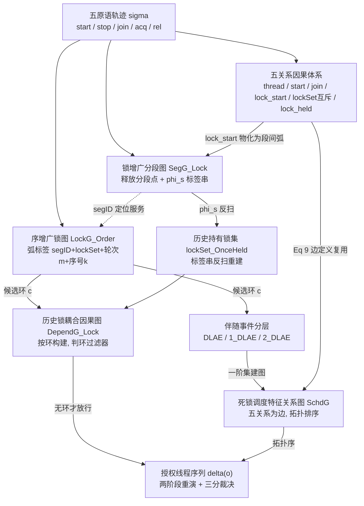

# 04b · SegLock(细化分段图 + 锁图的死锁检测与重演):六点第一性原理 + 知识图谱 + 批判性四审视(完整框架分析卡)

> 论文:Lu Faming, Wang Xiaoyu(王小宇), Yuan Guiyuan*(袁贵元,通讯), Zheng Jiajing(郑佳婧), Bao Yunxia. Deadlock Detection and Replay of Multi-Thread Programs Based on Refined Segmentation and Lock Graphs. *Tsinghua Science and Technology*, 2026. DOI 10.26599/TST.2025.9010085(2024-12-30 收稿,2025-03-22 修订,2025-04-18 接收)[PDF p.1]
> 本卡性质:L4 分析层卡,叠在 `04_DEADLOCKSEG_SEGLOCK.md`(2026-08-13 事实层拆解)之上。论文事实一律引"见 04 卡 §X"不复写;本卡只产出六点分析增量、张力结构、知识图谱、批判四审视与特命节。
> 格局层口径:全卡按七篇视角书写(`09_FAMILY_SYNTHESIS_V2.md` + `08_MHP.md` §9 为坐标系),`_review_20260815/R7_legacy_cards_recheck.md` §四对 04 卡的全部注记(4-1 至 4-5)已消化进本卡相应位置;不复刻旧卡的四篇视角表述。
> 合规:唯一输出为本文件,其余一切既有文件只读;TOP5 引用只取自论文参考文献表 [PDF p.16-17];2021 中文前身文(README 谱系:《软件学报》2021,郑佳婧/鲁法明系锁增广分段图)**不在手**,涉及处仅转引 README/04 卡表述并显式标注;pdftxt 乱码处标"存疑待核原 PDF";页锚 [PDF p.X] 为版面页码,与 `_launch/pdftxt/SEGLOCK.txt` 逐段核对过。

---

## 〇、特命节:组内路线之争 + 「够用就好」裁剪哲学

### 〇.1 SegLock(动态锁图)vs MHP(静态 STCFG):路线之争的实质分歧点

先校准命题本身(七篇视角,R7 4-1 注记):SegLock 与 MHP **不构成直接竞争**——输入域正交(Java 单条运行轨迹 [PDF p.3] vs C 源码静态 [见 08 卡 §0]),产出正交(终端死锁判定 vs 上游 MHP 谓词,后者论文自述不产 bug 报告 [见 08 卡 §9.1])。真正的"路线之争"是家族在动静两侧各复刻一遍的**重/轻模型之争**:动态侧 02 PNULock(展开,重)vs 04 SegLock(增广图,轻);静态侧 03 分段 PN+值流(展开,重)vs 08 STCFG(集合代数,轻)——"每条线都是 PN 精算版与图近似速算版成对出现"(08 卡 §9.2)。把 SegLock 与 MHP 这两台轻量载体并置的价值在于:对比它们能提取出轻量路线**共同押注什么、各自在哪里让步**,从而把路线之争落到四个可检验的实质分歧点:

1. **信息表示:带序实例 vs 无序集合**。SegLock 的弧标签 (m,k)+段标签串保留事件实例身份与段内次序(Eq 6,[PDF p.8]);MHP 六属性集只记"有无",不记次序与次数(08 卡 §8 张力 1)。轻量阵营内部并不统一:SegLock 是"带序轻量",MHP 是"无序轻量"——这一刀决定了 SegLock 能向下支撑重演,MHP 连判定都不产出。
2. **判定引擎:局部图算法 vs 查表**。SegLock 判环走图矩阵求环(多项式,[PDF p.15])+ 五规则过滤;MHP 建图期传播、查询期纯集合运算零搜索(08 卡 §3.4)。两者都回避全局搜索,但 SegLock 仍保留运行期图算法,MHP 把计算全部前移到构造期——效率取向更极端,表达力也封得更死。
3. **覆盖语义:观测闭包 vs may 推断**。SegLock 两张图的顶点弧集合是已观测事件的恒等像,零推断、因此零建模错误也零推广;MHP 是静态 may 分析,F 取并保 sound 方向但 soundness 论证缺失(R7 4-5:"轻量线的理论债在第三个载体上继续欠着")。这一条是动静本性差异,不是路线选择;真正的路线选择差异在下一条。
4. **残余不确定性的外包对象(实质分歧所在)**。轻模型普遍把重模型自己消化的不确定性外包出去:SegLock 外包给确定性重演的运行时三分裁决("无法判定"桶,[PDF p.10]);MHP 外包给下游(别名同址过滤/路径条件/展望中的 LLM,08 卡 §9.3)。重模型(PNULock/UAF 篇的展开)在网语义内部闭环。**路线之争的实质不是"要不要轻",而是"轻掉的那部分语义由谁兜底、兜底成本记在谁的账上"**。

现行状态裁定:这是家族系统性生产模式(一个洞见 → 重轻双载体),不是待决的二选一;04 卡头部"路线之争现行答案"按 R7 注记收窄理解为**动态侧答案**。

### 〇.2 裁剪代价精确化:弧标签丢了什么、判环替代配置枚举的等价性边界

#### 〇.2.1 弧标签(轮次 m + 序号 k)替代"每执行一变迁":信息丢失账本

立基准:PNULock 的轨迹网 γ 映射使"同一语句的每次执行都是独立变迁"(02 卡 §2.1),展开在此之上回答全局可达性;SegLock 对应物是序增广锁图的弧标签 γ = <seg1ID, (t, lockSet), m, seg2ID>(k)(Eq 6,[PDF p.8]),m 记线程 t 第几次获取该锁,k 为轨迹全局序号 [PDF p.8]。逐项对账:

**保住的三笔**:实例身份(k 全局唯一,每次执行一弧,同语句不同轮不合并);轮次坐标(m);持锁快照与段坐标(lockSet、seg1/seg2ID)。

**丢掉的三笔**:
- (i) **可重复发射机制**:图是一次性历史结构,顶点弧集 = 观测事件的恒等像;网的变迁虽同样来自观测实例,但 1-safe 网的发射机制允许"已观测实例的重排序交错"(02 卡定理 1:冲突与并发结构使网蕴含比原轨迹更多的潜在交错)。须把口径修准(修正旧卡 §4 表述):**两边都不能合成新实例**——循环第 4 轮谁的模型里都没有;PNULock 能推广到的是未观测*交错*(已观测实例的重排序),不是未观测*迭代*(新实例)。据此判断:两法覆盖面差距比旧卡表述的窄,差距集中在判定完备性(见 〇.2.2 方向 B),不在事件集本身。
- (ii) **线程内精确控制流**:变迁挂状态库所(精确到语句),SegLock 挂段号(粒度 = 段);段内相对顺序只留在 φ_s 标签串里——OnceHeld 反扫用它 [PDF p.8],跨段兼容性判定不用它。
- (iii) **偏序全局结构**:展开事件自带因果/冲突/并发三元判据,配置枚举天然是全局一致性检查;SegLock 把偏序压成段间可达闭包 s1 ▷ s2(Eq 5,[PDF p.7])+ 五关系,判定退化为局部模式匹配。

#### 〇.2.2 历史锁耦合因果图判环替代展开配置枚举:等价性边界(构造性分析)

两个方向分开判,各给构造或证明思路。

**方向 A:过滤器误杀真死锁(漏报)。** DependG_Lock^c 的边 (u, o(x)) → (v, o(y)) 断言"u 第 x 次获取历史锁 o 先于 v 最后一次获取持有锁 o"。论文只给直觉句 [PDF p.9],证明思路可以补全:v 死锁时仍持有 o(否则 o 不在 lockSet(e_j),L_IS 为空,无边);o 对 u 是 once-held,即 u 在 e_i 前已获又已释;互斥锁单令牌,故 u 的持有区间与 v 的持有区间不相交;而 v 的最后一次 acq(o) 成功完成要求此刻 u 已释放,故 u 的获取必早于 v 的该次获取。该推导依赖三个前提:**单令牌非重入互斥、轨迹记账忠实完整、"最后一次"选择正确**(反扫保证取最近 acq)。三前提成立时 must 方向可靠,判环不误杀;**破坏任一前提即漏报起点**,两类构造:

- 样例 R1(重入破坏记账):Java synchronized 可重入,t1 持 G 后重入 acq(G) 再 rel(G)(计数降 1、未真放);若探针按"一次 rel 清一笔持有"记账,G 被提前移出 lockSet、落入 lockSet_OnceHeld,G 与 t2 的 acq(G) 配出伪 <lock_held 边,DependG_Lock 出伪环,真死锁被第五规则误杀。全文未讨论重入——此为构造性风险点,非实测结论。
- 样例 R2(原语缺失破坏因果):park/unpark 不在五原语词汇表([PDF p.4] σ3 自证)——unpark 造成的真实因果("t1 已解锁阻塞者")不进任何一张图,检测层是在残缺因果上判环;σ3 类假阳性检测层放弃、推给重演。R2 同时说明漏报/假阳性的分界随原语词汇表移动。

**方向 B:过滤器放过假死锁(残留假阳性)。** 五规则全过不等于存在可行调度。规则 3(段间不可达闭包)查两方之间的因果,规则 5 查历史锁耦合自洽,都是**候选环内部相容性**;全局可调度性(所有祖先事件能否排成使各方同时到达等待点的全序)没有任何图检查——这正是 §5 的 DLAE 分层 + SchdG 拓扑排序要补的事,而它只在重演阶段运行时验证,三分判定还留了"无法判定"桶 [PDF p.10]。

等价性结论:**在封闭世界三前提下,配置枚举(02)= 全局可达性判定,判环 + 五规则(04)= 必要条件过滤器**;04 的报告集比 02 的确认集宽松,差集交给重演裁决;"漏报"方向仅在三前提破坏处发生(R1/R2 两类构造覆盖)。裁剪的精确代价由此定形:**把"判定"降格为"过滤 + 运行时确认",买下多项式级开销,付出"未知桶不可量化"的账。**

### 〇.3 「够用就好」:工程哲学还是理论妥协(依实验数据判)

**支撑"自觉工程哲学"的一面**:精度 14 基准逐行持平 PNULock(Table 5 中 SegLock 与 PNULock 两列逐行相同,iGoodlock 另在 4 个 Demo 行多报,[PDF p.14]);时间全面占优(Test1b 0.115 vs 0.682s、Test7 0.153 vs 0.927s、MulThreadDeadlockDemo 0.235 vs 1.354s,[PDF p.14]);重演确定性一次成功(Table 6 trashing 列 SegLock 全 No,[PDF p.15]);对不利数据诚实——正文自认内存高于 iGoodlock 并给原因、自认无死锁时比 iGoodlock 慢并给原因 [PDF p.15]。"同等精度换大降开销"在所测负载上是成立的合格工程主张,且三分裁决的"无法判定"桶说明作者知道过滤器不是充分条件。

**阻止升格为理论结论的三块缺口**:
- (a) 等价性边界未证明(〇.2.2):"够用"的"用"域没有定理刻画,报告集与网语义确认集的 ⊆ 关系、"未知桶"占比均无形式化;
- (b) 负载未进渐近区:14 基准全为教学级,i5-6300HQ + 8GB [PDF p.14],状态爆炸从未被触发,"PNULock 内存高因状态爆炸" [PDF p.15] 是无观测支撑的理论归因;OnceHeldLockDemo 上三方法时间同时跳到 2.1–2.5s(其余基准全部 ≤0.93s)提示 OnceHeld 计算自己的规模风险,论文未追查;
- (c) 验证域与主张域重叠:直接服务本文主张的 4 个基准里 3 个自设计(PetriDeadLockDemo、OnceHeldLockDemo、MulThreadDeadlockDemo,[PDF p.14]),假阳性类型全是作者预知类型——"精度持平"也可能是"基准里不存在过滤器盲区类型"的平凡结果(替代解释详见 四.4)。

**裁定**:当前证据下是**自觉的工程哲学,以理论妥协的价格成交**——成交单三行:全局可调度性判定外包给运行时;封闭世界三前提未声明;"未知桶"未计量。这与组内轻量线的共同模式一致(R7 4-5:第三个载体继续欠同一笔理论债),"够用就好"在家族里是方法论立场而非本篇偶然。

---

## 一、六点第一性原理分析(节结构对齐 03b)

### 1. Task:解决什么问题(形式化)

输入:单条五原语轨迹 σ ∈ ConPrimitive*(Def 1,Eq 1,[PDF p.3]),ConPrimitive = {start(u,v), stop(v), join(u,v), acq(u,l), rel(u,l)}。输出两件:(a) 潜在死锁判定——序增广锁图中的环 c 通过五规则过滤 [PDF p.8];(b) 每个潜在死锁的确定性调度方案(每锁授权线程序列 δ(o))与重演三分裁决(真/假/未知,[PDF p.10])。问题与 02 同源(D2 线问题清单,见 04 卡 §1),本篇的形式化增量是把"有哪些假阳性"从枚举升级为**分类学**:五类 FP(单线程环、start/join 因果环、门锁环、lock-start 耦合环、历史锁耦合环)一一对应 Def 2 的五关系([PDF p.5]),前三类已有方法能杀、后两类本文新增 [PDF p.5]——问题陈述本身即一张"假阳性周期表",这是比单点修复更可复用的贡献形态。

### 2. Challenge:传统方法的困难

见 04 卡 §1(三类残留问题)。此处只补第一性的那一层:**为什么这些假阳性在图模型框架内难杀**。锁图/分段图的顶点是聚合体(语句级或段级),而 lock-start 耦合是区间级现象(u 的整个持锁区间约束 v 中操作)、历史锁耦合是跨区间现象("曾持有-现持有"的时间序)——聚合图的信息槽位里根本没有安放它们的格子。已有两条出路:升维换载体(PNULock 用 PN 变迁到实例级,代价状态爆炸)或打补丁加规则(扩展锁图谱系 [15]–[19],治不了区间级耦合)。本文走第三条:**不换载体也不只加规则,改造载体的切分方式,让区间级依赖物化为图结构**(锁释放成为分段点 → 区间端点显式化,lock-start 耦合变成段间弧)。注意 R7 4-2 注记:"锁释放当分段点"在七篇语境下不是本篇专属细化——静态侧 STCFG 六场景里 lock/unlock 都是分段点且收稿更早(08 卡 §4.1);准确说法是同批思想的平行落地。

### 3. Insight & Novelty

- **主洞察:假阳性 = 因果信息在商结构中丢失;修复 = 选择性去压缩。** 三处增广各对一类丢失:m/k 弧标签对多轮混淆、释放分段点 + 段间弧对 lock-start 耦合、DependG_Lock 判环对历史锁耦合。去压缩是选择性的——只为判定所需的信息付费,其余仍压着(段内次序不参与跨段判定、非同步语句全部丢弃)。这是"够用就好"在方法结构层的化身。
- **重演侧洞察:伴随事件分层把调度问题离散化**(Def 7,Eqs 7–8,[PDF p.9])。触发死锁所需的获取事件被切成二阶集(按原轨迹授权序即可)+ 一阶集(须满足 SchdG 拓扑序),连续的调度空间被压缩成两个约束类,调度方案由拓扑排序机械生成(Fig 4 全流程 [PDF p.11],σ1 得 G: t1→t2→t2→t1、o1: t1→t1、o2: t1→t2)。
- **检测-重演同构**:五关系词汇表同时出现在过滤器(SchdG 边定义 Eq 9 与规则 3/5 用同一套关系)与重演图里——检测与重演共享一种因果语言,这是全文最值得带走的设计,也是它区别于"检测归检测、重演靠随机"主流做法的结构性根据。
- **Novelty 定位**:相对自家 02(PNULock),同等判别力、多项式开销;相对扩展锁图谱系([15]–[19]),三类增广 + 重演闭环。

### 4. 方法骨架校核(逐式全恢复见旧卡 §2.1–2.5,此处只记独立复核的增量发现)

- **Def 2(3) lock_start 的下标系统乱码**:pdftxt 中 k/l/n 双用、区间写法破碎("for an integer k ∈ [m, j] ... e_k.thread = u, and l ⩾ n"),语义只能依旧卡恢复为"u 在持锁区间内的事件先于 v 中 acq(v,o) 之后的事件"。存疑待核原 PDF。
- **Def 2(4) 互斥符号丢失**:原文 "(lockSet(e_i) ∩ lockSet(e_j)) , ∅" 关系符缺失,按上下文与 04 卡 §2.1 恢复为 ≠。存疑待核原 PDF。
- **判定规则的层次校核**:§2.3 给的四条规则(成环、异线程、段间无有向路径、持锁集不交)是**动机基线"扩展锁图"**的死锁规则 [PDF p.3];§4 的最终判定在其上加第五条(DependG_Lock 无环,[PDF p.9])且载体换成序增广锁图。04 卡 §2.4 五条并列,易读成同级——实际 1–4 继承基线、5 为新增,层次不同。
- **摘要自引矛盾(编辑伤)**:"its performance is better than PNULock and SegLock" [PDF p.1],而 §6.2.2 明言 "SegLock is the proposed method" [PDF p.14]——摘要把自家方法名列为对比对象,应为 iGoodlock 之误。
- **基准数矛盾**:摘要 "eight Java multi-thread program examples" [PDF p.1] vs §6.2 收尾段 "…detection accuracy in 14 Java multi-thread program examples…" [PDF p.15] vs Table 5 实列 14 行 [PDF p.14]。
- **参考文献无前身自引**:40 条文献表中未见 2021 中文锁增广分段图(README 谱系:《软件学报》2021,郑佳婧线);"in Chinese" 条目仅 [8](2015 计算机学报)、[31](1992 西北工大学报)、[40](2019 软件学报),无 2021 条目。前身文不在手,仅注记本篇提取文本中未见其引用,是否以其他形式致谢无法核对。
- 其余骨架(Def 3 六条顶点生成规则、Eq 3/4 标签拼接、Fig 4 流程、三分裁决条件)与正文及 Fig 2 说明句互证一致;φ_s 下划线约定在纯文本流中丢失,依 Fig 2 图注恢复 [PDF p.6]。

### 5. 实验协议与结果批判(基础数据见旧卡 §3,增量如下)

- **Table 5 与 Table 6 时间口径矛盾(独立复核发现)**:Test1b 的检测时间 Table 5 记 iGoodlock 0.129 / PNULock 0.682 / SegLock 0.115s [PDF p.14],Table 6 同名行却记 0.488 / 0.123 / 0.124s [PDF p.15]——PNULock 在两表间差 5.5 倍;且 Table 6 中无死锁基准(Test2a/Test6/CyclicDemo)三方法时间全为 0,而 Table 5 中三者非零。若 Table 6 前三列真是栏头所写 "Detection time overhead" [PDF p.15],不可能为零。最可能解释:该列实为重演阶段耗时(或含重演的总时长),栏头标错。两种读法殊途同归:**两表的"时间"数字不可互相引用,凡引 PNULock 时间优势者必须回到 Table 5**。〔08-24 R1-d 已核销(TASK-20260824-007):原 PDF 双路终核确证**栏头标错**——Table 6 实装重演耗时,三重证据=无死锁基准全 0/正文引导句"deadlock replay"/与 02 篇 Table VII 重演列 0.126/0.123 吻合,见 `_audit_remediation_20260824/A4_pdf_verification.md` 核点 2;另见 02b §〇.2 同表检测列错位发现,两发现并案〕另 "Testla"(Table 5/6 首行)应为 Test1a,拼写存疑。
- **OnceHeldLockDemo 跳变**:三方法同时升到 2.158/2.512/2.118s,其余基准全部 ≤0.93s [PDF p.14]——唯一指向历史锁计算成本的规模信号,论文未解释、未追查。
- **多线程红利只有单样本**:MulThreadDeadlockDemo 上 SegLock 相对 PNULock 优势最大(0.235 vs 1.354s),提示并发规模才是轻模型红利区,但 n=1。
- **自造基准循环性**:见 〇.3(c);ConLockDemo 是唯一取自外部的目标类型样例(ConLock+ 文中例子,[PDF p.14])。
- **协议细节缺失**:重演成功判定的分母、"未知"桶占比、每基准轨迹长度/事件数均未报告——无法估计负载离任何方法的渐近区有多远。

### 6. Potential flaw

- **封闭世界三前提未声明**(单令牌非重入互斥、轨迹记账忠实完整、五原语覆盖全部同步机制):〇.2.2 已给破坏后果的构造(R1 重入误杀、R2 park/unpark 因果残缺);后两者论文部分自认([PDF p.4] σ3、[PDF p.16] 结论自认 wait/notify 缺口),重入全文未讨论。
- **跨运行映射三假设照搬**(线程 fork 序、锁申请序、共享变量访问序两次运行一致,[PDF p.11-12]):数据依赖调度程序上不成立,失败模式未讨论——承 02 卡对附录 A 的同类批评,本篇原样继承且更少讨论。
- **复杂度论证只对比不建式**:"图矩阵求环多项式 vs 图遍历指数" [PDF p.15] 的对比对象是 iGoodlock 的遍历搜索,不是展开;DependG_Lock 构造与 OnceHeld 反扫的开销公式全缺,"PNULock 慢因状态爆炸"是理论归因而非实测曲线。
- **能力边界无对照实验**:有没有 PNULock 能报而 SegLock 漏(或反之)的构造样例,两篇都没做(R7 4-5 注记:三载体通病,05 卡话题 1 提议的"构造区分性样例集"仍未落地)。
- **编辑质量信号拉低表格可信度**:摘要两处硬伤(对比对象名、8/14)+ Table 6 栏头疑错 + 基准名拼写不一——不影响方法正确性,但提示终校粗糙,引用数值前需逐格回核。

---

## 二、张力结构

1. **核心 But:"精度持平开销大降,那展开路线是否该退役?"(独立裁定,与其他路镜像分析不通气)**。裁定:**不退役,转岗**。四条理由:
   - (a) **校准依赖**:轻模型过滤器的等价性边界未证明(〇.2.2),PN 展开的网语义是家族唯一的 ground-truth oracle;退役展开等于拆掉校准轻模型精度的参照系——Table 5 的"精度持平"本身就是拿 PNULock 当锚测出来的。
   - (b) **数据不支持对称结论**:"开销大降"测于从未触发重模型痛点(状态爆炸)的负载;OnceHeldLockDemo 的 10 倍级时间跳变说明轻模型自己的痛点也会来,只是还没人去测——两边都缺渐近区数据,此时按小负载数据退役任一载体都是超范围推断。
   - (c) **家族格局**:重/轻双载体是系统性生产模式(七篇视角:02/04 与 03/08 各一对,08 卡 §9.2),组内真实策略是一个洞见摊销两个载体,不存在"二选一待决"状态;04 卡"现行答案"仅指动态侧(R7 4-1)。
   - (d) **转岗方案**:在线/边缘部署走 SegLock 式轻载体(04 卡 §5 的 T1 判断);展开收敛到离线证据生成(偏序 witness)与语义仲裁角色——02 卡 §2.2 的"配置张成子网 = 根因回溯图示"正是转岗后的核心资产。
2. **封闭世界检测 vs 开放裁决重演**:检测层被五原语封顶(park/unpark 类假阳性杀不掉),重演层用运行时事实兜底——方法结构把"模型表达力不足"转化为"运行时裁决成本",σ3 是论文自我暴露的样例 [PDF p.4]。张力未消解:裁决失败的"未知"桶没有计量。
3. **精度主张 vs 自造基准的循环**:过滤器为已知 FP 类型设计,基准又主要由这些类型构成——主张域与验证域高度重叠(〇.3c),精度证据的独立性问题未闭合。
4. **信息增广 vs 内存代价**:增广不是免费的——SegLock 内存全面高于 iGoodlock(两图 + 因果图的信息量代价,正文自认 [PDF p.15]);"轻量"是相对 PN 的轻,不是绝对轻。OnceHeldLockDemo 的时间跳变是同一张账单的另一个科目。
5. **洞见摊销 vs 单篇新颖性(家族张力)**:lock-start 耦合因果在 02(PN 化第一站)、03(α/β 伴随标签)、04(段间弧)、08(LF/FL 集)四度落地;本篇接收最晚(2025-04)且与 08 零互引(收稿 2024-11 更早)。R7 4-2 注记:"锁释放当分段点"不宜再当本篇专属细化讲——单篇增量收窄为历史锁耦合因果图 + 序增广弧 + 重演分层,这恰是本篇真正独有的部分。

---

## 三、知识图谱(对齐 06b 规格)

### 3.1 核心概念清单(9 个)

1. **五原语轨迹 σ**:ConPrimitive = {start, stop, join, acq, rel} 的序列(Def 1,Eq 1,[PDF p.3]);唯一事实源,划定封闭世界。
2. **五关系因果体系**:<_thread、<_start、<_join、<_lock_start、#_lockSet、<_lock_held(Def 2 五条,[PDF p.5]);全文的公共词汇表。
3. **锁增广分段图 SegG_Lock**(Def 3,[PDF p.6-7]):start/join 外锁释放也开段;φ_s 标签串记段内锁事件(带轨迹序号);lock-start 耦合物化为段间弧。
4. **序增广锁图 LockG_Order**(Def 4,Eq 6,[PDF p.8]):顶点 = 锁;弧标签 <seg1ID,(t,lockSet),m,seg2ID>(k),轮次 + 序号使多轮执行成为不同弧。
5. **历史持有锁集 lockSet_OnceHeld**([PDF p.5 定义,p.8 反扫算法]):获取当前持有锁的过程中曾获取过的锁;从段标签串自右向左扫描重建。
6. **历史锁耦合因果图 DependG_Lock**(Def 5,[PDF p.8-9]):对候选环 c 按需构建的局部图;有环则 c 判假阳性。
7. **伴随事件分层 DLAE / 1_DLAE / 2_DLAE**(Def 7,Eqs 7–8,[PDF p.9]):环中事件的祖先获取事件全集 / 其中受伴随事件影响的一阶部分 / 其余二阶部分。
8. **死锁调度特征关系图 SchdG**(Def 8,Eq 9,[PDF p.10]):一阶集事件为顶点、五关系为边的有向图;拓扑排序给出使环并发执行的授权序。
9. **锁授权线程序列 δ(o) 与两阶段重演**([PDF p.10-12]):二阶集按原轨迹序、一阶集按拓扑序拼接成每锁授权队列;CalFuzzer 探针执行,δ 清空 + 成环 = 真,δ 清空 + 正常终止 = 假,否则未知。

### 3.2 概念间关系(邻接表)

- σ → SegG_Lock / LockG_Order:同一轨迹的两次编译(因果投影 / 资源竞争投影)。
- σ → 五关系体系:关系的定义域与判定素材。
- 五关系体系 → SegG_Lock:lock_start 物化为段间弧(生成规则 (vi))。
- SegG_Lock → LockG_Order:弧标签中的 seg1/seg2ID 由段号提供(定位服务)。
- SegG_Lock → lockSet_OnceHeld:φ_s 标签串反扫 [PDF p.8]。
- LockG_Order + lockSet_OnceHeld → DependG_Lock:候选环 c 的顶点边由 Eq 6 标签与 OnceHeld 集共同生成。
- DependG_Lock → 判定:无环才放行(必要条件过滤器)。
- LockG_Order 环 c → DLAE 分层 → SchdG → 拓扑序 → δ(o):重演链。
- 五关系体系 → SchdG:Eq 9 边定义直接复用五关系(检测-重演同构点)。
- δ(o) + CalFuzzer → 三分裁决。

### 3.3 Mermaid 图

### 3.4 理论框架(论文无显式框架图,以下为依内容重构)

"轨迹事实源 → 双图商结构 → 运行时仲裁"三段式:

1. **事实采集层**:CalFuzzer 探针采五原语轨迹 [PDF p.13];轨迹是唯一事实源,也是封闭世界的边界——原语词汇表之外的事实(park/unpark、wait/notify)从此层起就进不来 [PDF p.4, p.16]。
2. **商结构层**:两张增广图是同一轨迹的两个正交投影——SegG_Lock 投影因果(谁必须先于谁),LockG_Order 投影资源竞争(谁与谁争锁);DependG_Lock 是对每个候选环按需构建的第三张**局部**图。"全局两图 + 局部一图"的分层经济是本篇框架的独有形态:不为全局建兼容性结构,只为通过初筛的环付费。
3. **运行时仲裁层**:DLAE 分层把触发条件离散化,SchdG 拓扑序生成 δ(o),CalFuzzer 强制执行,三分裁决收尾 [PDF p.10];跨运行对象同一性靠三条一致性假设建立映射 [PDF p.11-12]。

**关键叠合点:枢纽不是任何一张图,而是"五关系词汇表"本身。** 它在第 2 层被物化为结构(lock_start 成段间弧、lock_held 成 DependG_Lock 边、thread 内序成段闭包),在第 3 层被复用为 SchdG 的边定义(Eq 9)——检测与重演因此共享同一种因果语言,这是"检测-重演同构"的机制根据。对照家族其他分析卡:03b 枢纽 = 段、06b = 变迁、02b = 配置,本篇 = 关系语言——四张卡里唯一以语言而非图对象为枢纽的设计。

### 3.5 关键表格解读(数值格在 pdftxt 中可读,以下逐表锚定)

**Table 4(案例级判定,[PDF p.12])**:7 个环 × 5 种方法。真值分布:3 真(3a 的弧 6&7、5&8;3b 的弧 1&5)4 假(3a 的 3&7、2&8;3b 的 4&8;3c 的 1&2)。四个基线全报 Yes(7/7 报死锁);本文方法 No,Yes,No,Yes,Yes,No,No——与真值逐行吻合。信息轴:这是"假阳性周期表"的案例级演示,四类假阳性各占一行,本文的五规则各杀其类。局限:N=7 且全部出自作者自造轨迹 σ1–σ3。

**Table 5(14 基准精度/时间/内存,[PDF p.14])**:
- 精度轴:**SegLock 与 PNULock 两列 14 行逐行相同**(全表最强命题);iGoodlock 在 ConLockDemo/PetriDeadLockDemo/OnceHeldLockDemo/MulThreadDeadlockDemo 四行多报假阳性(4/1、2/1、4/2、2/1 vs SegLock/PNULock 的 3/0、1/0、2/0、1/0),多报的全是本文能杀的类型。
- 时间轴:SegLock 对 PNULock 全部 14 行占优(1.5–6.1 倍);对 iGoodlock 有死锁基准占优、无死锁基准略劣(Test2a 0.171 vs 0.113s)且正文给了原因 [PDF p.15]。
- 内存轴:**提取文本中只有 iGoodlock 与 SegLock 两子列**(3.5–4.3 vs 4.5–6.6MB),PNULock 无数值格;而正文断言 "PNULock suffers from state explosion problems, its memory overhead is higher than SegLock and iGoodlock" [PDF p.15]——该断言在表中无数据支撑,pdftxt 或丢列,存疑待核原 PDF。
- 异常行:OnceHeldLockDemo 时间三方法同跳 2 秒级(见 一.5)。

**Table 6(重演对照,[PDF p.15])**:trashing 轴仅 iGoodlock 在 Test1a/1b 为 Yes(DeadlockFuzzer 随机重演需 3+ 次,正文 [PDF p.15]);时间轴口径疑点见 一.5(栏头 "Detection time overhead" 与零值行矛盾,最可能实为重演耗时)——本表的时间数字不与 Table 5 互引。

### 3.6 引用网络(TOP5 关键文献,只取自论文参考文献表 [PDF p.16-17])

1. **[21] Agarwal et al., Detection of deadlock potentials in multithreaded programs, IBM JRD 2010**:分段图方法的直系来源(start/join 分段 + 扩展锁图),本文标题里"细化"的对象;承重最重的骨架引用。
2. **[22] Samak & Ramanathan, Trace driven dynamic deadlock detection and reproduction, SIGPLAN Not. 2014**:逻辑时钟建模 start/join 因果 + 轨迹驱动检测与复现——与本文使命(单条轨迹 → 检测 → 确定性复现)最同构的前作,"确定性重演"卖点的谱系锚点。
3. **[18] Joshi et al., A randomized dynamic program analysis technique for detecting real deadlocks, 2009**:循环锁依赖链(线程 ID + 锁集),单线程环/门锁环消解的出处;iGoodlock 底座,即实验对比基线之一的理论来源。
4. **[29] Cai & Lu, Dynamic testing for deadlocks via constraints, IEEE TSE 2016**:CalFuzzer 与约束式动态检测——本文全部基础设施所在([28] ConLock 同系,并提供 ConLockDemo 样例);没有它本文无法落地。
5. **[31] Yuan Y., Li Y., Wang G., 图的全部回路枚举矩阵算法,西北工业大学学报 1992(in Chinese)**:"基于图矩阵求环、时间复杂度多项式" [PDF p.15] 这一核心性能主张的技术底座——2026 年论文的性能卖点压在 1992 年中文文献上,是全文引用结构中最值得注意的一笔。

---

## 四、批判性四审视

### 4.1 假设审视(隐含假设 → 依据 → 风险)

- **单令牌非重入互斥锁**(隐含,未声明):依据是全文把 acq/rel 当单笔记账;风险:重入时 lockSet/OnceHeld 记账失真,过滤器可误杀真死锁(〇.2.2 样例 R1 构造)。
- **轨迹忠实完整**:探针看到的 acq/rel 序即真实同步序;依据是 CalFuzzer 探针机制 [PDF p.10];风险:任何漏采/乱序使两图与因果图整体失真,且无检测手段。
- **五原语覆盖全部相关同步机制**:已被论文自己证伪([PDF p.4] σ3 的 park/unpark、[PDF p.16] 自认 wait 系缺口);后果:残缺因果上判环(〇.2.2 样例 R2)。
- **"σ 未触发死锁 ⟹ 环中各获取操作可并发安排"**([PDF p.9],Def 6-7 论证起点):依据只有假设句本身;风险:DLAE 的祖先集可能划错,重演失败的"未知桶"吸收的正是这条假设的误差——桶不计量,则该假设永不被检验。

### 4.2 证据审视(证据质量与主张强度的匹配)

- 精度主张("能消两类新假阳性且持平 PNULock"):案例级(Table 4)+ 基准级(Table 5)双展示,形式充分;但基准里 3/4 个目标类型样例自设计、无盲区类型测试,主张强度应从"过滤器完备"降为"对已知类型有效"。
- 开销主张("时间内存大降"):14 点全胜 PNULock 是强证据;但负载未进渐近区 + Table 5/6 口径矛盾削弱其可引用性——引用时必须绑定 Table 5 并注明教学级负载。
- 重演主张("确定性一次成功"):trashing 对照有力;但成功率分母与"未知率"缺失,"一次成功"的条件域未知。
- 编辑质量(摘要自引矛盾、8/14、栏头疑错)作为元证据:提示数值表格未经严格终校,引用前逐格回核是必要动作。

### 4.3 推理审视(推理链的断点)

- 断点 1:<_lock_held 的 must 方向在文中只有直觉句没有证明(〇.2.2 已补证明思路并给出三前提)——断点被前提封住,但前提未声明,故形式上仍是断点。
- 断点 2:"DependG_Lock 无环 → 报潜在死锁":论文诚实表述为 necessary condition [PDF p.9],但报告策略把它当充分条件用;差额推给重演,而重演三分裁决又留"未知"桶——整条链的最终保证落在未计量的运行时环节上。
- 断点 3:复杂度论证只做对比不做构造(一.6);对 PNULock 的优势归因("PN 信息多 + 状态爆炸")无实测支撑。
- 断点 4:OnceHeld 反扫的正确性依赖段标签串完整保留获取-释放配对信息,φ_s 只拼接不校验(Eq 3/4),异常路径(异常抛出导致的隐式释放)如何进标签串未讨论。

### 4.4 替代解释审视(同一观测的竞争假说)

- 观测:SegLock 时间全面优于 PNULock。竞争解释:(a) 负载太小,PN 固定开销(建网+展开)主导,模型本质差异未被测量;(b) 实现质量差异——两者同为 Java/CalFuzzer 实现,展开器常数因子可能远大于模型复杂度差异;(c) Table 6 显示同负载下 PNULock 与 SegLock 时间几乎相同(0.123 vs 0.124s),若该表口径才是真实检测耗时,"大降"幅度本身存疑。三个替代解释都不需要"图比 PN 轻"这一论文名义上的机制。
- 观测:精度持平 PNULock。竞争解释:基准中不存在两类过滤器盲区类型的死锁(平凡持平),而非过滤器与展开语义等价。
- 观测:iGoodlock 在 OnceHeldLockDemo 上 2.158s 异常。竞争解释:不是历史锁计算本质昂贵,而是该样例触发 iGoodlock 的图遍历最坏情形——单一异常行不足以定位成本来源(三方法同时变慢反而提示样例本身结构特殊)。

---

## 五、安全门自检

- **不编造**:全部论断带 [PDF p.X] 锚(版面页码,与 `_launch/pdftxt/SEGLOCK.txt` 逐段核对);pdftxt 乱码处(Def 2(3) 下标系统、Def 2(4) 互斥符号、φ_s 下划线、Table 5 PNULock 内存列、Table 6 栏头归属、"Testla" 拼写)一律显式标"存疑待核原 PDF",未做静默恢复;〇.2.2 的证明思路与样例 R1/R2 明确标注为本文本卡的构造性分析,非论文内容。
- **不过度承诺**:核心 But 裁定("不退役,转岗")区分"文本可证 / 推断 / 家族格局判断"三层;等价性结论限定在封闭世界三前提下;精度持平的平凡替代解释如实并列;未使用"显然/必然/一定"类禁止词。
- **全覆盖**:论文 §1–§7 全部实质内容已覆盖(五原语轨迹、Def 2 五关系、Def 3/4 两图、Def 5 因果图、§4 判定、§5 重演全链 DLAE/SchdG/δ(o)/三分裁决、跨运行映射、Table 4/5/6、结论自认局限与未来方向);事实层细节按分工引旧卡不复写;Fig 1–9 中图像性内容(Fig 2/3 图形细节、Figs 5–9 界面截图)未逐弧复刻,依赖正文叙述句与 Fig 题注,已在相应处以叙述句锚定。
- **只读合规**:唯一写入文件为本卡;旧卡、R7、母版卡、README 均只读;未执行任何 git 写命令;TOP5 引用全部取自论文参考文献表 [PDF p.16-17],无外网检索;2021 中文前身文不在手,相关表述仅转引 README/04 卡并显式标注。

---

## 附:核对与覆盖声明

**输入清单**(全部只读):`_launch/pdftxt/SEGLOCK.txt`(全读 1411 行,事实基准);`../DeadlockSeg-2026-TST.pdf`(未直接打开,页锚以 pdftxt 版面页为准);`04_DEADLOCKSEG_SEGLOCK.md`(全读);`08_MHP.md`(§8–§9);`02_DEADLOCK_PNULOCK.md`(全读);`_review_20260815/R7_legacy_cards_recheck.md`(仅 §四 04 卡条目 4-1~4-5 及总评);格式母版 `03b_UAF_sixpoint_kg_critique.md` + `06b_SBPN_kg_critique.md`(节规格);README(谱系段)。同波姊妹卡 `02b_PNULOCK_sixpoint_kg_critique.md` 仅取节结构参照,其特命节内容未读(遵守镜像分析不通气约束)。

**R7 注记落实位置**:4-1(现行答案 → 动态侧答案)→ 〇.1 末与 二.1(c);4-2(锁释放分段点非专属)→ 一.2 与 二.5;4-3(两套载体实为三套经 bridge 筛选)→ 〇.1 分歧点框架(以七篇视角重述,未沿用旧卡"两套载体"表述);4-4(问王小宇问题升级)→ 本卡不设见面礼节,以 09 §5.2-5 为准,此处仅声明口径;4-5(覆盖率对照缺失)→ 一.6、二.1(b)、四.2。

**与旧卡分工**:论文事实层(方法逐式恢复、实验基础数据、作者线)见 `04_DEADLOCKSEG_SEGLOCK.md`;本卡全部内容为分析层增量,其中独立复核新发现:摘要自引矛盾、摘要 8/14 矛盾、Table 5/6 时间口径矛盾、Table 5 内存列缺格、参考文献无前身自引、判定规则层次校核、OnceHeldLockDemo 跳变解读、重入记账风险构造(R1)、判环 vs 配置枚举的等价性边界形式化。

