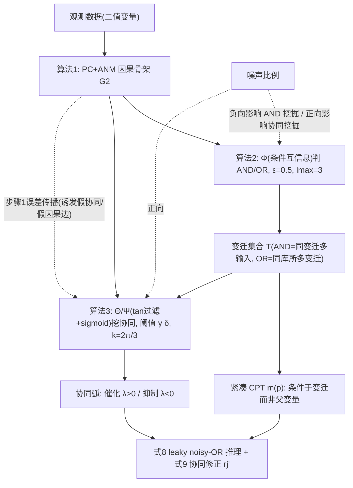

# SBPN 论文：知识图谱提取与批判性分析（B1 独立视角）

- 论文：Wang, Lu, Zhou, Zeng, Bao. "Synergy-incorporated Bayesian Petri Net: A method for mining 'AND/OR' relation and synergy effect with application in probabilistic reasoning". Information Sciences 680:121019, 2024. DOI 10.1016/j.ins.2024.121019
- 分析对象文本：pdftxt/SBPN.txt（全文 25 页，已对照原 PDF 抽查 p.7、p.14-15、p.23 关键页）
- 分析角色：知识图谱提取 + 批判性分析（与主拆解 Agent 独立并行，未读其他拆解文件）
- 页码锚说明：[PDF p.X] 指 PDF 第 X 页（即论文正文页码，两者一致）
- 公式约定：全部纯文本转写；"某真"/"某假"表示原文的 hat/check 记号（命题为真/假、变迁使能/未使能）

---

# 第一部分：知识图谱提取

## 1. 核心概念及其关系

### 1.1 概念清单（9 个）

| # | 概念 | 内容 | 出处 |
|---|------|------|------|
| C1 | SBPN 八元组 | SBPN = (D, P, β, T, F, Pr, λ, M)：命题集 D、库所集 P、双射 β:P→D、变迁集 T、流关系 F、概率函数 Pr:P∪T→[0,1]、协同系数函数 λ:P×T→[−1,1]、标识 M（各库所的条件概率分布）；整体须为有向无环图 | [PDF p.6] |
| C2 | 库所=命题 / 变迁=规则 | 库所表示命题变量，变迁表示不可分解的推理规则；库所→变迁的流关系表示前件，变迁→库所表示后件；变迁使能 iff 其全部前件命题同时为真（式 5：u(S(•ti))=\|•ti\| 时 Pr(ti使能\|S)=1，否则=0） | [PDF p.5][PDF p.6][PDF p.7] |
| C3 | "AND/OR" 关系 | 指向同一变迁的多个输入库所构成 AND 结构；同一库所的多个输入变迁之间构成 OR 结构。三种基本因果结构：单规则、合取规则、析取规则（Fig 3(a)-(c)） | [PDF p.5][PDF p.8] |
| C4 | 协同效应（催化/抑制）与协同系数 | 非因变量可提高（催化）或降低（抑制）某条推理规则成立的概率；强度由 λ(p,t) 刻画，λ>0 催化、λ<0 抑制，绝对值越大效应越强；绿色虚线弧=催化、红色点线弧=抑制 | [PDF p.2][PDF p.6][PDF p.8] |
| C5 | 紧凑 CPT（标识 m(p)） | 库所的条件概率定义在其输入变迁上而非全部父变量上；Fig 2 的 m(p6) 只需 3 个参数（配合 leaky noisy-OR），显著小于传统 CPT | [PDF p.6][PDF p.7] |
| C6 | "AND 强度"指标 Φ 与阈值 ε | 式(6)：Φ(x,y,z) = 1/(1+exp(ωa−ωb))，ωa = I(y;z\|x假)，ωb = I(y;z\|x真)（条件互信息）。定理 1：在"z 无噪声且仅有 x、y 两个前件"条件下，Φ(x,y,z)>0.5 是 x、y 之间存在 AND 关系的充要条件。实际判定：Φ(x,y,z)>ε 且 Φ(y,x,z)>ε 视为 AND，本文取 ε=0.5；复合 AND 上限 lmax=3 | [PDF p.10][PDF p.11] |
| C7 | 协同强度 Θ/Ψ 与阈值 γ、δ | 式(7)：Θ(ti,pj) = 1/(1+exp(σa−σb))（催化），Ψ(ti,pj) = 1/(1+exp(σb−σa))（抑制）；σa = tan(k(Pr(输出真\|输入全真)−0.5))，σb = tan(k(Pr(输出真\|输入全真, pj真)−0.5))，0<k<π，本文 k=2π/3；tan 为"过滤函数"，声称用于抑制错误前件-后件关系的影响。定理 2：若 pj 对 ti 有催化（抑制）效应，则 Θ>0.5（Ψ>0.5）。判定：Θ≥γ 记催化、Ψ≥δ 记抑制，仅给出 0.5<γ<1、0.5<δ<1，未给具体数值 | [PDF p.13] |
| C8 | 三步结构挖掘管线与协同候选集 | 步骤 1（算法 1）：PC 算法学因果骨架，未定向边用 ANM（HSIC 检验残差独立性）定向，得 G2；步骤 2（算法 2）：对每个变量的父集用 Φ 判 AND/OR，得 ANDOR 集合并生成变迁；步骤 3（算法 3）：对每个变迁在候选集内用 Θ/Ψ 挖协同。候选集：UP(ti)=不在同一连通分量的库所（结构间协同）、RP(ti)=同一连通分量但与 ti 无直接/间接因果的库所（结构内协同），按"用户需求"取 UP、RP 或 UP∪RP | [PDF p.8][PDF p.9][PDF p.12][PDF p.13] |
| C9 | 带协同修正的 leaky noisy-OR 推理 | 式(8)：Pr(px真\|S(•px)) = 1 − (1 − Pr(px真\|所有变迁未使能)) × 连乘_{j∈J} (1 − Pr(px真\|仅 tj 使能))。式(9)：当 tj 同时受 m 个催化库所与 n 个抑制库所影响时，rj = Pr(px真\|仅 tj 使能) 修正为 rj' = [Σ_{i=1..m}(rj + Pr(pi+真)·λ(pi+,tj)·(1−rj)) + Σ_{j=1..n}(rj − Pr(pj−真)·\|λ(pj−,tj)\|·rj)] / (m+n)，即对逐个修正值取算术平均；协同系数可由专家给定或从数据学习（细节在补充材料） | [PDF p.14][PDF p.15] |

### 1.2 概念间关系（邻接表）

- C2（PN 语义）→ 支撑 → C1（八元组定义）、C3（AND/OR 的图形表达）[PDF p.5-6]
- C8 步骤 1（PC+ANM）→ 输出因果图 G2 → 作为 C6 的输入域（父集 Parents(G2,xi)）[PDF p.9][PDF p.11]
- C6（Φ≥ε 判定）→ 决定 → C3 的 AND 分组（ANDOR 集合）→ 决定变迁集合 T 与 •t [PDF p.11][PDF p.12]
- C3（AND 归并为变迁）→ 正向影响 → C5（CPT 紧凑度：参数量从对父变量指数级降为对输入变迁数量级）[PDF p.2][PDF p.7]
- C8 步骤 3（候选集 UP/RP + C7 判定）→ 产生 → C4 的协同弧与 λ [PDF p.13]
- C4（λ 系数）→ 通过式(9)修正 rj → 调节 → C9 的推理输出（催化升、抑制降）[PDF p.14-15]
- 噪声比例 → 负向调节 C6 效果（5% 噪声下 AND 挖掘优于 10%）、正向调节 C7 效果（10% 噪声下协同挖掘优于 5%；原文称"噪声是协同效应的先决条件"）[PDF p.20][PDF p.21]
- C8 步骤 1 的错误 → 传播至 → 步骤 3 协同判定（式(7) 的 tan 过滤函数即为缓解此问题而设）[PDF p.13]；反向亦成立：协同库所携带的强相关会诱导步骤 1 误判因果边（D10-3000 上 p32→p17 的错误前件-后件关系）[PDF p.17]

### 1.3 Mermaid 图

## 2. 理论框架（论文无显式框架图，以下为依内容重构的隐含框架）

论文未给出统一的"理论框架图"，但 Fig 1(b)、第 3-5 节与结论（[PDF p.2][PDF p.6-15][PDF p.24]）隐含一个"知识挖掘—表示—推理"三段式、四层叠合的框架：

1. 结构语义层（PN 层）：借用 Petri 网的库所/变迁/流关系表达命题、规则与因果方向；AND 通过"同一变迁的多输入库所"表达，OR 通过"同一库所的多输入变迁"表达；协同效应表达为库所到变迁的虚/点线弧。该层回答"AND/OR 与协同长什么样"[PDF p.5][PDF p.6][PDF p.8]。
2. 概率语义层（BN 层）：在 PN 结构上定义联合概率分布（式 4：JPD 沿库所与变迁分解，Pr(x1..xr) = 连乘 Pr(xi|•xi)），变迁使能概率取 0/1 确定性（式 5），库所条件概率采用 noisy-OR 家族语义，形成紧凑 CPT。该层回答"结构上如何算概率"[PDF p.7]。
3. 数据挖掘层：三步管线（PC+ANM → 条件互信息 Φ → 条件概率差 Θ/Ψ），把 AND/OR 与协同从数据中"学出来"，是论文声称区别于 FPN 系列（[21-23]，依赖专家经验）与 PN+BN 融合系列（[38][39]，人工建模）的核心层 [PDF p.4][PDF p.9-13]。
4. 推理层：以变迁为基本推理元的 leaky noisy-OR（式 8）加协同修正（式 9），把 λ 系数注入推理过程；无协同时 SBPN 退化为 leaky noisy-OR 模型 [PDF p.14][PDF p.23]。

关键叠合点：变迁是三层的枢纽——它既是结构层的规则节点，又是概率层的 CPT 压缩单元，又是挖掘层协同效应的挂载对象（"PN 变迁是协同效应挖掘的基本单元"[PDF p.12]）、推理层的基本推理元 [PDF p.14]。论文对贡献的自我定位（3 条）也与此对应：学 AND/OR 与协同、变迁进 CPT、协同量化进推理 [PDF p.4]。

## 3. 关键数据表

### 3.1 表 3：SBPN 在 6 个合成数据集上的挖掘性能 [PDF p.18]

背景：基准网络（Fig 7，[PDF p.15]）含 30 条普通因果关系、21 个最小 AND 单元、10 个协同效应 [PDF p.17]；数据集命名 Dx-y，x=噪声比例(5/10%)，y=样本量(1000/2000/3000) [PDF p.16]。九个指标为普通因果(C)、最小 AND 单元(A)、协同效应(S)各自的 Recall/Precision/F1 [PDF p.17]。

| 数据集 | R(C) | P(C) | F1(C) | R(A) | P(A) | F1(A) | R(S) | P(S) | F1(S) |
|---|---|---|---|---|---|---|---|---|---|
| D5-1000 | 0.93 | 0.88 | 0.90 | 0.90 | 0.86 | 0.88 | 0.60 | 0.60 | 0.60 |
| D5-2000 | 1.00 | 1.00 | 1.00 | 1.00 | 1.00 | 1.00 | 0.80 | 0.89 | 0.84 |
| D5-3000 | 1.00 | 0.97 | 0.98 | 1.00 | 0.95 | 0.97 | 0.60 | 1.00 | 0.75 |
| D10-1000 | 0.93 | 0.90 | 0.91 | 0.90 | 0.86 | 0.88 | 0.90 | 0.90 | 0.90 |
| D10-2000 | 0.97 | 0.85 | 0.91 | 0.90 | 0.90 | 0.90 | 0.70 | 0.88 | 0.78 |
| D10-3000 | 0.97 | 0.88 | 0.92 | 0.95 | 0.91 | 0.93 | 0.70 | 1.00 | 0.82 |

关键数值解读：

- Recall(A) 0.90-1.00、Precision(A) 0.86-1.00：AND 单元挖掘整体较好；由于共 21 个 AND 单元，0.90 意味着漏掉约 2 个 [PDF p.17][PDF p.18]。
- Recall(S)=0.60（D5-1000）：10 个协同效应只找到 6 个，且 Precision(S)=0.60 对应原文"识别出 4 个错误协同效应，占识别总数的 40%"（即识别 10 个、对 6 错 4）[PDF p.17][PDF p.18]。这是全表最差单元格，原文归因于"低噪声+小样本使协同库所携带的协同信息量少"[PDF p.17]。
- Recall(S) 随样本量非单调：D5 系列 0.60→0.80→0.60（样本 1000→2000→3000），D10 系列 0.90→0.70→0.70。样本增多反而变差，原文未解释此非单调现象（只解释了噪声维度的平均差异 [PDF p.21]）。由于只有 10 个协同效应，指标粒度为 0.1，一两个效应的波动即产生 0.1-0.2 的跳变；正文未报告重复实验或方差（详见批判部分 M2）。
- D10-3000 的 Precision(S)=1.00 对应原文"D10-3000 上未识别出错误协同效应"[PDF p.17]；但同页指出该数据集上出现错误因果边 p32→p17（p32 本是规则"IF p18 THEN p17"的协同库所，因携带大量协同信息与 p17 强相关而被误判为因果），与 P(C)=0.88<1 一致 [PDF p.17][PDF p.18]。
- 对照表 4（D5-1000 上与 6 个基线比较，[PDF p.18]）：SBPN 的 C 三项（0.93/0.88/0.90）与 PC 完全相同——因为 SBPN 的普通因果发现就是 PC（+ANM 定向）；A、S 指标上除 CCI 外全部基线为 N.A.（不支持该任务），CCI 的 Recall(S)=0.00。ANM、CCI 的 F1(C) 仅 0.16，HC 0.62，GES 0.82，GOBNILP 0.45。

### 3.2 表 14：两个真实数据集上的定性挖掘对照 [PDF p.22]

背景：泌尿系统疾病数据集（120 例、8 属性，[PDF p.21]，真值网络 Fig 13 按领域知识[17][36]构建 [PDF p.21-22]）与学生表现数据集（395 例、33 属性，[PDF p.21-22]）。✓=识别出，×=未识别出，─=算法不支持该类关系。

| 待挖掘关系 | PC | ANM | CCI | HC | GES | GOBNILP | SBPN |
|---|---|---|---|---|---|---|---|
| X3→X7（腰痛→膀胱炎，普通因果） | ✓ | ✓ | ✓ | × | × | × | ✓ |
| X5→X7（排尿痛→膀胱炎，普通因果） | ✓ | × | × | × | ✓ | × | ✓ |
| X5→X7 上 X6 的催化效应 X6(+) | ─ | ─ | × | ─ | ─ | ─ | ✓ |
| X5→X7 上 X3 的抑制效应 X3(−) | ─ | ─ | ─ | ─ | ─ | ─ | ✓ |
| Y2 AND Y13 → Y27（性别∧通学时间→工作日饮酒） | ─ | ─ | ─ | ─ | ─ | ─ | ✓ |
| Y25→Y26（课余时间→外出交友） | ✓ | × | × | × | × | × | ✓ |
| Y3 AND Y15 → Y21（年龄∧挂科数→升学意愿） | ─ | ─ | ─ | ─ | ─ | ─ | ✓ |
| Y25→Y26 上 Y24 的催化效应 Y24(+) | ─ | ─ | × | ─ | ─ | ─ | ✓ |
| Y3∧Y15→Y21 上 Y29 的抑制效应 Y29(−) | ─ | ─ | ─ | ─ | ─ | ─ | ✓ |

关键数值/符号解读：

- SBPN 在全部 9 行均为 ✓；但 9 行中有 6 行的全部基线为 ─ 或 ×——即这 6 类关系按定义只有 SBPN（个别行加 CCI）支持挖掘，比较的信息量有限 [PDF p.22]。
- CCI 是唯一在两行催化效应上"支持但失败"（×）的基线；原文解释 CCI 挖的是变量间增强效应而非"非因变量对规则"的效应 [PDF p.22-23]。
- 注意 X3 在表中同时出现为 X7 的因（第 1 行）与 R1 规则的抑制因子（第 4 行）；原文明确"X5 和 X3 是 X7 的因"且"X3 对 R1 有抑制效应"[PDF p.23]——这与摘要"非因变量的协同效应"的表述存在张力（详见批判 L3）。
- 推理实验（Fig 15，[PDF p.23]）：以 X7、Y21、Y26、Y27 为预测目标，SBPN 预测准确率高于 noisy-OR[13]、leaky noisy-OR[15]、cancellation model[18]；准确率仅以柱状图呈现，正文无精确数值、无方差、无显著性检验 [PDF p.23]。

## 4. 引用网络（TOP5 关键文献）

| 排序 | 文献 | 角色 | 反复使用位置 |
|---|---|---|---|
| 1 | [13] Pearl 1988《Probabilistic Reasoning in Intelligent Systems》 | 理论基础：noisy-OR 模型是 SBPN 的建模与推理机制母体；同时是合成数据 OR 结构的生成机制、推理实验基线 | 式(2)定义 [PDF p.5]；"noisy-OR 作为本文建模推理机制"[PDF p.7]；式(10)数据生成 [PDF p.16]；推理基线 [PDF p.23] |
| 2 | [15] Diez & Druzdzel 2006（leaky noisy-OR 技术报告） | 理论基础+方法骨架：leaky noisy-OR 是 SBPN 推理框架（式 8 直接改写自它），也是推理实验基线；"无协同时 SBPN≈leaky noisy-OR" | Fig 1 讨论 [PDF p.2]；式(3) [PDF p.5]；式(8)推理框架 [PDF p.14]；退化说明与基线 [PDF p.23]。注意 [PDF p.7] 处将 leaky noisy-OR 误标为 [9]（[9] 实为 Popescu & Dumitrache 的不确定规则工作流论文），他处均为 [15]，属原文引用笔误 |
| 3 | [24] Spirtes et al.《Causation, Prediction, and Search》（PC 算法） | 方法组件+对比对象：结构挖掘第一步整体采用 PC；也是 6 个基线之一（其 C 指标与 SBPN 完全一致） | 相关工作 [PDF p.3脚注1][PDF p.5]；基本思路 [PDF p.6]；算法 1 [PDF p.9]；基线 [PDF p.18-21] |
| 4 | [17] Zhang et al. 2021（CCI：combined cause inference） | 最近竞品/对比对象+部分真值来源：是唯一同类（挖组合因+增强效应）的方法；论文反复论证 SBPN 与其差异（挖"因变量间 AND"与"对规则的催化/抑制"）；泌尿数据集真值网络（Fig 13）按 [17][36] 的领域知识构建 | 引言差异论证 [PDF p.3]；相关工作 [PDF p.6]；基线 CCI [PDF p.18-22]；真值构建 [PDF p.21-22] |
| 5 | [23] Wang, Lu, Zhou, Zeng 2022（协同效应 FPN，ESWA） | 前身工作（同作者组自引）：协同效应概念在 FPN 上的先行版本，本文声称超越点是"从数据学而非专家给"；同时是 Case 1（腐蚀失效）真值结构来源；推理实验中作为"参数靠专家"的 PN 系方法被排除出基线 | FPN 相关工作与差异声明 [PDF p.4]；Case 1 来源 [PDF p.21]；排除说明 [PDF p.23] |

次关键：[28] Hoyer et al.（ANM）为算法 1 的定向组件兼基线 [PDF p.9][PDF p.18]；[38] Taleb-Berrouane et al.（BSPN）与 [39] Santana et al.（Bayesian-PN 多米诺效应）是"PN+BN 融合"的差异化对象，论文用整段论证与其"根本不同"（它们人工建模、沿用传统 BN 概率语义）[PDF p.4]。

---

# 第二部分：批判性分析

## 1. 方法论审视

**M1（最大内部效度威胁）评估数据的生成机制与被评估模型的假设同构，构成自证循环。** 合成数据按式(10)生成：OR 结构用 noisy-OR 机制生成（原文明言"noisy-OR 模型 [13] 被用作变迁间 OR 关系的生成机制"）、AND 结构用输入变量乘积与真值比例的组合生成 [PDF p.16]；协同效应则是"直接更新催化/抑制库所的取值，使得 Pr(输出真|输入真, 催化库所真) 远大于 Pr(输出真|输入真)、Pr(输出真|输入真, 抑制库所真) 远小于 Pr(输出真|输入真)"[PDF p.16]——这恰好就是式(7) Θ/Ψ 所度量的统计量。换言之，数据按"SBPN 能检测什么"来注入信号，再用 SBPN 检测之。基线中 ANM 假设加性噪声（对二值数据本就不适配，六个数据集上 F1(C) 恒为 0.16-0.18，[PDF p.18-19]），HC/GES/GOBNILP 假设普通 DAG——它们与生成机制系统性失配，比较结果的外推力弱。

**M2（统计效力缺失）全部定量结果为单次运行，无重复、无方差、无显著性检验。** 表 3 的 6 个数据集各为一次随机生成（[PDF p.16]），协同效应总数仅 10 个、AND 单元 21 个 [PDF p.17]，Recall(S) 粒度为 0.1；观察到的非单调现象（D5 系列 Recall(S) 0.60→0.80→0.60、D10 系列 0.90→0.70→0.70，[PDF p.18]）与抽样波动的预期形态一致，但论文既未重复实验估计方差，也未解释非单调性，只对"噪声维度"的平均差异给出事后解释（AND 挖掘 5% 噪声更好、协同挖掘 10% 噪声更好，[PDF p.20-21]）。Fig 15 的预测准确率同样只有柱状图无数值无区间 [PDF p.23]。全文没有任何假设检验、置信区间或多重比较控制；严格说不是 p-hacking（因为根本没有 p 值），而是低于该刊常规实证标准的"单点数据+叙事解释"。

**M3（阈值与超参数敏感性未检验）。** ε=0.5 恰好取在定理 1 给出的理论下界上（0.5≤ε<1，"ε 越大挖出的 AND 越强"，[PDF p.11]）——在有噪声的有限样本下，Φ 围绕 0.5 的抽样波动会直接制造假阳性 AND，而论文未报告 ε 的敏感性曲线；k=2π/3 的选取无任何论证 [PDF p.13]；γ、δ 只有区间 0.5<γ<1、0.5<δ<1，正文通篇未给出实验所用的具体数值 [PDF p.13]（可能在补充材料，但正文结果不可独立核验）；lmax=3 亦无讨论 [PDF p.11]。三个门槛（ε、γ、δ）直接决定表 3、表 14 的全部结果，其敏感性缺席是硬伤。

**M4（评估对象的选择偏差）。** (a) 6.2 节标题为"真实世界结构"，但数据仍由与 6.1 相同的合成机制生成（原文："两个案例的数据生成机制与合成结构相同"[PDF p.21]），真实的只有图拓扑；(b) Case 1（腐蚀失效）取自作者自己的前作 [23]（[PDF p.21]），真值结构由被评估方法的提出者定义；(c) 论文明言不用经典 BN 基准库，理由是"这些网络不含 AND 关系或协同效应"[PDF p.21]——理由成立，但结果是所有定量基准均为"含 SBPN 型结构"的网络，方法在普通网络上的假阳性率（会不会在没有 AND/协同的地方挖出 AND/协同）从未被测试；(d) 6.3 节预测目标"选择 X7、Y21、Y26、Y27，因为这些变量大多受协同效应影响"[PDF p.23]——按对己方有利的准则筛选评估点；(e) 正文只报告"AND 结构与协同效应最多"的基准网络（Fig 7），其余网络放补充材料 [PDF p.15]。

**M5（预测实验协议缺失）。** 全文检索不到 train/test 切分、交叉验证或留出集的任何描述；协同系数的学习被描述为"基于数据集微调，使规则在考虑所有协同命题时可信度最高"[PDF p.15]。若（正文无相反证据）系数在同一数据上学习并评估，则 SBPN 相对 noisy-OR/leaky noisy-OR 的每变迁 m+n 个额外自由参数天然带来样本内拟合优势，Fig 15 的领先无法归因于"协同机制正确"而非"参数更多"（详见 L5）。泌尿数据集仅 120 例 [PDF p.21]，该风险尤其突出。

**M6（真实数据的代表性与预处理黑箱）。** 方法明确限定二值变量（"本研究聚焦二值变量的 AND/OR 与协同挖掘"[PDF p.7]），但学生表现数据集的属性含年龄 Y3、成绩 Y31-Y33 等多值/连续变量（[PDF p.22] 表 13），泌尿数据集 X1 为患者体温（[PDF p.21] 表 12）——二值化方式全文未述。两个真实数据集样本量 120/395，对基于条件互信息（式 6）与条件概率差（式 7）的估计而言非常小；且泌尿数据真值网络的"X6 对 R1 有催化效应"这一条目，其论证方式就是"X5 与 X6 同时出现时 X7 的条件概率高于仅 X5 出现时"[PDF p.23]——真值的定义与 Θ 的计算公式同义反复，SBPN"挖到"它在逻辑上近乎必然（见 L1）。

**M7（噪声与协同信号的设计性纠缠，未控混淆）。** 论文自己指出"噪声是协同效应的先决条件"，并以此解释 10% 噪声下协同挖掘更好 [PDF p.21]。在生成机制中，协同只能通过对 noisy-OR 基线的偏离（即"结构化噪声"）体现；这意味着实验中"协同信号强度"与"噪声比例"是被设计绑定的混淆对：无法区分方法是在挖"协同效应"还是在挖"任何使条件概率偏移的噪声结构"。没有负控实验（注入与协同无关的结构化噪声，检验 Θ/Ψ 是否误报）。

## 2. 逻辑审视

**L1（最薄弱环节）：从"条件概率差"到"协同效应"的语义跳跃缺乏可识别性论证。** 协同效应在操作层面被定义为：给定规则前件为真，非前件变量取真时输出条件概率的升/降（式 7，[PDF p.13]）。但产生这种条件概率差的替代机制至少包括：未观测共因（confounder）的代理变量、与前件交互的调节变量（moderator）、碰撞结构条件化后的选择偏差、以及步骤 1 漏掉的真实因果边。论文没有任何一节讨论如何区分"协同"与这些替代解释；相反，论文自己给出了混淆可双向发生的证据——D10-3000 上协同库所 p32 因携带大量协同信息而被 PC 误判为 p17 的因 [PDF p.17]，说明"协同库所"与"因果变量"在数据指纹上可以无法区分。"催化/抑制"的化学隐喻（[PDF p.2]）赋予了这个统计量过强的机制性语义。

**L2（定理适用范围与实际使用的落差）。** 定理 1 的充要性只在"z 不受噪声影响且仅有两个前件 x、y"的条件下成立 [PDF p.10-11]；对更一般情形（有噪声、多前件、AND/OR 混合），论文仅断言"式(6)仍可用于判定"（"In fact, ... Eq. (6) can still be used ..."）而无证明 [PDF p.11]，且 Fig 4/表 2 的演示恰恰表明多前件+OR 会淹没 AND 信号（表 2 中 p1、p2 双假时 Pr(p5真)=0.71，双真时 0.95，直读像 OR，[PDF p.10]）。结论一节进一步自认："随着指向同一效应变量的 OR 结构增多，识别 AND 结构愈发困难"[PDF p.24]。但摘要与贡献陈述无任何限定地宣称"能直接从数据学习 AND 关系与协同效应"[PDF p.1][PDF p.4]——理论保证的范围远小于宣称范围。

**L3（定义不一致的具体案例）。** 摘要与引言将协同效应严格限定为"非因变量对推理规则的效应"（"synergy (catalytic or inhibitory) effect that a non-causal variable may have on a reasoning rule"[PDF p.1]；引言以催化剂 D"不是 F 的因"为例 [PDF p.2]）；但泌尿案例中 X3 同时被认定为"X7 的因"和"对规则 R1 有抑制效应"[PDF p.23]。在形式化层面这不算矛盾（X3 不在 R1 对应变迁的 CausalityPlace 中，属 RP 结构内协同候选，[PDF p.13]），但说明"非因变量"的表述不准确——准确表述应为"非该规则前件的变量"；论文未澄清这一点，读者按摘要理解会做出错误预期。

**L4（过度概括）。** 摘要称"在开放数据集上的实验结果证明了方法的有效性与优势"[PDF p.1]，但定量主证据（表 3-11）全部来自合成数据；两个开放 UCI 数据集仅做定性对照（表 14）且无真值可核（学生数据集部分），原文亦承认"这两个数据集中 AND 关系与协同效应数量有限，故只做定性比较"[PDF p.21]。学生数据上的"有意义规则"（如"工作日饮酒量由性别 AND 通学时间共同决定"[PDF p.22-23]）只有叙事合理性，无任何外部验证，作为社会行为因果断言尤其草率。

**L5（替代解释未排除：参数量与过拟合）。** Fig 15 中 SBPN 优于三个基线的另一解释是：SBPN = leaky noisy-OR + 每变迁额外 m+n 个协同参数（式 9），而系数按"使规则可信度最高"的准则在数据上微调 [PDF p.15]；在无留出集证据（M5）的前提下，"协同机制正确"与"自由度更大导致的样本内优势"两个假说在论文给出的证据下不可区分。消融方向（如：给 leaky noisy-OR 同等数量的自由参数但随机挂载、或在无协同数据上对比四模型）均未做。另外式(9)对多重协同取算术平均的聚合规则是纯 ad hoc 选择——油罐案例中催化 λ=0.6 与抑制 λ=0.7 几乎相互抵消（修正后 0.85 对无协同基线 0.86，[PDF p.15]），一个强抑制因子会被多个弱催化因子稀释，这种行为是否符合"协同"的领域语义，论文未讨论。

## 3. 贡献审视

**实际增量（分对象）：**

- 相对普通 BN/noisy-OR：真实增量不在"表示"（BN 本可通过增设确定性 AND 中间节点表达合取，论文自己承认这点，[PDF p.3]），而在"学习"——中间 AND 节点不在原始数据中、传统结构学习学不出它；SBPN 用变迁约束观测变量间关系绕开了这一点 [PDF p.3]。核心技术新颖点是式(6)的条件互信息 AND 判据及定理 1（尽管适用范围窄，见 L2），这是文献中相对新的做法。
- 相对噪声-OR 系（含 leaky noisy-OR[15]、cancellation model[18]）：增量为"规则级"协同——[18-20] 处理的是因变量之间的增强/削弱，SBPN 处理非前件变量对规则的效应 [PDF p.4-5]；概念区分成立，但其经验优势的证据被 M5/L5 削弱。
- 相对 PN+BN 融合（BSPN[38]、Bayesian-PN[39]）：这两者是人工建模+传统 BN 概率语义，SBPN 从数据学结构并重定义变迁上的概率语义 [PDF p.4]；差异化论证清晰，成立。
- 相对作者自己的协同 FPN [23]：概念（协同弧、催化/抑制）几乎平移自 [23]，本文增量是"参数与结构从数据学习而非专家给定"[PDF p.4]。这是一条渐进式自我延长线：FPN 版(2022, ESWA) → 贝叶斯版(本文)。
- 相对 CCI[17]：任务定义有实质差异（因变量间 AND vs 非因变量间组合因；规则级 vs 变量级效应），定位准确 [PDF p.3]。

**Novelty 定位：** 中等。是"已有部件的新组装"（PC+ANM+CMI 判据+tan 过滤+leaky noisy-OR）而非新原理；最有独立价值的部件是 AND 判据（式 6+定理 1）与"变迁作为 CPT 压缩单元"的表示方案。"Synergy-incorporated"的核心语义继承自 [23]。

**对后续研究的启发：** (a) 用变迁/规则作为一等公民承载"上下文对规则的调制"，对安全/风险建模（如故障树的门条件失效、MAS 中环境因素对交互规则的调制）是可借鉴的表示思想；(b) 作者自己指出的开放问题——OR 结构增多时 AND 不可识别、扩展到时序数据 [PDF p.24]——本身即是对该方向局限的诚实标注；(c) 反面教材价值：评估协议（生成机制与模型假设同构）提示后续工作必须用异构生成器做对抗性评估。

## 4. 可复现性

**已给出的信息：** 算法 1-3 伪代码 [PDF p.9][PDF p.12][PDF p.13-14]；式(6)-(10) 完整公式；ε=0.5、lmax=3 [PDF p.11]、k=2π/3 [PDF p.13]；ANM 残差独立性用 Hilbert-Schmidt 独立性准则 [PDF p.9]；数据生成机制式(10)与协同注入方式 [PDF p.16]；数据集命名与规模 [PDF p.16][PDF p.21]。

**缺失的关键细节（正文层面不可复现）：**
1. γ、δ 的具体数值从未给出（只有 0.5<γ<1、0.5<δ<1 [PDF p.13]），而它们直接决定协同挖掘的全部结果；
2. PC 算法的条件独立检验类型与显著性水平 α 未述 [PDF p.9]；
3. 协同系数学习只有三句话的流程描述（基准强度→微调→映射），"更多细节见补充材料"[PDF p.15]，正文不可独立复现；
4. 6.3 节预测实验的协议（切分、准确率计算方式、预测规则）完全未述 [PDF p.23]；
5. 真实数据的二值化/离散化方式未述（方法限定二值变量 [PDF p.7]，但学生数据含多值属性 [PDF p.22]）；
6. Fig 15 无数值，结果无法核对 [PDF p.23]。

**数据/代码可得性：**
- Data availability 声明原文（[PDF p.24]）："Data will be made available on request."
- 但正文三个脚注给出了公开数据链接：github.com/netlearninglabs/SBPN/tree/main/sample（脚注 3，[PDF p.10]）、.../simulated_structure（脚注 4，[PDF p.16]）、.../real_world_rule（脚注 6，[PDF p.21]）——声明与脚注不一致（声明说"按需索取"，实际部分数据已公开）。
- 任务给定的外部情报：该 GitHub 仓库只有数据、无代码。与论文核对：论文自身从未承诺公开代码（三个脚注均只指向数据目录），故"仓库无代码"与论文声明不矛盾；但结合上述第 1-4 条缺失，结论是——结构挖掘部分需自行重实现且缺少 γ、δ 与 PC 参数，属"半可复现"；协同系数学习与推理实验属"不可复现"（关键细节在正文之外）。

## 5. 总评（模拟审稿人立场）

**判定：大修（Major Revision）。** 表示层的想法（变迁承载 AND 与规则级协同、压缩 CPT）清晰且有一定新意，写作结构完整、算法与定理表述规范；但实证体系存在结构性缺陷，现有证据不足以支撑"有效性与优势"的结论强度。

**三个最硬的质疑点：**

1. **评估自证循环：** 合成数据的生成机制（noisy-OR 生成 OR、乘积生成 AND、按 Θ/Ψ 所度量的条件概率差直接注入协同）与 SBPN 的建模假设同构 [PDF p.16]；所谓"真实世界结构"实验的数据仍由同一合成机制生成 [PDF p.21]；泌尿数据集的协同"真值"用与式(7)同义的条件概率差定义 [PDF p.23]；推理实验的预测目标按"受协同影响"筛选 [PDF p.23]。请在生成机制与模型假设异构的数据上、含"无 AND/无协同"负控网络的假阳性测试下重新评估。
2. **统计效力与协议缺失：** 单次运行、无方差/显著性（表 3 的非单调结果 0.60→0.80→0.60 无解释 [PDF p.18]）、Fig 15 无数值 [PDF p.23]、无 train/test 切分描述、γ/δ 数值未披露、ε/k/γ/δ 无敏感性分析 [PDF p.11][PDF p.13]。在此之前，SBPN 相对基线的优势无法与"每变迁 m+n 个额外参数在同一数据上微调"[PDF p.15] 的过拟合解释相区分。
3. **"协同效应"的可识别性：** 操作定义等于"非前件变量引起的条件概率偏移"（式 7，[PDF p.13]），与未观测混杂、调节效应、结构学习残差不可区分，论文未提供区分手段；且自证据显示协同库所可被误判为因（p32→p17，[PDF p.17]）、因变量可同时是协同因子（X3，[PDF p.23]，与摘要"非因变量"表述冲突 [PDF p.1]）。定理 2 只证明了必要方向（有协同→Θ>0.5），算法却按充分方向使用（Θ≥γ→判协同）[PDF p.13]。

**次要修订项：** [PDF p.7] leaky noisy-OR 误引为 [9]（应为 [15]）；Data availability 声明与 GitHub 脚注不一致 [PDF p.24 vs p.10/16/21]；摘要"open datasets demonstrate effectiveness"与实际证据结构（定量=合成、开放数据=定性）不匹配 [PDF p.1]；Fig 13 中"否定关系"的小圆圈弧不属于定义 1 的记号系统，属临时扩展 [PDF p.22-23]；建议给出 lmax>3 与复合 AND 的可扩展性讨论 [PDF p.11]。

---

## 安全门自检

- 不编造：以上每一论断均带 [PDF p.X] 锚点；无法从文本核验的（Fig 15 具体数值、补充材料内容、γ/δ 实际取值）均已明示"未给出/在正文之外"；外部情报（GitHub 仓库只有数据无代码）已标注为任务给定信息并与论文声明做了核对区分。
- 不过度承诺：批判结论区分了"正文层面不可复现"与"可能在补充材料中"；对过拟合替代解释的表述为"不可区分"而非"必然过拟合"。
- 全覆盖：知识图谱四项（概念 9 个、框架、2 张关键表、TOP5 引用）与批判五项（方法论 7 条、逻辑 5 条、贡献、可复现性、总评）均已完成。
