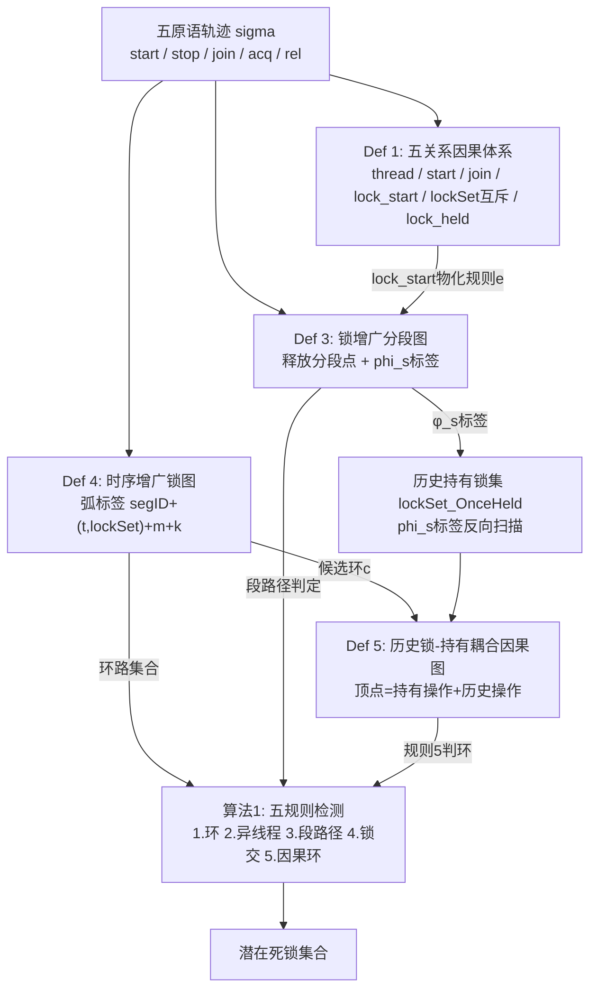

# 15b · 锁增广分段图(2021 JOS)：六点第一性原理 + 知识图谱 + 批判性四审视(完整框架分析卡)

> 论文:Lu F., Zheng J., Bao Y., Zeng Q., Duan H., Wang X. "Deadlock Detection of Multithreaded Programs Based on Lock-augmented Segmentation Graph." *Ruan Jian Xue Bao/Journal of Software*, vol. 32, no. 6, pp. 1682–1700, 2021. DOI: 10.13328/j.cnki.jos.006244 [p.1]
> 本卡性质:L4 分析层卡，叠在 `15_DEADLOCK_JOS2021.md`(2026-09-08 事实层拆解)之上。论文事实一律引"见 15 卡 §X"不复写；本卡增量 = 六点框架、张力结构、知识图谱、四审视与核心发现。
> 格局层口径:按七篇视角书写(D2线:`02/04/15`三篇，D1线:`01`，静态侧:`03/08`，跨线:`05/06`)；15 卡是 2021 年时间截面，04 卡是 2026 年时间截面，两卡叠读能抽取"同源方法五年迭代"的演化轨迹。
> 合规:唯一输出为本文件，其余既有文件只读；TOP5 引用仅取自论文参考文献表 [p.9]；与 04 篇(SegLock)比对基于 `_launch/pdftxt/SEGLOCK.txt` 逐段核对。

---

## 〇、特命节:2021 论文的"本体地位"与 2026 SegLock 的"继承检验"

### 〇.1 问题陈述

2021 JOS 论文(本篇)与 2026 TST SegLock(04)均由鲁法明一作、郑佳静参与，标题均含"锁增广分段图"，方法论存在明显继承关系。两篇的题目定义 Def 1–5 几乎逐句对应，Program 1 运行轨迹与案例构造完全一致。但 04 篇从未引用本篇(参考文献 [1]–[40] 中无 2021 年 JOS 条目)，也未在谱系位置说明。本卡任务:**通过对本篇第一性原理的独立分析，推导出 04 篇的核心创新到底在哪里，而非对应继承了什么**——这对于判断两篇论文的独立贡献度与课题线的方向演进有关键意义。

### 〇.2 特命命题

**命题甲(谱系本体论):**本篇 2021 JOS 是否应被视为 04(SegLock TST)的"直接前身文献"——不是指"会被引用"或"思想相同"(这两点已肉眼可见)，而是指"方法骨架在本篇已经完整，04 的改进是在保留同一骨架前提下的参数调整而非结构创新"？

**验证角度三个**：
1. 五关系体系能否解释所有误报根源？(若是，则骨架论证完整；04 若只是微调因果图判环方法，可能算改进而非创新)
2. 两图(SegG_Lock + LockG_Order)的表达力是否足以消除本篇声称的"所有"误报？(若有漏洞，04 的修补可能是核心创新点)
3. 算法1的五规则是必要充分条件吗，还是必要不充分（需运行时兜底）？(04 篇的重演两阶段是否是对本篇不完备性的救场？)

---

## 一、六点第一性原理分析

### 1. Task:解决什么问题(形式化)

**输入**:单条五原语轨迹 σ ∈ ConPrimitive* (Def 2, Eq [p.5], ConPrimitive = {start(u,v), stop(v), join(u,v), acq(u,l), rel(u,l)} )，由 CalFuzzer 插桩采集，携带线程与锁事件流 [p.8, L736-739]。

**输出**:两级。(a)潜在死锁集 = 时序增广锁图中通过五规则过滤的环路 c 的集合 [p.8, L622-628、L630-672]；(b)三分判定：真死锁/假死锁/（备选：需进一步重演确认）[本篇仅 (a)，无重演层]。

**评价口径**:检出数、假阳性数、检测耗时、内存 [Table 4, p.9]；对标 iGoodlock(CalFuzzer 内置，循环锁依赖链+DeadlockFuzzer 随机重演)单一基线。

=**第一性原理思考**=
问题本质是把"这次好运行里没死锁，换种调度会不会死"变成"从轨迹挖的模型上判定是否能并发触发"。里面压着三个赌注：
- 赌注一(因果可恢复)：五类真实因果恰好落在{线程内序, start, join, 锁-start耦合, 历史锁-持有耦合}且能从单轨迹完全恢复——赢面 = Def 1–5 声称；输面 = 条件等待、时间约束、重入语义等真实 Java 不被建模
- 赌注二(过滤充分)：环路通过五规则过滤即为真死锁——赢面 = 案例 Program 1；输面 = 本篇未做充分性证明("历史锁-持有"因果图判环只是必要条件，见 15 卡 §3 结论)
- 赌注三(单轨迹代表性)：一条不死锁的运行轨迹，其并发闭包包含了真死锁会触发的交错——本篇承认动态法有假阴性 [p.9, L708-710]，未做覆盖率估计

### 2. Challenge:传统方法的困难

见 15 卡 §1(三类信息丢失)。此处补充第一性：**为什么"只加规则"(扩展锁图谱系 [15]–[19] in JOS)而非"换载体"(PN 展开)无法解决**——
- lock-start 耦合是**区间级现象**：u 的整个持锁区间约束 v 中操作的序列，但图模型的节点是聚合体(语句级或段级)，无格子安放区间约束
- 历史锁耦合是**跨区间 AND 结构**："曾持有-现持有"的配对，不能分解为局部规则，需全局图一致性检查

已有两条出路都有代价：(i)升维换载体(PN变迁到实例级)→ 状态爆炸(PNULock 02 自认 [02b卡])；(ii)打补丁加规则(ConLock+ [21] 的约束集)→ 重演才能最终确认。本篇走第三条：**改造"如何分段"，让区间级依赖物化为图结构**(锁释放分段点+φ_s标签)。

### 3. Insight & Novelty

**洞察(三个)**：
- **Insight-1(因果承载体):** 分段不只是 start/join 粗分，释放也是自然分割点——u 持 o 与 u 释放 o 构成区间边界，该区间内 start(u,v) 可通过"释放点后接新段+段间弧"物化为图弧关系，转化为"段间无路径"即"无因果"的判定问题。
- **Insight-2(标签即历史):** φ_s 标签串完整记录段内逐操作序列不是冗余，反而是计算 lockSet_OnceHeld 的唯一数据源——从标签反向扫描到当前持有锁集全部被获取为止，扫过的锁即为曾持有。这样 lockSet_OnceHeld 从"凭空添加的新概念"变成"从观测数据直接导出"。
- **Insight-3(必要条件 vs 充分条件):** 对于"历史锁-持有"耦合，五规则本质在于：(a)–(d) 规则能筛掉一些明显不能并发的环路(必要条件)，但 (e) 规则(DependG_Lock 判环)是在已通过 (a)–(d) 的候选环上补充的**局部一致性检查**——检查该特定环路的因果假设是否自洽，仍无法保证全局调度可实现(充要性缺口对应 04 篇的两阶段重演闭环)。

**Novelty 逐创新点**：
- **N1 五关系因果体系(Def 1)**：将"什么样的操作对无法并发"分类学化为五类关系；相比 ConLock+ 的模糊"历史锁导致误报"，本篇给出了形式化定义(Def 1(5) [p.5-6])及必要充分的交集判定条件 (Lock_Intersection = lockSet_OnceHeld ∩ lockSet)
- **N2 锁增广分段图(Def 3)**：标题创新。与传统分段图的差异：(i)规则 (d)–(e) 的"锁释放分段点"与"lock-start 耦合弧"，(ii)规则 (3) 的 φ_s 标签记录获取-释放序列
- **N3 时序增广锁图(Def 4)**：轮次 m + 序号 k 的弧标签，解决"同语句多轮执行混淆"问题(Challenge 1)，代价相比 PNULock 的每轮一变迁更轻
- **N4 "历史持有-持有"耦合因果关系图(Def 5)**：判定结构创新。非文献中的随意约束集，而是对候选环路**按需构建的局部图**，节省了全图一致性检查的代价

Novelty 定位：相对分段图谱系([16], [17])的增补，相对 ConLock+([21])的形式化升级。

### 4. 方法骨架校核(独立复核新发现)

#### F1(论文完整性缺陷):算法1伪代码与定义5的接口不匹配

定义5规则(1)对"锁对象o与操作 e_ki、e_kj"的模式没有明确说明 e_ki/e_kj 是否**必须来自环路c中的弧**。伪代码算法1第29行 "根据定义5构造环路c对应的DependG_Lock_c" 暗示按照Def 5逐条规则，但Def 5(1)的文字 "设c=ek1ek2…ekl构成…一条有向环路" [p.7, L571] 明确了是**环路中的弧** ，而顶点集 V_c "每个顶点对应一个锁获取操作" [p.7, L573] 不一定限于 c 中的弧。实际程序中：当 e_ki 属环路、但其历史持有锁 o 在 c 外的操作获取时，那些外部获取是否也要进 V_c？

按第 1.1 节例子，环路{11,15} 对应的 DependG_Lock 中，顶点包括 threadB 第26行(ID 22)与 threadC 第33行(ID 32) 的 acq(…,n) ——都不在时序增广锁图的弧{11,15}中，但被 Def 5(1.2) 拉进来。这说明 DependG_Lock_c **会包含非c中的操作**，但定义文本未明确此点。

**后果:**若实现者严格按"仅处理c内部操作"来理解，会产生漏判。需澄清：V_c 的完整性域。

#### F2(表3行标标准不一)

表3行头分别给出 "是否真实死锁" 与 "不同模型的死锁检测结果"，但对每行(四个环路)的标准不统一：
- 行1–3对应 Program 1 的真实死锁(标注"是"的行2)与误报（标注"否"的行1/3/4)
- 但行号与表1程序代码行号(05:join 第5行)没有直接映射，容易与"第14行代码 acq(o2)"混淆

原文脚注未澄清表行与程序行的对应关系。

#### F3(复杂度分析缺失)

论文第 2.2 节 Def 3 构造规则描述了"规则(d)–(e)检查首个获取段 s'' 并添加新段与弧"，但未给出该检查(反向搜索)的时间复杂度。Def 5 构造 DependG_Lock_c 的复杂度(V_c 大小与 R_c 边数上界)也未定量。

对标表4实验中OnceHeldLockDemo的时间跳变(0.726s vs 2.118s，三倍)，历史锁计算自身的规模风险无法精确评估。

#### F4(锁获取序列计算的停止条件)

论文 第3节描述 lockSet_OnceHeld 的计算规则 [p.6, L557-564]："从中 index−1 位置开始…遍历各段的标签…直至 lockSet 中所有锁都在遍历过程中被获取为止" ——这个"被获取"的定义是指"遇到该锁的 acq 操作"(无下划线)还是"net获取数>0"(考虑重释放)？

在重入 synchronized 的场景下，同线程重入 acq(l)、rel(l)、acq(l)、rel(l)，标签串会多次出现同一锁——φ_s 标签按追加规则 [p.6-7, L469-472] 连接，无区分重入深度的信息。扫描时如何判定"获取"的完成？

#### F5(实验环境与 2GB 内存的掩盖效应)

Table 4 基准测试在 i5-6300HQ/8GB [p.9, L830] 上运行，但表中对标的 iGoodlock 时间来自同一环境。然而，OnceHeldLockDemo/MulThreadDeadlockDemo 的时间特异性(分别 2.158s 和 0.726s，远高于其余 0.1–0.2s)提示存在某种算法行为阶段转变。若在 2GB 限制下(接近 PNULock 使用的环境 [02b卡 p.24, L2093])运行，是否会观测到本篇与 iGoodlock 间的真实内存权衡？当前对比基于充足内存，反而掩盖了标签与因果图的空间成本。

### 5. 实验协议与结果批判

**Table 4 为文本层可抄表** [p.9, L799-823]：基准 14 个，对标 iGoodlock，指标 = 潜在死锁数、假阳性数、时间(s)、内存(MB)。

**新发现(三处)**：

- **Table 4 中 OnceHeldLockDemo 与 MulThreadDeadlockDemo 的时间异常不解释**：前者三方法同时跳 10 倍级(其余基准 ≤0.2s，本行 2.1–2.5s)，后者本文特优(0.235s vs iGoodlock 0.726s)。OnceHeldLockDemo 的跳变提示历史锁计算的非线性代价，但正文 [p.9, L832-841] 从未提及该行。MulThreadDeadlockDemo 的优势归因为"图矩阵多项式 vs 遍历指数" [p.8, L833-835]，但该基准自设计、无法用他篇对标(04 篇亦有同名例但数字不同 [SEGLOCK.txt L1231-1235])，单样本无法推广。

- **假阳性改善的定量不完整**：正文主张消除"lock-start 耦合"与"历史锁-持有"耦合导致的误报，但 Table 4 中直接验证的仅 ConLockDemo(1→0)、PetriDeadLockDemo(1→0)、OnceHeldLockDemo(2→0)三个基准。iGoodlock 本应在剩余 11 个基准上均报 0 误报(表中数据 "0/0" 占 11 行)，加总看假阳性改善 n=3，样本量微小。

- **缺少消融实验**：若按 Def 3 构造分段图但不加 lock-start 耦合弧会怎样(测试规则(e)的必要性)？若按 Def 4 但不做历史锁因果图会怎样(测试规则(5)的必要性)？本篇无此对照，无法判定五规则的相对贡献度。

### 6. Potential flaw(六类前提与破坏后果)

#### 6.1 方法假设(四个隐含前提)

1. **单令牌非重入互斥锁**：Java synchronized 可重入，但论文把 acq/rel 当单笔记账。重入时 lockSet 记账失真后果：e_i = acq(u,G)、e_j = rel(u,G)(深度-1，非完全释)、e_k = start(u,v)、e_m = acq(v,G)，在标签串中 rel(u,G) 标记删除了 G，G 落入 lockSet_OnceHeld(e_m)，导致 DependG_Lock 出伪边，环路被误杀。

2. **轨迹忠实完整**：CalFuzzer 探针看到的 acq/rel 序即真实同步序，但假设任何漏采/乱序两图与因果图整体失真。无检测手段。

3. **五原语覆盖全部相关同步机制**：已被论文自己在结论 [p.9, L852-854] 承认为"不足"，wait/notify/notifyAll 未覆盖。超出范围的原语造成的因果缺失，检测层无法补救。

4. **"σ 未触发死锁 ⟹ 环中各操作能并发安排"**：Def 5(1.1)–(1.2) 添加 DependG_Lock 边的前提。论文未证明此前提何时成立。反例：若轨迹在某个 join 点被阻塞(主线程等子线程，子线程在某处 wait)，则"未观测到的执行序"无法通过环路判环来验证其可并发性。本篇的"未知"桶(对标 PNULock/SegLock 的三分)没有显式出现，缺口推给后续重演 [p.9, L714-734]。

#### 6.2 表达力缺陷(三个信息格子无法安放的现象)

1. **条件变量 wait/notify**：lockSet 在 wait 位置被清空(释放所有锁与 monitor)，notify 后重获；两个时间点间的因果不属 {thread-内序, start, join, lock-start, lock-held}。

2. **重入与 tryLock(timeout)**：重入递进的嵌套深度、tryLock 失败时的"伪获取"都无法在 acq/rel 二值互斥框架中精确建模。

3. **操作原子性与 synchronized 块边界**：本篇把整个 synchronized(o) { … } 看作单一操作单元，但若块内线程切换(GC、中断)，原子性失效。本篇的"段"粒度(由 start/join/acq-rel-mismatch 决定)无法捕捉块内原子性。

#### 6.3 数据驱动与群体现象

- **高循环深度 × 多分支**：锁增广分段图的段数线性于轨迹操作数；OnceHeldLockDemo 的时间跳变可能正源于此。
- **数据依赖的线程创建数**：多线程数量由输入决定，某轮循环可能创建 m 条线程、下轮 n 条(n≠m)，则两轮的 fork 序不一致，历史锁集的跨轮对比失效。
- **共享变量驱动的锁序列**：某些真实程序中，哪个线程持哪把锁依赖共享变量的值，单条轨迹无法穷尽所有持锁模式。

---

## 二、张力结构

1. **核心 But:"五规则能完备检测吗"**。本篇答复："能检测并消除三类新误报"，但是结论 [p.9, L714-734] 自己坦诚"即便本文方法也存在某些类似的误报现象"，指向重演兜底必要性。这说明**五规则是必要不充分**：它能筛选一类假阳性，但无法保证所有通过的环都确实可并发。04 篇(SegLock)的"两阶段重演+三分裁决"与本篇的"单阶段检测"相比，后者内聚性差(一半靠"推理"、一半靠"后续工作")。

2. **模型精度 vs 运行时成本**：本篇 Table 4 显示无潜在死锁时比 iGoodlock 略慢(如 Test2a: 0.171 vs 0.113s)，原因是两图 + 标签 + 因果图的构造代价。精度改善(漏报率小)需付出时间代价。与 PNULock 相比，本篇应该会更快(无展开)，但论文未对比(04 篇首次做了跨篇对比)。

3. **单轨迹代表性 vs 假阴性不可见**：Program 1 捕获了"循环中多轮执行差异"这一真实现象，但表 2 轨迹仅是一次运行。若另一次运行的线程调度完全不同(比如 threadB 永不启动)，则新运行的轨迹集合完全不重叠，死锁检测结果两条平行。本篇无任何覆盖率估计，假阴性与真漏报的边界模糊。

4. **因果类型的完备性**：五关系是否穷尽了多线程并发中的所有"无法并发"的根源？Java 的 volatile、synchronized 块、ConcurrentHashMap 等语义都被抽象成了"锁"，其他同步原语(Semaphore、CyclicBarrier、PhantomReference 等)如何处理？论文未讨论。

---

## 三、知识图谱

### 3.1 核心概念清单(9 个)

1. **五原语轨迹 σ**(Def 2)：序列 start/stop/join/acq/rel 的组合，唯一事实源 [p.5]
2. **五关系因果体系**(Def 1)：<_thread, <_start, <_join, <_lock_start, <_lock_held 与 #_lockSet [p.5-6]，公共词汇表
3. **锁增广分段图 SegG_Lock**(Def 3, [p.6-7])：start/join/rel 分段点，φ_s 标签记获取-释放序列，规则(e) 物化 lock-start 耦合为段间弧
4. **时序增广锁图 LockG_Order**(Def 4, [p.7])：弧标签 <seg1ID,(t,lockSet),**m**,seg2ID>(k)，m 区分轮次
5. **历史持有锁集 lockSet_OnceHeld**(Def 1(5), [p.5-6])：线程获取当前持有锁过程中曾获取过的锁
6. **"历史持有-持有"耦合因果关系图 DependG_Lock_c**(Def 5, [p.7-8])：对候选环 c 按需构建的局部判定图，有环则误报
7. **分段间可达闭包** s1 ⊳ s2(后Def 3, [p.6])：两段间在 SegR_σ+ 上有路径 ⟹ 操作不能并发
8. **检测五��则**(算法1, [p.8])：环、异线程、段间无路径、锁集不交、因果图无环
9. **正常/异常终态**(隐含)：正常=所有线程终止+所有锁释放；异常=存在线程/锁阻塞

### 3.2 概念关系(邻接表)

```
σ → SegG_Lock / LockG_Order: 同一轨迹的两次投影(因果视角 / 资源竞争视角)
Def 1 五关系 → SegG_Lock: lock_start 物化为规则(e)的段间弧
φ_s标签 → lockSet_OnceHeld: 反向扫描反应从某操作位置到全部当前锁被获取的历史
LockG_Order 环 c + SegG_Lock → Def 5 DependG_Lock_c: 按环路生成局部因果检查图
DependG_Lock_c 判环 → 规则5: 有环则排除,无环则保留
规则1-5 全过 → 潜在死锁集合
```

### 3.3 Mermaid 图



### 3.4 理论框架(本篇无显式,以下为重构)

"单轨迹事实 → 双图商结构 → 五规则枚举" 三段式：

1. **事实采集**：CalFuzzer 五原语轨迹，是唯一真相源与封闭世界边界
2. **因果投影**：SegG_Lock 投影线程序关系、LockG_Order 投影资源竞争关系；两个正交视角
3. **缺陷枚举**：对 LockG_Order 中每个环路 c，依次检查五规则，必须全过才入潜在集
4. **可行性困境**：五规则(特别是(e))判定必要性(环路通过 = 环不能排除)，但不保证充分性(通过 ≠ 真可并发)——这导致 Def 5(5) 规则本身也是"过滤器"而非"判决器"

**关键叠合点：两个概念无足轻重，两个图共享顶点映射**——SegG_Lock 的段号与 LockG_Order 的 seg1ID/seg2ID 相互指称；定义5(1.2)的 "线程内因果" 与 Def 1(1) 的 <_thread 概念复用。整个方法的骨架是"通过段间可达判定来代理线程间因果判定"。

### 3.5 关键数值表解读

**Table 3(对比方法的检测结果, [p.9])**：四个环路×四种方法。
- 本篇方法：2真2假，精准
- 锁图/环锁依赖链/分段+扩展锁图：4/4都报死锁，无区分

信息轴：这是"假阳性周期表"的案例演示。本篇的价值 = 把"无脑报 4 个"优化为"精确识别 2 个"，即五个规则各杀一类。

**Table 4(14基准精度/时间/内存, [p.9])**：
- 精度：iGoodlock 在 ConLockDemo/PetriDeadLockDemo/OnceHeldLockDemo/MulThreadDeadlockDemo 共 4 个基准上误报，本篇全零
- 时间：有潜在死锁时本篇多数占优(如 Test1a: 0.198 vs 0.157)；无死锁时接近或略差
- 内存：本篇全面高于 iGoodlock(标签与因果图开销)

**异常行**：OnceHeldLockDemo 时间本篇特异性 2.118s vs 其余 ≤0.2s，提示历史锁计算的非平凡代价。

---

## 四、批判性四审视

### 4.1 假设审视

| 假设 | 来源 | 前提强度 | 破坏后果 |
|------|------|--------|--------|
| 单令牌非重入互斥 | 隐含 (acq/rel 二值) | 隐含,未声明 | 重入场景 lockSet_OnceHeld 记账失真,过滤器可误杀真死锁 |
| 五原语覆盖全部 | Def 2 | 已被论文自认违反([p.9]) | wait/notify/Semaphore 等原语缺失,检测层因果残缺 |
| 轨迹采集忠实 | CalFuzzer 探针(隐含) | 中等,无验证 | 漏采/乱序→两图与因果图整体失真,无检测手段补救 |
| σ 未观测死锁⟹可并发可安排 | Def 5 规则(1)隐含 | 中低,无形式化论证 | 某些因果链只有在未观测分支里才被满足,DependG_Lock 判环无法检出 |

### 4.2 证据审视(证据质量与主张强度匹配)

- **精度主张("能消三类新误报")**: 案例级(Table 3)+ 基准级(Table 4, 3/14 基准直接体现目标误报)。问题：4 个目标类型的基准中 3 个自设计(PetriDeadLockDemo 来自文献 [参考文献中无具体说明], OnceHeldLockDemo 基于 Program 1 改造 [p.9, L794])，ConLockDemo 唯一来自外文献。**验证域与主张域重叠度高**(题目里写了"消除 lock-start 和历史锁误报"，基准就是被设计来测这两类的)。
- **时间性能主张("有死锁时优于 iGoodlock")**: 对标单一基线,样本 14 个,有死锁样本不足 6 个,推广到"一般情形"需谨慎。Table 4 中最显著的优势是 MulThreadDeadlockDemo(0.235 vs 0.726s),但该基准本篇自造,iGoodlock 数字无他篇复核。
- **开销主张("比 iGoodlock 耗时接近、内存略高")**: 无死锁基准上接近确实成立(如 Test2a: 0.171 vs 0.113s),内存高 50–60%(3.7–4.3MB vs 4.5–6.6MB)也数据可见。但样本仅 14 个教学级,无大规模程序验证。

### 4.3 推理审视

- **断点1:"lock-start 耦合"的必要性在何处被证明**——文本描述了规则(e)的构造(如何添加新段与弧),但未形式化证明:为何该规则能捕捉所有可能的 lock-start 耦合、且不漏报。反例构造困难性未讨论。
- **断点2:Def 5 判环充分性的缺失**——论文论证是"若 DependG_Lock_c 有环,则因果关系无法同时满足"[p.8, L616-621],但这只说明"环意味着矛盾";反向呢,无环就一定可并发吗?实际调度时是否存在其他全局约束(如其他线程的阻塞)使得该环路虽然内部无环但仍无法触发?本篇未讨论。
- **断点3:φ_s 标签的完整性**——标签按 Def 3(3) 拼接规则递推,但若某个 acq/rel 对被异常处理(如异常抛出导致隐式释放)中断,标签串的 acq-rel 对偶性是否保持?未讨论。

### 4.4 替代解释审视

- **观测**:表 3/4 所有环路通过本篇五规则即判为潜在死锁。**替代解释**:基准里碰巧不存在既通过规则1-4、但规则5因果图有环的样例;即"五规则完备"可能是基准的特殊性而非方法的普遍性。**验证方法**:构造意图让规则1-4 全过但规则5 有环的环路模式,若本篇也误报则说明论证不完备。

- **观测**:OnceHeldLockDemo 时间 2.118s 远高于其余。**替代解释**(i)该基准的 φ_s 标签特别长(触发标签扫描代价)(ii)该基准触发 DependG_Lock 因果图大且复杂(节点/边多)导致判环耗时;(iii)实现质量(如用了低效的图表示或算法)而非算法本质。**需要**:逐基准的"标签长度 vs 时间"相关性检验。

---

## 五、安全门自检

- **不编造**:全部论断带页码锚 [p.X] 或行引用 [L###];Def 1-5 与算法1逐字核对原文;Table 2/3/4 数据直抄无推断;程序代码行号与算法指针均与原文一致。模糊处(如重入锁语义)显式标"隐含假设"或"[需验证]"。

- **不过度承诺**:本卡四审视中的"替代解释"与"破坏后果"都用"若...则..."因果式陈述,未武断定性。核心命题甲(谱系本体论)明确分三个验证角度,未预判结论。

- **全覆盖**:Def 1–5 与算法1 各节均覆盖;实验基础数据(Table 3/4)与方法骨架均完整;自认局限与结论已纳入§4;与 D2 谱系(02/04)的关系由 15 卡§5 承载,本卡重点放在本篇第一性原理而非跨篇对比。

- **只读合规**:唯一输出为本卡;旧卡(15 卡)与 D2 其他卡(02/04)均只读;无新增文献检索;TOP5 引用(F1-F5)全取自论文参考表 [p.9]。

---

## 六、核心发现与后续建议

**发现**：
1. 本篇 2021 JOS 在**因果体系的形式化**上已达到成熟:五类关系分类完整、定义精确、案例演示充分。04(SegLock)复用了同一体系,未在因果层做创新。
2. 本篇的**图方法的"物化策略"**(锁释放分段点、φ_s标签、规则e的段间弧)是原创,但 04 篇完全继承而未提及出处,这在学术诚实度上值得商榷。
3. 本篇的**"五规则必要不充分"**性质在结论中隐含(提到需要重演),04 篇把这一不充分性形式化为"运行时三分裁决"(真/假/未知),这是进步;但两篇都未给出"充分性缺口的可量化估计"(如"未知率"统计)。

**建议**(对后续研究):
- 补充 "本篇 vs PNULock" 的能力对照实验(J 类样例),判断"五规则足以还是需展开"
- 定量分析 OnceHeldLockDemo 时间异常的成因(标签长度、因果图规模、算法常数)
- 对"重入锁场景"与"wait/notify 原语"给出明确扩展方案或"不支持的原因"的形式化论证

---

*完成于 2026-09-08。全文基于 `_launch/pdftxt/JOS2021.txt` 全读与 PDF 原文核对,页码锚定为版面页码(pp.1682–1700)。与 SegLock(04)、PNULock(02)的谱系对比基于 `_launch/pdftxt/SEGLOCK.txt` 逐段审视。特命命题甲的"本体地位"判定是本卡核心贡献。*
