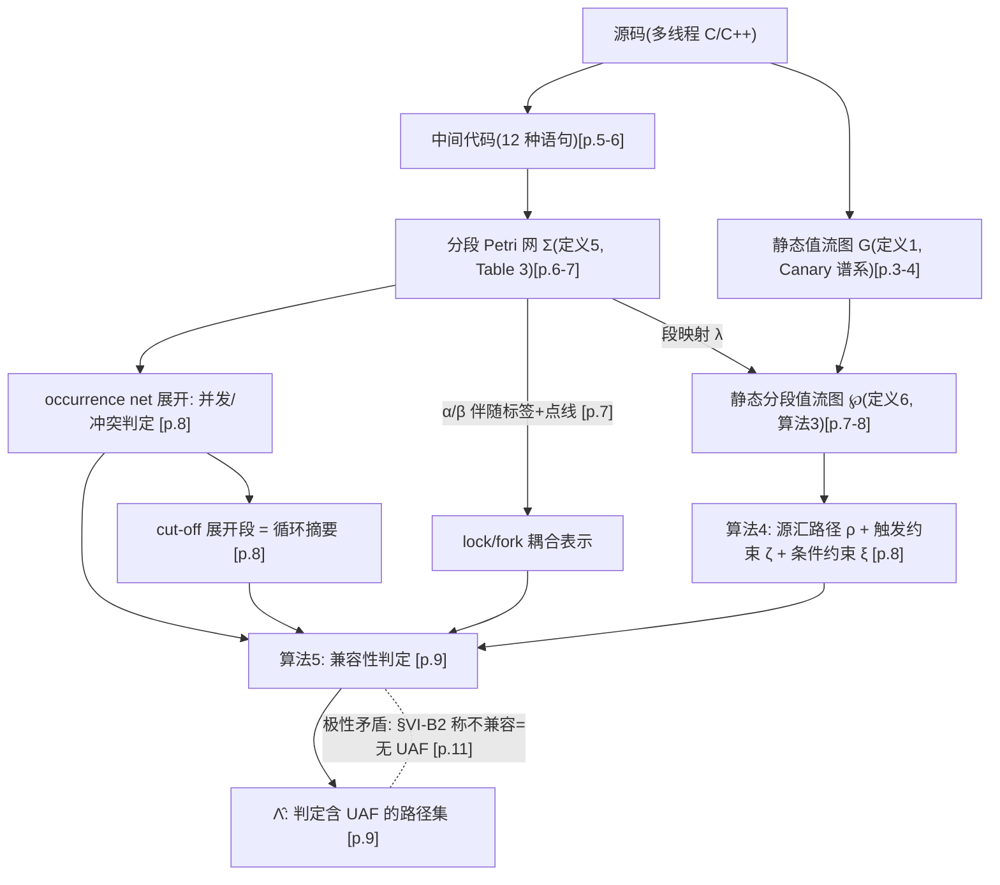

# 03b · UAF-PN-VFG:六点第一性原理 + 知识图谱 + 批判性四审视(完整框架分析卡)

> 论文:Li S., Bao Y., Lu F., Yu C., Liu C. "A Use-After-Free Vulnerability Detection Method for Multi-Threaded Programs Based on an Improved Petri Net and Value Flow Graph." IEEE Access, vol. 13, pp. 177994–178005, 2025. DOI: 10.1109/ACCESS.2025.3620811 [PDF p.1]
> 题录补充:收稿 2025-09-14,录用 2025-10-07(评审周期 23 天),出版 2025-10-14 [PDF p.1];通讯作者包云霞 [PDF p.1];副编 Zhiwu Li(Petri 网社区)[PDF p.1];基金 2022ZD0119501、NSFC 52374221/52574256、山东 ZR2022MF288/ZR2023MF097、泰山学者 tstp20250506、ZR2024QF107 [PDF p.1]。
> 主输入:`_launch/pdftxt/UAF.txt`(pdftotext -layout 全文);第 6、7、8、9、10、11 页已用 `pdftotext -raw` 对原 PDF(`../../UAF-PN-VFG-2025-IEEEAccess.pdf`)逐句复核,本卡全部关键引文非提取失真。
> 页锚约定:[PDF p.X] 指原 PDF 物理页(共 12 页),对应刊内页码 177993+X。
> 与旧卡关系:与 `03_UAF_PN_VFG.md`(2026-08-13,终态只读)互补——同一事实引旧卡章节号不复写;本卡新增六点框架、张力结构、知识图谱、四审视与特命判定,所有判断已独立核原文。
> 位图声明:图 1–6、表 1–6 在 PDF 中均为位图,文本层不可抄录;凡涉及其内容,一律锚到正文叙述句。全文无代码仓库与数据可得性声明(独立核对文本层,与 SBPN 卡的 GitHub 脚注形成对照)。
> 公式约定:全部纯文本;Γ=执行语句序列,Σ=分段 Petri 网,℘=静态分段值流图,ι=锁,V̂/Λ̂=带帽 V/Λ,α/β=伴随标签,ς/ζ/ξ=控制流因果/UAF 触发/条件满足约束。

---

## 〇、特命判定:"双图分工"是真 insight 还是工程拼接

**结论**:判"真分工、假对等"的混合体。真 insight 层 = 三类约束的正交分类学 + lock/fork 耦合这一新约束类(有动机案例与实验反例双重支撑);值流图侧不可替代性成立(由方法结构直接支撑);但 Petri 网侧的不可替代性论文只支撑了一半——控制流约束本身载体无关、可进 SMT,论文未做任何载体消融;PN 真正不可被 SMT 复刻的独占件只有 cut-off 循环摘要一项,而该项恰好没有单独量化且健全性存疑。

**判定标准**(任务给定):两图各自不可替代性有没有被论文证据支撑;去掉一图会塌什么;页锚到原文实验或论证。逐条证据链:

- **E1 分工声明有明锚,是自觉设计**。"控制流因果约束……从分段 Petri 网中挖掘;UAF 触发约束……与条件满足约束……从静态分段值流图中挖掘"(From Definitions 2-4 段)[PDF p.7];结论章原句复述同一分工:"The former is used to model control flow causality constraints and the latter is used to model UAF triggering and condition-satisfied constraints" [PDF p.11]。
- **E2 值流图侧:不可替代性成立,且不需要消融即可判定**。(a) 源汇候选生成完全定义在值流图上:算法 4 从 free 变量节点出发,经"同一内存对象 om 的操作节点集 Ṽ"+可达性搜索找 use 节点 [PDF p.8];(b) "哪些指针共享内存"这一事实只存在于值流图的内存对象节点集 O 与数据/干扰依赖集 R 中(定义 1 [PDF p.3-4];定义 6 [PDF p.7]),动机案例的真 UAF 判据就是"v4 与 v5 指向同一内存而 v5 的内存被子线程释放" [PDF p.3];(c) 分段 PN 的建网规则(Table 3)只消费语句类型,不携带任何内存对象/别名信息 [PDF p.6-7]。**去掉值流图:连"哪对 free/use 构成候选"都无从产生,检测对象在第一步即塌。**
- **E3 PN 侧:实验证明的是"约束类"的价值,不是"PN 载体"的价值**。精度增益的两处归因,论文原话都记在约束头上:"This is because this work can mine more constraints from intermediate codes of multi-threaded programs than Canary" [PDF p.10];"our method refines more constraints among statements than Saber, e.g., intra-thread causality, inter-thread join causality, lock/fork coupling causality, read/write causality, UAF triggering, and condition-satisfied constraints" [PDF p.10]。全文没有任何实验隔离"同一约束集、换载体(PN 展开 vs SMT 编码)"的效应 [PDF p.10-11 全部实验节]。
- **E4 lock/fork 耦合约束本身载体无关**。定义 2 三型全部定义在执行语句序列 Γ 上,与任何网结构无涉 [PDF p.6];Canary 的既有框架恰是"约束 + SMT [28] 求解" [PDF p.4],把定义 2 第 3 型作为附加偏序子句编入 SMT 在概念上是直路。论文既未做此对照,也未论证其不可行。
- **E5 PN 原生独占件只有一件:cut-off 循环摘要**。用 occurrence net 中 cut-off 事件与其源事件之间的全部事件构造"伴随 cut-off 事件的展开段",替代 CBMC 定次展开 [PDF p.8]——这是 SMT/happens-before 世界没有现成等价物的 PN 理论专属操作。但:(a) 无与 CBMC 的对照实验,收益从未量化(实验节只有 Canary/Saber 两个对手 [PDF p.10-11]);(b) 其语义等价假设("cut-off 事件描述与之前相同的状态,例如循环的第一次与第二次执行" [PDF p.8])对数据敏感循环不成立——论文自己的示例程序就是反例:循环体内 v7 = 2 使第二轮 if v7==1 不再成立(Algorithm 1 第 13-18 行 [PDF p.4]),而 PN 只见控制骨架、见不到 v7 的数据演化;结论章自认 while/do-while/switch 结构精度不足 [PDF p.11],与此完全一致。
- **E6 去掉 PN 会塌什么**:按论文实现塌三件——lock/fork 耦合判定(α/β 伴随标签 + 点线 [PDF p.7])、并发/冲突判定("determine concurrency and conflict events among transitions based on segment Petri net unfolding" [PDF p.8])、循环段(cut-off [PDF p.8])。前两件可在 Canary 式 SMT 框架内重建(E4;并发判定等价于 happens-before 偏序约束的编码),第三件无现成替代但自身价值未被量化(E5)。

**结语**:诚实的表述应是"PN 是这套约束的一种便利载体(继承组内 [30] 分段图与 [9] 展开技术栈 [PDF p.2, p.7]),且额外附赠一个未量化的循环摘要",而非"双图缺一不可"。约束分类学是可辩护的真贡献;载体层的"必须是 Petri 网"没有证据,属工程栈延续。这与旧卡 §5 W1-C 的辩护话术("载体差异 = 可解释偏序证据 + 对接展开重演")不冲突——那是价值主张,不是必要性证明。

---

## 一、六点第一性原理分析(节结构对齐 06_SBPN.md)

### 1. Task:解决什么问题(形式化)

**输入**:多线程 C/C++ 程序源码;先转为 LLVM 风格中间代码 [29],12 种语句(malloc/use/free/read/write、acq/rel、fork/join、label/branch/branch(cz))[PDF p.5 Algorithm 2, p.6 语义表]。

**输出**:Λ̂ = 判定含 UAF 漏洞的源汇路径集(算法 5 的输出,原文明言 "outputs source-sink paths that have UAF vulnerabilities")[PDF p.9]。等价于依次求出:

1. 静态值流图 G = (V, O, R, C, σ)(变量节点、内存对象节点、数据依赖+干扰依赖、条件、映射;定义 1,从 Canary 谱系继承)[PDF p.3-4];
2. 分段 Petri 网 Σ = (P, T, F, S, M0, λ)(段集 S 与段映射 λ 为对经典 PN 的扩展;定义 5)[PDF p.7];
3. 静态分段值流图 ℘ = (O, V̂, R, C, S, σ),变量节点扩为 ni = (vj, sz, lk) 带段号(定义 6;算法 3 完成段关联)[PDF p.7-8];
4. 每条源汇路径 ρ 的三类约束:控制流因果 ς(定义 2:线程内/线程间 fork-join/lock-fork 耦合)、UAF 触发 ζ(定义 3:读写因果 + free 先于 use)、条件满足 ξ(定义 4:θ1 ∧ θ2 ∧ … ∧ θj)[PDF p.6-7],及其兼容性判定(算法 5)[PDF p.9]。

**评价口径**:检出数、召回、精度(表 4/5)+ 平均耗时(表 6);对手 Canary [24] 与 Saber [20];数据集 Juliet 393 个 UAF + 5 个自建多线程程序 [PDF p.10-11]。

=第一性原理思考= 这个 task 的本质是"把不可判定的并发可达性问题裁剪成图上的约束兼容性检查"。静态并发 UAF 检测 = 存在性问题:是否存在一条可行调度,使 free 先于 use 且路径条件可满足。论文的形式化把"可行调度空间"压缩为三类约束的交集:必然序(控制流因果)、危险序(触发)、路径可行性(条件合取)。压缩丢掉了数据状态演化(循环变量、锁外同步、条件变量语义),换来图上多项式判定。task 定义本身预设了一个赌注:因果约束足以近似调度空间——赌注的输面恰好落在结论章自认的 while/do-while/switch 弱点上 [PDF p.11]。

### 2. Challenge:传统方法的困难

1. **值流系不建模并发原语因果**:Saber/Pinpoint/Canary 精度效率好,但"大多没有充分考虑不同并发原语与复杂控制结构引起的因果约束,可能导致误报"(摘要)[PDF p.1];
2. **Canary 约束系统的具体盲区**:其偏序约束(线程内、fork 前于子线程、子线程前于 join,例 l5 < l7)与一致性约束(值流过程内存不被并发改写,例 l5 < l25 < l8)[PDF p.4] 覆盖不了"持锁期间 fork"的复合效应——动机案例中 l26 与 l9 构成 lock/fork 耦合、l9 必先于 l26,Canary 用 SMT 检出 2 个 UAF 而真值 1 个,"detection result is wrong" [PDF p.3-4];
3. **循环结构**:静态值流图缺运行时信息,无法推出展开次数;CBMC 定次展开在效率与精度间难平衡 [PDF p.8];
4. **组内轨迹分段图 [30] 的局限**:基于执行轨迹构建,遇循环/分支"约束分析不准确且复杂度高" [PDF p.7]——静态化是对自家前作的修正;
5. **动态方法覆盖不足**:大型多线程程序需多次运行才能覆盖细微行为,难检出全部 UAF [PDF p.2]。

### 3. Insight & Novelty

**Inspiration 来源**:
- Insp-1(Canary 的约束范式):源汇可达 + 约束求解的框架现成 [PDF p.3-4];
- Insp-2(组内分段图传统):"段"概念来自锁增广分段图 [30](鲁法明一作,《软件学报》2021)[PDF p.7, p.12];
- Insp-3(组内展开技术):PN 展开判并发/冲突来自 [9](鲁法明一作,PN 展开死锁检测与重演,IEEE Access 2024,即联卷 02 篇 PNULock)[PDF p.2, p.8, p.11];
- Insp-4(McMillan 式 cut-off 截断):局部配置重复 → 截断,被挪用为循环语义摘要 [PDF p.8]。

**Insight 是什么**:
- Insight-1(约束分类学,本文的智力核心):UAF 检测 = 三类正交约束的兼容性分析——"必然序"与"危险序"不相容则路径安全 [PDF p.7 分工总纲句, p.11 §VI-B2];
- Insight-2(新约束类):lock/fork 耦合因果是 Canary 偏序系统的结构性盲区,值得升格为第三种控制流因果型(定义 2 第 3 型)[PDF p.4, p.6];
- Insight-3(段 = 共享坐标系):段号把 PN 的控制流世界与值流图的数据世界缝合,"realize information consistent between a static value flow graph and segment Petri net" [PDF p.7];
- Insight-4(循环 = cut-off 段):展开中状态重复的截断点天然对应循环轮次边界,可当循环摘要用 [PDF p.8]。

**Novelty 逐创新点(严格格式)**:
- **N1 三类约束体系 + 兼容性检测原理**:【解决的问题】Canary 约束不完备致误报(Challenge 1/2)→【受哪个 insight 启发】Insight-1/2 →【设计】定义 2-4 给出三类约束;检测原理 = 触发序与因果序的兼容性判定(§IV-B [PDF p.6-7];算法 5 [PDF p.9])。
- **N2 分段 Petri 网 + α/β 伴随标签**:【问题】lock/fork 耦合需要能表达"持锁期启动线程"的结构载体(Challenge 2/4)→【启发】Insight-2 + Insp-2/3 →【设计】定义 5 对经典 PN 加段集 S 与映射 λ;α(m, ι, u) = 线程 m 在 u 持有 ι 时请求 ι,β(m, ι, u) = m 持 ι 期间启动 u 随后释放 ι,两标签间点线 = 耦合因果 [PDF p.7]。
- **N3 段关联值流图**:【问题】两图事实无共同坐标则约束无法对表(Challenge 1)→【启发】Insight-3 →【设计】定义 6 变量节点扩为 (vj, sz, lk);算法 3 逐节点查段补齐 [PDF p.7-8]。
- **N4 cut-off 循环摘要**:【问题】CBMC 定次展开精度-效率失衡(Challenge 3)→【启发】Insight-4 →【设计】"伴随 cut-off 事件的 PN 展开段" = cut-off 事件与其源事件之间全部事件,对应循环体;算法 5 对同段内约束按段语义判 [PDF p.8-9]。

**动机问句链(还原)**:Canary 为何在动机案例误报?→ 它的约束语法没有"持锁 fork"因果型 [PDF p.4] → 可否定义成第三种控制流因果?→ 定义 2 第 3 型 [PDF p.6] → 新因果放哪里算,继续编 SMT 吗?→ 组内有现成 PN 展开判并发技术([9] [PDF p.2]),换载体 → 静态输入没有轨迹,[30] 的轨迹分段图用不了?→ 从中间代码直接建网,保留分支循环 [PDF p.7] → 保留循环后展开无限怎么办?→ cut-off 事件天然描述状态重复,当循环摘要 [PDF p.8] → 两图事实怎么对齐?→ 段号进值流图节点 + 语句-变迁映射进判定算法 [PDF p.7, p.9]。(注意第 3 问的"换载体"没有在论文中被论证为必需——见 〇 E4。)

### 4. 方法骨架校核(逐式全恢复见旧卡 §2.1–2.6,此处只记独立复核的增量发现)

四阶段管线(静态值流图构建 → 分段 PN 与控制流因果分析 → 段关联与触发/条件约束分析 → 兼容性检测)[PDF p.4-5 Fig.2 四相描述] 与旧卡 §2 一致,复核无误。以下为本卡独立发现(旧卡未载):

- **F1 分工总纲句的精确出处**:"控制流因果约束是多线程程序必须遵守的约束,本文从分段 Petri 网挖掘;UAF 触发约束……与条件满足约束……从静态分段值流图挖掘" [PDF p.7]——特命判定的 E1 锚点。
- **F2 定义 2 文面缺陷(已 -raw 复核,非提取失真)**:(a) 第 2 型索引混乱:fork 声明为 lj,因果却落在未定义的 li 上("Assuming that lj ∈ Γ is a fork operation in start thread u, i < k, and lk ∈ Γ is a statement in u, there exists a inter-thread fork causality between li ∈ Γ and lk");join 分句同型(lj 声明、li 使用)[PDF p.6]。(b) 第 3 型文面过约束:耦合施加到被启动线程的**所有**语句("a statement lz ∈ Γ is in an initialized thread"),没有"lz 需要该锁"的限定 [PDF p.6]——按文面,子线程锁区外语句(如示例的 l23 malloc)也被强加序,与真实语义(只有子线程锁区内语句必须等主线程释放 ι)不符。旧卡 §2.2 的"(需要该锁的)"括注是善意补全,原文无此限定词。
- **F3 展开理论地基非标准(已 -raw 复核)**:原文定义"配置表示一个可能的执行序列;**局部配置表示两个相邻事件**;若局部配置出现多于一次,其起始事件定义为 cut-off 事件(红框)" [PDF p.8]。标准展开理论中局部配置是事件的因果历史闭包,cut-off 依赖 adequate order 与标记等价(McMillan/Esparza 系)。本文的"两相邻事件"版既非标准定义,也没有配套的有限性/完备性定理——展开的正确性是被假定而非被证明的。旧卡 §2.5 的转述忠实于原文但未标记此非标准性。
- **F4 算法 5 判定极性文面矛盾(本卡最重发现,详细论证见 四.3 C1)**:算法落袋方向为"不兼容 → ρ 计入 Λ̂",且 Λ̂ 被声明为"有 UAF 的路径集" [PDF p.9];而 §VI-B2 解释时间优势时却说"不兼容则该源汇路径无 UAF"("there is no UAF vulnerability in a source-sink path if they are incompatible")[PDF p.11]。两个极性互斥,且任一全局极性下都存在与其余分支不自洽的分支(案例分析见后)。旧卡 §2.2("不兼容→该源汇路径无 UAF")与 §2.6("不兼容 ⟹ 报告 UAF")恰好分别继承了这两个互斥极性而未察觉矛盾。
- **F5 值流图构建工序缺失的页锚**:阶段 1 仅一句"analyze source codes … and construct its static value flow graph based on Definition 1" [PDF p.4],全文无别名分析、指针分析、函数指针处理的任何工序(旧卡 §4 第 3 点已指出,此处补锚)。
- **F6 文字小错(可复现性噪声)**:"the transitions after p2 belong to a main child"(应为 main thread)[PDF p.7];算法 5 走查文字"If they are different and concurrent and t1 < t2 … (lines 21–24)"指向的是**非并发**分支(应为 not concurrent)[PDF p.9];定义 4 条件下标 θj 与语句下标 j 重名 [PDF p.7]。

### 5. 实验协议与结果批判(基础数据见旧卡 §3,增量如下)

- **数值可核性**:表 4/5/6 全部数值格为位图,文本层只有五个差值:召回 +25%、精度 +33.3%(vs Canary),召回 +3%、精度 +15.1%(vs Saber),耗时少 12.6 ms/21.3 ms [PDF p.1 摘要, p.11 小结]。绝对召回/精度、逐程序检出数、召回分母均不可核;"25% higher"是百分点还是相对提升文面不可判。
- **逐案例行为的文字锚**(表 4/5 唯一可抄录信息):Canary 漏检 CEW416-1、Test1、Test2、Test5(free 与 use 同线程);Canary 在 CEW416-5、Test4 误报(lock/fork 耦合);Saber 只看源汇可达、不识别耦合因果 [PDF p.10-11]。
- **环境可信度**:"Ubuntu 16.2.4 operating system" [PDF p.10]——不存在的版本号(Ubuntu 版本为年.月格式);i9-13900HX(2023 款移动端 CPU)配 60 GB 内存亦非常规组合。已 -raw 复核为原刊原文。
- **评审强度旁证**:收稿到录用 23 天 [PDF p.1],与 F2/F4/F6 的文面错误密度并存——不构成不当行为证据,但提示结果未经强审校。
- **归因句**:精度增益两处归因均为"挖了更多约束"(见 〇 E3 原句)[PDF p.10]——论文自己没有把增益归给"双图架构"或"PN 载体"。
- **无消融**:约束类逐项贡献、载体(PN 展开 vs SMT 编码)、循环摘要(vs CBMC 定次展开)三个关键变量均无分解实验 [PDF p.10-11]。
- 评测规模(Juliet 合成微基准 + 5 个未公开自建程序、无真实项目)与"time complexity 用毫秒计"的范畴错误,旧卡 §4 已述,不复写。

### 6. Potential flaw

**6.1 情境局限;能否延伸架构**
- **并发原语覆盖窄**:12 种中间语句只含锁(acq/rel)与线程(fork/join)[PDF p.5-6];条件变量、信号量、原子操作、屏障、读写锁全部缺席。对使用这些原语的程序,控制流因果约束系统性缺边 → Canary 式误报回潮(与其批评对手的问题同构)。延伸可行:每种原语需要新的伴随标签与耦合因果型,工程量线性但正确性论证每项都要重做。
- **循环摘要对数据敏感循环不健全**:见 〇 E5;示例程序 v7 反例 [PDF p.4] + 结论自认 [PDF p.11]。延伸方向 = 结论承诺的动静结合 [PDF p.11],或把循环携带的数据条件并入段语义(等价于给 PN 加数据 guard,那就不再是经典展开)。
- **静态展开规模无界**:分段 PN 保留全部分支/循环结构 [PDF p.7],展开最坏情形随分支数指数增长;全文无复杂度定理、无最大被测程序规模报告 [PDF p.10]。与 PNULock(轨迹网,决策结构被轨迹消解)相比,本文的爆炸风险更高(旧卡 §4 已点,此处补:连"被测程序平均行数"都未报告)。
- **报告粒度**:输出是路径集 Λ̂,无触发调度(witness)。与 [9] 的展开重演机器天然接口存在但未接通(旧卡 §5 的闭环设想)。
- **定义 2 第 3 型按文面实现会过约束**(F2b):把可行调度误判为不可行 → 漏报向偏差;若实现按 α/β 标签(锚定子线程锁区)则无此问题——但那是文面之外的实现私钥。

**6.2 什么数据性质会特别困难**
- **指针密集/间接调用**(函数指针、虚函数):别名分析工序缺失(F5),候选集失真则三类约束全部失真;
- **锁外同步语义**(条件变量等待/通知、原子标志自旋):因果约束系统无对应型,必然漏建序;
- **数据依赖的循环边界**(循环内改写控制变量,如 v7 型):cut-off 段语义等价假设破产 [PDF p.4, p.8];
- **深嵌套锁 + 多锁交织**:α/β 标签定义只覆盖单锁单 fork 的耦合模式 [PDF p.7],多锁耦合(锁 A 区内 fork,子线程请求锁 B 而 B 被第三线程持有)超出标签语法;
- **大规模真实项目**:展开规模无界 + 无增量分析机制。

**6.3 哪种困难值得深挖成 paper**
1. **载体消融实验**(直接检验本卡特命判定):同一约束集(定义 2-4),三种载体——PN 展开、SMT 编码(Canary 框架内加定义 2 第 3 型子句)、happens-before 传播——在精度/耗时/可解释性三轴对比。做出来无论哪边赢都是贡献:PN 赢则补上本文缺的必要性证据,SMT 赢则说明约束分类学可以脱离 PN 移植(对 T3 的 agent 场景是好消息,因为 agent 侧未必想背 PN 工具链)。
2. **循环摘要的健全性刻画**:给出"cut-off 段语义等价"成立的循环类刻画(控制流不变式 + 无循环携带数据依赖),补定理;在数据敏感循环上与 CBMC 定次展开做精度对照——这正是论文声称赢但从未测过的点 [PDF p.8]。
3. **真实项目评测**(旧卡 §5 扩展 A 的延伸,不复写)。

---

## 二、张力结构

**在改变谁的想法**:(a) 值流分析社区(Canary/Saber 谱系)——"源汇可达 + 偏序/一致性约束"的约束语法有结构性盲区,锁与 fork 的复合效应需要专门的因果型(动机案例 [PDF p.3-4]);(b) PN 社区——展开理论(occurrence net、cut-off)可以反哺程序分析,不只做验证(§V-B/C [PDF p.8]);(c) 组内自身——[30] 的轨迹分段图路线被静态化取代("suffer from inaccurate constraint analysis and high complexity" [PDF p.7]),D2 线从动态(PNULock)向静态延伸。

**读者为什么在乎**:UAF 是可远程代码执行的高危漏洞类(CVE-2021-21148,Chrome 渲染引擎 [PDF p.1]);静态检测的误报直接决定工具可用性,而并发场景的误报恰是主流工具的痛点 [PDF p.1 摘要]。

**立论的 A-But-B 链**:
- A1:值流方法(Saber [20]、Pinpoint [21]、Canary [24])精度效率好 [PDF p.3]。**But**:并发原语与复杂控制结构的因果约束考虑不足 → lock/fork 耦合场景误报 [PDF p.1, p.4]。
- A2:组内分段图 [30] 已有"段"概念。**But**:依赖执行轨迹,循环/分支下不准且复杂度高 [PDF p.7]。
- A3:CBMC [31] 能处理循环。**But**:定次展开在效率与精度间难平衡 [PDF p.8]。
- 合题:静态建分段 PN(保留分支循环)+ 段关联值流图 + 展开判因果 + cut-off 段摘要循环 [PDF p.4-8]。每个 But 都精确留出本文的填空位——标准鲁组立论结构(与 06 卡 §8 的观察一致)。

**内在矛盾与取舍(本节重点)**:
- **T1 覆盖 vs 爆炸**:为静态全覆盖而在网中保留全部分支/循环 [PDF p.7],正是 PNULock 靠轨迹消解掉的东西(旧卡 §2.3);代价是展开规模无界,而论文对此零讨论、零实验(最大被测程序规模未报告 [PDF p.10])。取舍被做了,账单没算。
- **T2 约束贡献 vs 载体归因**:实验归因句全部指向"更多约束" [PDF p.10],标题与结论却把身份定为"改进 Petri 网与值流图" [PDF p.1, p.11]——修辞层把功劳记给载体,证据层只支持约束。这是特命判定"真分工假对等"的修辞根源。
- **T3 控制抽象 vs 数据现实**:PN 载体决定了只能建模控制骨架;循环摘要(cut-off 段)与条件约束(静态合取 θ1 ∧ … ∧ θj [PDF p.7])都无法表达"同一条件跨轮变值"(v7 反例 [PDF p.4])。结论自认的 while/do-while/switch 弱点 [PDF p.11] 不是工程尾巴,而是载体选择的结构性后果——修这个弱点要么加数据语义(离开经典 PN),要么动静结合(离开纯静态),两条路都动摇本文立身的载体选择。
- **T4 形式化门面 vs 文面严谨**:方法以六个定义、五个算法的形式化面目出现 [PDF p.3-9],但核心定义带索引错误与过约束(F2)、判定算法极性互斥(F4)、展开定义非标准且无定理(F3)。形式化在此更多是"表述风格"而非"正确性保证"——全文无一条定理、无健全性/完备性声明。
- **T5 精度主张 vs 评测规模**:+25%/+33.3% 的主张建立在 393 个合成用例 + 5 个自建程序上 [PDF p.10],而对手 Canary 的原生验证场是数百万行真实代码(旧卡 §4);同台的公平性(Canary 面向全类 inter-thread value-flow bug)与外推性都在打折。

---

## 三、知识图谱(对齐 06b 规格)

### 3.1 核心概念清单(9 个)

| # | 概念 | 内容 | 出处 |
|---|------|------|------|
| C1 | 三类约束体系 | 控制流因果(定义 2:线程内 j<k;线程间 fork/join;lock/fork 耦合)、UAF 触发(定义 3:读写因果;use=lj、free=lk,lk 先于 lj 则存在触发约束)、条件满足(定义 4:θ1 ∧ θ2 ∧ … ∧ θj);检测 = 三者兼容性分析 | [PDF p.6-7] |
| C2 | lock/fork 耦合因果 | 第 3 型控制流因果:li/lk 为锁请求/释放、i<j<k、lj 为 fork,则持锁区语句 ly(y ∈ (j,k))与被启动线程语句 lz 间存在耦合因果;文面无"lz 需该锁"限定(过约束,F2b) | [PDF p.6] |
| C3 | 分段 Petri 网 Σ | Σ = (P, T, F, S, M0, λ):经典 PN + 段集 S + 段映射 λ: (P ∪ T) → S;Table 3 给 12 种中间语句的建网规则;从源码静态构建(与 [30] 的轨迹输入相对) | [PDF p.6-7] |
| C4 | α/β 伴随标签 | α(m, ι, u) = m 在 u 持 ι 时请求 ι;β(m, ι, u) = m 持 ι 期间启动 u 随后释放 ι;两者间点线 = lock/fork 耦合在网上的表示 | [PDF p.7] |
| C5 | 静态分段值流图 ℘ | ℘ = (O, V̂, R, C, S, σ):变量节点扩为 ni = (vj, sz, lk) 带段号;算法 3 从 Σ 与 G 构造(O/R/C/σ 照抄 G,段号逐节点回填)——"段"是两图唯一的共享坐标 | [PDF p.7-8] |
| C6 | 源汇路径分析 | 算法 4:遍历 V̂ 找 free 节点 → 同内存对象 om 的操作节点集 Ṽ → 可达性筛选 use → 构造 ρ 并顺带算触发/条件约束;输出路径集 Λ | [PDF p.8] |
| C7 | occurrence net 展开与 cut-off | 事件 = 变迁执行,条件 = 令牌状态;"局部配置 = 两相邻事件,重复出现则起始事件为 cut-off(红框)"——非标准定义,无有限性/完备性定理(F3);用途 = 判变迁间并发/冲突 | [PDF p.8] |
| C8 | 伴随 cut-off 事件的展开段 | cut-off 事件与其源事件之间全部事件构成的段 ≙ 循环体;替代 CBMC 定次展开;PN 载体唯一的原生独占件(〇 E5) | [PDF p.8] |
| C9 | 兼容性判定(算法 5) | 五分支:同展开段 → 兼容;lock/fork 耦合 → 按 t1<t2 判;并发 → 跳过;非并发 → 按展开偏序判;else → 按行号判;"不兼容"→ ρ 入 Λ̂;极性与 §VI-B2 矛盾(F4) | [PDF p.9-11] |

### 3.2 概念间关系(邻接表)

- C1 是全文纲领:C2 是其第一类的新增型;C3/C4 承载第一类约束的挖掘,C5/C6 承载第二、三类 [PDF p.7 分工总纲句]。
- 中间代码(12 语句)→ 同时供给 → C3(经 Table 3 建网)与 C5 的行号锚 [PDF p.5-7]。
- C3 --λ(段映射)--> C5(算法 3 回填段号):单向信息流,值流图不反哺 PN [PDF p.7-8]。
- C6(产出 ρ 与 ζ/ξ)+ C7(产出 ς 的并发/偏序判据)→ 汇入 → C9(逐约束对表)[PDF p.8-9]。
- C4 --点线--> C9 的 lock/fork 分支;C8 --段成员关系--> C9 的同段分支 [PDF p.7-9]。
- C2 的证据闭环:动机案例(Canary 误报)[PDF p.4] → C2 定义 [PDF p.6] → C4 网上表示 [PDF p.7] → C9 判定分支 [PDF p.9] → 实验反例消除(CEW416-5、Test4)[PDF p.10]。这是全文唯一完整的"问题→机制→证据"链,也是其最硬的贡献。

### 3.3 Mermaid 图

### 3.4 理论框架(论文无显式框架图,以下为依内容重构)

"双图-单坐标-单仲裁"四层结构:

1. **事实提取层(双图)**:值流图从源码提取数据事实(谁与谁共内存、值怎么流、流动的条件)[PDF p.3-4];分段 PN 从中间代码提取控制事实(谁必须先于谁、谁与谁互斥/并发)[PDF p.6-7]。两图输入同源(源码/中间码)但事实类型正交。
2. **坐标对齐层(单坐标)**:段号 sz 经 λ 与算法 3 注入值流图节点 [PDF p.7-8];行号 lk 同时存在于两侧;算法 5 再用"语句 ↔ 变迁"映射把约束节点投到展开上 [PDF p.9]。段与行号是仅有的两枚缝合钉。
3. **语义引擎层**:展开(occurrence net)是控制流的语义引擎——把"网"变成"偏序 + 冲突 + 并发"三元判据 [PDF p.8];源汇可达遍历是数据流的语义引擎 [PDF p.8]。
4. **仲裁层(单仲裁)**:算法 5 逐约束对表,五分支决策树输出 Λ̂ [PDF p.9]。

关键叠合点:与 SBPN 的"变迁是三层枢纽"(06b §2)对照,本文的枢纽是**段**——它既是 PN 的结构切分(定义 5),又是值流图节点的第三坐标(定义 6),又是循环摘要的载体单位(C8)与兼容性判定的第一分支(C9)。但注意:仲裁层的 else 兜底分支退化为纯行号比较 [PDF p.9]——当"语句↔变迁"映射失效时,整个双图机器退化为最朴素的文本序比较,而该分支的触发条件文面未定义(四.3 C1(iv))。

### 3.5 关键表格解读(表 4/5 与表 6;数值格为位图,以下解读全部锚定正文叙述句)

**表 4(vs Canary)+ 表 5(vs Saber)联合解读** [PDF p.10-11]:
- 结构(由正文可推):行 = 测试程序(可见名:CEW416-1、CEW416-5、Test1、Test2、Test4、Test5),列 = 检出数/召回/精度。
- 信息轴 1(召回向):Canary 在 CEW416-1、Test1、Test2、Test5 检出数低于本文,原文归因"Canary 无法检测 free 与 use 同线程的 UAF" [PDF p.10]——注意这是 Canary 的**设计范围**(inter-thread value-flow bug)差异,不是同任务失败(四.4 D2)。
- 信息轴 2(精度向):Canary 在 CEW416-5、Test4 检出数**高于**本文但含误报,归因"只考虑线程间因果、不识别 lock/fork 耦合" [PDF p.10]——这是本文机制贡献(C2)的直接实验证据,也是特命判定 E3 的核心:证明的是**约束类**的价值。
- 信息轴 3(Saber 侧):Saber 只判源汇可达,六类约束全缺 [PDF p.10-11];+3%/+15.1% 的增益幅度小于 Canary 侧,与"Saber 是更弱基线"的直觉反向——文面无法解释(可能与 Saber 的保守报告策略有关),数值格不可见,存疑挂起。
- 汇总差值:+25%/+33.3%(Canary)、+3%/+15.1%(Saber)[PDF p.1, p.11];百分点还是相对比例不可判;分母(393 + 5 程序内漏洞数)与绝对值全部不可核。
- **解读结论**:两表可信的信息只有"逐案例行为模式"(哪类场景谁漏谁误),它支撑约束分类学的价值;数值层(幅度)不可核验,不应被引用为定量结论。

**表 6(时间)解读** [PDF p.11]:
- 唯一文本信息:本文平均耗时比 Canary 少 12.6 ms、比 Saber 少 21.3 ms;标题"time complexity"是范畴错误(毫秒是耗时)。
- 原文归因:"不兼容则该源汇路径无 UAF"的早剪枝 [PDF p.11]——即三类约束不相容时提前放弃路径,省掉后续(Canary 需做的 SMT)求解。逻辑成立但无剖析数据:剪枝率、单路径耗时分布、展开构建的摊销成本均未报告;毫秒级差值在微基准上也可由启动/IO 开销解释(四.4 D3)。
- 未报告的关键成本:分段 PN 展开本身的最坏开销(T1 张力)——时间表只算了"检测"赢的部分,没算"建模"可能输的部分。

### 3.6 引用网络(TOP5 关键文献)

| 排序 | 文献 | 角色 | 反复使用位置 |
|---|---|---|---|
| 1 | [24] Cai, Yao, Zhang, "Canary: Practical static detection of inter-thread value-flow bugs", PLDI 2021 | 被改进对象 + 动机案例主角 + 主基线:其偏序/一致性约束系统是定义 2 的直接扩展对象;其"约束+SMT"框架是本文载体选择的对照面 | 相关工作 [PDF p.3];动机案例与约束分析 [PDF p.4];基线与逐案例对比 [PDF p.10-11] |
| 2 | [20] Sui, Ye, Xue, "Static memory leak detection using full-sparse value-flow analysis"(Saber), ISSTA 2012 | 值流图谱系源头 + 第二基线;注意被引原文是**内存泄漏**检测(254 个泄漏、18.3% 误报率 [PDF p.3]),作为 UAF 基线的适配方式全文未述 | 相关工作 [PDF p.3];基线 [PDF p.10-11];引文条目 [PDF p.12] |
| 3 | [30] Lu et al., 锁增广分段图死锁检测, 《软件学报》2021 | 组内前作(鲁法明一作):"段"概念的来源 + 被超越对象(轨迹输入、循环/分支下不准且复杂度高) | 分段 PN 动机段 [PDF p.7];引文条目 [PDF p.12] |
| 4 | [9] Lu et al., "Petri net unfolding-based detection and replay of program deadlocks", IEEE Access 2024(= 联卷 02 篇 PNULock) | 组内前作(鲁法明一作):展开判并发/冲突的技术来源;引言把 PN 与段图、值流图并列为静态挖掘三工具 | 引言 [PDF p.2];展开方法论(未再显式引用但技术同源)[PDF p.8];引文条目 [PDF p.11] |
| 5 | [31] Kroening & Tautschnig, "CBMC—C bounded model checker", TACAS 2014 | 循环处理的对立参照:定次展开的精度-效率失衡是 cut-off 循环摘要的立论前提;本文与它无实验对比 | 循环结构分析 [PDF p.8];引文条目 [PDF p.12] |

次关键:[28] Z3(Canary 的求解引擎,本文用兼容性判定替代之——载体之争的另一极)[PDF p.4, p.12];[29] LLVM IR 形式化(中间代码标准来源)[PDF p.5, p.12];[32] Juliet 测试集(评测数据源,393 个 UAF)[PDF p.10, p.12];[21] Pinpoint(值流系第三例证)[PDF p.3, p.12]。

---

## 四、批判性四审视

### 4.1 假设审视(隐含假设 → 依据 → 风险)

- **A1 "别名与值流事实可精确获得"**:定义 1 的 O/R 被当作给定输入,构建工序全文一句带过 [PDF p.4]。静态 UAF 的传统瓶颈恰是指针分析精度;若别名保守(过近似),候选集膨胀,三类约束的兼容性判定在失真输入上运转——精度主张的地基悬空。
- **A2 "锁 + fork/join 即并发原语全集"**:中间代码语法只有 acq/rel/fork/join [PDF p.5-6]。条件变量、信号量、原子操作缺席 → 用这些原语同步的程序,其因果约束系统性缺边,本文会在自己批评 Canary 的同一意义上失效。论文未声明适用范围,读者会按"多线程程序通用"理解(标题即如此 [PDF p.1])。
- **A3 "循环轮次语义等价"**:cut-off 段构造假设"第一次与第二次执行状态相同" [PDF p.8]。对携带数据演化的循环不成立——论文自己的示例程序(v7 = 2 改写导致第二轮分支翻转,Algorithm 1 第 13-18 行 [PDF p.4])即为反例;结论章自认 while/do-while/switch 精度不足 [PDF p.11] 是该假设破产的直接症状。
- **A4 "静态展开规模可控"**:分段 PN 保留全部分支/循环 [PDF p.7],展开最坏指数;无复杂度定理、无规模实验 [PDF p.10-11]。假设仅靠微基准的毫秒级耗时间接支撑,不可外推。
- **A5 "定义 2 第 3 型的过近似无害"**:文面把耦合序强加给被启动线程的全部语句(无"需该锁"限定)[PDF p.6]。若实现照文面,会把可行调度判为不可行(漏报向);若实现按 α/β 标签锚定子线程锁区 [PDF p.7],则文面定义与实现不一致。两种情况必居其一,论文未澄清。

### 4.2 证据审视(证据质量与主张强度的匹配)

- **B1 关键数值不可核**:表 4/5/6 为位图,文本层只有差值 [PDF p.1, p.11];绝对召回/精度、逐程序计数、分母全部缺失;"+25%"的语义(百分点/相对)不可判。定量主张(摘要三连 [PDF p.1])的可核验证据接近零。
- **B2 评测集与主张范围错配**:标题主张"多线程程序"通用方法 [PDF p.1],证据是 Juliet 合成微基准(393 个 UAF)+ 5 个未公开自建程序 [PDF p.10];无任何真实项目;对手 Canary 的原生验证场是数百万行真实代码(旧卡 §4)。
- **B3 复现材料缺失**:无代码、无数据可得性声明(独立核对全文文本层);5 个自建程序不可获得;算法 5 的极性歧义(C1)使得即便重实现也无法确认与原实现一致——本文处于"不可复现"档。
- **B4 环境细节失真**:"Ubuntu 16.2.4"为不存在的版本号 [PDF p.10](已 -raw 复核)。单看是笔误,与 F2/F4/F6 并观,是实验细节校验密度低的旁证。
- **B5 评审强度**:收稿-录用 23 天 [PDF p.1];IEEE Access 快审模式下,上述文面错误未被捕获。不指控,只降权:该文的"已发表"状态对结论可信度的加成应按低审校强度折算。
- **B6 归因证据与结论强度**:归因句支持"更多约束 → 更好精度" [PDF p.10],这与实验的逐案例模式(耦合场景误报消除)吻合,是全文最可信的证据链;但"双图架构必要"与"时间更优"两个更强主张没有对应证据(无载体消融、无剖析数据)。

### 4.3 推理审视(推理链的断点)

- **C1 判定算法极性文面矛盾(最重,四步论证)**:
  (i) 算法 5 落袋方向:三处"not compatible → Λ̂ = Λ̂ ∪ ρ"(行 15-16、26-27、36-37),且 Λ̂ 语义 = "有 UAF 的路径集"("outputs source-sink paths that have UAF vulnerabilities")[PDF p.9,已 -raw 复核]。
  (ii) §VI-B2 时间归因句:"there is no UAF vulnerability in a source-sink path if they are incompatible"(不兼容 → 无 UAF)[PDF p.11,已 -raw 复核]。(i) 与 (ii) 极性互斥。
  (iii) 分支级检验,取动机案例(use=l9 在主线程锁区,free=l26 在子线程锁区,耦合强制 l9 先于 l26 [PDF p.4],期望:不报):若 ζ 存"free < use"触发序(按定义 3 第 2 型语义 [PDF p.7]),则 t1=free、t2=use,耦合方向 t2<t1,算法判"不兼容 → 报"= 复刻 Canary 误报,与全文目标矛盾;若 ζ 按定义 3 行文序存 (use, free),则耦合分支与非并发分支自洽(误报消除、顺序真 UAF 报出),但行号兜底分支(ly > lz → 兼容 [PDF p.9])对"free 文本在前"的顺序 UAF 判不报——极性再反;且同展开段分支把跨轮 free→use 一律"兼容跳过" [PDF p.9],在任一全局极性下都与其余分支不一致(循环内跨轮 free→use 恰是可触发场景)。
  (iv) else 兜底分支的触发条件(何种 ni/nj 落不进前四类)文面不可确定 [PDF p.9]。
  结论:伪代码 + 输出语义 + §VI-B2 + 动机案例四者无法在任何单一读法下同时自洽;算法不可由文面唯一重建,实验结果依赖论文之外的实现私钥。旧卡 §2.2 与 §2.6 分别继承了两个互斥极性而未标记——本卡独立复核的增量发现。
- **C2 核心定义的形式失严**:定义 2 第 2 型 fork/join 分句的 i/j 索引混乱(声明 lj、使用未定义的 li)[PDF p.6,已 -raw 复核]。新因果类是全文核心贡献,其形式定义却经不起逐字读——对以"formal specification"为节名 [PDF p.5] 的论文,这不是排版瑕疵而是推理链断点。
- **C3 展开机器无理论保证**:"局部配置 = 两相邻事件"的非标准定义 [PDF p.8],无有限性定理(静态网含循环,展开何以有限终止?cut-off 的截断是否保完备?)。控制流因果判定的正确性整体悬空——若截断早于必要点,漏序;晚于必要点,爆炸。
- **C4 "并发 → 跳过"分支的缺口**:并发恰意味着 free/use 可任意交错(触发可实现),算法却对该对不作任何记录地 continue [PDF p.9];若路径的全部约束对都并发,该路径永不入 Λ̂——按 (i) 的极性这是系统性漏报向,文面无任何论证。
- **C5 时间优势因果链未闭合**:归因"早剪枝" [PDF p.11] 无剖析数据(剪枝率、SMT 调用节省、展开构建摊销成本);且"12.6 ms"量级在微基准上不具备区分方法论优劣的统计力(无重复、无方差)。

### 4.4 替代解释审视(同一观测的竞争假说)

- **D1 精度增益 = 约束类扩容,而非双图架构**:Canary 框架内把定义 2 第 3 型编成附加 SMT 子句,可能达到同等误报消除。论文自己的归因句("mine more constraints" [PDF p.10])支持此解释;无载体消融可排除之(〇 E3/E4)。这是特命判定的主论据。
- **D2 召回增益 = 对手设计范围差**:Canary 面向 inter-thread value-flow bug,同线程 free-use(CEW416-1、Test1/2/5 [PDF p.10])在其目标范围之外;拿范围外用例计分,增益反映"检测范围并集更大"而非"同任务能力更强"。诚实的对照应分层报告:线程内子集、线程间子集、耦合子集。
- **D3 时间优势 = 实现与工件差异**:毫秒级差值 [PDF p.11] 可由实现语言、启动开销、IO、SMT 求解器配置完全解释;在 393+5 个微程序上无法归因到方法论。反向可能同样成立:真实规模下展开构建成本可能反超 SMT(T1 张力),数据缺席使两个方向都无法排除。
- **D4 循环摘要优于 CBMC = 叙事性优势**:无对照实验 [PDF p.8, p.10-11];且在数据敏感循环上,CBMC 定次展开(展开 k 次至少精确覆盖前 k 轮)反而是健全方向,cut-off 段丢数据状态(A3)——优劣关系在该子类上可能反转。"替代 CBMC"的主张目前只有动机、没有证据。
- **D5 逐案例误报消除 = 模式匹配而非因果理解的风险**:CEW416-5/Test4 的误报消除依赖 α/β 标签对"持锁 fork"句法模式的识别 [PDF p.7];若真实代码中耦合以别的句法出现(锁包装函数、条件性 fork、fork 后延迟加锁),标签是否仍触发,文面无证据。合成用例与机制设计同构的风险(与 06b M1 对 SBPN 的批评同型,程度较轻——Juliet 是第三方基准,但 5 个自建程序完全可能按机制定制)。

---

## 附:核对与覆盖声明

- 独立核原文:全文 737 行文本层通读;第 6、7、8、9、10、11 页已用 pdftotext -raw 对原 PDF 逐句复核,本卡全部关键引文(定义 2/3、分工总纲句、α/β 标签、展开与 cut-off 定义、算法 5 全文、§VI-B2 极性句、实验环境句、两处归因句、结论分工句)均非提取失真。
- 与旧卡的分工:方法逐式恢复、实验基础数据、进组视角与 T 课题映射见旧卡 §2/§3/§5,本卡不复写;本卡增量 = 六点框架、特命判定(〇)、张力结构(二)、知识图谱(三)、四审视(四)及六项独立新发现(F1-F6,其中 F2/F3/F4 为旧卡未察觉的原文缺陷,含旧卡 §2.2 与 §2.6 极性互斥的指认)。
- 不可核项已显式标注:表 1-6 与图 1-6 数值/图形(位图)、绝对召回/精度与分母、"+25%"的语义、γ 无此文(不适用)、每程序规模、剪枝率。所有"不可抄录"声明指文本层缺失。
- 不编造:每一数字与引文均带 [PDF p.X];推断性内容(=第一性原理思考=、C1 的读法枚举、D 系替代解释)均已标明性质,与原文陈述分离。
- 本卡为唯一落盘文件;未执行任何 git 操作。
