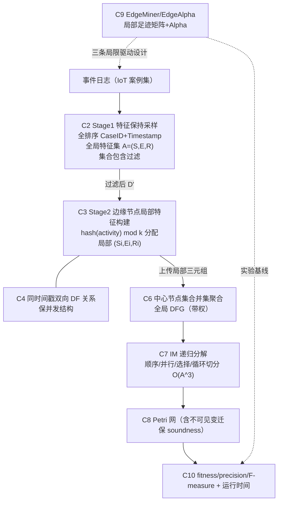

# EdgeIM 知识图谱提取与批判性分析（B2 独立视角）

**论文**：Su, Liu, Lu, Cheng, Zeng, Zhang. "EdgeIM: An Efficient Edge-based Process Model Discovery Technique". IEEE ICWS 2025, pp. 404-410. DOI 10.1109/ICWS67624.2025.00057。7 页会议短文。
**通讯作者**：Faming Lu（"* Faming Lu is the corresponding author." [PDF p.1]）。
**页码约定**：本文 [PDF p.X] 指 PDF 第 X 页（X=1..7），对应印刷页 404-410（p.1=404, p.2=405, p.3=406, p.4=407, p.5=408, p.6=409, p.7=410）。
**证据来源**：pdftotext 全文提取 + 对 PDF 第 5-7 页 -layout 复核（表 I/II/III 数值逐格核对）。

---

# 第一部分：知识图谱提取

## 1. 核心概念及其关系

提取 10 个核心概念（均以论文原文为准）：

| # | 概念 | 论文内定义/角色 | 出处 |
|---|------|----------------|------|
| C1 | EdgeIM | 三阶段边缘流程模型发现技术，"a novel Inductive Miner-inspired algorithm" | [PDF p.1] |
| C2 | 特征保持采样（Stage 1） | 事件按 (CaseID, Timestamp) 字典序全排序；维护全局特征集 A=(S, E, R)（起始活动集、结束活动集、directly-follows 关系集）；仅保留能扩展全局特征集的案例，其余过滤；集合包含检查 Si 属于 S 且 Ei 属于 E 且 Ri 属于 R 保证"零关键结构损失" | [PDF p.3, p.4] |
| C3 | 边缘节点局部特征构建（Stage 2） | 一致性哈希把**活动类型**映射到边缘节点（j = hash(e.activity) mod k）；每节点独立维护局部三元组 (Si, Ei, Ri)，Ri 为带权 directly-follows 关系 | [PDF p.3, p.4] |
| C4 | 时间戳冲突处理 | 相邻事件时间戳相同时（t(ak) = t(ak+1)），同时向 Ri 加入双向关系 <ak,ak+1> 与 <ak+1,ak>，以保留潜在并发结构 | [PDF p.3, p.4] |
| C5 | directly-follows 关系 / DFG | Definition 3：RL 为迹中相邻活动对集合；权重函数 w(a,b) = 各迹中相邻对 (a,b) 出现次数之和（Kronecker delta 求和式，公式(2)(3)）。Definition 4：DFG = (V, E, w) 有向带权图 | [PDF p.2, p.3] |
| C6 | 中心节点聚合（Stage 3 前半） | 中心节点以集合并集合并各节点的 (Si, Ei, Ri)，权重逐边累加 DFG(a,b) = DFG(a,b) + Ri(a,b)，得全局 DFG | [PDF p.3, p.5] |
| C7 | Inductive Miner 递归分解（Stage 3 后半） | 在全局 DFG 上递归检测基本模式——顺序(→)、并行(∧)、选择(×)、循环(⟲)——切分活动集为互斥子集、生成子 DFG、递归挖掘子网后按模式合并；复杂度 O(A^3) | [PDF p.2, p.5] |
| C8 | Petri 网（输出模型） | Definition 5：PN = (P, T, F, l)，含不可见变迁标签 τ；EdgeIM 以不可见变迁保证模型 soundness（对比 EdgeAlpha/AM 无不可见变迁导致循环节点脱离模型） | [PDF p.3, p.6] |
| C9 | EdgeMiner / EdgeAlpha（前作与基线） | EdgeMiner 在数据源（边缘节点）构建局部足迹矩阵、中心聚合 [24,25]；其实现 edgeAlpha 基于 Alpha Miner，三条局限：效率低、假设时间戳唯一、无法处理循环结构 | [PDF p.1] |
| C10 | 评估指标 fitness / precision / F-measure | F-measure = 2 * fitness * precision / (fitness + precision)，公式(4)；fitness 衡量模型重放日志能力，precision 衡量模型不产生日志外行为的程度 | [PDF p.5] |

**关系邻接表**（箭头 = 论文中明示的依赖/产出/对比关系）：

- C1 EdgeIM → 包含 → C2, C3, C6+C7（三阶段流水线）[PDF p.1, p.3]
- C2 Stage1 → 产出 → 过滤日志 D' + 全局特征 (S,E,R)（Algorithm 1 的 Output）[PDF p.4]
- C2 Stage1 → 消除 → 分布式采集导致的时间戳不确定性（通过全排序）[PDF p.4]
- C3 Stage2 → 输入为 → C2 的 D'（Algorithm 2 Input: "Filtered D', Global Features (S,E,R)"）[PDF p.4]
- C3 Stage2 → 内含 → C4 时间戳冲突处理（Algorithm 2 第16-18行）[PDF p.4]
- C3 Stage2 → 产出 → 局部三元组 {Local_i = (Si,Ei,Ri)} [PDF p.4]
- C5 DF关系 → 聚合构成 → 全局 DFG（经 C6）[PDF p.5]
- C6 聚合 → 馈入 → C7 IM 递归分解 [PDF p.5]
- C7 IM 分解 → 生成 → C8 Petri 网 [PDF p.5]
- C9 EdgeMiner/EdgeAlpha → 动机来源与被改进对象 → C1（EdgeIM 针对其三条局限设计）[PDF p.1]
- C9 EdgeAlpha → 实验对比对象 → C1（表 II、表 III）[PDF p.6, p.7]
- C4 时间戳冲突处理 → 直接回应 → C9 的局限(2)"时间戳唯一性假设" [PDF p.1]
- C7 IM → 直接回应 → C9 的局限(3)"Alpha 无法处理循环" [PDF p.1]
- C10 指标 → 评估 → C8 输出模型质量（表 II）[PDF p.5, p.6]

## 2. 理论框架图（文字描述，含推断）

论文的架构模型（Fig. 3 "An Approach Overview" [PDF p.3]）是一个**三层数据流**：

**(a) 预处理层（Stage 1）**：输入为案例集 {σ1..σn}。先按 <CaseID, Timestamp> 字典序对全部事件做全序排序，"eliminating the timestamp uncertainty caused by the distributed collection" [PDF p.4]；然后单遍扫描，用动态特征覆盖策略过滤：案例仅当其起始活动、结束活动或 DF 关系能扩展全局特征集 (S,E,R) 时保留（Algorithm 1 第5行条件：s 不属于 S，或 e 不属于 E，或 Rtmp 不是 R 的子集）[PDF p.4]。复杂度：排序 O(n*log n) + 特征检查 O(n*m^2)，n 为事件总数、m 为单迹最大活动数 [PDF p.4]。
**注意（推断）**：论文从未说明 Stage 1 在何处执行。全排序与全局特征集的构建都需要对**全部原始数据的全局视图**，逻辑上只能在一个集中位置完成；Fig. 3 把它画在边缘节点之前的独立框中 [PDF p.3]。这是框架中的关键含糊点（详见第二部分）。

**(b) 边缘层（Stage 2）**：过滤后的 D' 中，每个事件按活动类型经一致性哈希分配到 k 个边缘节点之一（"a consistent hashing algorithm maps activity types to edge nodes, ensuring balanced workload distribution" [PDF p.4]）。每节点独立维护 (Si, Ei, Ri)：迹首事件活动入 Sj、迹尾入 Ej；相邻事件对按当前事件活动的归属节点 j 计入 Rj，同时间戳则双向计入（Algorithm 2 第8-21行）[PDF p.4]。哈希 O(1)/事件，整体 O(n) [PDF p.4]。

**(c) 聚合层（Stage 3）**：中心节点收齐所有局部三元组，做集合并集与权重累加得到全局 DFG（聚合复杂度 O(k*m)，k 为边缘节点数、m 为每节点最大局部关系数 [PDF p.5]），随后"applies the recursive decomposition strategy of the classical Inductive Miner" [PDF p.5]：单节点即建叶子；否则检测基础模式 → 切分 DFG → 递归挖子网 → 按模式合并成 Petri 网（Algorithm 3）[PDF p.5]。

**隐含的效率论证逻辑（推断自文本）**：边缘节点上传的是尺寸约为"活动数平方"量级的关系统计而非原始事件，且 Stage 1 剪除冗余案例后"significantly reduces the mutual accesses among edge nodes. This reduction in inter-node communication overhead improves the efficiency" [PDF p.6]——即通信量与"局部特征体积 + 节点间相邻对互访次数"挂钩，而非与事件总量挂钩。这是全文效率主张的理论支点，但论文未给出任何通信量的形式化或实测（见第二部分 1）。

## 3. 关键数据表（逐数值解释）

### 表 II：模型质量（fitness / precision / F-measure），四方法 x 九日志 [PDF p.6]

| 日志 | AM (f/p/F) | IM (f/p/F) | EdgeAlpha (f/p/F) | EdgeIM (f/p/F) |
|---|---|---|---|---|
| Sepsiscases | 0.16 / 0.4272 / 0.2328 | 1 / 0.0866 / 0.1594 | 0.16 / 0.4272 / 0.2328 | 1 / 0.1213 / 0.2166 |
| exercise | 1 / 0.6458 / 0.7848 | 1 / 0.2876 / 0.4467 | 1 / 0.6458 / 0.7848 | 1 / 0.3008 / 0.4625 |
| ETMconfig | 0.99 / 0.9918 / 0.9909 | 1 / 0.9918 / 0.9959 | 0.99 / 0.9918 / 0.9909 | 1 / 0.9918 / 0.9959 |
| BPI13Incid | 0.58 / 0.1489 / 0.2370 | 1 / 0.2672 / 0.4217 | 0.17 / 0.2837 / 0.2126 | 1 / 0.2837 / 0.4420 |
| TSL.anon | - / - / - | 1 / 0.66 / 0.7952 | - / - / - | 1 / 0.7801 / 0.8765 |
| ICP.anon | 0.62 / 0.2593 / 0.3657 | 1 / 0.5489 / 0.7088 | 0.62 / 0.2593 / 0.3657 | 1 / 0.443 / 0.6140 |
| fightCar | 0.81 / 1 / 0.8950 | 0.92 / 0.8525 / 0.8850 | 0.81 / 1 / 0.8950 | 0.81 / 1 / 0.8950 |
| BPI17Offe | - / - / - | 1 / 0.8246 / 0.9039 | - / - / - | 1 / 0.8246 / 0.9039 |
| AllTrace | 0.9 / 0.375 / 0.5294 | 1 / 0.9216 / 0.9592 | 0.9 / 0.375 / 0.5294 | 1 / 0.9216 / 0.9592 |

"-" 表示"failed to discovery a process model or ... could not be evaluated" [PDF p.5]。逐项解读（比值为笔者据表内数值计算）：

- **fitness**：EdgeIM 在 9 个日志中 8 个为 1，仅 fightCar 为 0.81 [PDF p.6]。论文解释 fightCar<1 是因日志含重复任务、模型将其视为同一任务 [PDF p.5]——但这只解释了"为何小于 1"，没有解释为何 EdgeIM (0.81) 低于 IM (0.92)。
- **AM 与 EdgeAlpha 在 7 个可评估日志中有 6 个（Sepsis、exercise、ETM、ICP、fightCar、AllTrace）三项数值完全相同**，仅 BPI13Incid 不同（EdgeAlpha fitness 0.17 vs AM 0.58）[PDF p.6]——符合 EdgeAlpha 是分布式 Alpha 的定位，也暗示分布式化本身会带来结构损失（论文称"structural loss issues encountered by EdgeAlpha due to distributed processing" [PDF p.5]）。
- **EdgeIM 与 IM 在 ETMconfig、BPI17Offe、AllTrace 三行数值逐位相同** [PDF p.6]——符合"EdgeIM = 在聚合 DFG 上跑 IM 式分解"的本质：质量增益来自 miner 家族（IM vs Alpha），而非"边缘"设计本身。
- **精度提升主张**：论文称"For complex event logs, e.g., Sepsis and BPI2013Incidents, EdgeIM's precision is about 40% higher than that of the IM" [PDF p.5]。核算：Sepsis 0.1213/0.0866 = +40.1%（成立）；BPI13Incid 0.2837/0.2672 = **+6.2%（不成立，"about 40%" 为以偏概全）**。
- **未解释的劣化**：ICP.anon 上 EdgeIM precision 0.443 vs IM 0.5489（-19.3%），F 0.6140 vs 0.7088（-13.4%）[PDF p.6]，正文完全未讨论。
- Sepsis 上 EdgeIM 的 F (0.2166) 低于 AM/EdgeAlpha (0.2328)，论文归因于多起止活动+循环结构下 EdgeIM 用更多不可见变迁保 soundness，而 AM/EdgeAlpha 牺牲 soundness 换 F 值 [PDF p.6]——这个 soundness 论点合理，但全文未给出 soundness 的量化验证。
- **鲁棒性亮点**：TSL.anon（17812 迹/83286 事件/40 活动，本组最大日志 [PDF p.6] 表 I）与 BPI17Offe 上 AM 与 EdgeAlpha 双双失败（"-"），EdgeIM 正常产出且 F 分别 0.8765、0.9039 [PDF p.6]。

### 表 III：运行时间，EdgeAlpha vs EdgeIM [PDF p.7]

表头仅为 time / sum time / sampling time / discovery time，**通篇未标注时间单位**（正文亦无）[PDF p.7]。EdgeIM 的 sum time = sampling time (Stage 1) + discovery time (Stages 2-3) [PDF p.6]。

| 日志 | EdgeAlpha time | EdgeIM sum | sampling | discovery | 加速比(笔者算) | 采样占比(笔者算) |
|---|---|---|---|---|---|---|
| Sepsis Cases | 1957.3217 | 174.2978 | 4.732 | 169.5658 | 11.2x | 2.7% |
| exercise | 86.5827 | 90.6906 | 2.125 | 88.5656 | **0.95x（更慢）** | 2.3% |
| ETM Configuration | 85.4518 | 24.5927 | 4.214 | 20.3787 | 3.5x | 17.1% |
| BPI2013Incidents | 7574.9726 | 765.4889 | 5.299 | 760.1899 | 9.9x | 0.7% |
| TSL.anon | - | 580.5401 | 32.325 | 548.2151 | （对手失败） | 5.6% |
| ICP.anon | 1200.6847 | 25.7998 | 6.877 | 18.9228 | 46.5x | 26.7% |
| fightCar | 125.6428 | 21.4605 | 6.215 | 15.2455 | 5.9x | 29.0% |
| BPI2017OfferLog | - | 681.4961 | 36.245 | 645.2511 | （对手失败） | 5.3% |
| AllTrace | 2013.5815 | 21.0402 | 3.851 | 17.1892 | 95.7x | 18.3% |

逐项解读：

- 时间为 5 次运行的平均值："measured the runtime five times for each dataset and calculated the average execution time" [PDF p.6]；**无方差/标准差/显著性检验**。
- 加速跨度极大（0.95x 到 95.7x），且与日志规模不单调：AllTrace（18364 事件）95.7x，而更大的 BPI13（65533 事件）只有 9.9x——提示加速主要由**冗余案例比例**（可被 Stage 1 剪除的量）驱动，而非规模本身。论文自己的归因也是"removing redundant cases significantly reduces the mutual accesses among edge nodes" [PDF p.6]。
- **内部矛盾**：正文断言"Across all datasets, EdgeIM outperforms EdgeAlpha in total execution time" [PDF p.6]，与表 III exercise 行（86.5827 < 90.6906）直接矛盾，且两句之后自己承认"In the exercise log, EdgeIM takes longer than EdgeAlpha" [PDF p.6]。
- **exercise 行的解释站不住**：论文归因于"the dataset is small, contains no redundant cases, and has a higher proportion of fixed overhead for preprocessing and sampling" [PDF p.6]。核算：即使把采样开销 2.125 全部扣除，纯 discovery 时间 88.5656 仍大于 EdgeAlpha 全流程 86.5827——"固定采样开销"（仅占 2.3%）解释不了劣势；真正的含义是**当采样剪不掉数据时（无冗余案例），EdgeIM 的 Stage 2-3 本身并不比 EdgeAlpha 快**。
- IM/AM 的运行时间被排除在比较外，理由是"do not involve edge data processing and can directly discover process models from event logs" [PDF p.6]——因此全文没有任何"边缘方案 vs 集中式方案"的端到端成本对比（见第二部分）。

### 表 I：九个公开日志统计 [PDF p.6]（辅助）

规模区间：迹 21（exercise）到 17812（TSL.anon）；事件 552 到 83286；活动 6 到 40；最长迹 185（Sepsis）。九个日志合计约 24.6 万事件（笔者加总），全部为经典 BPM 基准（医院 Sepsis、IT 事故 BPI2013、贷款 BPI2017 等），与引言"billions of event logs ... daily" [PDF p.1] 的 IoT 动机存在两个数量级以上的落差。

## 4. 引用网络（TOP 5 + 引用方式分析）

| 引文 | 内容 | 角色 | 引用方式与观察 |
|---|---|---|---|
| **[5] Leemans, Fahland, van der Aalst 2013**（Petri Nets 会议，IM 原始文献） | 块结构模型构造式发现 | **理论基础/方法核心** | 单点引用于"recursively decomposes the global directly-follows graph using the Inductive Miner (IM) [5]" [PDF p.2]。注意：IM 2013 原版是在**事件日志**上递归切分；EdgeIM 实际做的是在 **DFG** 上递归切分，这对应 Leemans 等 2018 年的 IMd 变体（即引文 [6]），而 [6] 全文仅出现在引言的打包引用"model discovery [3-8]"中 [PDF p.1]，未被单独讨论。论文甚至用"its recursive discovery approach from the DFG, compared to the IM's divide-and-conquer approach applied to the event log"来解释自己与 IM 的精度差异 [PDF p.5]——这正是 IMd 与 IM 的区别，却未归功于 [6]。 |
| **[25] Andersen, Rathje, Imenkamp, Koschmider, Landsiedel, "EdgeMiner", ACM SAC 2025** | 在数据源构建局部足迹矩阵、中心聚合的分布式发现框架 | **直接前作 + 批判对象** | 引言专段评述并列举三条局限（效率低/时间戳唯一性假设/edgeAlpha 基于 Alpha 无法处理循环）[PDF p.1]，EdgeIM 的三项设计一一对应回应。这是全文最实质的"站在谁肩上"关系。 |
| **[24] Andersen, Rathje, Landsiedel, "EdgeAlpha", arXiv 2024 (2405.03426v3)** | EdgeMiner 的 Alpha 实例 | **唯一实验基线（对比对象）** | 与 [25] 打包引用（"in [24, 25]" [PDF p.1]）；表 II/III 中的 EdgeAlpha 即此方法。论文未说明所用 EdgeAlpha 是原实现还是自行在 PM4Py 重实现（复现性问题，见第二部分 4）。 |
| **[20] Evermann & Assadipour, ACM SAC 2014**（MapReduce 实现 Alpha） | 分布式计算框架并行化传统 PM 算法 | **分布式 PM 前作（被区隔对象）** | 被定位为"partially parallelize traditional algorithms, but still rely on partial centralized data aggregation, limiting their ability to meet real-time processing requirements [20,21]" [PDF p.1]。但 EdgeIM 自己的"哈希分桶计数 + 中心归并"在计算模式上与 map-shuffle-reduce 同构，且同样是批处理（需先全排序），论文未讨论这一相似性——区隔理由（实时性）对 EdgeIM 自身同样不成立。 |
| **[27] Su, Liu, Zhang, Zeng, "Sampling business process event logs with guarantees", CCPE 2024** | 带保证的事件日志采样 | **方法参考（Stage 1 来源，自引）** | **引用位置异常**：仅作为 Definition 1（事件日志/迹/活动）的定义出处被引 [PDF p.2]。而 EdgeIM 的核心卖点之一——"feature-preserving sampling / 覆盖式过滤"——与该自引论文的标题主题（同一第一作者的日志采样工作）高度重合，Stage 1 方法段落却零引用。这种引用方式会让读者低估 Stage 1 与作者既有工作的重叠度。 |

**次级但值得记录的引用**：[21] Gatta et al. 2019（分布式医疗 PM）作为"边缘局部预处理 + 中心聚合"路线的前作，被批评"仍需频繁本地-中心数据交换" [PDF p.2]；[22][23] Burattin 等流式发现作为"实时但精度受限"的对立面 [PDF p.1, p.2]；[29][30][31] 提供 F-measure/fitness/precision 的度量定义 [PDF p.5]；[26] Mannhardt 等差分隐私作为隐私路线的代表 [PDF p.2]（与结论的隐私主张相关，见下）。

---

# 第二部分：批判性分析

## 1. 方法论审视

**(a) 实验环境不是边缘环境，而是单服务器模拟。** 实验平台原文："The experiments were conducted on a server with the following specifications: Intel Xeon Silver 4210R processor (2.4GHz, 10 cores/20 threads, total 40 cores), 27.5MB L3 cache, supporting VT-x virtualization, and running Ubuntu 22.04.2 LTS" [PDF p.5]。三点问题：(1) 全部"边缘节点"运行在同一台服务器上，没有真实网络、没有异构低算力设备——而对比的前作 EdgeMiner 的定位恰是"at data sources (i.e., edge nodes)" [PDF p.1]；(2) 硬件描述自相矛盾："10 cores/20 threads, total 40 cores"在算术上不可能（4210R 为 10 核 20 线程，若双路应为 20 核 40 线程），说明实验章节校对粗糙；(3) **边缘节点数 k 从头到尾没有报告**——Algorithm 2 用 hash(e.activity) mod k [PDF p.4]，k 是决定负载均衡与"节点间互访"量的核心参数，实验章节却只字未提，也没有随 k 变化的可扩展性实验。

**(b) 通信开销的测量口径是空的。** 全文的效率因果链是"剪除冗余案例 → 减少节点间互访 → 降低节点间通信开销 → 提升效率"（"removing redundant cases significantly reduces the mutual accesses among edge nodes. This reduction in inter-node communication overhead improves the efficiency" [PDF p.6]），但论文**没有报告任何通信指标**：无传输字节数、无消息条数、无网络延迟建模，唯一的观测量是单机墙钟时间 [PDF p.7]。在单服务器上，"节点间通信"最多是进程/内存访问，其成本与真实边缘网络相差数量级。通信开销主张全部是推断而非测量——这是内部效度的最大威胁。

**(c) 混淆变量：采样与算法未拆分（无消融）。** 表 III 的比较是"EdgeIM（含 Stage 1 采样）vs EdgeAlpha（无采样、跑全量日志）"[PDF p.7]。加速可能来自采样剪数据，也可能来自 IM 系相对足迹矩阵构建的算法差异，实验设计无法区分。缺两个关键对照：EdgeAlpha + 同样的 Stage 1 采样；EdgeIM 去掉 Stage 1。且**各日志经采样后保留多少案例/事件从未报告**——正文只说 exercise "contains no redundant cases" [PDF p.6]，其余日志的压缩率是黑箱，读者无法判断 11x-96x 加速中数据缩减贡献几成。

**(d) 数据集选择偏差。** 九个日志全部是小规模经典 BPM 公开日志（最大 83286 事件 [PDF p.6] 表 I），没有一个真实 IoT/传感器日志，没有任何一个达到"集中式不可行"的规模——而动机是"billions of event logs ... daily"与"limited storage and computing capacity" [PDF p.1]。在这种规模上，集中式 IM 在 PM4Py 上本可直接完成，论文用"not directly comparable" [PDF p.6] 将 IM/AM 的运行时间排除出表 III，从而回避了"这些日志根本不需要边缘方案"的端到端对比。

**(e) 统计方法。** 时间取 5 次平均 [PDF p.6]，无方差、无置信区间、无显著性检验；质量指标未说明是对全量日志还是采样后日志计算 fitness/precision（这直接影响"fitness=1"的含义）；表 III 无时间单位 [PDF p.7]。

## 2. 逻辑审视

**(a) 推理链最薄弱的一步：Stage 1 的位置使"边缘"前提自我瓦解。** Stage 1 要求"All events in the input cases are sorted in a total order based on the case ID and timestamp" [PDF p.3] 并构建全局特征集 (S,E,R) [PDF p.4]——这需要对**全部原始事件的全局视图**，只能集中执行（论文未说明在哪执行）。更致命的是：Algorithm 1 的输出就是"Filtered D', Global Features (S, E, R)" [PDF p.4]，即**在数据进入边缘节点之前，全局起始活动集、结束活动集、无权 DF 关系集已经算完了**——这正是 Stage 3 聚合要得到的东西（除边权外）。换言之，按论文自己的伪代码，边缘层（Stage 2）唯一新增的信息是 DF 关系的**频次**，而 IM 的基础切分主要依赖 DFG 的结构而非频次。如果 Stage 1 集中执行，原始数据已经全部离开边缘设备，"数据不出边缘、降低传输开销、保护隐私"的全部叙事随之落空；如果 Stage 1 分布式执行，全排序与全局集合维护的通信成本论文只字未提。这是全文没有回答、也无法在现有描述下自洽的问题。

**(b) "efficient"的边界条件被系统性省略。** 实证上 efficiency 只相对 EdgeAlpha 成立（唯一基线），且有反例：exercise 上 EdgeIM 更慢（90.6906 vs 86.5827 [PDF p.7]），而正文断言"Across all datasets, EdgeIM outperforms EdgeAlpha in total execution time" [PDF p.6]——**与自家表格和自家下一句话直接矛盾**。对集中式 IM 的时间比较被整体回避 [PDF p.6]。"about 40% higher precision"对 BPI2013Incidents 实为 +6.2%（0.2837 vs 0.2672 [PDF p.6]，笔者核算）。结论章更把主张升级为"privacy-preserving model discovery" [PDF p.6]——全文没有任何隐私机制、威胁模型或实验（差分隐私只在相关工作里提别人 [PDF p.2]），隐私主张是零支撑的搭便车。

**(c) 替代解释：提速主要来自数据变小，质量提升主要来自换 miner，两者都与"边缘"无关。** 证据一：论文自己把提速归因于"removing redundant cases" [PDF p.6]；证据二：唯一无冗余可剪的日志（exercise）恰是唯一 EdgeIM 更慢的日志，且扣除采样开销后纯 discovery 仍慢于对手全程（88.5656 > 86.5827 [PDF p.7]，笔者核算）——说明当采样失效时，"边缘 IM"本身不带来速度优势；证据三：质量上 EdgeIM 与集中式 IM 在三个日志逐位相同 [PDF p.6]，其余差异被论文归因于"DFG 上递归 vs 日志上递归"[PDF p.5]，即 IMd 与 IM 的既知差异。因此更简洁的解释是：**EdgeIM ≈ 覆盖式采样 + 分布式 DF 计数 + IMd**，三个组件各自都不是本文发明，性能收益可分别归属到前两个组件，与"边缘部署"这一叙事无必然联系。论文没有排除这一解释的任何实验。

**(d) 时间戳冲突处理的双刃剑未讨论。** 同时间戳即加双向 DF 关系 [PDF p.4] 在时间戳粒度粗（如仅到天/秒）的日志上会批量注入伪并发，使 IM 切出过宽的并行结构、拉低精度。论文既未做时间戳粒度敏感性分析，也未解释 ICP.anon 上精度反而比 IM 低 19.3%（0.443 vs 0.5489 [PDF p.6]）是否与此有关。

**(e) 形式化与写作的可靠性瑕疵**（影响对结果的信任度）：Definition 5 印为"P ∩ T = ∅, P ∩ T ≠ ∅"，字面自相矛盾（应为 P ∪ T ≠ ∅）[PDF p.3]；Algorithm 3 标题误植为"Feature-Preserving Sampling"（内容是中心聚合与模型发现）[PDF p.5]；Algorithm 1 第4行 σ[0] 取首元素但 Rtmp 用 1 ≤ k < |σ|，0 基与 1 基混用，按字面会漏掉首个相邻对 [PDF p.4]；"the number of edge nodes after Stage 1 filtering remains equal to the initial number" [PDF p.6] 语义不通（过滤案例不改变节点数，疑指案例覆盖的节点数）。

## 3. 贡献审视

**实际增量（相对既有工作逐项核对）**：

- 相对 **EdgeMiner/EdgeAlpha [24,25]**：把可聚合的局部统计量从足迹矩阵换成带权 DF 三元组 (Si,Ei,Ri)，把中心侧 miner 从 Alpha 换成 IM 式 DFG 递归分解，由此获得循环处理能力与 soundness（表 II 中 AM/EdgeAlpha 在 TSL.anon、BPI17Offe 上直接失败而 EdgeIM 产出 F 0.8765/0.9039 [PDF p.6]，这是最实的证据）；外加同时间戳双向边，回应 EdgeMiner 的时间戳唯一性假设 [PDF p.1]。这是真实但幅度有限的增量——EdgeMiner 原文本就声称提出"various distributed model discovery strategies"（论文自述 [PDF p.1]），EdgeIM 可视为该框架下"换一个 miner 实例"的自然延伸。
- 相对 **Evermann 系 MapReduce 分布式 PM [20]**：EdgeIM 的哈希分桶计数 + 中心归并在计算模式上就是 map-shuffle-reduce；区别仅在叙事层（"边缘"）与 miner 选择（IM vs Alpha）。论文用"实时性不足、部分集中聚合" [PDF p.1] 区隔 [20,21]，但 EdgeIM 同样是批处理（需全排序）且同样有中心聚合，区隔理由对自己同样适用。
- 相对 **IMd（Leemans 2018 [6]）**：Stage 3 的"在 DFG 上递归分解"与 IMd 思想一致，论文未讨论、未单独引用（见第一部分 4）。**"分布式收集 DF 统计 + 中心跑 DFG 版 IM"这一组合的新颖性，取决于是否承认 IMd 已把"只需 DFG 即可挖掘"这一步做完**——承认之后，本文的新颖性主要剩下 Stage 1 采样与工程整合，而 Stage 1 又与作者自引 [27] 高度重合。
- **novelty 定位**：合理的说法是"首个 IM 家族的边缘化实例 + 采样预处理的组合与 PM4Py 实现"。论文的实际措辞（"novel Inductive Miner-inspired algorithm" [PDF p.1]）尚可接受，但摘要/结论层面的"efficient / privacy-preserving / well-suited for large-scale IoT deployments" [PDF p.1, p.6] 超出证据。
- **对边缘 PM 小方向的启发（正面）**：(1) 明确了"可加性统计量"是边缘 PM 的正确抽象——凡 miner 只依赖可分布式累加的充分统计量（DF 计数、起止集合），即可低通信聚合，IM 家族因此优于 Alpha 家族；(2) 展示了采样/过滤可作为与分片正交的前置层；(3) 用公开日志 + PM4Py 给了这个 3-4 个团队的小方向一个可对标的基线数字（尽管复现信息不全）。对后续工作者，最有价值的遗留问题恰是其未答的：Stage 1 能否去中心化、k 与拓扑如何影响通信、频次信息在边缘侧是否值得付出成本。

## 4. 可复现性

**方法细节**：三个算法均给伪代码 [PDF p.4, p.5]，定义标准（Def 1-5 [PDF p.2, p.3]），核心思路可重实现。但**数值复现不可能**，缺失项：边缘节点数 k；哈希函数与一致性哈希细节；各日志采样保留率；表 III 时间单位；PM4Py 版本；EdgeAlpha 的实现来源（原作代码还是自行重实现）；fitness/precision 的计算对象（全量日志或采样日志）与所用 PM4Py 评估器配置；IM 是否用 infrequent 变体/噪声阈值。

**数据/代码公开声明——原文抄录**：全文没有 availability 声明段。仅有的相关原文为：
- "EdgeIM, has been implemented in the PM4Py1 process mining tool platform" [PDF p.5]
- 脚注 1："1 https://processintelligence.solutions/pm4py" [PDF p.5]
- "Table I provides detailed statistics on nine publicly event logs2" [PDF p.5]
- 脚注 2："2 https://data.4tu.nl/search?search=process+mining" [PDF p.5]

即：**EdgeIM 自身代码未公开**（只给了所依托平台 PM4Py 的官网）；数据"公开"但脚注是 4TU 门户的**通用搜索链接**而非各日志的 DOI，且 TSL.anon、ICP.anon、fightCar、ALLTrace、exercise、ETM Configuration 等名称在公开语料中不具唯一可解析性，第三方无法确认拿到同一份数据。综合评级：**思路可复现、数字不可复现**。

## 5. 总评（审稿人视角）

**判定：大修（major revision）。** 作为 7 页 ICWS 短文（实际已被接收），其工程贡献真实：把边缘 PM 从 Alpha 家族推进到 IM 家族、获得循环处理与 soundness、在两个基线全灭的日志上产出可用模型 [PDF p.6]，这值得发表。但按其自身主张（efficiency、通信开销、隐私、大规模 IoT）衡量，证据链有结构性缺口，若我审稿会给 major revision 并要求回答以下三点。

**三个最硬的质疑点**：

1. **Stage 1 在哪里执行？通信开销到底测过没有？** 全排序与全局特征集需要全量原始数据的集中视图 [PDF p.3, p.4]，若集中执行则原始数据已出边缘，效率/隐私叙事自毁；且 Algorithm 1 的输出 (S,E,R) 已含无权全局 DFG，边缘层只补了频次 [PDF p.4]。同时全文声称降低"inter-node communication overhead" [PDF p.6] 却无任何通信量测量（单服务器模拟、k 未报告 [PDF p.5]）。请给出 Stage 1 的部署位置、端到端字节级通信账本、以及随 k 变化的实验。
2. **提速归因混淆：请补消融。** EdgeIM（含采样）对 EdgeAlpha（无采样）不是受控比较 [PDF p.7]；唯一无冗余日志 exercise 上 EdgeIM 反而更慢，且扣除采样开销后仍慢（88.5656 > 86.5827 [PDF p.7]），提示增益主要来自数据缩减而非边缘算法设计。请补三个对照：EdgeAlpha+同样采样、EdgeIM 去采样、集中式 IM/IMd 端到端时间；并报告各日志采样保留率与"Across all datasets"矛盾句 [PDF p.6] 的修正。
3. **新颖性边界与主张收缩。** Stage 3 的 DFG 递归分解 ≈ IMd（[6] 仅打包引用 [PDF p.1]，而论文用 IMd 与 IM 的差异解释自己的精度 [PDF p.5]）；Stage 1 采样与作者自引 [27] 主题重合却只在 Definition 1 处引用 [PDF p.2]；"about 40% higher precision"对 BPI2013 实为 +6.2% [PDF p.6]；结论的"privacy-preserving" [PDF p.6] 无任何支撑内容。请明确剩余增量（同时间戳双向边 + 组合工程），并把摘要/结论的主张收缩到证据范围内。

---

**校验声明（三道安全门）**：(1) 不编造——本文所有论文事实均标注 [PDF p.X] 并经 pdftotext 全文及第 5-7 页 -layout 复核，所有比值/占比/加总标注"笔者计算"且给出原始数值；(2) 不过度承诺——对论文未言明处（Stage 1 执行位置、k 值、时间单位、采样保留率）一律标注为"未报告/推断"，未替论文补全；(3) 全覆盖——覆盖全部 7 页：动机与前作局限 [p.1]、相关工作与定义 [p.2]、架构与定义 [p.3]、算法 1/2 [p.4]、算法 3 与实验设置 [p.5]、表 I/II 与时间分析与结论 [p.6]、表 III 与参考文献 [p.7]。
