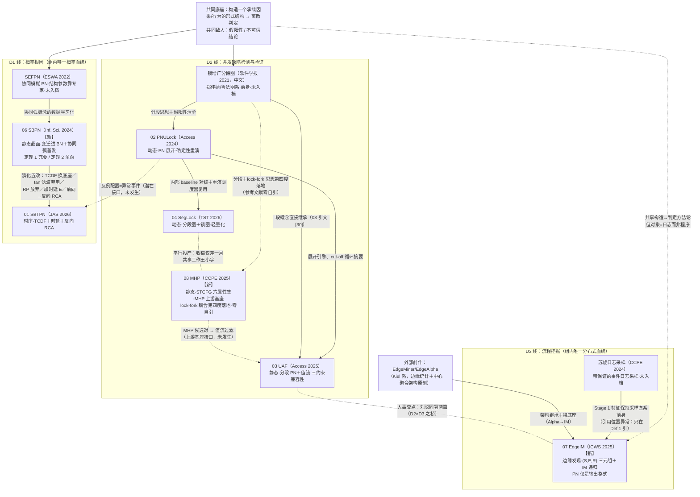

# 09 · 家族综合 V2：七篇联卷（总卡 × 谱系 2.0 × 方法论 DNA 修订 × 七篇对比 × 进组清单 V2 × 缺口清单）

> **版本关系**：本文件是 `05_FAMILY_SYNTHESIS.md`（四篇版核心交付，已审计终态化，只读）的**升级版本，不是修订**。旧版正确的判断一律保留并标"维持"；被新证据修正处显式标注 **【V2 修订】**。
> **输入**：旧四卡 `01_SBTPN.md` / `02_DEADLOCK_PNULOCK.md` / `03_UAF_PN_VFG.md` / `04_DEADLOCKSEG_SEGLOCK.md`；新三卡 `06_SBPN.md` / `07_EDGEIM.md` / `08_MHP.md`（2026-08-15 付费墙三篇入档）；B 波独立批判卡 `06b_SBPN_kg_critique.md` / `07b_EDGEIM_kg_critique.md` / `08b_MHP_kg_critique.md`；bridge 三卡（`bridge/SBPN_T4_bridge.md` / `bridge/EDGEIM_T2_bridge.md` / `bridge/MHP_T1T3_bridge.md`，只引其结论）；组侧图 `research/map/W1_lu_side/LU_SIDE_MAP.md`（只读）。
> **引用约定**："NN 卡"＝本目录 `NN_*.md`，"NNb 卡"＝对应批判卡，章节号指卡内标题。公式一律纯文本，不用 LaTeX。

---

## 1. 七篇总卡

| # | 文件 | 论文 | 刊/年 | 作者线 | 主线 | 一句话 |
|---|------|------|-------|--------|------|--------|
| 01 | `01_SBTPN.md` | SBTPN：多变量时序知识挖掘与 RCA | IEEE/CAA JAS 2026 | 王晓亮（一作）/ 鲁法明＋周孟初（通讯） | **D1** | PN 变迁进 BN 建模 AND/OR 与催化/抑制协同＋时延，TCDF 挖→SBTPN 建→概率修正 RCA，准确率超 SOTA 11%+（01 卡 §2/§3） |
| 02 | `02_DEADLOCK_PNULOCK.md` | PNULock：PN 展开死锁检测与重演 | IEEE Access 2024 | 鲁法明（一作）/ 包云霞（通讯） | **D2** | 轨迹挖成 1-safe 轨迹网＋recover 伴随网，展开检死标记，配置导出确定性锁调度器一次重演（02 卡 §2） |
| 03 | `03_UAF_PN_VFG.md` | 分段 PN＋值流图并发 UAF 静态检测 | IEEE Access 2025 | 李珊珊（一作）/ 包云霞（通讯）/ 刘聪（五作） | **D2** | 分段 PN 管控制流因果（含 lock/fork 耦合），分段值流图管源汇路径，三类约束兼容性判 UAF，胜 Canary/Saber（03 卡 §2/§3） |
| 04 | `04_DEADLOCKSEG_SEGLOCK.md` | SegLock：细化分段图＋锁图死锁检测与重演 | Tsinghua Sci. Tech. 2026 | 鲁法明（一作）/ 王小宇（二作）/ 袁贵元（通讯） | **D2** | 锁释放也当分段点＋弧带轮次/序号＋历史锁耦合因果图判环，精度持平 PNULock、开销降到 1/2–1/6〔⚠️ 08-24 勘误：原文宣称，Table 5 对标数据整列制表错位已确证，真实 1.70–6.35×（中位 2.76×），宣称范围大体成立但名实错位，见 02b §〇.2＋_audit_remediation_20260824/ 终核〕（04 卡 §2/§3） |
| 06 | `06_SBPN.md`【新】 | SBPN：AND/OR 与协同效应的挖掘、建模与概率推理 | Information Sciences 2024 | 王晓亮（一作）/ 鲁法明（通讯）/ 包云霞（五作·调研） | **D1** | SBTPN 前身：变迁进 BN＋协同弧＋紧凑 CPT 首发，从静态截面数据学 AND/OR 与规则级协同（定理 1 充要 / 定理 2 单向），变迁版 leaky noisy-OR 前向推理（06 卡 §3/§4） |
| 07 | `07_EDGEIM.md`【新】 | EdgeIM：高效边缘过程模型发现 | IEEE ICWS 2025（CCF-B 会议短文） | 苏旋（一作）/ 刘聪（二作，NOVA 双署名）/ 鲁法明（通讯） | **D3** | 边缘节点只上传 (S,E,R) 特征三元组，中心并集聚合成 DFG 再跑 IM 式递归分解，通信量与日志规模解耦，补上 EdgeAlpha 的环结构与时间戳冲突并发两个缺口（07 卡 §1/§3） |
| 08 | `08_MHP.md`【新】 | Segment-Based MHP：C 程序分段式可并行性分析 | CCPE 2025 | 鲁法明（一作）/ 王小宇（二作）/ 曾庆田（三作）/ 袁贵元＋包云霞（双通讯） | **D2** | 按"并发上下文等价"切段的 STCFG，六属性集＋六规则查表判 MHP；lock-fork 耦合 HB 与 intra/inter 锁二分双机制，查询期零图搜索；家族里位置最上游的基座篇（08 卡 §0/§3） |
| 09 | `09_FAMILY_SYNTHESIS_V2.md` | ——七篇综合（本文件） | | | | |

**七篇阅读顺序建议 V2**：04（最轻，入门 D2 概念）→ 02（D2 方法学底座）→ 08（分段思想的静态第三载体＋MHP 上游基座）→ 03（D2 深水区：静态 PN＋值流）→ 06（D1 前身，无时序、概念最干净）→ 01（D1 时序旗舰）→ 07（D3 独立线，可任意时点插读）→ 09（本综合）。旧版"04→02→03→01→05"顺序（README）在四篇范围内维持有效。

**框架分析卡清单（L 波补齐，2026-08-22 四卡齐，七篇"主拆卡＋框架卡"双层结构自此统一）**：

- `01b_SBTPN_sixpoint_kg_critique.md` —— 特命＝SBPN/SBTPN novelty 首发权切割（归属表 10 行双页锚）
- `02b_PNULOCK_sixpoint_kg_critique.md` —— 特命＝SegLock 之后展开路线的剩余价值推演（可检验命题）
- `03b_UAF_sixpoint_kg_critique.md` —— 特命＝"双图分工"是否真 insight（2026-08-15 窗口2 落）
- `04b_SEGLOCK_sixpoint_kg_critique.md` —— 特命＝组内路线之争＋「够用就好」裁剪哲学

---

## 2. 谱系 2.0

在旧版谱系（README §二，7 条边）基础上扩展：D1 线根节点前移两代并补 SBPN→SBTPN 演化边；D2 线补 MHP 为分段方法第三载体；新增 D3 支线。新增 9 条边、改道 1 条。

### 2.1 旧边（6 条，维持，说明见 README §二，此处一行复述）

1. **ROOT→SEG2021**：2021 中文论文确立"按因果依赖分段消假阳性"的问题清单，是 D2 全线的根。
2. **SEG2021→PNU**：PNULock 用 PN 展开重做同一问题，每次语句执行独立成变迁、信息零丢失，代价是状态爆炸。
3. **PNU→UAF**：展开引擎从动态轨迹网移植到静态分段 PN，occurrence net 判并发/冲突、cut-off 做循环摘要。
4. **SEG2021→UAF**：段概念直接继承（03 篇引文 [30]）。
5. **PNU→SEGL**：SegLock 是 PNULock 的轻量化重构，组内自己完成重模型与轻模型的对照实验（04 卡 §3）。
6. **PNU⇢SBTPN**（虚线，未发生）：D2 反例配置＝离散异常事件，可喂 SBTPN 做概率归因——七篇下仍零互引，维持"地图机会而非既成事实"的判断。

### 2.2 新边（9 条＋1 条改道，逐条衔接说明）

**N1. SEFPN(ESWA 2022) → SBPN**（D1 前史边，随之 ROOT→SBTPN 改道为 ROOT→SEFPN）
同一批作者的 2022 前作把催化/抑制协同效应放进模糊 Petri 网，但结构与参数全靠专家给定；SBPN 首次把"PN 变迁进 BN＋协同弧＋概率标记"做成可从数据学习的版本（06 卡 §0 家族位置、§3.1 Insp-3）。**【V2 修订】**旧版谱系把 D1 根画在 SBTPN；实际 D1 是"SEFPN(2022)→SBPN(2024)→SBTPN(2026)"三部曲，协同弧/概率标记等机制的首发权在 SBPN，SBTPN 是其时序化（06 卡 §0）。

**N2. SBPN → SBTPN**（D1 演化边，核心）
据 06 卡 §9 逐条差分，演化要点五条：
- **换底座**：PC＋ANM＋HSIC 统计式因果发现 → TCDF 神经式（注意力膨胀卷积），并由卷积核权重顺带产出时延（06 卡 §9-2）；
- **tan 滤波弃用**：SBPN 式(7) 的协同强度带 tan(k(x-0.5)) 滤波（k=2*pi/3），SBTPN 式(5) 去掉了滤波、直接对两个条件概率之差取 sigmoid（06 卡 §9-5）；
- **RP 放弃**：SBPN 支持域间 UP＋域内 RP 两类协同候选集，SBTPN 只保留"不同连通分量"（对应 UP），域内协同被放弃（06 卡 §9-5）；
- **加时延与任务转向**：新增时延函数 E: P×P→[0,+inf)，协同关系从"系数函数 lambda 非零"升格为一等弧集 S；推理方向从前向预测（式 8-9）转为反向根因归因（SBTPN 式 6-8＋算法 4），并补齐 O(m^3) 复杂度分析（06 卡 §9-3/7/8）；
- **理论保证的代价**：SBPN 定理 1（充要）在 SBTPN 中没有对应物，理论保证换成了工程流程（06 卡 §9-4）。SBPN 自认的"OR 多则 AND 难辨"在 SBTPN 仍未解决，"噪声是协同前提"被继承并升级为阈值敏感问题（06 卡 §9-10）。

**N3. SEG2021 ⇢ MHP**（虚线：思想传承但零自引）
lock-fork 耦合这一组内祖传洞见在 08 篇以 LF/FL 双集合＋规则 6 的形态**第四度落地**（前三度：02 的锁弧因果、03 的伴随标签 α/β、04 的 lock-start 耦合因果），分段思想同源；但 MHP 参考文献 [1]–[26] 中 2021 分段图、02、03、04 一篇都没引，祖传 insight 以"全新发现"面目出现（08 卡 §0 反常、§3.1、§8-6）。对组是"一个洞见吃四篇"的效率，对单篇是新颖性风险——审稿人若识破谱系，独有增量只剩 intra/inter 锁二分＋段属性工程（08 卡 §8-6）。

**N4. SEGL ⇢ MHP**（虚线无向：平行投产）
两篇收稿仅差一月（MHP 2024-11-24，SegLock 2024-12-30），共享二作王小宇，是同一批分段思想在 Java 动态侧与 C 静态侧的平行投产（08 卡 §0）。分段密度对照：SegLock 的自我标榜是"锁释放也当分段点"（动态轨迹上），MHP 静态侧 lock 与 unlock **都是**分段点（六场景 D/E），切得更细（08 卡 §4.1 对照）。08 卡 §9.2 的谱系判断：03 之于 08，恰如 02 之于 04——每条线都是"PN 精算版"与"图近似速算版"成对出现，这是"重模型 vs 轻模型"路线之争在静态侧的复刻。

**N5. MHP ⇢ UAF**（虚线，未发生：上游基座接口）
MHP 是"许多并发缺陷分析的基座"（08 篇原文第一句），家族里位置最上游：08 出"可能并行"候选对，03 出"数据真到达"过滤，拼起来才是完整检测器；且 08 自认的假阳性根源（不判内存对象同址、无路径条件）恰是 03 值流图与条件约束已覆盖的能力（08 卡 §9.3）。两篇零互引——与 D1/D2 闭环同构，属地图机会而非既成事实。

**N6. 苏旋采样(CCPE 2024) → EdgeIM**（D3 线内直系）
一作苏旋自己的"带保证的日志采样"（07 篇引文 [27]）是 Stage 1 特征保持采样的直系前身；但正文只在 Definition 1（日志/迹定义）处引用它，方法段落零引用，引用方式会让读者低估 Stage 1 与既有工作的重叠度（07 卡 §0 作者线，07b 卡引用网络 [27] 行）。

**N7. EdgeMiner/EdgeAlpha(Kiel 系) → EdgeIM**（外部架构继承＋换底座）
"边缘节点本地统计＋中心一次聚合"的架构原创权在 Kiel 系；EdgeIM 以"跟随者换底座超车"入场：底座从 Alpha 换成 IM 式 DFG 递归，同一架构立刻获得环结构、soundness 与 fitness 保证，另用等时间戳双向边回应 EdgeMiner 的时间戳唯一性假设（07 卡 §2-5、§3.2 Insight 3/4、§9）。

**N8. UAF ⇢ EdgeIM**（虚线无向：人事交点）
刘聪（山东理工＋NOVA 里斯本双署名）同署 03 篇（五作）与 07 篇（二作），是 D2 内存安全线与 D3 流程挖掘线的人事之桥，也是 D3 的国际接口（03 卡作者线、07 卡 §0、LU_SIDE_MAP §6"刘聪 NOVA 兼职[需验证]"）。

**N9. ROOT ⇢ EdgeIM**（虚线：D3 与 D1/D2 的方法论关系）
D3 共享家族"构造一个形式结构→离散判定"的方法论骨架（构造全局 DFG→IM 四模式递归判定），选题公式也完全同构（X=EdgeMiner 架构，Y=环结构/soundness＋时间戳冲突并发，07 卡 §9）；**但对象是事件日志而非程序**，且全程无 PN 理论机制创新——Petri 网只是输出格式，这条线的技术门槛在数据工程侧、不在形式化侧（07 卡 §9 方法论 DNA 验证段）。

---

## 3. 方法论 DNA 修订

旧版三板斧：**建模＝因果容器 / 求解＝离散判定 / 评测＝自建对照＋组内对标**（05 卡 §二）。用七篇重新检验如下。

### 3.1 三板斧重检：哪些强化、哪些要修

**板斧一"建模＝PN 是因果容器而非目的"——D1/D2 强化，D3 需要改写。**
- 强化证据：SBPN 是该判断的极致体——"借 PN 的图语法，装 BN 的概率语义"，变迁不再发射、只作条件概率分解的中间节点，为此不惜放弃 PN 的动态执行能力（可达性/并发分析全部不再适用），换来可从数据学习（06 卡 §4.2 第一性思考）。MHP 则干脆不用 PN：六个属性集合装并发上下文，段=并发语义等价类（08 卡 §3.3）。旧判据"当 PN 太重时毫不犹豫退到图近似，标准是信息够不够、不是形式化纯度"在七篇下全线成立。
- **【V2 修订】**建模轴要拆成两种血统：D1/D2 六篇的容器装的是**因果/资源语义**（轨迹网、分段 PN、增广图、SBPN、STCFG）；D3 的 EdgeIM 装的是**可加充分统计量**——(S,E,R) 三元组对 IM-on-DFG 类算法是充分统计量、关于日志分片可加，整篇论文就是这一个恒等式的工程化（07 卡 §1 立足恒等式）。这个"最小充分统计量"设计模式是其余六篇都没有的，也是 EdgeIM 作为**组内唯一分布式血统**的技术内核；但"边缘"现状是单机逻辑分片而非物理部署（07 卡 §6.1），血统成色待真实多机检验。
- **【V2 修订】**概率血统的归属前移：**SBPN 的贝叶斯层是组内唯一概率血统**——组内唯一从数据学习概率结构（AND/OR＋协同＋CPT）的方法学，且拥有七篇中唯一的充要刻画（定理 1：无噪双亲下 Phi>0.5 当且仅当 AND，06 卡 §4.6）。旧版把"PN×BN 融合"记在 SBTPN 名下（05 卡对比表 01 列）——机制首发权应记 SBPN(2024)，概念雏形至 SEFPN(2022)。同时记录概率线的方法学软肋：定理 2 只有"有协同 ⟹ 分数>0.5"的单向，算法却按充分方向使用（分数过阈值 ⟹ 判协同），阈值法只有召回向依据、没有精度向保证——D5-1000 上 40% 协同误报是这个缺口的直接体现（06 卡 §4.7 逻辑批注，06b 卡质疑 3）。

**板斧二"求解＝离散判定优先，统计为辅"——七篇全线成立，并新识别一个子模式。**
- SBPN：判定式管线（Phi/Theta/Psi 过 sigmoid 后与阈值 epsilon/gamma/delta 比大小），变迁使能是 0/1 硬合取（式 5），连概率推理的组合骨架也是规则级 OR（06 卡 §4.6–4.8）；EdgeIM：IM 四类基础模式（顺序/并行/选择/循环）的 cut 检测（07 卡 §4.3）；MHP：六条规则全部是集合运算级判定，无 HB 无冲突即判并发（08 卡 §4.6）。
- 新识别子模式：**"构造期预付、查询期免搜索"**。MHP 把跨线程事实在建图期三步全局传播摊平进段属性，查询退化为常数次集合运算（08 卡 §3.4）；EdgeIM 把统计构建下推边缘、中心只做一次并集聚合（07 卡 §3.2 Insight 1）。这是组内轻量化路线（04/07/08）的共同配方，可视为板斧二的效率面。

**板斧三"评测＝自建对照＋组内对标"——强化到必须如实写出阴暗面的程度。**
B 波三卡的独立批判显示，三篇新卡的实验**都有"自建基准撑精度"模式**，且形态各异：
- SBPN（最典型的自证循环）：合成数据的生成机制与模型假设同构——OR 用 noisy-OR 生成、AND 用乘积编码、协同按 Theta/Psi 所度量的条件概率差直接注入；所谓"真实世界结构"实验的数据仍由同一合成机制生成，真实数据集的协同"真值"用与式(7)同义的条件概率差定义（06b 卡 M1/M4/M6）。评的是"假设成立时挖得回来"，不证明假设在真实数据中成立（06 卡 §5.1 批判）。
- MHP（为机制定制用例）：8 个自研用例逐一对准自家新机制命名，STCFG 相对 RRG 的全部精度优势恰好只出现在其中 3 个（DRB005/006/007，一一对应三个新机制）；在全部 4 个 SPLASH2 真实内核上与 RRG 逐值相同，**真实负载上精度增益为零**，真值确定方法学全文缺失（08 卡 §5.4-2、08b 卡质疑 1/3）。
- EdgeIM（靶场模拟＋选择性叙述）：9 个公开日志是实打实的，但"边缘"是单台服务器上的进程模拟（推断，源自 07 卡带标签口径；论文未明说部署形态），边缘节点数 k 从未报告，通信开销与隐私两条主张零测量零机制；"superior to both"被自家表格否定（9 行实为 6 胜 1 平 2 负），"about 40% higher precision"一半不成立（07 卡 §5.6，07b 卡 1(a)/1(b)/2(b)）。
- 组内对标传统维持（04 对标 02），但 08 暴露新风险点：两个外部基线（TCT/RRG）均为**作者自行复现**，TCT 还是从 Java 跨语言移植，复现保真度不可查验（08b 卡方法论审视首条）。
- 正资产也要记录：**诚实自限的传统在延续**——02/04 的重演"真/假/未知"三分宁输出未知不冒充确定；08 摘要自称 "preliminary" 且声明自己不是竞争检测器；06 如实报告噪声-性能反向关系与协同挖掘的非单调波动（06 卡 §5.4-6）。这条与阴暗面并存，写自己论文时继承前者、根治后者。

**人事-课题对应 V2**（在 05 卡 §二基础上扩充）：王晓亮＝D1 全线一作（SEFPN→SBPN→SBTPN 三部曲，T4 接口人）；包云霞＝D2 通讯位（02/03）＋08 双通讯之一，但在 06 仅五作做调研——D1/D2 人事交叠角色互换（06 卡 §0）；**王小宇＝04 与 08 双二作，横跨 Java 动态分段图与 C 静态 STCFG 两条载体线，是 T1 与 T3 的共同接口人**（08 卡 §0）；袁贵元＝04 与 08 双通讯位；曾庆田＝山科大流程挖掘掌门（08 卡 §0），署名横跨 01/02/06/07/08 五篇，D3 资源位；刘聪＝03×07 交点，D3 国际通道（NOVA）；苏旋＝D3 学生主力（采样线延续者）；郑佳婧＝分段图元老（已去中科曙光）；李珊珊＝03 一作（毕业去向待问）。

### 3.2 组 DNA 的评审风险（B 波三卡审稿判定均为大修的共性原因——进组后写自己论文的反面清单）

> **使用边界（G3 审计 P1-03 增）**：本节批判措辞（"超卖""按靶画箭"等）为内部反面教材专用，逐条有 b 卡锚点可辩护，但**不外发、不进邮件与面谈**；对组表述一律以 §5.1 的"请教＋互补"话术为准。

B 波三卡（06b/07b/08b）模拟审稿判定**全部是大修（Major Revision）**。共性原因归纳为六条，每条附"自己论文怎么避"：

1. **总括性 claim 超卖**：摘要主张范围系统性大于证据范围。实例：SBPN 称"开放数据集实验证明有效性与优势"，但定量主证据全部来自合成数据、开放数据只有定性勾叉（06b 卡 L4）；EdgeIM 正文断言"Across all datasets ... outperforms"与自家表格及自家下一句话直接矛盾，结论层把主张升级为 privacy-preserving 而全文无任何隐私机制（07b 卡 2(b)）；MHP 的 "higher precision" 成立域只在 3/12 个自制用例，被悄然放大到一般 C 程序（08b 卡逻辑审视·过度概括）。→ **反面清单**：每条摘要主张旁自查对应证据的表格行号；主张收缩到证据范围；有反例的行如实点名。
2. **消融缺失**：多机制捆绑、无拆分归因。SBPN 的 epsilon/k/gamma/delta 无一敏感性分析，gamma/delta 数值干脆未给（06b 卡 M3）；EdgeIM 无"采样 vs 换 miner"的贡献拆分，缺 EdgeAlpha+采样 与 EdgeIM-采样 两个对照（07b 卡 1(c)）；MHP 捆绑三机制（lock-fork 耦合/锁二分/分段）零消融，且 Table 3 可反推出精度提升与"分段"无关（08b 卡替代解释段）。→ 每个机制一列消融是底线；标题卖点必须与精度故事对得上。
3. **单次运行、无统计强度**：SBPN 全部定量结果单次运行、协同指标粒度 0.1 的非单调波动无解释（06b 卡 M2）；EdgeIM 时间取 5 次平均但无方差无显著性（07b 卡 1(e)）；MHP 单机单配置、只给六个比率不给原始秒数（08b 卡统计强度薄弱段）。→ 重复运行＋方差/置信区间是及格线。
4. **评测自证循环**：生成机制/用例设计与模型假设同构（SBPN 06b M1；MHP 08b 质疑 1"按靶画箭"）。→ 异构生成器＋负控实验（在不含目标结构的数据上测假阳性率）。
5. **复现关键项缺失**：SBPN 的 gamma/delta 与预测协议未披露（06b 卡可复现性）；EdgeIM 的 k、时间单位、采样保留率、EdgeAlpha 实现来源全缺（07b 卡 4）；MHP 代码/用例不公开、基线为自行复现（08b 卡 4）。→ 工件公开＋参数全披露＋基线用原实现或说明移植决策。
6. **指标-任务错位**：MHP 表题 "Data races found" 量的却是 MHP 对、又自认不是竞争检测器，MHP 层面漏报不可见（08b 卡质疑 3）；EdgeIM 用 BPM 业务日志支撑 IoT 叙事、用"不可比"回避与集中式的端到端对比（07b 卡 1(d)）。→ 指标定义与任务声明一致；动机场景与评测数据同域。

这六条与旧版"共同局限"第 1、2 条同根（评测规模小＋SOTA 脱节），但 B 波把它从"局限"升级为"审稿一票大修项"。**推断**（标注为推断）：旧四篇若过同等强度审稿，大概率触发同类质疑——01 已知阈值敏感＋纯仿真评测，02/04 教学级基准，03 的 "+25% recall" 无真实项目支撑。

---

## 4. 七篇横向对比表

沿用旧版框架（05 卡 §一），扩到七列。

| 维度 | 01 SBTPN（JAS 2026） | 02 PNULock（Access 2024） | 03 UAF（Access 2025） | 04 SegLock（TST 2026） | 06 SBPN（Inf. Sci. 2024）【新】 | 07 EdgeIM（ICWS 2025）【新】 | 08 MHP（CCPE 2025）【新】 |
|---|---|---|---|---|---|---|---|
| **建模对象** | 多变量时序（工业过程异常传播） | Java 多线程程序的一条运行轨迹（动态） | C/C++ 多线程源码（LLVM 中间码，静态） | Java 多线程程序的一条运行轨迹（动态） | 静态截面二值样本（无时间维、无先验结构）（06 卡 §1） | 分散在边缘节点的业务过程事件日志（IoT 叙事）（07 卡 §1） | C/Pthreads 多线程源码（LLVM 16＋SVF，静态）（08 卡 §1） |
| **PN 或图变体** | SBTPN 九元组：变量-库所一一映射＋协同弧 S＋时延函数 E＋概率标记 M（PN×BN 融合） | 程序轨迹网（1-safe；状态库所＋锁库所；每次执行独立变迁）＋死锁伴随网（recover 变迁） | 分段 PN（段集＋段映射＋伴随标签 alpha/beta 刻画 lock/fork 耦合）＋分段值流图 | 非 PN：锁增广分段图＋序增广锁图（弧带轮次 m＋序号 k；锁释放为分段点） | SBPN 八元组 (D,P,beta,T,F,Pr,lambda,M)：变迁=规则进 BN、协同系数 lambda: P×T→[-1,1]、概率标记；必须 DAG（06 卡 §4.2） | 非 PN 建模：DFG 与 (S,E,R) 特征三元组；PN 只是输出格式（含 tau 不可见变迁保 soundness）（07 卡 §1/§4.3） | 非 PN：STCFG 分段线程敏感控制流图，段节点挂六属性集 F/J/FL/LF/L/IL（08 卡 §1.3/§4.2） |
| **求解技术** | TCDF 挖简单因果→条件互信息判 AND（式 4）→条件概率判协同（式 5）→概率修正 RCA（式 6–8）＋因果路径剪枝 | McMillan/ERV 完全有限前缀展开；死标记=与全部 cut-off 冲突的配置；配置张成子网→锁授权序列→CalFuzzer 确定性重演 | 分段 PN 展开判并发/冲突＋cut-off 展开段做循环摘要；值流源汇路径；三类约束兼容性判定 | 图矩阵求环（多项式）＋五种因果关系＋历史锁耦合因果图判环；调度特征图拓扑排序→两阶段重演 | PC＋ANM＋HSIC 挖骨架→条件互信息 Phi 判 AND（定理 1 充要）→tan 滤波＋sigmoid 的 Theta/Psi 挖协同（定理 2 单向）→变迁版 leaky noisy-OR 前向推理（式 8-9）（06 卡 §4） | 覆盖采样（算法 1）→一致性哈希分片本地统计＋等时间戳双向边（算法 2）→中心并集聚合＋IM 式 DFG 四模式递归分解（算法 3）（07 卡 §4） | 六场景切段→Table 2 初始化＋差量 worklist 不动点→三步全局传播→六规则集合运算判 HB/冲突，无关系即判并发；查询期零图搜索（08 卡 §4） |
| **评测方式** | 自建仿真 Syn1000/Syn500（31 变量已知因果函数）＋TE 过程 IDV(1)；对比 TCDF/PCMCI/MTE/MLP-GC；12 挖掘指标＋余弦 RCA | CalFuzzer 例程 9 个＋自建 Program 1；对比 iGoodlock；假阳性数＋检测/重演耗时 | Juliet（393 UAF）＋5 个自建程序；对比 Canary/Saber；recall/precision/耗时 | 14 个 Java 程序（8 CalFuzzer＋外部来源＋3 自建）；对比 iGoodlock＋组内 PNULock；精度/时间/内存/重演抖动 | 合成基准网络（30 因果/21 AND/10 协同）×6 数据集＋半合成"真实结构"2 例＋UCI 两数据集定性＋推理位图；对比 PC/ANM/CCI/HC/GES/GOBNILP；9 指标（C/A/S 各三）（06 卡 §5） | 9 个 4TU 公开日志；对比 AM/IM/EdgeAlpha；fitness/precision/F-measure＋时间（5 次平均，无单位）；通信与隐私零测量（07 卡 §5） | 8 自研用例＋4 个 SPLASH2 内核；对比自行复现的 TCT/RRG；报告数/真阳性数＋构造/分析耗时比率（无原始秒数）（08 卡 §5） |
| **核心卖点** | 首个显式建模 AND/OR＋协同效应的 RCA；可解释概率归因，超 SOTA 11%+ | 假阳性比锁图系少；确定性重演一次成功；张成子网=可回溯根因 | 识别 lock/fork 耦合因果（Canary 做不到）；cut-off 循环摘要替代 CBMC 定次展开 | 精度持平 PNULock、时间 1/2–1/6〔⚠️ 08-24 勘误：原文宣称，Table 5 对标数据整列制表错位已确证，真实 1.70–6.35×（中位 2.76×），宣称范围大体成立但名实错位，见 02b §〇.2＋A4 终核〕；历史锁假阳性首次被杀 | 首个从数据学 AND/OR＋规则级协同的 PN×BN 融合；紧凑 CPT（3 参数 vs 2^3 行）；定理 1 充要刻画（06 卡 §3.3） | 通信量与日志规模解耦（O(k·\|A\|^2)）；IM 底座带来环结构＋soundness＋8/9 日志 fitness=1；对 EdgeAlpha 提速 3.5–95.7 倍（07 卡 §5.5） | lock-fork 耦合 HB（第四种排序来源）＋intra/inter 锁二分与祖先例外条款（DRB006 9/9 vs 基线 0/0）；构造耗时仅 TCT 的 6.05%（08 卡 §3/§5.3） |
| **自认局限** | O(m^3)×3 规模瓶颈；θ1/θ2 阈值敏感〔08-22 符号勘误：原文为 η，原记 θ——与 05 卡同注，08-24 同步〕；协同依赖噪声 | 展开状态爆炸；单轨迹；只做资源死锁；无时间信息 | while/do-while/switch 精度不足；待扩展到死锁/竞争/泄漏与修复 | 只有五原语（wait/notify 未覆盖）；未来靠 DL/LLM 与自动修复 | 只支持二值变量＋必须 DAG＋静态无时序（结论自认"未来做时序"）；OR 密集时 AND 难辨；协同依赖噪声存在（06 卡 §6.1） | 节点动态合并/分裂部署策略、节点分配策略留未来工作；exercise 日志上比 EdgeAlpha 更慢（自认小数据无冗余）（07 卡 §5.4/§6.1） | 只支持 mutex＋fork/join，barrier/条件变量/读写锁/信号量全不建模；自称 preliminary results；声明自己不是竞争检测器（08 卡 §5.4/§6.1） |

### 共同局限 V2（旧五条重检＋新增一条）

1. **评测规模小、无真实场景数据**——**维持并强化**：七篇全中。新证据：MHP 在仅有的 4 个真实内核上精度与基线逐值相同（08 卡 §5.4-2）；EdgeIM 的 9 个日志全是 BPM 经典基准、无一 IoT 日志，与"billions of event logs"动机差两个数量级以上（07b 卡表 I 解读）；SBPN 的"真实世界结构"数据仍是合成（06b 卡 M4）。
2. **与所在领域最新 SOTA 脱节**——**维持并强化**：MHP 点名了 2018 静态向量钟但未实测对比（08 卡 §5.4-1）；EdgeIM 与 IMd/IMf 无系统对比、甚至未点破自己就是 IMd 路线（07 卡 §4.3）；SBPN 的同台对手停在经典因果发现与 CCI(2021)。
3. **单模型单假设**——**维持并加细**：D2 四篇同步词汇表统一地窄（02/04 五原语、08 四原语，wait/notify/barrier/条件变量全留白——家族性短板，08 卡 §6.1）；SBPN 限二值＋DAG＋"噪声是协同前提"；EdgeIM 隐含假设日志干净＋时间戳粒度足够细＋流程平稳，覆盖采样对噪声迹会精确反转为"噪声无损保留"（07 卡 §6.2）。
4. **组内工具链割裂**——**【V2 修订】部分修正**：Java（CalFuzzer）与 C（LLVM/SVF）两套载体仍不通、D1 与 D2 仍零互引（维持）；但 C 静态侧 03 与 08 已共享 LLVM＋SVF 同一工具栈（08 卡 §4.0），割裂在收敛。新增更尖锐的事实：组内**跨篇互引普遍稀疏**——08 对组内全线零自引（08 卡 §0），07 对 D1/D2 零引用、对自家采样前作也只在定义处引一次（07b 卡引用网络）；"检测→归因""MHP→值流"两个闭环都只存在于地图判断中。
5. **可复现性中等**——**【V2 修订】**：旧判"仅 SBTPN 放了代码仓库"需修正——SBPN 同样有公开仓 github.com/netlearninglabs/SBPN，正文三个脚注指向其 sample/simulated_structure/real_world_rule 三个数据目录（06 卡 §0 身份卡）；但外部情报显示仓内只有数据无代码，且论文自身从未承诺公开代码，属"半可复现"（06b 卡可复现性段；仓内容核验列为 bridge 卡依赖前置）。07/08 维持未开源判断：EdgeIM"思路可复现、数字不可复现"（07b 卡 4），MHP"凭论文不可复现"（08b 卡 4）。
6. **【新增】评审面系统性风险**：见 §3.2 六条反面清单——B 波三卡均判大修，且共性原因与组内评测惯式同构。发表阵地判断维持旧版：IEEE Access/JAS/TST/CCPE/ICWS 阵地与 agent/SE/FM 社区声誉体系脱节，T 课题不复制此投稿习惯（05 卡 §二、LU_SIDE_MAP §3 战术注）。

---

## 5. 进组准备清单 V2

### 5.1 面谈技术话题（旧 5＋新 3＝共 8 个）

> 〔08-24 挂针（TASK-20260824-007 F1）:新增强力候选话题=**D1×D2 组内闭环提案**（检测器内建概率归因,三命题+竞对核查已备）,话术 30 秒版见 `bridge/D1D2_closure_bridge.md` §6,**待用户拍板后启用**;另"1/2–1/6"卖点已校准为 A 案口径（本表 §总卡 04 行指针）,引用时以 `_audit_remediation_20260824/A4_pdf_verification.md` §终判为准。〕

旧五个话题（05 卡 §3.1，判断全部维持，一行复述＋七篇视角微更新）：

1. **"重模型 vs 轻模型"的能力边界**（04 vs 02）——维持；**V2 升级**：08 入档后这场路线之争有了静态侧镜像（03 展开 vs 08 集合代数，08 卡 §9.2），话题可从"死锁双雄"扩为"动静两侧四篇"，更显读透全线。
2. **D1+D2 闭环的第一个接口设计**——维持；bridge 侧已把它具体化为"展开前缀影响锥→SBPN 结构先验"的解 DAG 化组件（bridge/SBPN_T4_bridge.md B4，只引结论）。
3. **确定性重演迁移到 MAS**——维持（02/04 共用调度器资产不变）。
4. **cut-off 循环摘要的独立价值**（03 篇埋点）——维持。
5. **SBTPN 协同效应映射到腐败级联**（T4）——维持；bridge 侧对三条映射的独立评估结论：防御=抑制成立度最高、通道=催化是建模选择需判据、共谋=AND 有三个已知破口（bridge/SBPN_T4_bridge.md §1.3，只引结论）。

新增三个话题（基于新三卡，措辞按"请教＋互补"定调，不用质问式）：

6. **SBPN 定理 2 的排印求证＋阈值法精度保证的互补提议**（对王晓亮/鲁老师，D1）。
   背景：06 卡 §4.7 用 -raw 双重复核确认定理 2 证明存在两处印刷错排（tan 单调区间写成 (-2/pi, 2/pi)、sigma_b 不等号方向与式(7) 定义不一致——两处恰好相互抵消、结论仍对）；且定理 2 只有"有协同 ⟹ 分数>0.5"的单向，算法 3 按充分方向使用，D5-1000 上 40% 协同误报正是该缺口的体现（06 卡 §4.7 批注，06b 卡质疑 3）。
   措辞示例："我精读 SBPN 时对照式(7) 重推了定理 2，注意到刊印版的单调区间和不等号方向似有排印出入（结论不受影响）——想求证是否有勘误或补充材料版本，顺带请教 gamma/delta 实验取值。另外定理 2 是单向的，我在想能不能补一个'分数过阈值 ⟹ 真有协同'的充分条件（噪声下界＋样本量＋e1 区间）加自动定标（置换检验/稳定性选择），既治协同误报、也正好接上 SBTPN 补充材料里 theta 阈值敏感的已知问题——这算不算一个组内有价值的互补方向？"（呼应 06 卡 §6.3-2 的 paper 缝）
7. **EdgeIM 通信开销的补实验提议**（对苏旋/刘聪/鲁老师，D3）。
   背景：EdgeIM 的效率因果链落在"减少节点间通信"，但全文无任何通信指标，实验为单机模拟、节点数 k 未报告、无随 k 扩展性实验（07 卡 §5.6-3，07b 卡质疑 1）。
   措辞示例："EdgeIM 的架构我很认同——特征三元组把通信量与日志规模解耦。我手头有多机/多 agent 实验环境，想请教如果补一版真实多机部署的字节级通信账本＋随节点数 k 的扩展性实验（顺带对比按 case 分片与按活动分片两种拓扑），对这条线的下一篇是不是有用？也想请教 Stage 1 全排序在设计上预期部署在哪一级。"（对应 07 卡 §6.3 判定的"次优 paper＝把边缘做实"，把批判卡最硬质疑转为送上门的补强）
8. **MHP 健全性的构造反例讨论＋形式化补全提议**（对王小宇/鲁老师，D2）。
   背景：08 卡 §6.2-1 指出 Algorithm 1 中 LF 集走并集方向（与 F 联动），而 LF 是规则 6 推 HB（必然有序断言）的原料——两条汇合路径只有一条持锁 fork 时，并集可能虚构 lock-fork HB 导致漏报真 MHP；全文无 soundness 定理，该缺口无从对账（附撤回条件：若原图第 10 行实为差集则撤回）。08b 卡质疑 2 同样点名无健全性/终止性/复杂度论证。
   措辞示例："我按 Table 2 和 Algorithm 1 手推了一个两路径汇合、只有一条路径持锁 fork 的小例子，想请教这种情形下 LF 并集会不会把另一条路径的执行也判出 lock-fork HB——是我对差量方向理解有误，还是这里确实需要一个 must 方向的槽位？如果是后者，我很想参与把六属性系统形式化＋补 soundness 定理＋扩 barrier/条件变量这件事——它正好把 preliminary 的缺口补成一篇期刊长文。"（对应 08 卡 §6.3 判定的"最值得写"，组内无人占位）

### 5.2 可以问学长的问题（旧 3＋新 2＝共 5 个）

旧三问（05 卡 §3.2，维持，一行复述）：

1. **问王小宇**：PNULock 与 SegLock 两套载体组里押哪边、有没有展开能检出而图方法漏掉的实际交错。
2. **问 UAF 线接手人**：别名信息自研还是接 SVF、动静结合打算接 CalFuzzer 还是新做 C/C++ 插桩。
3. **问王晓亮/D1 在读生**：SBTPN 在非等间隔/事件型数据上的表现、TCDF 底座更换成本、TE 预处理脚本完整性。

新增两问：

4. **问苏旋（或经刘聪，EdgeIM 线）**：刘聪老师 NOVA 双署名的合作是什么模式（联合指导/访问/项目制）？D3 线学生想用这条国际通道一般怎么走？EdgeIM 结论里的节点动态合并/分配策略是你自己继续做吗、还是线上有新同学接？——摸清 D3 唯一入档篇背后的合作机制与延长线归属（07 卡 §0 作者线；LU_SIDE_MAP §6 将"刘聪 NOVA 兼职"列为[需验证]，此问顺带核销）。
5. **问王小宇（MHP×SegLock 双重身份）**：你同时是 SegLock（Java 动态分段图）和 MHP（C 静态 STCFG）的二作，组里静态/动态两条分段线是打算合流（比如 MHP 段属性直接喂 UAF 篇的兼容性判定、把展开只留给循环摘要）还是继续平行？你博士主线押哪一侧？——这一问同时覆盖 T1（展开/割集载体选型）与 T3（值流上游过滤）两个接口（08 卡 §9.3/§9.4 给出的组内缝合点；bridge/MHP_T1T3_bridge.md 判 MHP 归 T3 组件级，王小宇是"同一批人、同一工具链谱系，迁移成本全库最低"的人事依据）。可选附带一句软性求证："MHP 篇相关工作完全面向 PL/MHP 社区、没提组里分段系工作，是投稿策略上刻意独立叙事吗？"
   
### 5.3 bridge 三卡可行性档位汇总（只引结论，不展开）

| bridge 卡 | 档位结论 | 一句话 | 来源 |
|---|---|---|---|
| SBPN × T4 | **可开题（附三条件）** | 三件核心资产（AND/OR 判定式、协同弧、协同修正 noisy-OR）可迁移且已扫面内无四要素撞车；但 SBPN 本体只有前向推理没有根因反演——反演层须新造，附条件＝提案表述修正＋千次注入成本试算＋叙事钉死三子格（共谋 AND/防御位审计/可复算后验） | `bridge/SBPN_T4_bridge.md` §4.1 |
| EdgeIM × T2 | **B 档＝T2 增强模块**（非独立命题，可行性中-高） | 分布式/边缘作为第五维给 T2 形成二次错位；独立成题的对手是 SOURCED 联盟体量，不划算；专属 kill 条件 K4 保证 bridge 失败不拖累 T2 主线 | `bridge/EDGEIM_T2_bridge.md` §4 |
| MHP × T1/T3 | **中档（有条件可行），归 T3 为主、组件级并入（M3a 前置过滤），T1 仅次要受益（展开加速器）** | 论文两项头牌精度贡献（lock-fork 耦合、过程间锁）在无锁 MAS 中迁移即失效，可搬的是分段抽象＋属性传播＋fork/join HB 规则骨架；方法新颖性天花板被 actor-MHP 经典线压住 | `bridge/MHP_T1T3_bridge.md` §4.1/§4.2 |

### 5.4 进组前行动建议增补（在 05 卡 §3.3 两周计划之上）

- **SBPN 仓核验＋复算**：钉 netlearninglabs/SBPN 仓内容（数据还是含代码），复算 Table 3 的 D5-2000 行（F1(C)=1.00 / F1(A)=1.00 / F1(S)=0.84），误差目标 ±0.02——与 bridge 卡 D0-14 里程碑同款，兼作 EX-04 素材（见 §6.4）；
- **MHP 运行例手工复算**：按 08 卡 §4.1/§4.7 对 Figure 3b 手工切段＋推 seg4/seg9 属性集＋套六规则复出 4 对真值，对齐 craft 手册 G1（手算小例）；
- **EdgeIM 复跑**：PM4Py 上对 1–2 个 4TU 日志复跑 IM 与 EdgeIM 式"先建 (S,E,R) 再挖"流程，感受充分统计量恒等式，对齐 craft G2。

---

## 6. 家族知识缺口清单

### 6.1 已清零项

**付费墙已清零**：2026-08-15 三篇付费墙论文（SBPN / EdgeIM / MHP）全部入档，拆解卷覆盖 D1×2＋D2×4＋D3×1＝7 篇，三主线并列格局在卷内补全（07 卡 §0 家族位置）。每篇均配独立批判卡与 bridge 卡，形成"精读＋审稿视角＋迁移评估"三层覆盖。

### 6.2 未入档方向（对照 LU_SIDE_MAP 的 D1–D3 清单）

| 线 | 缺口 | 依据与影响 |
|---|---|---|
| D1 | **SEFPN（ESWA 2022，协同模糊 PN）**：SBPN 引文 [23]，协同弧概念源头、Case 1 真值结构来源 | 06 卡 §0/§3.1；不入档则协同效应的原始动机与专家系数设定细节缺失，谱系 N1 边只有转述支撑 |
| D2 | **2021 锁增广分段图（软件学报，中文，郑佳婧线）**：分段谱系根节点 | 03 篇引文 [30]、README 谱系 SEG2021 节点至今只有转述；lock-fork 四度落地的"第零度"无一手核对 |
| D2 | **wait/notify／通信死锁方向**：02/04/08 三篇共同自留的坑，组内是否有在研论文未知 | 02 卡 §4（引 PSPACE-complete 后明确分开研究）、04 卡 §4、08 卡 §6.1；这是面谈话题 8 的自然延伸 |
| D3 | **苏旋 CCPE 2024 采样论文**（EdgeIM 引文 [27]，Stage 1 直系前身）；**刘聪流程挖掘主线**与**曾庆田掌门线**代表作 | 07 卡 §0/07b 卡引用网络；D3 在卷内只有 1 篇，是三线中覆盖最薄的——LU_SIDE_MAP §1 判 D3"成熟赛道跟随＋边缘并跑"，其"跟随"主体篇目全部未入档 |
| 应用线 | **Healthcare 等应用面**（任务书点名，具体篇目[待核实]） | 拆解卷零覆盖；对照 LU_SIDE_MAP §5 引用的"鲁矩阵版（18 篇＋14 人）"底稿，卷内覆盖 7/18，其余约 11 篇（推断含应用面与中文期刊面）待从矩阵核实优先级 |
| 批判覆盖 | **旧四篇（01–04）无 B 波独立批判卡** | B 波三卡对新三篇的审稿式检验全部判大修（§3.2）；01 已知阈值敏感＋纯仿真评测，06b 的质疑框架（自证循环/统计效力/可辨识性）可直接平移到 01——旧四篇的"审稿视角"是卷内不对称缺口 |
| 补充材料 | **SBPN 补充材料**（协同系数学习公式、其余基准网络结果、gamma/delta 取值可能在内）未获取 | 06 卡 §4.8/附录核对声明；直接影响复现档位判定（06b 卡"协同系数学习与推理实验不可复现"） |

### 6.3 组内接口缺口（七篇拼图后可见的"未发生的闭环"，全部零互引）

1. **D1×D2**：反例配置/源汇路径 → SBPN/SBTPN 异常事件（旧判断维持，README §二-4；bridge B4 已给解 DAG 化的具体接口方案）；
2. **D2 静态内部**：MHP 段属性 → UAF 兼容性判定（把展开只留给循环摘要，规模瓶颈立减；反向 UAF 的值流/同址判定恰是 MHP 自认的假阳性根源）——08 卡 §9.3，新识别；
3. **D2 动静之间**：MHP 静态 MHP 对 → CalFuzzer 式动态探针剪枝（只对 MHP=true 的语句对插桩）——08 卡 §9.3，新识别；
4. **D3×T 课题**：EdgeIM 的 (S,E,R) 行为摘要模式 → 多 agent 行为特征的分布式聚合与 conformance 参照模型（bridge/EDGEIM_T2_bridge.md P-A/P-B，B 档推进）。

### 6.4 EX-04 解锁提示行

**EX-04（用户 SBPN 精读原题）现已解锁**：精读三件套齐备——06 卡（逐式恢复＋定理证明逻辑＋原刊印刷错误标注）、06b 卡（独立审稿视角）、bridge 卡（T4 迁移评估）。建议精读自测三问，读完原文再对照卡内答案：
(i) 定理 1 为什么能做到充要、定理 2 为什么只有单向？（对照 06 卡 §4.6/§4.7 及其隐含前提批注——"非 AND 即 OR"的门型假设与阈值法的召回向/精度向不对称）
(ii) 表 2 的数据为什么"直读像 OR 而真值是 AND"？（对照 06 卡 §4.6：OR 兄弟规则的稀释与条件互信息开关不对称）
(iii) tan 滤波在放大什么、代价是什么、SBTPN 为什么把它扔了？（对照 06 卡 §4.7 第一性思考与 §9-5）
配套动手项：复算 Table 3 D5-2000 行（误差 ±0.02 为验收线，bridge 卡 §4.4 D0-14 里程碑同款）；先核 github.com/netlearninglabs/SBPN 仓内容（数据 or 代码）再定复现路线。

---

## 附：V2 修订清单与安全门自检

**本文件相对 05 卡的显式修订（共 5 处，均已在正文标注"V2 修订"）**：
1. §2-N1：D1 谱系根节点从 SBTPN 前移至 SEFPN(2022)→SBPN(2024)，PN×BN 融合机制首发权归 SBPN；
2. §3.1：建模板斧拆为"因果容器（D1/D2）"与"可加充分统计量（D3）"两种血统；SBPN=组内唯一概率血统、EdgeIM=组内唯一分布式血统；
3. §4 共同局限 4：工具链割裂部分修正（03 与 08 共享 LLVM＋SVF），同时补"组内跨篇互引普遍稀疏、08 零自引"的新事实；
4. §4 共同局限 5：可复现性判断修正——SBPN 亦有公开仓（数据目录，仓内是否含代码待核）；
5. §3.1 人事对应：包云霞（D1/D2 角色互换）、王小宇（双二作横跨动静两线）、袁贵元（双通讯）、曾庆田（五篇署名、D3 掌门）、刘聪（D2×D3 之桥）角色扩充。

**安全门自检**：
- **不编造**：七卡、三批判卡、三 bridge 卡的论断均标来源文件与卡内章节；bridge 结论只引档位与一句话、未重做调研；"Healthcare 应用线"标[待核实]、"旧四篇过审会遇同类质疑"标推断、"其余 11 篇含应用面"标推断；LF 健全性缺口沿 08 卡原样保留其撤回条件。
- **不过度承诺**：面谈话题全部采用"求证＋互补"措辞；对组 DNA 阴暗面如实写出但同时记录诚实自限的正资产；bridge 档位一字未改（可开题附条件 / B 档 / 中档组件级），未升格。
- **全覆盖**：任务书六节全部落实；旧版正确判断逐条标"维持"未推翻；新三卡的方法内核、批判卡三硬质疑、bridge 三档位、组侧图 D1–D3 对照均已进入正文。

*完成于 2026-08-15。本文件为本次任务唯一写入；`05_FAMILY_SYNTHESIS.md` 与其余输入均只读未动。*
