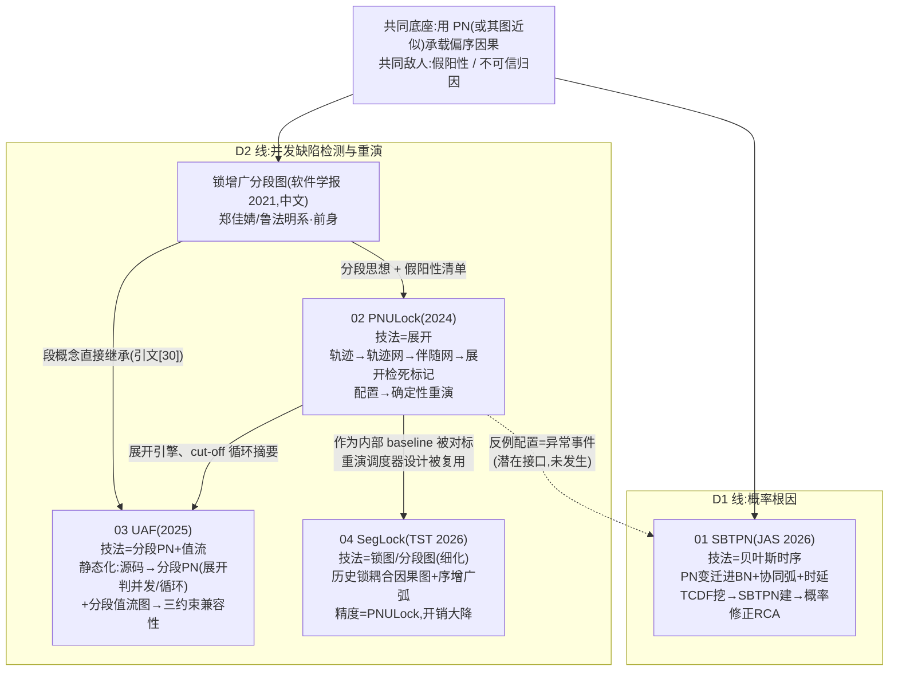

# 鲁组 PN 方法族四篇联卷拆解(2026-08-13)

> 用途:2026-09-10 进鲁法明组前的知识底座。四篇同属 PN 方法族,分属 D1(概率根因)与 D2(并发验证)两条主线,联卷对比拆解。
> 依据:四篇 PDF 原文(/mnt/d/MyResearch/ 顶层)+ 鲁侧图 LU_SIDE_MAP.md(D1–D3 定位、T1–T4 挂载)。公式均按原文恢复;PDF 文本提取存在乱码处已尽力校对,以原 PDF 为准。〔08-22 抽验记录(TASK-20260821-001 W3 波):五个具体点位对照原 PDF 核验——4 处教学示例忠实原文(C1 死标记/算法5 链/段4标签串/Syn 区间),1 处真错已修(SBTPN 式3 符号 μ、阈值 η,详见 01 卡与 teaching 勘误注);全局声明据此收窄〕
> 阅读顺序建议:**04(最轻,入门 D2 概念)→ 02(D2 方法学底座)→ 03(D2 延伸到内存安全)→ 01(D1 概率线)→ 05(横向综合)**。

---

## 一、四篇总卡

| # | 文件 | 论文 | 刊/年 | 一作/通讯 | 主线 | 一句话 |
|---|------|------|-------|-----------|------|--------|
| 01 | `01_SBTPN.md` | SBTPN:多变量时序知识挖掘与 RCA | IEEE/CAA JAS 2026(13卷5期) | 王晓亮 / 鲁法明+周孟初 | **D1** | PN 变迁塞进 BN 建模 AND/OR 与催化/抑制协同效应,RCA 准确率超 SOTA 11%+ |
| 02 | `02_DEADLOCK_PNULOCK.md` | PNULock:PN 展开死锁检测与重演 | IEEE Access 2024(12卷) | 鲁法明 / 包云霞 | **D2** | 轨迹挖成 1-safe 轨迹网 + recover 伴随网,展开检死标记,配置导出确定性锁调度器一次重演 |
| 03 | `03_UAF_PN_VFG.md` | 分段 PN + 值流图并发 UAF 静态检测 | IEEE Access 2025(13卷) | 李珊珊 / 包云霞 | **D2** | 分段 PN 管控制流因果(含 lock/fork 耦合),分段值流图管源汇路径,三类约束兼容性判 UAF,胜 Canary/Saber |
| 04 | `04_DEADLOCKSEG_SEGLOCK.md` | SegLock:细化分段图+锁图死锁检测与重演 | Tsinghua Sci. Tech. 2026 | 鲁法明 / 袁贵元 | **D2** | 锁释放也当分段点 + 弧带轮次/序号 + 历史锁耦合因果图判环,精度持平 PNULock、开销降到 1/2–1/6〔⚠️ 08-24 勘误:该数字系原文宣称,其 Table 5 对标数据整列制表错位已确证,共享基准真实 1.70–6.35×（中位 2.76×）,宣称范围大体成立但名实错位——引用前必读 02b §〇.2 与 _audit_remediation_20260824/A4_pdf_verification.md〕 |
| 05 | `05_FAMILY_SYNTHESIS.md` | —— 横向对比 + 方法论 DNA + 进组准备清单(核心交付) | | | | |

## 二、方法族谱系:四条技法怎么互相衔接

四篇覆盖鲁组的四条技法:**展开(unfolding)、锁图/分段图(lock/segmentation graph)、值流(value flow)、贝叶斯时序(BN + time PN)**。它们不是四个孤岛,而是一棵有明确演化顺序的树:

衔接关系逐条说明:

1. **分段图 → 展开(2021 → 02)**:组内 2021 年中文论文(锁增广分段图,本卷 03 篇引文 [30]、04 篇作者郑佳婧的硕士线)确立了"按因果依赖分段消假阳性"的问题清单;PNULock 用 PN 展开重做同一问题——每次锁语句执行独立成变迁,信息零丢失,代价是状态爆炸。
2. **展开 → 值流(02 → 03)**:UAF 篇把 PNULock 的展开引擎从"动态轨迹网"移植到"静态分段 PN"上,用 occurrence net 判并发/冲突、用 cut-off 事件做循环摘要;再叠加值流图承载内存语义(free→use 源汇路径)。**展开管"执行序可能性",值流管"数据到达性",两者兼容性判定 = 检测**。
3. **展开 → 细化锁图(02 → 04)**:SegLock 是对 PNULock 的"轻量化重构"——用弧标签(轮次 m + 序号 k)替代"每执行一变迁",用历史锁耦合因果图判环替代展开配置枚举,精度持平、时间内存大降。**组内自己完成了重模型与轻模型的对照实验**(04 篇 Table 5/6 直接对标 PNULock)。
4. **D2 与 D1 的闭环(02/03 → 01,尚未发生)**:鲁侧图 §1 判定"D1+D2 闭环(展开找缺陷 + 概率定根因)无人占据"。技术接口:D2 输出的反例配置/源汇路径 = 离散异常事件,喂给 SBTPN 作为"异常变量",用式(6)–(8)做概率归因。四篇论文互引仅 03 引 02,**D1 与 D2 之间零互引——闭环是地图判断的机会,不是已有事实**。
5. **重演是贯穿 D2 的公共资产**:02 与 04 共用同一套 CalFuzzer 探针调度(lockBefore/lockAfter/unlockAfter + park/unpark)、同一套跨运行 ID 映射、同一个"真/假/未知"三分判定。这是组内最工程化、复用度最高的模块。

## 三、文件清单

- `README.md` —— 本文件(总卡 + 谱系)
- `01_SBTPN.md` —— D1:问题-方法(九元组、式 3–8)-实验(Syn/TE)-局限-进组视角(T4)
- `02_DEADLOCK_PNULOCK.md` —— D2:轨迹网/伴随网/展开/确定性重演-局限-进组视角(T1)
- `03_UAF_PN_VFG.md` —— D2:分段 PN/分段值流图/三约束兼容性-局限-进组视角(T3)
- `04_DEADLOCKSEG_SEGLOCK.md` —— D2:锁增广分段图/序增广锁图/历史锁因果图/两阶段重演-局限-进组视角(T1)
- `05_FAMILY_SYNTHESIS.md` —— **核心交付**:横向对比表、鲁组方法论 DNA、进组准备清单(5 个面谈话题 + 3 个问学长的问题)
- `REMEDIATION_PLAN_20260824.md` ＋ `_audit_remediation_20260824/A4_pdf_verification.md`〔08-24 整改窗 TASK-20260824-007〕:质量整改方案书 v3(R1-R4+E/F 组)＋原 PDF 三处终核报告(U1 销项正本,含 Table 5 错位 8/8 判定与卖点链 A 案终口径);`repro/C0_repo_check_dod_preregistration.md`(R3 前置:三仓核查+DoD 预注册);`bridge/D1D2_closure_bridge.md`(F1:D1×D2 闭环卡,三命题+竞对核查,待拍板)

---

## 四、2026-08-15 付费墙三篇增补战役（四篇→七篇）

付费墙三篇（SBPN/EdgeIM/MHP）当日由用户提供入档（见 `../MANIFEST.md` 2026-08-15 节），主窗＋21 路 Agent 四波完成拆解/复现/bridge/教学全链路。**01-05 与 teaching/ 保持 08-13 终态未动**；新读者从 `09_FAMILY_SYNTHESIS_V2.md`（七篇综合，取代 05 作为最新总览）入手。

| 类型 | 文件 | 状态 |
|---|---|---|
| 主拆解 | `06_SBPN.md`（543 行）/ `07_EDGEIM.md`（314 行）/ `08_MHP.md`（408 行） | 6 点框架＋公式文本恢复＋数字回 PDF；G1 页锚 2 处已修 |
| 独立批判 | `06b/07b/08b_*_kg_critique.md` | 知识图谱＋四审视；三篇模拟审稿均判大修 |
| 复现 | `repro/{SBPN,EDGEIM,MHP}_plan.md`＋`repro/{sbpn,edgeim,mhp}/` | **三篇全 PASS**（SBPN 29/29 数值锚；EdgeIM 带三注记，precision 反向已归因；MHP 21 对零差＋DRB005 4/4）；PASS=公式/机制层验证，非论文主实验复现（见各 README 口径声明） |
| bridge | `bridge/{SBPN_T4,EDGEIM_T2,MHP_T1T3}_bridge.md` | 可开题（附三条件）/ B 档增强模块 / 中档归 T3；44 条竞对经 G4 复核 97.5% 通过 |
| 综合 V2 | `09_FAMILY_SYNTHESIS_V2.md`（286 行） | 七篇谱系（新增 9 边）＋组 DNA 修订＋进组清单 V2（8 话题＋5 问） |
| 教学包 | `teaching_paywall3/`（五件 18 题） | TEACHING-AWAITING-USER |
| 审计 | `_audit_paywall3/G{1,2,3,4}_*.md` | G1 数字 0 错（页锚 2 处 P0 已修）；G2 0 error；G3 P0=0 内部 GO；G4 三卡结论站得住 |
| 战役档案 | `_launch/LAUNCH_PACKAGE_20260815.md`（分工/DoD/Agent ID 全记录）＋`CHECKPOINT-20260815.md`＋`99_USER_TODO_20260815.md` | 收口完成，④教学与提案差量待用户 |
| 框架卡·L1 | `01b_SBTPN_sixpoint_kg_critique.md`（52.7KB） | ✅ 已落（08-22 补齐波）：六点＋张力＋KG＋四审视；特命＝SBPN/SBTPN novelty 首发权切割，归属表 10 行全部双页锚；R7 注入吸收；存疑 S1-S5 入卡附 |
| 框架卡·L2 | `02b_PNULOCK_sixpoint_kg_critique.md`（46.5KB） | ✅ 已落（08-22）：同构四节；特命＝展开路线剩余价值推演，可检验命题甲/乙/丙＋两分支裁定；与 04 卡 Table 5/6 对照带双方页锚 |
| 框架卡·L3 | `03b_UAF_sixpoint_kg_critique.md`（42.9KB） | ✅ 已落确认（08-15 窗口2 原有，本次未动） |
| 框架卡·L4 | `04b_SEGLOCK_sixpoint_kg_critique.md`（36.0KB） | ✅ 已落（08-22）：特命＝组内路线之争＋「够用就好」裁剪哲学；等价性边界为构造性分析（证明思路＋漏报构造样例）；独立裁定"不退役、转岗" |
| 后续收口波·两张拍板表 | `_review_20260815/00_SUMMARY.md`（43.6KB，改进总表 98 行 A22/B27/C7/U42）＋`fusion_sun_20260815/00_SYNTHESIS.md`（32.7KB，融合排序＋9 类拒因避雷矩阵） | ✅ 已落（08-22）；内容验收走 G 级独立审计（`_audit_finishing_20260821/`），过后交用户拍板 |
| 窗口2完整档案包 | `_archive_window2_20260815/README.md` | 窗口2 全量档案（总结/日志/进度/所属线/架构/计划/手册/交接 11 件＋08-18 验收报告），断线恢复第一读 |

**读旧卡注意（2026-08-15 后，文案源＝R7 §三.3）**：

> ① `01_SBTPN.md` §2 所述协同弧/概率标记/AND-OR 挖掘/建模论证首发于 SBPN(2024)（对照 `06_SBPN.md` §9 差分），其 §5 的 T4 借力路径已由 `bridge/SBPN_T4_bridge.md` §0 改道（SBPN 静态截面直搬，无等间隔时序障碍，但需新造反演层）；② `05_FAMILY_SYNTHESIS.md` §3.1 话题 2 与 §3.2 问题 3 中"SBTPN 要等间隔时序"的障碍表述已过时，面谈话术以 09 §5 为准；③ `05` 共同局限 5"仅 SBTPN 有代码仓"已修正（SBPN 亦有仓，见 09 共同局限 5）；④ `04_DEADLOCKSEG_SEGLOCK.md` 的"两套载体"与"路线之争现行答案"表述读作动态侧结论，静态侧对照见 `08_MHP.md` §9；⑤ 各旧卡"见面礼问题"一律以 09 §5.1/§5.2 的升级版为准。
