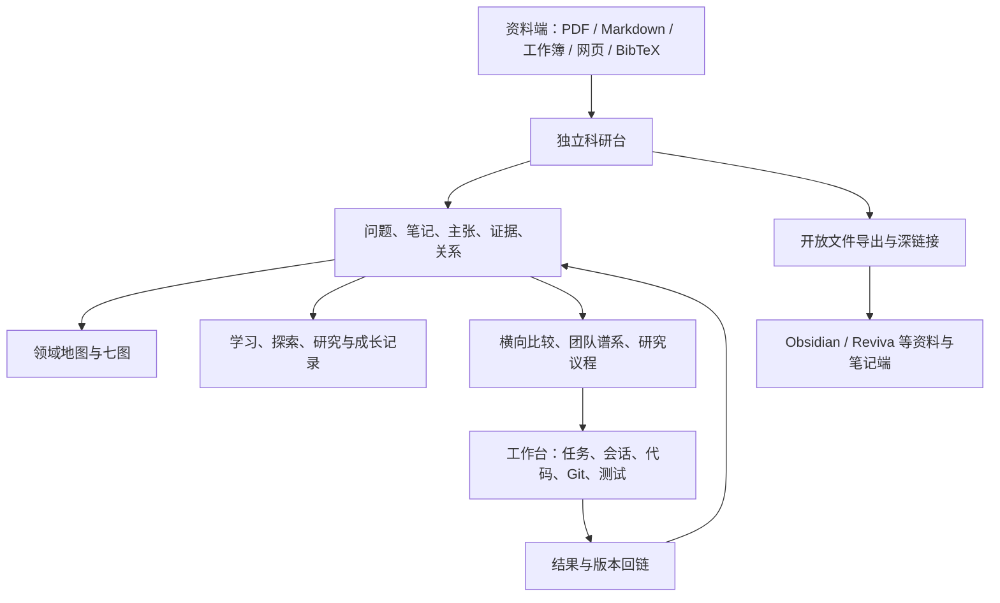

# 科研台详版：当前版本、进度、整体设计、板块细节与资产清单

> 2026-09-10 导航首版取舍已确认：B／A／B／B／C。当前施工交接见[Sol执行方案](../../../../decisions/2026-09-10__research__research-desk-navigation-sol-execution-plan.md)。本篇仍为09-08资产快照，不代表全库状态已刷新到09-10；软件尚未实施。

> **架构更新（2026-09-08）**：用户提出科研台、工作台、资料、项目和日志解耦。原 v0.2 的同仓模块方案已由[解耦架构 v0.3](../../../../decisions/2026-09-08__research__research-system-decoupled-design-v0.3.md)取代为待审设计；本篇资产盘点仍有效，但目录草图和部署顺序以 v0.3 为准。

> **画布功能更新**：Map／菌丝网络不再只是内容库目录；任务线、拖拽任务树、跨线菌丝连接、人—Agent 协作板和工作台联动由[Canvas 需求 v0.4](../../../../decisions/2026-09-08__research__research-canvas-graph-requirements-v0.4.md)单独定义。

日期：2026-09-08（Asia/Taipei）。整理：Codex 主窗口，TASK-20260908-002。性质：根据现有文件及用户本轮澄清形成的详细现状与设计总览；本文版本为本次盘点修订版，不为科研台产品新增发布版本。

**科研台的目标，是承载长期学习与科研体系的独立研究空间。领域地图、科研菌丝网、七图、文献与笔记、问题形成、方法操作、个人能力成长都属于它的范围。** 鲁组准备、EdgeIM 和自主研究是目前具体使用场景。用户本轮已明确菌丝网准备放进科研台；这一方向在本文按确认的需求记录。

**当前实物是分散但丰富的研究资产、既有地图工具和一组独立科研台设计稿；尚无已验收的独立科研台统一产品。** 不能把工作台 v2、W5 v0 地图浏览器、MASTERY_GATE v2.2 组合成一个虚构的“科研台 v2.2”。

配套：[待整合体系、构想与近期任务详版](04_待整合的学习科研体系_构想与近期任务详版.md)保存构想演进与接入缺口；[科研任务具体情况详版](05_科研任务盘点与具体情况详版.md)逐项解释研究工作。旧 [全景盘点](01_科研台全景盘点_含Map.md)及 [近期材料清单](02_近期科研与进组材料清单.md)保留作第一版文件核对记录。

**搭建审查历史：**[08 审查与融合取舍](08_科研台搭建审查与融合取舍.md)补核 W5、KB、辅助工具与 LearnGraph 的实际接入边界；[融合设计 v0.2](../../../../decisions/2026-09-08__research__research-desk-fusion-design.md)是早期技术提案，其同仓方案已被后续解耦方向替代。当前首版取舍见本页顶部执行方案；学习方式沿用06中用户确认的论文＋AI带学。

## 1. 当前版本与进度：逐个对象看

| 对象 | 当前可以确认的版本／阶段 | 已有成果 | 还缺什么 |
|---|---|---|---|
| 独立科研台产品 | 09-05 独立方向确认；架构 NOT-FROZEN | 产品职责、对象主链、桥接方向、P0 示例 | 最终设计、技术栈、实现与独立运行验收 |
| 三源改进提案 | 09-05 PROPOSED / DESIGN-ONLY | 来源、操作符、学习记录及六阶段路线 | 与后续六份材料、菌丝全局构想的完整映射 |
| 阶段 0 语义合同 | PROPOSED / USER-REVIEW-PENDING | 字段、ID、来源锚点、状态及验收条款 | 关键语义确认与后续只读来源库 |
| 领域地图 | GRAND_MAP v1；W1–W7 文档资产 | 全域、细分、交叉、团队、评审、方法、开源与提案 | 更新资料回流、旧判断刷新和统一对象化 |
| W5 数据化 | v0 schema＋解析器＋YAML/BibTeX/HTML 实物 | 现有条目可由文件读取 | v1 cells/watchlist/reconciliation/邻域图实施 |
| 七图 | 七视角、五份主文件及模板 | 知识、方法、谱系、迁移、能力、适配、轨迹 | 一份主记录支撑所有视图及个人证据积累 |
| 学习执行包 | MASTERY_GATE 更新记录到 v2.2 | 整篇诊断、六门、四论文镜头、五层导航 | 新课堂证据、外部 T/R/F/E 方案与原门限对齐 |
| 长期整合版 | 文件正文 v1.1 | 学习调整、研究判断、开放探索、七视角、CCF 对照 | 正式纳入科研台资料／记录／导航 |
| 专项执行附件 | 文件名 v1.0、正文 v1.3 | T/R/F/E 四项工作与联系准备 | 各线实际完成证据和仓内接续状态 |
| 第二研究线附件 | 正文 v1.1 | P/O 入口、文献地图、试探构造 | 本人试探、问题卡、验证与自己的技术产物 |
| 工作台 v2 WP0 | 09-01 回执 TECH-PASS，外部门未闭合 | 隔离实现与测试回执 | 后续审查、采收和 live 门需按原任务核实；不是科研台完成度 |

版本依据：[独立设计](</mnt/d/MyResearch/MAS_Safety_Project/progress/decisions/2026-09-05__research__independent-research-desk-design-alignment.md>)、[三源提案](</mnt/d/MyResearch/MAS_Safety_Project/progress/decisions/2026-09-05__research__research-desk-three-source-improvement-proposal.md>)、[阶段 0](</mnt/d/MyResearch/MAS_Safety_Project/progress/decisions/2026-09-05__research__research-desk-stage0-semantic-contract.md>)、[训练包](</mnt/d/MyResearch/MAS_Safety_Project/learning/training/lu-edgeim-algo1/MASTERY_GATE.md>)、[长期整合版](</mnt/d/Edge下载/学习与科研体系-整合版.md>)、[专项 v1.3](</mnt/d/Edge下载/鲁组进组准备-执行细化-v1.0-2026-09-08 (1).md>)、[双入口 v1.1](</mnt/d/Edge下载/第二条研究线-方向恢复与双入口试探-2026-09-08 (1).md>)。

目前没有可以据以计算统一完成百分比的冻结功能清单。准确进度是：**研究资产层已形成；产品边界已有确认；对象与接口仍在设计；独立产品闭环尚待建设。** 本轮是文件及设计状态核对，没有新做应用运行验收。

## 2. 科研台总体定位与系统关系

### 2.1 长期体系需要它承载什么

科研菌丝网的核心是让问题、概念、方法、来源、例子、结果和研究判断相互连接，并在实际学习、探索与研究中持续修正。一个节点可以向前置、下游用途、横向替代、历史前身、一般机制、反例和下一问题生长。跨问题的联系可以来自共享的方法动作、反例、工具、评价协议与真实证据。

它还要支持更宽的认识：领域细分与竞争路线、代表团队的纵向脉络、工业约束、开源社区、个人能力和研究身份如何变化。AI 的职责包括主动指出用户还不知道的问题和维度；收录一个方向不要求立即给 EdgeIM 服务。长期目标、近期投入、已测能力、已证实结论分别表达。

来源：[原会话第 26、29–31 轮](</mnt/d/MyResearch/MAS_Safety_Project/research/papers_lu/session-archive-20260906/ONLY_PAPER_FULL_SESSION_20260906.md>)；[训练体系正文 v0.3](</mnt/d/Edge下载/科研学习与训练体系-v0.1.md>) §2、8–11；[整合版](</mnt/d/Edge下载/学习与科研体系-整合版.md>) §6–7。详细演进及具体生长例子见配套构想篇。

### 2.2 科研台、工作台与资料端



这张图表达目标关系。当前独立科研台及桥接未完成，图中的箭头不能读为已上线的数据流。

| 位置 | 应保存的内容 | 与别处怎样关联 |
|---|---|---|
| 原始材料层 | 原论文、网页快照、工作簿、个人原记录 | 摘录回到原位置和版本 |
| 科研记录层 | 问题、笔记、主张、证据、关系、比较和决策 | 通过稳定 ID 引用源件及执行事实 |
| 学习记录层 | 学习会话、本人产物、提示、反馈、修正、复测 | 七图和能力摘要引用同一记录 |
| 工作台 | 任务、CLI/Agent 会话、工作树、运行、测试和交付 | 研究问题提出任务；真实结果回到 Evidence |
| 派生层 | 搜索索引、图布局、聚合和筛选 | 从正文和关系重建，不能替代原件 |

独立是产品与研究数据边界的方向；是否必须独立仓库、进程、数据库，以及基础组件如何共用，仍属于设计未决项。

## 3. 各板块详细设计与实际基础

以下逐项说明目标行为、现有载体及未完成部分。“拟”表示已有设计或根据明确需求整理出的待实现行为。

### 3.1 研究总览与接续入口

总览要能回答：现在关注什么问题、正在读什么、有什么判断待核、上一次留下什么、下一步为何值得做。活动任务旁应能看到相应问题、来源与证据，长期观察也应有入口。

当前靠项目卡、TODO、训练 BRIEF、handoff 和地图导航组合使用；它们的日期与状态不总同步。尚缺独立科研台中统一的接续工作面。拟从主记录派生“近期问题／阅读队列／待核事项／近期决定”，不要求用户重复填写同一进度。

### 3.2 资料收件箱与来源库

输入包含 PDF、Markdown、网页、Git 仓库、BibTeX 和工作簿。工作簿三源提案记录 18 个可见工作表，Sheet1 为 20 列论文／资料表，其余多为摘录与反思；这属于 09-05 读取回执，本轮没有重做工作簿逐单元格审计。

来源浏览拟支持：工作表与单元格、Markdown 章节与行、PDF 页码，原文与笔记并看。每个摘录保存来源、位置、上下文和抽取批次。当前已有原件与静态目录；只读导入器、统一 source_index、版本差异浏览尚未验收。来源库可收个人感想，但感想应保留为个人记录。

### 3.3 搜索、发现与观察

目标搜索范围为论文、笔记、问题、方法、人物、团队和关系。检索结果应能定位到具体页／段，指出来源和已知版本；按问题、方法动作、替代表示和否定既有假设的工作扩展搜索。

现有基础是文件检索、map 索引、surveys、radar 与维护 runbook。全文索引方案、语义检索选型、增量摄取与独立搜索界面尚未落定。三项研究观察自动化是另一组外部配置记录；尚未核实它们当前在线状态或与科研台的连接。

### 3.4 文献库、阅读与引用

文献应有论文身份、作者、年份、出处、版本、原文、阅读记录和与问题的关系。同名文件、副本、补充材料和失败下载应可区分。一次阅读可以产生摘录、对象解释、方法比较或问题；阅读状态不等于本人掌握。

现有鲁侧／邻域 11 篇论文及配对拆解、孙侧论文库、综述 PDF 与 BibTeX 构成基础。逐篇配对和缺件见任务篇。拟把主 manifest、增补 manifest、PDF 与拆解连接起来，并让任何需要引用的主张回到原文。统一元数据和多版本浏览仍未产品化。

### 3.5 笔记、Claim、Evidence 与审阅

拟保留四个可区分的动作：摘原文、写自己的理解、提出可检查的主张、连接支持或反驳证据。一个主张可关联多个来源、实验或反例；证据不足时保留具体未知。

现有正文拆解、批判件、六点卡、实验回执和迁移卡已在做部分工作。Review Inbox 方案集中显示候选关系、待确认主张、来源冲突和缺锚点记录，操作包括确认、收窄、质疑、拒绝和暂存。尚缺统一对象、版本与审阅界面。AI 的总结应有出处和候选状态。

### 3.6 领域生态 Map

目标是看清细分问题、技术路线、前后继、学术与工业团队、开源工具、现实压力和新瓶颈。既有 L0/L1/L2、W1–W7、radar 和 matrices 是直接资产。需要把当前论文和研究发现回流到旧地图，并能按关系类型、时间和证据筛选。

领域地图有自己的观察价值；EdgeIM 是一个局部坐标。第 30 轮讨论的 Problem、Genealogy、Method、Actor、Pressure、Frontier/Residual 加 Me 是领域开图提案；它与训练七图有重叠但不是同一套命名，尚须映射，不能加成 14 本日常笔记。

### 3.7 七图、知识连接与学习记录

七图共同看同一批对象与会话：Knowledge 看概念依赖；Method 看方法空间；Genealogy 看来源与改动；Transfer 看可迁移与失效；Competency 看有产物的表现；Identity/Fit 看实践中的偏好与环境；Trajectory 看跨时间的变化。

当前七视角由五文件承担，另有统一笔记模板。设计上，一次学习保存问题、必要前置、预测、动作、本人产物、提示、反馈、修正、证据状态、复测与下一步；视图引用它。个人能力表仍含空模板，不能据其存在生成已测能力画像。

### 3.8 研究操作符与迁移案例

操作符是可复用的研究动作，例如何时换表示、优化后怎样重新测量、怎样检查反馈环境、怎样显式保存关键语义。案例册已有八张卡；详细目录在构想篇。

拟从一个真实问题选择动作，展示触发条件、原机制、可借动作、失效边界和最小检查，再形成 TransferCard。迁移卡要写对应与不对应、需要的观察、预测、检验和当前证据。当前为文档／模板资产，尚无已建成的 Operator Bench。

### 3.9 横向比较

比较对象包括论文、方法、团队、实验设置与指标。比较项由具体问题决定：任务、输入、假设、表示、保留／丢失、保证、成本、评价和失败情形。论文自报、个人复算与推断要能并排识别。

已有四矩阵、家族合成、四论文比较、BR-14 和开源版图。统一单元格对象仍未实现。新增 JOS 拆解也未全部进入旧家族合成；不能仅凭年份相继就画成直接继承链。

### 3.10 人物、团队与时间线

要从代表性问题和路线取样，包含不同规模学术组、工业研究／工程团队与开源社区。人物、机构、作者合作、论文引用、机制继承、主题相似分别记关系，并保留有效时间。

当前有 W1/W2、radar 团队卡和 teams/schools 数据。旧会话的团队判断是待核线索。拟支持团队纵向变化与横向比较互跳；统一人物消歧、隶属变化和时间轴未验收。

### 3.11 研究议程、实验与资产复用

议程记录具体问题、为什么值得做、已有办法、竞争解释、证据方案和继续／调整／停止的依据。学习、探索、研究三个循环都可进入；只有需要执行的动作送到工作台。

现有 proposals、Bridge 规划、T/R/F/E、P/O 和实验目录可复用。成果应能继续作为工具、反例、生成器、评价协议或问题来源。科研台要记录“这次改变了什么判断、下次复用什么”，而不是按论文或任务数量判断研究成熟度。

### 3.12 导出、协作与共同思考界面

已有方向是 Markdown/PDF/BibTeX/JSON 导入导出及稳定链接，连接工作台、Obsidian/Reviva。三条主数据方向是来源文件→科研索引、研究决策→工作台任务、执行结果→证据。接口失败或来源修改时的冲突处理仍属设计。

长期交互另有平板、电子批注和 AI 共用白板构想：方便回溯讨论，在同一画布放原文、关系、推导和问题。第 31 轮用户提出可以直接共同使用有 AI 的白板，避免先做复杂设备互通。当前是体验需求与候选方式，未形成已采纳工具或科研台白板模块。

### 3.13 已提出的工作面与交互细节

三源提案已给出以下界面安排，当前都按设计记录保留；尚无对应的独立科研台界面验收。

| 工作面 | 用户打开后看见什么 | 主要动作 | 输出回到哪里 |
|---|---|---|---|
| 来源三栏面 | 左侧来源／工作表／章节，中间原文或 PDF，右侧摘录与笔记 | 选择具体位置，保留原文，写个人观察或候选问题 | Excerpt、Note 与原来源锚点 |
| 问题／论文面 | 对象正文与笔记；相关证据、未决项、操作符和下一步 | 围绕一个问题阅读、比较和修改判断 | Question、Claim、研究记录 |
| 证据审阅面 | 待核主张、AI 候选边、来源版本或同步冲突、缺定位记录 | 确认、收窄、质疑、拒绝、暂存并留下依据 | 主张状态与关系修订 |
| 地图面 | 同一记录的知识、方法、谱系、迁移、能力等视角 | 切换视图，按关系类型／时间／证据筛选，点边回来源 | 共同对象与来源；图布局可重建 |
| 操作符工作面 | 触发问题、可借机制、不能照搬处、最小检查与证据上限 | 选问题与操作符，形成一张迁移草稿 | TransferCard、学习或研究会话 |
| 比较与团队面 | 可比较方法及带来源的单元格；人物、机构、论文和有效时间 | 横向比较、沿时间回溯、打开证据 | Comparison、Team、Relation、研究决定 |

P0 要走通一篇来源、一条问题与证据关系及一次导出；完整地图、多团队时间线和协作画布仍需按阶段设计。这个最小使用范围不会删掉长期体系中的其他板块。

新增来源补记：[ChatGPT 分支导出](</mnt/d/Edge下载/ChatGPT-分支_·_重构进组计划.md>)末轮再次提出基础线怎样组织、菌丝网怎样建设。已有概念图与方法库要接到连续单元、本人作答、反馈、理解变化和复用；导出中的“讲义定顺序、问题作入口、视频补示范”仍是安排倾向，尚无完整交付。它补充学习工作面的真实需求，不构成新产品实现回执。

## 4. 对象、关系与状态细节

依据阶段 0 合同及三源提案整理。下面是设计字段，不表示数据库已有这些表。

| 对象 | 关键内容 | 典型连接 |
|---|---|---|
| Source / Paper | 稳定身份、来源位置、类型、捕获时间、正文版本、定位方式 | 原文→摘录；论文→作者／团队／问题 |
| Excerpt / Note | 原文、上下文、定位；个人理解与外部引文区别 | 来源→笔记→候选主张 |
| Question / Claim | 问题或可检查判断、主体、范围、假设、当前状态 | 方法、支持／反驳证据、待解决处 |
| Evidence | 原文位置、推导、运行或反例、实际版本、适用范围 | 支持／限制／反驳某条 Claim |
| Relation | 类型、方向、来源、时间、状态、创建者与修订 | authored_by / cites / supports / analogous_to 等 |
| Comparison | 比较问题、对象、维度、值、量纲和依据 | 研究判断和后续决策 |
| Operator / TransferCard | 触发、机制、对应／不对应、检验与证据上限 | 方法→目标问题→检查→关系更新 |
| LearningSession | 产物、提示、反馈、修正、能力观察与复测 | 同一记录连接七图 |
| Decision / Experiment | 选择理由、替代方案、输入与判据、继续条件 | 工作台执行→真实结果回链 |
| Person / Team | 身份、隶属、合作、贡献、时间与来源 | 论文、方法、问题族和工业案例 |

稳定 ID 拟用命名空间标识，例如 `paper:edgeim-2025`；文件路径只负责定位。来源变化应能保留版本，关系不因地图布局变化丢失。阶段 0 原稿提出来源哈希和短哈希消歧；这些是待确认的导入合同设计，本轮不额外给全部资产建立哈希工程。

状态也需区分：`draft/candidate/confirmed/disputed/rejected/archived` 描述研究记录；`UNKNOWN` 描述证据不足；`scheduled/in_progress/awaiting_feedback/retest/closed` 描述学习调度；“能解释／能改条件／能找反例”等描述有范围的能力表现。它们不能合成一个百分比。

### 4.1 一条实例怎样穿过各板块

以“日志特征变化会不会影响某个下游发现过程”为示例：打开 EdgeIM 原文→记录 Algorithm 1 与发现接口→提出带条件的问题→连接已有计数例子→核查具体下游变体是否读权重→与一个可比方法对照→决定需要手算、查实现还是实验→把实际结果回链→更新方法图及学习记录。

这条示例用于解释对象流动。现有计数讨论不能直接推出最终模型变差；旧采样实验仍冻结。P0 可以选用这个问题验证工具流程，研究本身是否值得开展另由问题与证据决定。

## 5. Map 全范围资产与数据版本

这里有三类现成入口：**研究内容地图 `research/map/`、七个研究／学习视角、全工作区资产快照 `/wbmap`**。前两者属于同一学习科研地图体系，统一设计需将它们接到共同记录；`/wbmap` 用于定位跨仓资产。当前文件分散，不意味着要另建互不相干的系统。

### 5.1 research/map：L0／L1／L2 与 W1—W7

总入口：[research/map/README.md](</mnt/d/MyResearch/MAS_Safety_Project/research/map/README.md>)；给本人使用的入口：[research/map/USER_GUIDE.md](</mnt/d/MyResearch/MAS_Safety_Project/research/map/USER_GUIDE.md>)；结构：[research/map/SCHEMA.md](</mnt/d/MyResearch/MAS_Safety_Project/research/map/SCHEMA.md>)；边界：[research/map/SEARCH_BOUNDARY.md](</mnt/d/MyResearch/MAS_Safety_Project/research/map/SEARCH_BOUNDARY.md>)；更新记录：[research/map/CHANGELOG.md](</mnt/d/MyResearch/MAS_Safety_Project/research/map/CHANGELOG.md>)。

| 层／波次 | 具体资产 | 实际覆盖 | 状态与注意点 |
|---|---|---|---|
| L0／W3 | [research/map/GRAND_MAP.md](</mnt/d/MyResearch/MAS_Safety_Project/research/map/GRAND_MAP.md>)、[research/map/W3_L0_global/L0_global_partition.md](</mnt/d/MyResearch/MAS_Safety_Project/research/map/W3_L0_global/L0_global_partition.md>)、[research/map/W3_unified/UNIFIED_MAP.md](</mnt/d/MyResearch/MAS_Safety_Project/research/map/W3_unified/UNIFIED_MAP.md>) | 全域分区、代表作、统一坐标与待核池 | 三处都在；主导航与伴随卷并存，不能当三个独立完整系统 |
| W1 鲁侧 | [research/map/W1_lu_side/LU_SIDE_MAP.md](</mnt/d/MyResearch/MAS_Safety_Project/research/map/W1_lu_side/LU_SIDE_MAP.md>)；同目录 A/B/C | Petri net、process mining、并发验证三个版图 | 文档资产齐；“鲁本人／合作网络／邻域方法”需要分开标注 |
| W2 孙侧 | [research/map/W2_sun_side/SUN_SIDE_MAP.md](</mnt/d/MyResearch/MAS_Safety_Project/research/map/W2_sun_side/SUN_SIDE_MAP.md>)；同目录 A/B/C | LLM-MAS safety、团队与 OpenReview、LLM safety 父级版图 | 文档资产齐；旧 USER_GUIDE 仍写“进行中”，应读总纲与当前实物 |
| L2 交叉带 | GRAND_MAP、[research/bridge_scan_2026-08-12/SYNTHESIS.md](</mnt/d/MyResearch/MAS_Safety_Project/research/bridge_scan_2026-08-12/SYNTHESIS.md>)、proposals | 鲁／孙／companion 方法交叉、竞争关系与候选问题 | 是带检索范围的历史判断，不是当前“无人做”的证明 |
| W4 | [research/map/W4_rejection_intel/](</mnt/d/MyResearch/MAS_Safety_Project/research/map/W4_rejection_intel>) | 两份公开评审元分析，转为实验与论证检查项 | 已有历史材料；增量评审与事实刷新另有计划 |
| W5 数据化 | [research/map/data/](</mnt/d/MyResearch/MAS_Safety_Project/research/map/data>)、[tools/scripts/map_to_yaml.py](</mnt/d/MyResearch/MAS_Safety_Project/tools/scripts/map_to_yaml.py>) | YAML、BibTeX、HTML explorer | v0 文件存在；v1 实施仍在 BR-11 |
| W5 v1 方案 | [research/map/w5_design_sprint_20260813/W5_V1_PLAN.md](</mnt/d/MyResearch/MAS_Safety_Project/research/map/w5_design_sprint_20260813/W5_V1_PLAN.md>) | cells、watchlist、reconciliation、邻域图 | 设计资产存在，不等于各数据对象和界面已实现 |
| W6 craft | [research/map/W6_craft/CRAFT_MANUAL.md](</mnt/d/MyResearch/MAS_Safety_Project/research/map/W6_craft/CRAFT_MANUAL.md>)；A/B/C/D、验收模板与回执 | 科研训练、代码 review、正确性、debug、实验、信息与 taste | 领域专用方法库已有；与通用方法论互补 |
| W7 companion | [research/map/W7_companion_side/COMPANION_SIDE_MAP.md](</mnt/d/MyResearch/MAS_Safety_Project/research/map/W7_companion_side/COMPANION_SIDE_MAP.md>) | 关系型 agent 安全第三侧翼、C①—C⑤、T5 关联 | 总纲重复登记两次 W7，实际同一目录与主文件，不重复计数 |

### 5.2 配套地图资产也在范围内

| 子系统 | 入口与清单 | 用处 |
|---|---|---|
| 四张比较矩阵 | [research/map/matrices/conformance-lane-comparison.md](</mnt/d/MyResearch/MAS_Safety_Project/research/map/matrices/conformance-lane-comparison.md>)、[research/map/matrices/shield-lane-comparison.md](</mnt/d/MyResearch/MAS_Safety_Project/research/map/matrices/shield-lane-comparison.md>)、[research/map/matrices/fault-panorama.md](</mnt/d/MyResearch/MAS_Safety_Project/research/map/matrices/fault-panorama.md>)、[research/map/matrices/cross-scan.md](</mnt/d/MyResearch/MAS_Safety_Project/research/map/matrices/cross-scan.md>) | 一致性检查／shield／故障／交叉扫描 |
| 团队动向 | [research/map/radar/teams/README.md](</mnt/d/MyResearch/MAS_Safety_Project/research/map/radar/teams/README.md>)及团队卡 | 人、机构、工作与时间线；定期复查，不用模糊“相关”边替代关系类型 |
| 月度雷达 | [research/map/radar/2026-08-14_adhoc_scan_delta.md](</mnt/d/MyResearch/MAS_Safety_Project/research/map/radar/2026-08-14_adhoc_scan_delta.md>)、[research/map/radar/signal-lights-2026-08.md](</mnt/d/MyResearch/MAS_Safety_Project/research/map/radar/signal-lights-2026-08.md>)、[progress/runbooks/research-map-maintenance.md](</mnt/d/MyResearch/MAS_Safety_Project/progress/runbooks/research-map-maintenance.md>) | 检索范围、零命中边界、竞争变化、改判条件 |
| 综述库 | [research/map/surveys/README.md](</mnt/d/MyResearch/MAS_Safety_Project/research/map/surveys/README.md>)、[research/map/surveys/SURVEY_LEDGER.md](</mnt/d/MyResearch/MAS_Safety_Project/research/map/surveys/SURVEY_LEDGER.md>)、[research/map/surveys/PLAN_survey_gapfill_202609.md](</mnt/d/MyResearch/MAS_Safety_Project/research/map/surveys/PLAN_survey_gapfill_202609.md>) | cards、PDF、crosswalk、对撞、T5/OE1 证据包与九月补缺计划 |
| 开源版图六簇 | [research/map/oss_landscape/SYNTHESIS.md](</mnt/d/MyResearch/MAS_Safety_Project/research/map/oss_landscape/SYNTHESIS.md>)；C1—C6 | PM、conformance、PN tools、agent safety、传播归因、formal×LLM |
| 开源实践与接线 | [research/map/oss_landscape/GUIDE_r_window_nine_repo.md](</mnt/d/MyResearch/MAS_Safety_Project/research/map/oss_landscape/GUIDE_r_window_nine_repo.md>)、[research/map/oss_landscape/MAINTENANCE_r_window_nine_repo.md](</mnt/d/MyResearch/MAS_Safety_Project/research/map/oss_landscape/MAINTENANCE_r_window_nine_repo.md>)、e2/ | 九仓单仓验证、跨工具链、遗留问题；单仓 PASS 不代表研究闭环成立 |
| 研究提案与对外出口 | [research/map/proposals/INDEX.md](</mnt/d/MyResearch/MAS_Safety_Project/research/map/proposals/INDEX.md>) | T1/T4、T2、T3、T5-companion、OE1、简历、一页纸、占位表；具体内容见科研任务详版 |
| 上游增量调研 | [research/bridge_scan_2026-08-12/](</mnt/d/MyResearch/MAS_Safety_Project/research/bridge_scan_2026-08-12>)、[research/deep_scan_2026-08-13/](</mnt/d/MyResearch/MAS_Safety_Project/research/deep_scan_2026-08-13>) | 老地图的来源池与合成依据，保留历史边界 |

本轮直接用 YAML 解析得到：`papers.yaml` **170 条**、`schools.yaml` **40 条**、`teams.yaml` **33 条**、`topics.yaml` **5 条**、`quicklooks.yaml` **19 条**。均与各自文件内 count 一致；生成时间字段仍为 **2026-08-14 05:35**。这些是不同对象类型的条目数，不能相加成“267 篇论文”，也不是全部已有 PDF 或全部已核验。

BR-11 当前仍列：cells.yaml 119 格、WATCHLIST/radar_hit、reconciliation、explorer 邻域图，以及实体分裂／团队词元／别名数量漂移三个修复项。当前 data/ 目录只有既有 YAML、schema、BibTeX、HTML；不能把 W5 v1 设计当成已做。旧数据内空白论断等残留问题仍需实施后的语义复核。

### 5.3 七图：七种视角，五份主文件

| 图 | 现有文件 | 记录什么 |
|---|---|---|
| 1 Knowledge | [learning/training/lu-edgeim-algo1/KNOWLEDGE_MAP.md](</mnt/d/MyResearch/MAS_Safety_Project/learning/training/lu-edgeim-algo1/KNOWLEDGE_MAP.md>) | 当前问题需要的概念与依赖，按任务扩展 |
| 2 Method Landscape | [learning/training/lu-edgeim-algo1/RESEARCH_MAPS.md](</mnt/d/MyResearch/MAS_Safety_Project/learning/training/lu-edgeim-algo1/RESEARCH_MAPS.md>)的 Map 2 | 方法问题、输入输出、保留／丢失信息、可比条件 |
| 3 Idea Genealogy | 同上 Map 3 | 来源可考证的继承与用户机制重建分开 |
| 4 Transfer | 同上 Map 4 | 对应点、不对应点、竞争解释、最小检查与证据上限 |
| 5 Competency | [learning/training/lu-edgeim-algo1/RESEARCHER_COMPETENCY_MAP.md](</mnt/d/MyResearch/MAS_Safety_Project/learning/training/lu-edgeim-algo1/RESEARCHER_COMPETENCY_MAP.md>) | 行为、产物、帮助条件与假阳性；不做人格评分 |
| 6 Identity & Fit | [learning/training/lu-edgeim-algo1/RESEARCH_IDENTITY_MAP.md](</mnt/d/MyResearch/MAS_Safety_Project/learning/training/lu-edgeim-algo1/RESEARCH_IDENTITY_MAP.md>) | 长期偏好、反向证据、问题与合作方式的匹配 |
| 7 Trajectory | [learning/training/lu-edgeim-algo1/RESEARCH_TRAJECTORY_MAP.md](</mnt/d/MyResearch/MAS_Safety_Project/learning/training/lu-edgeim-algo1/RESEARCH_TRAJECTORY_MAP.md>) | T0/T1/T2 工作样本、反馈、修正与支架撤除 |

配套入口是 [learning/training/lu-edgeim-algo1/START_HERE.md](</mnt/d/MyResearch/MAS_Safety_Project/learning/training/lu-edgeim-algo1/START_HERE.md>)、[learning/training/lu-edgeim-algo1/PAPER_MAP.md](</mnt/d/MyResearch/MAS_Safety_Project/learning/training/lu-edgeim-algo1/PAPER_MAP.md>)、[learning/training/lu-edgeim-algo1/CONNECTIONS.md](</mnt/d/MyResearch/MAS_Safety_Project/learning/training/lu-edgeim-algo1/CONNECTIONS.md>)、[learning/training/lu-edgeim-algo1/RESEARCH_NOTE_TEMPLATE.md](</mnt/d/MyResearch/MAS_Safety_Project/learning/training/lu-edgeim-algo1/RESEARCH_NOTE_TEMPLATE.md>)。PAPER_MAP 是论文阅读导航，不是“第八张能力图”；RESEARCH_MAPS 一份文件承担三图。

七图已具备记录结构和课程例子，Identity/Fit、Trajectory 等个人表格仍可见空模板。不能由“图都写好了”推出“本人画像与成长轨迹已经建立”。学习入口的新旧版本问题见科研任务详版 §2。

### 5.4 全工作区资产地图

[docs/workbench-map-20260822.html](</mnt/d/MyResearch/docs/workbench-map-20260822.html>) 是跨仓工作区全图快照；[tools/dashboard/hub/wbmap.py](</mnt/d/MyResearch/MAS_Safety_Project/tools/dashboard/hub/wbmap.py>) 为 `/wbmap` 提供读取与章节导航。冻结／退役约定见 [progress/handoff/2026-08-24__workbench-map-finalize__handoff.md](</mnt/d/MyResearch/MAS_Safety_Project/progress/handoff/2026-08-24__workbench-map-finalize__handoff.md>)。

它回答“资产、工具和工作区在哪”，不负责论文事实、个人能力或研究谱系。[WORKBENCH.md](</mnt/d/MyResearch/WORKBENCH.md>) 是板块注册表，许多心跳、旧截止日期仍停在八月；不能直接用它判断九月当前进度。

## 6. 五层导航怎样容纳菌丝网

既有导航写作：

```text
WORLD / FIELD
    ↓
RESEARCH MAPS
    ↓
ACTIVE TRACKS
    ↓
EVIDENCE / PRACTICE
    ↓
ARTIFACTS

所有层回链 SOURCES；CLAIMS / GOVERNANCE 横切各层；证据可反向更新地图。
```

**已落地的是文字导航与部分入口。** [learning/training/lu-edgeim-algo1/MASTERY_GATE.md](</mnt/d/MyResearch/MAS_Safety_Project/learning/training/lu-edgeim-algo1/MASTERY_GATE.md>) §8（更新记录到 v2.2）写入五层结构；[learning/training/lu-edgeim-algo1/FOUR_PAPER_TRAINING_LOOP.md](</mnt/d/MyResearch/MAS_Safety_Project/learning/training/lu-edgeim-algo1/FOUR_PAPER_TRAINING_LOOP.md>) §9 写入四论文在各层的位置；[学习与科研体系-整合版.md](</mnt/d/Edge下载/学习与科研体系-整合版.md>) §6 明确保留七个视角，强调同一记录按需查看、不重复填七张表。

**仍欠完整接线。** FOUR_PAPER §9 的 RESEARCH MAPS 一行只有镜头／设计选择／前后继／residual 的说明，没有逐一指向七图主文件；旧 research/map、个人七图、WORLD/FIELD、新 T/R/F/E 的对象归属、复用记录、更新方向也未形成一个已验收的统一实现。

因此，旧窗口的“融合一个字没写”只能描述它自己中断的那段工作，不能代表当前整个盘面；“五层已经出现”也不能证明整个科研台融合完成。

下表是本次盘点的归属说明，**不是新冻结的架构**：

| 层 | 可复用的现有资产 | 接线时还要明确 |
|---|---|---|
| WORLD/FIELD | L0/L1、团队谱系、radar、工业与前沿素材 | 领域事实、团队关系、时间与来源，不把会话推测升为事实 |
| RESEARCH MAPS | 领域／方法矩阵、七个视角、论文谱系与迁移卡 | 同一对象的稳定身份；哪些是视图、哪些是原始记录 |
| ACTIVE TRACKS | EdgeIM／四论文、T/R/F/E、T 系列、JINZU | 当前线、候选线、暂停线及不同来源的开门条件 |
| EVIDENCE/PRACTICE | 手算、本人实现、实验回执、反例、失败、复测 | 本人／AI／原文贡献、提示量、可复算范围 |
| ARTIFACTS | 笔记、比较卡、方法摘要、进组材料、代码与研究报告 | 导出、版本、可引用条件与反向链接 |

本轮新增的明确定位是：WORLD/FIELD 与七图承载长期学习和科研认识；ACTIVE TRACKS 包含当前 T/R/F/E 及其他研究线；EVIDENCE/PRACTICE 保存实际工作；ARTIFACTS 可以是笔记、代码、反例集、综述、工具和交流材料。进组是其中一种使用场景。五层是导航分工，生长与证据更新允许横向及反向发生。

## 7. 实施阶段与各阶段欠账

| 阶段 | 原方案目标 | 现有可用基础 | 当前缺口／完成标志 |
|---|---|---|---|
| 0 语义与来源 | 输入快照、字段、状态、ID、来源锚点 | 阶段 0 合同及三源表 | 设计确认；新旧输入适配；选定 P0 问题 |
| 1 只读来源库 | 来源导航与可定位摘录 | PDF/MD/XLSX、manifest | 能从摘录返回单元格／页／段并识别版本 |
| 2 研究对象 | Question、Note、Claim、Evidence、审阅 | 拆解、批判、研究卡 | 候选及确认状态可用，导出可恢复关系 |
| 3 方法与学习 | Operator、TransferCard、LearningSession | 案例册、七图与训练模板 | 同一记录能表现反馈、修正、复测和真实迁移 |
| 4 统一地图与比较 | 多视角 Map、Comparison、Team | W1–W7、YAML、矩阵、团队卡 | 关系、量纲、有效时间和来源可追溯且不重复维护 |
| 5 桥接 | 文件、科研台、工作台与资料端 | 工作台运行与开放文件格式 | 研究任务和结果可往返回链，冲突有明确处理 |

原提案存在一个需要进一步写清的排期问题：完整 Map 在 P1，但 P0 又要展示一条 Map 关系。可先区分“最小关系显示”和“完整地图交互”，这只是本次解释建议，尚未改写原阶段合同。三源提案的完整使用流程也含执行回链与复测，不能误说阶段 1 就需实现整个流程。

## 8. 当前资产清单与所在位置

### 8.1 存储与仓库

| 仓库／位置 | 本轮核实的身份 | 主要职责 |
|---|---|---|
| `/mnt/d/MyResearch` | 独立仓，origin 尾名 `my-cockpit.git`，HEAD `e757493` | 全局工作区、协作路由、外部参考库、根目录交接 |
| `/mnt/d/MyResearch/MAS_Safety_Project` | 独立仓，origin 尾名 `Research_Training_Undergraduate.git`，HEAD `da66308` | 地图、论文、学习、实验、进度和看板 |
| `/mnt/d/MyResearch/research_growth` | 独立仓，origin 尾名 `Research_Learning.git`，HEAD `22ace3d` | 方法论、摘录、迁移协议与研究反思 |
| `/mnt/d/MyResearch/MAS_Safety_Project-wb2-wp0-20260901` | MAS 的独立 worktree，HEAD `02da69b` | 工作台 v2 WP0 隔离实现；不是科研资料的最新主仓 |
| `/mnt/d/MyResearch/research` | 外仓普通目录 | 少量旧路径资产；不能与 MAS 内的 research 混用 |

三仓既有修改混有其他窗口产物。MAS 本轮复读 HEAD 为 `da66308fb34abb8f93c40be07de119231914c7e2`；外仓、成长库及 WP0 worktree 的 HEAD 已在续作收尾再次读取，与同日第一版一致。本文没有执行采收、暂存或提交。

### 8.2 按板块的资产入口

| 部分 | 已有载体 | 当前可用内容与缺口 |
|---|---|---|
| 研究全景与选路 | [research/map/GRAND_MAP.md](</mnt/d/MyResearch/MAS_Safety_Project/research/map/GRAND_MAP.md>)、[research/map/FUSION_ROADMAP.md](</mnt/d/MyResearch/MAS_Safety_Project/research/map/FUSION_ROADMAP.md>) | 全域、领域、交叉带和历史路线；日期与竞争判断需按来源时间读取 |
| 人物／团队／研究谱系 | [research/map/W1_lu_side/](</mnt/d/MyResearch/MAS_Safety_Project/research/map/W1_lu_side>)、[research/map/W2_sun_side/](</mnt/d/MyResearch/MAS_Safety_Project/research/map/W2_sun_side>)、[research/map/radar/teams/](</mnt/d/MyResearch/MAS_Safety_Project/research/map/radar/teams>) | 鲁侧、孙侧、兄弟团队与时间线；关系不是全部已核真的统一图数据库 |
| 文献与证据 | [research/papers_lu/](</mnt/d/MyResearch/MAS_Safety_Project/research/papers_lu>)、[research/sun/phase1/papers/](</mnt/d/MyResearch/MAS_Safety_Project/research/sun/phase1/papers>)、[research/map/surveys/](</mnt/d/MyResearch/MAS_Safety_Project/research/map/surveys>) | PDF、拆解、批判件、综述与检索边界；详见科研任务详版 |
| 横向比较 | [research/map/matrices/](</mnt/d/MyResearch/MAS_Safety_Project/research/map/matrices>)、论文家族合成、W4 评审元分析 | 方法、故障、conformance、shield 与论文家族比较；新增论文未全部回流 |
| 七图与成长记录 | [七图入口](</mnt/d/MyResearch/MAS_Safety_Project/learning/training/lu-edgeim-algo1/KNOWLEDGE_MAP.md>)及本文 §5.3 的五份地图文件 | 七个观察视角已有文本和模板；部分个人记录仍空白，不能当已测能力 |
| 研究动作／迁移 | [方法论/迁移审计协议_20260905.md](</mnt/d/MyResearch/research_growth/方法论/迁移审计协议_20260905.md>)、[方法论/TRANSFER_CARD_TEMPLATE.md](</mnt/d/MyResearch/research_growth/方法论/TRANSFER_CARD_TEMPLATE.md>) | 从机制对应、不对应、表示充分性到最小证伪的记录协议 |
| 研究方法库 | [方法论/科研体系三源整合_20260904.md](</mnt/d/MyResearch/research_growth/方法论/科研体系三源整合_20260904.md>)、[learning/methodology/RESEARCH_METHODOLOGY.md](</mnt/d/MyResearch/MAS_Safety_Project/learning/methodology/RESEARCH_METHODOLOGY.md>)、W6 craft | 来源→适配→本人证据；部分体系采纳仍为提案 |
| 研究议程／提案 | [research/map/proposals/INDEX.md](</mnt/d/MyResearch/MAS_Safety_Project/research/map/proposals/INDEX.md>)、[research/tracebridge_full_spectrum_20260830/00_control/BRIDGE_LU_PLANNING_LOG.md](</mnt/d/MyResearch/MAS_Safety_Project/research/tracebridge_full_spectrum_20260830/00_control/BRIDGE_LU_PLANNING_LOG.md>) | T 系列、Bridge、鲁组与后续方向；有历史候选、暂停与待裁决线 |
| 实践与实验事实 | [research/experiments/](</mnt/d/MyResearch/MAS_Safety_Project/research/experiments>)、[research/edgeim_sampling_audit/](</mnt/d/MyResearch/MAS_Safety_Project/research/edgeim_sampling_audit>)、[research/map/oss_landscape/e2/](</mnt/d/MyResearch/MAS_Safety_Project/research/map/oss_landscape/e2>) | 已有代码、回执、失败与冻结记录；“有结果文件”不等于可引用证据 |
| 调研／雷达 | [research/map/surveys/RESEARCH_SOP.md](</mnt/d/MyResearch/MAS_Safety_Project/research/map/surveys/RESEARCH_SOP.md>)、[research/map/radar/](</mnt/d/MyResearch/MAS_Safety_Project/research/map/radar>) | 检索、证据分级、复扫与回流规则；不是已接通的自动科研系统 |
| 执行／治理桥 | [progress/TODO.md](</mnt/d/MyResearch/MAS_Safety_Project/progress/TODO.md>)、[progress/projects/](</mnt/d/MyResearch/MAS_Safety_Project/progress/projects>)、[tools/dashboard/](</mnt/d/MyResearch/MAS_Safety_Project/tools/dashboard>) | 任务、项目、会话、验收的既有设施；承担执行事实 |
| 独立产品方案 | [progress/decisions/2026-09-05__research__independent-research-desk-design-alignment.md](</mnt/d/MyResearch/MAS_Safety_Project/progress/decisions/2026-09-05__research__independent-research-desk-design-alignment.md>) | 产品边界已表达为独立科研台＋桥接；对象、接口、技术栈与实现尚未整体落定 |

### 8.3 方法与成长库

| 资产 | 用途与状态 |
|---|---|
| [learning/Learning–Research OS v0.1 — FROZEN 2026-09-03.md](</mnt/d/MyResearch/MAS_Safety_Project/learning/Learning–Research OS v0.1 — FROZEN 2026-09-03.md>) | 冻结 OS；真实闭环、本人证据、资源约束。不是独立科研台 UI 方案 |
| [learning/methodology/](</mnt/d/MyResearch/MAS_Safety_Project/learning/methodology>)、[tools/ai/](</mnt/d/MyResearch/MAS_Safety_Project/tools/ai>) | SOP、分析、综述、证据审计、review、idea、写作等通用方法 |
| [research/map/W6_craft/](</mnt/d/MyResearch/MAS_Safety_Project/research/map/W6_craft>) | 形式化／PM／agent 实验的领域专用训练和 debug 方法 |
| [方法论/科研体系三源整合_20260904.md](</mnt/d/MyResearch/research_growth/方法论/科研体系三源整合_20260904.md>) | 已以 adapter 方式接入方法库；不替代 OS，B4 正式采纳仍另有未决项 |
| [方法论/迁移审计协议_20260905.md](</mnt/d/MyResearch/research_growth/方法论/迁移审计协议_20260905.md>)、[方法论/TRANSFER_CARD_TEMPLATE.md](</mnt/d/MyResearch/research_growth/方法论/TRANSFER_CARD_TEMPLATE.md>) | 从术语相似到结构、机制、干预、可验证迁移；有存在／可识别／充分性区分 |
| [反思与思考/2026-09-05_Execution-Structure-Intervention_研究母结构.md](</mnt/d/MyResearch/research_growth/反思与思考/2026-09-05_Execution-Structure-Intervention_研究母结构.md>) | 用户研究思考的保存；论文细节与跨域主张仍待逐条原文核验 |
| [反思与思考/2026-09-05_鲁法明研究谱系与稳定Research-Grammar.md](</mnt/d/MyResearch/research_growth/反思与思考/2026-09-05_鲁法明研究谱系与稳定Research-Grammar.md>) | 六分支与合作网络思考；SYNTHESIS-PENDING-CITATION-AUDIT |
| [反思与思考/2026-09-05_EdgeIM四论文十字训练闭环.md](</mnt/d/MyResearch/research_growth/反思与思考/2026-09-05_EdgeIM四论文十字训练闭环.md>) | 成长库中的概念镜像；执行入口用训练包的 MASTERY_GATE 与 FOUR_PAPER |
| [方法论/SKILL_INDEX.md](</mnt/d/MyResearch/research_growth/方法论/SKILL_INDEX.md>) | 方法索引；不要将其条目数当成已部署的新科研台技能注册表 |
| [research/tracebridge_full_spectrum_20260830/00_control/_scratch/2026-09-04__research-system/](</mnt/d/MyResearch/MAS_Safety_Project/research/tracebridge_full_spectrum_20260830/00_control/_scratch/2026-09-04__research-system>) | B1 pengsida、B2 Supervisor、B2b Luo PDF、B3 成长库索引、B4 体系提案、C3 待登记项 |

原始三源：[工作簿1.xlsx](</mnt/d/Alkaid/Desktop/工作簿1.xlsx>)、[研究操作符与横向迁移案例册.md](</mnt/d/Edge下载/研究操作符与横向迁移案例册.md>)、[科研学习与训练体系-v0.1.md](</mnt/d/Edge下载/科研学习与训练体系-v0.1.md>)。最后一份文件名 v0.1、正文 v0.3 的冲突已写入阶段 0 合同；不能静默改成一种版本。Luo 源件为 [博士生科研入门辅导.pdf](</mnt/d/Edge下载/博士生科研入门辅导.pdf>)，其方法读本已单独存在。

[progress/STATUS.md](</mnt/d/MyResearch/research_growth/progress/STATUS.md>) 顶部日期仍是 2026-05-25，而方法库已有九月增量，故不能用该旧状态页断言“近期没更新”。

### 8.4 桥接底座与参考工具

工作台负责任务、会话、Git、测试与交付；科研台负责研究问题、来源、关系和证据。已有 v2 文档：[progress/runbooks/workbench-v2-architecture.md](</mnt/d/MyResearch/MAS_Safety_Project/progress/runbooks/workbench-v2-architecture.md>)、[progress/decisions/2026-08-31__maintenance__workbench-v2-construction-plan.md](</mnt/d/MyResearch/MAS_Safety_Project/progress/decisions/2026-08-31__maintenance__workbench-v2-construction-plan.md>)、[progress/decisions/2026-09-01__maintenance__workbench-v2-skill-registry-design.md](</mnt/d/MyResearch/MAS_Safety_Project/progress/decisions/2026-09-01__maintenance__workbench-v2-skill-registry-design.md>)。WP0 隔离实现的恢复口在 [progress/handoff/2026-09-01__workbench-v2-wp0-codex-execution__handoff.md](</mnt/d/MyResearch/MAS_Safety_Project/progress/handoff/2026-09-01__workbench-v2-wp0-codex-execution__handoff.md>)；这不等于独立科研台的阶段 0—5 已做。

| 参考／现有工具 | 设计文档赋予的参考价值 | 本轮可以确认的范围 |
|---|---|---|
| Obsidian | 开放文件、笔记和深链接 | 文件互通的目标已写入方案；不是任意双向覆盖同步已经实现 |
| Reviva | 资料到 Wiki／笔记／复习 | [docs/superpowers/handoffs/2026-09-04__reviva-trial-stop-handoff.md](</mnt/d/MyResearch/docs/superpowers/handoffs/2026-09-04__reviva-trial-stop-handoff.md>)记录试用停止归档；试用不等于采用 |
| NotEMD | 概念抽取、链接与文献处理 | 参考项目已列入设计；本轮不把插件存在当成 PDF 处理已完成 |
| LearnGraph | 学习证据、掌握状态、成长图 | [LearnGraph/](</mnt/d/MyResearch/LearnGraph>)等试用目录存在；不等于个人能力已经测出 |
| Supervisor-Skills | 提问、检查、论文写作方法 | [external/Supervisor-Skills/](</mnt/d/MyResearch/external/Supervisor-Skills>)实体库存在，B2/B2b 有整理；当前未证明整套 skill 已挂入科研台 |
| pengsida learning_research | Research Project、读写、最小实验、debug | [external/learning_research/](</mnt/d/MyResearch/external/learning_research>)与成长库摘录存在，B1 已整理 |
| Keelson／ArHub／Scriverse／AI Project OS／Aeroric／Wegent | 搜索聚合、领域容器、时间线、协作与任务现场 | 是独立科研台设计文档的参考名单；不是本次验证过的采用清单 |

优先桥接普通 Markdown/PDF/BibTeX/JSON 与稳定 ID；AI 生成关系先进入候选层。这些是方案口径，实际桥接实现与验收仍须另查。

WP0 的 138 passed、490 passed 等属于 09-01 隔离工作树回执，本轮未重跑。保留其开放门能够说明目前可借的工程基础，不能据此宣布 8899 当前已加载该实现。[WP0 原交接](</mnt/d/MyResearch/MAS_Safety_Project/progress/handoff/2026-09-01__workbench-v2-wp0-codex-execution__handoff.md>)有明确恢复与所有权边界。

## 9. 具体未完成事项与下一份有效交付

| 事项 | 本轮判断 | 下一份能改变状态的交付 |
|---|---|---|
| 长期菌丝网进入科研台总设计 | 需求已明确；本文已补完整定位 | 将构想篇各项映射进正式设计的对象、视图和更新动作 |
| 六份新材料与三源合同 | 原文已定位、职责已拆清 | 来源／版本关系表进入正式输入与接续记录 |
| 独立架构与 P0 | 方向确认，设计未冻结 | 清楚的对象／接口方案、P0 交互和验收 |
| W5 v1 | 设计存在，实施欠账 | cells、watchlist、reconciliation、邻域图及数据修复回执 |
| 领域地图持续更新 | 老地图可用，动态事实需刷新 | 有来源、时间和检索范围的增量，回写对应问题和团队 |
| 七图与个人记录 | 模板与课程实例存在 | 来自真实任务的一份主记录及各视角回链 |
| 新论文回流 | JOS 原件与双卡存在 | 独立核验后更新家族合成、地图及引用 |
| 来源／搜索／审阅／比较／导出 | 分散资产与设计存在 | 独立科研台中可走通并验收的一条流程 |
| AI 观察与共同白板 | 构想／历史配置记录 | 先核实际能力与配置，再决定具体接入 |
| 缺失登记实体 | TASK-20260905-003 有索引、原件未定位 | 找到原任务实体或由负责窗口修正登记 |

本篇完成的是详细盘点与需求还原。它使科研台的长期范围与当前欠账可审阅，不改变旧实验、个人学习证据或现有设计的采纳状态。资产目录在下方完整保留，具体研究问题与任务事实另见任务篇。

## 附录：research/map 文件级索引

下列按当前磁盘枚举全部 Markdown 文件及 data/ 直接文件，便于防漏和检索；PDF、第三方实现与运行产物通过其目录／manifest 导航，不逐个膨胀为主清单。未对每个历史文件重做事实审查。

| 文件 | 字节数 |
|---|---:|
| [CATALOG_research-20260813.md](</mnt/d/MyResearch/MAS_Safety_Project/research/map/CATALOG_research-20260813.md>) | 5761 |
| [CHANGELOG.md](</mnt/d/MyResearch/MAS_Safety_Project/research/map/CHANGELOG.md>) | 57371 |
| [FUSION_ROADMAP.md](</mnt/d/MyResearch/MAS_Safety_Project/research/map/FUSION_ROADMAP.md>) | 22079 |
| [GRAND_MAP.md](</mnt/d/MyResearch/MAS_Safety_Project/research/map/GRAND_MAP.md>) | 12268 |
| [README.md](</mnt/d/MyResearch/MAS_Safety_Project/research/map/README.md>) | 10137 |
| [SCHEMA.md](</mnt/d/MyResearch/MAS_Safety_Project/research/map/SCHEMA.md>) | 12712 |
| [SEARCH_BOUNDARY.md](</mnt/d/MyResearch/MAS_Safety_Project/research/map/SEARCH_BOUNDARY.md>) | 4826 |
| [USER_GUIDE.md](</mnt/d/MyResearch/MAS_Safety_Project/research/map/USER_GUIDE.md>) | 6132 |
| [W1_lu_side/A_petri_net_landscape.md](</mnt/d/MyResearch/MAS_Safety_Project/research/map/W1_lu_side/A_petri_net_landscape.md>) | 18639 |
| [W1_lu_side/B_process_mining_landscape.md](</mnt/d/MyResearch/MAS_Safety_Project/research/map/W1_lu_side/B_process_mining_landscape.md>) | 18707 |
| [W1_lu_side/C_concurrency_verification_landscape.md](</mnt/d/MyResearch/MAS_Safety_Project/research/map/W1_lu_side/C_concurrency_verification_landscape.md>) | 15638 |
| [W1_lu_side/LU_SIDE_MAP.md](</mnt/d/MyResearch/MAS_Safety_Project/research/map/W1_lu_side/LU_SIDE_MAP.md>) | 8920 |
| [W2_sun_side/A_llm_mas_safety_landscape.md](</mnt/d/MyResearch/MAS_Safety_Project/research/map/W2_sun_side/A_llm_mas_safety_landscape.md>) | 13540 |
| [W2_sun_side/B_teams_and_openreview.md](</mnt/d/MyResearch/MAS_Safety_Project/research/map/W2_sun_side/B_teams_and_openreview.md>) | 15189 |
| [W2_sun_side/C_llm_safety_parent_landscape.md](</mnt/d/MyResearch/MAS_Safety_Project/research/map/W2_sun_side/C_llm_safety_parent_landscape.md>) | 17789 |
| [W2_sun_side/SUN_SIDE_MAP.md](</mnt/d/MyResearch/MAS_Safety_Project/research/map/W2_sun_side/SUN_SIDE_MAP.md>) | 8023 |
| [W3_L0_global/L0_global_partition.md](</mnt/d/MyResearch/MAS_Safety_Project/research/map/W3_L0_global/L0_global_partition.md>) | 11872 |
| [W3_unified/UNIFIED_MAP.md](</mnt/d/MyResearch/MAS_Safety_Project/research/map/W3_unified/UNIFIED_MAP.md>) | 40205 |
| [W4_rejection_intel/A_formal_x_agent_review_meta.md](</mnt/d/MyResearch/MAS_Safety_Project/research/map/W4_rejection_intel/A_formal_x_agent_review_meta.md>) | 9195 |
| [W4_rejection_intel/B_agent_reliability_review_meta.md](</mnt/d/MyResearch/MAS_Safety_Project/research/map/W4_rejection_intel/B_agent_reliability_review_meta.md>) | 9241 |
| [W6_craft/ACCEPTANCE_RECEIPT_TEMPLATE.md](</mnt/d/MyResearch/MAS_Safety_Project/research/map/W6_craft/ACCEPTANCE_RECEIPT_TEMPLATE.md>) | 978 |
| [W6_craft/A_training_and_taste.md](</mnt/d/MyResearch/MAS_Safety_Project/research/map/W6_craft/A_training_and_taste.md>) | 9658 |
| [W6_craft/B_correctness_and_review.md](</mnt/d/MyResearch/MAS_Safety_Project/research/map/W6_craft/B_correctness_and_review.md>) | 10425 |
| [W6_craft/CRAFT_MANUAL.md](</mnt/d/MyResearch/MAS_Safety_Project/research/map/W6_craft/CRAFT_MANUAL.md>) | 18899 |
| [W6_craft/C_debug_and_experiments.md](</mnt/d/MyResearch/MAS_Safety_Project/research/map/W6_craft/C_debug_and_experiments.md>) | 8256 |
| [W6_craft/D_research_intelligence_trends_and_taste.md](</mnt/d/MyResearch/MAS_Safety_Project/research/map/W6_craft/D_research_intelligence_trends_and_taste.md>) | 15818 |
| [W6_craft/REPRO_TEARDOWN_ACCEPTANCE_CHECKLIST.md](</mnt/d/MyResearch/MAS_Safety_Project/research/map/W6_craft/REPRO_TEARDOWN_ACCEPTANCE_CHECKLIST.md>) | 4823 |
| [W6_craft/receipts/2026-08-22__pilot__sbpn-e2.md](</mnt/d/MyResearch/MAS_Safety_Project/research/map/W6_craft/receipts/2026-08-22__pilot__sbpn-e2.md>) | 2640 |
| [W7_companion_side/COMPANION_SIDE_MAP.md](</mnt/d/MyResearch/MAS_Safety_Project/research/map/W7_companion_side/COMPANION_SIDE_MAP.md>) | 7682 |
| [_schema-source-20260813.md](</mnt/d/MyResearch/MAS_Safety_Project/research/map/_schema-source-20260813.md>) | 5918 |
| [data/SCHEMA.md](</mnt/d/MyResearch/MAS_Safety_Project/research/map/data/SCHEMA.md>) | 8464 |
| [data/_meta.yaml](</mnt/d/MyResearch/MAS_Safety_Project/research/map/data/_meta.yaml>) | 13112 |
| [data/map_explorer.html](</mnt/d/MyResearch/MAS_Safety_Project/research/map/data/map_explorer.html>) | 315562 |
| [data/papers.yaml](</mnt/d/MyResearch/MAS_Safety_Project/research/map/data/papers.yaml>) | 122907 |
| [data/quicklooks.yaml](</mnt/d/MyResearch/MAS_Safety_Project/research/map/data/quicklooks.yaml>) | 52102 |
| [data/references.bib](</mnt/d/MyResearch/MAS_Safety_Project/research/map/data/references.bib>) | 40086 |
| [data/schools.yaml](</mnt/d/MyResearch/MAS_Safety_Project/research/map/data/schools.yaml>) | 86005 |
| [data/teams.yaml](</mnt/d/MyResearch/MAS_Safety_Project/research/map/data/teams.yaml>) | 33410 |
| [data/topics.yaml](</mnt/d/MyResearch/MAS_Safety_Project/research/map/data/topics.yaml>) | 8418 |
| [matrices/conformance-lane-comparison.md](</mnt/d/MyResearch/MAS_Safety_Project/research/map/matrices/conformance-lane-comparison.md>) | 13209 |
| [matrices/cross-scan.md](</mnt/d/MyResearch/MAS_Safety_Project/research/map/matrices/cross-scan.md>) | 16118 |
| [matrices/fault-panorama.md](</mnt/d/MyResearch/MAS_Safety_Project/research/map/matrices/fault-panorama.md>) | 14078 |
| [matrices/shield-lane-comparison.md](</mnt/d/MyResearch/MAS_Safety_Project/research/map/matrices/shield-lane-comparison.md>) | 13982 |
| [oss_landscape/C1_process_mining.md](</mnt/d/MyResearch/MAS_Safety_Project/research/map/oss_landscape/C1_process_mining.md>) | 7902 |
| [oss_landscape/C2_conformance_verification.md](</mnt/d/MyResearch/MAS_Safety_Project/research/map/oss_landscape/C2_conformance_verification.md>) | 14488 |
| [oss_landscape/C3_petri_net_tools.md](</mnt/d/MyResearch/MAS_Safety_Project/research/map/oss_landscape/C3_petri_net_tools.md>) | 15832 |
| [oss_landscape/C4_agent_safety_frameworks.md](</mnt/d/MyResearch/MAS_Safety_Project/research/map/oss_landscape/C4_agent_safety_frameworks.md>) | 10883 |
| [oss_landscape/C5_propagation_risk.md](</mnt/d/MyResearch/MAS_Safety_Project/research/map/oss_landscape/C5_propagation_risk.md>) | 9266 |
| [oss_landscape/C6_formal_llm.md](</mnt/d/MyResearch/MAS_Safety_Project/research/map/oss_landscape/C6_formal_llm.md>) | 4554 |
| [oss_landscape/E2_KICKOFF.md](</mnt/d/MyResearch/MAS_Safety_Project/research/map/oss_landscape/E2_KICKOFF.md>) | 5133 |
| [oss_landscape/GUIDE_attribution_benchmarks.md](</mnt/d/MyResearch/MAS_Safety_Project/research/map/oss_landscape/GUIDE_attribution_benchmarks.md>) | 7945 |
| [oss_landscape/GUIDE_lp06.md](</mnt/d/MyResearch/MAS_Safety_Project/research/map/oss_landscape/GUIDE_lp06.md>) | 5131 |
| [oss_landscape/GUIDE_r_window_nine_repo.md](</mnt/d/MyResearch/MAS_Safety_Project/research/map/oss_landscape/GUIDE_r_window_nine_repo.md>) | 5685 |
| [oss_landscape/KICKOFF.md](</mnt/d/MyResearch/MAS_Safety_Project/research/map/oss_landscape/KICKOFF.md>) | 4278 |
| [oss_landscape/MAINTENANCE_attribution_benchmarks.md](</mnt/d/MyResearch/MAS_Safety_Project/research/map/oss_landscape/MAINTENANCE_attribution_benchmarks.md>) | 10517 |
| [oss_landscape/MAINTENANCE_lp06.md](</mnt/d/MyResearch/MAS_Safety_Project/research/map/oss_landscape/MAINTENANCE_lp06.md>) | 5153 |
| [oss_landscape/MAINTENANCE_r_window_nine_repo.md](</mnt/d/MyResearch/MAS_Safety_Project/research/map/oss_landscape/MAINTENANCE_r_window_nine_repo.md>) | 7166 |
| [oss_landscape/SYNTHESIS.md](</mnt/d/MyResearch/MAS_Safety_Project/research/map/oss_landscape/SYNTHESIS.md>) | 9017 |
| [oss_landscape/e2/ARCHITECTURE.md](</mnt/d/MyResearch/MAS_Safety_Project/research/map/oss_landscape/e2/ARCHITECTURE.md>) | 4606 |
| [oss_landscape/e2/DELTA.md](</mnt/d/MyResearch/MAS_Safety_Project/research/map/oss_landscape/e2/DELTA.md>) | 3443 |
| [oss_landscape/e2/FAILURE_RECONCILIATION.md](</mnt/d/MyResearch/MAS_Safety_Project/research/map/oss_landscape/e2/FAILURE_RECONCILIATION.md>) | 3170 |
| [oss_landscape/e2/LOCAL_INTERFACE.md](</mnt/d/MyResearch/MAS_Safety_Project/research/map/oss_landscape/e2/LOCAL_INTERFACE.md>) | 5550 |
| [oss_landscape/e2/LP06_ARCHITECTURE.md](</mnt/d/MyResearch/MAS_Safety_Project/research/map/oss_landscape/e2/LP06_ARCHITECTURE.md>) | 6931 |
| [oss_landscape/e2/NEXT_PLAN.md](</mnt/d/MyResearch/MAS_Safety_Project/research/map/oss_landscape/e2/NEXT_PLAN.md>) | 9670 |
| [oss_landscape/e2/RUNLOG.md](</mnt/d/MyResearch/MAS_Safety_Project/research/map/oss_landscape/e2/RUNLOG.md>) | 14441 |
| [oss_landscape/e2/R_BATCH2_ARCHITECTURE.md](</mnt/d/MyResearch/MAS_Safety_Project/research/map/oss_landscape/e2/R_BATCH2_ARCHITECTURE.md>) | 7352 |
| [oss_landscape/e2/R_WINDOW_LONG_TERM_OPTIMIZATION.md](</mnt/d/MyResearch/MAS_Safety_Project/research/map/oss_landscape/e2/R_WINDOW_LONG_TERM_OPTIMIZATION.md>) | 14294 |
| [oss_landscape/e2/R_WINDOW_NEXT_EXECUTION_PLAN.md](</mnt/d/MyResearch/MAS_Safety_Project/research/map/oss_landscape/e2/R_WINDOW_NEXT_EXECUTION_PLAN.md>) | 19445 |
| [oss_landscape/e2/R_WINDOW_NINE_REPO_ARCHITECTURE.md](</mnt/d/MyResearch/MAS_Safety_Project/research/map/oss_landscape/e2/R_WINDOW_NINE_REPO_ARCHITECTURE.md>) | 8801 |
| [oss_landscape/e2/USER_GUIDE.md](</mnt/d/MyResearch/MAS_Safety_Project/research/map/oss_landscape/e2/USER_GUIDE.md>) | 4391 |
| [oss_landscape/e2/W1A_ABM_RUN.md](</mnt/d/MyResearch/MAS_Safety_Project/research/map/oss_landscape/e2/W1A_ABM_RUN.md>) | 2526 |
| [oss_landscape/e2/W1A_CLONE_INTEGRITY.md](</mnt/d/MyResearch/MAS_Safety_Project/research/map/oss_landscape/e2/W1A_CLONE_INTEGRITY.md>) | 1227 |
| [oss_landscape/e2/W1A_CPN_AUDIT.md](</mnt/d/MyResearch/MAS_Safety_Project/research/map/oss_landscape/e2/W1A_CPN_AUDIT.md>) | 3212 |
| [oss_landscape/e2/W1A_MAPPING.md](</mnt/d/MyResearch/MAS_Safety_Project/research/map/oss_landscape/e2/W1A_MAPPING.md>) | 4620 |
| [oss_landscape/e2/W1A_PRIVACY.md](</mnt/d/MyResearch/MAS_Safety_Project/research/map/oss_landscape/e2/W1A_PRIVACY.md>) | 2691 |
| [oss_landscape/e2/W1A_PRIVACY_SAMPLE.md](</mnt/d/MyResearch/MAS_Safety_Project/research/map/oss_landscape/e2/W1A_PRIVACY_SAMPLE.md>) | 2833 |
| [oss_landscape/e2/W1A_REVIEW.md](</mnt/d/MyResearch/MAS_Safety_Project/research/map/oss_landscape/e2/W1A_REVIEW.md>) | 3510 |
| [oss_landscape/e2/W1A_STROBE_AUDIT.md](</mnt/d/MyResearch/MAS_Safety_Project/research/map/oss_landscape/e2/W1A_STROBE_AUDIT.md>) | 2471 |
| [oss_landscape/e2/W1A_VALIDATION.md](</mnt/d/MyResearch/MAS_Safety_Project/research/map/oss_landscape/e2/W1A_VALIDATION.md>) | 2671 |
| [oss_landscape/e2/W1_APPROVAL_CARD.md](</mnt/d/MyResearch/MAS_Safety_Project/research/map/oss_landscape/e2/W1_APPROVAL_CARD.md>) | 2689 |
| [oss_landscape/e2/W1_ENV_PREFLIGHT.md](</mnt/d/MyResearch/MAS_Safety_Project/research/map/oss_landscape/e2/W1_ENV_PREFLIGHT.md>) | 2912 |
| [oss_landscape/e2/W1_INTEGRATION_PLAN.md](</mnt/d/MyResearch/MAS_Safety_Project/research/map/oss_landscape/e2/W1_INTEGRATION_PLAN.md>) | 4720 |
| [oss_landscape/e2/W1_METHOD_GATE.md](</mnt/d/MyResearch/MAS_Safety_Project/research/map/oss_landscape/e2/W1_METHOD_GATE.md>) | 4418 |
| [oss_landscape/e2/W1_clone_gate.md](</mnt/d/MyResearch/MAS_Safety_Project/research/map/oss_landscape/e2/W1_clone_gate.md>) | 4015 |
| [oss_landscape/e2/W1_pn_preflight.md](</mnt/d/MyResearch/MAS_Safety_Project/research/map/oss_landscape/e2/W1_pn_preflight.md>) | 5067 |
| [oss_landscape/e2/W1_risk_preflight.md](</mnt/d/MyResearch/MAS_Safety_Project/research/map/oss_landscape/e2/W1_risk_preflight.md>) | 4442 |
| [oss_landscape/e2/W1_schema_preflight.md](</mnt/d/MyResearch/MAS_Safety_Project/research/map/oss_landscape/e2/W1_schema_preflight.md>) | 6115 |
| [oss_landscape/e2/aegis/RUNLOG.md](</mnt/d/MyResearch/MAS_Safety_Project/research/map/oss_landscape/e2/aegis/RUNLOG.md>) | 6385 |
| [oss_landscape/e2/agentdojo/RUNLOG.md](</mnt/d/MyResearch/MAS_Safety_Project/research/map/oss_landscape/e2/agentdojo/RUNLOG.md>) | 4238 |
| [oss_landscape/e2/artifacts/README.md](</mnt/d/MyResearch/MAS_Safety_Project/research/map/oss_landscape/e2/artifacts/README.md>) | 540 |
| [oss_landscape/e2/cunf/RUNLOG.md](</mnt/d/MyResearch/MAS_Safety_Project/research/map/oss_landscape/e2/cunf/RUNLOG.md>) | 7211 |
| [oss_landscape/e2/declare4py/RUNLOG.md](</mnt/d/MyResearch/MAS_Safety_Project/research/map/oss_landscape/e2/declare4py/RUNLOG.md>) | 7621 |
| [oss_landscape/e2/entropia/RUNLOG.md](</mnt/d/MyResearch/MAS_Safety_Project/research/map/oss_landscape/e2/entropia/RUNLOG.md>) | 8572 |
| [oss_landscape/e2/pybeamline/RUNLOG.md](</mnt/d/MyResearch/MAS_Safety_Project/research/map/oss_landscape/e2/pybeamline/RUNLOG.md>) | 7365 |
| [oss_landscape/e2/rbatch1_three_readings/PLAN.md](</mnt/d/MyResearch/MAS_Safety_Project/research/map/oss_landscape/e2/rbatch1_three_readings/PLAN.md>) | 12372 |
| [oss_landscape/e2/rbatch1_three_readings/PLAN_V2.md](</mnt/d/MyResearch/MAS_Safety_Project/research/map/oss_landscape/e2/rbatch1_three_readings/PLAN_V2.md>) | 2877 |
| [oss_landscape/e2/rbatch1_three_readings/RUNLOG.md](</mnt/d/MyResearch/MAS_Safety_Project/research/map/oss_landscape/e2/rbatch1_three_readings/RUNLOG.md>) | 7673 |
| [oss_landscape/e2/rbatch1_three_readings/SPEC_EQUIVALENCE.md](</mnt/d/MyResearch/MAS_Safety_Project/research/map/oss_landscape/e2/rbatch1_three_readings/SPEC_EQUIVALENCE.md>) | 6293 |
| [oss_landscape/e2/rbatch1_three_readings/STATUS.md](</mnt/d/MyResearch/MAS_Safety_Project/research/map/oss_landscape/e2/rbatch1_three_readings/STATUS.md>) | 6584 |
| [oss_landscape/e2/rbatch1_three_readings/results/comparison.md](</mnt/d/MyResearch/MAS_Safety_Project/research/map/oss_landscape/e2/rbatch1_three_readings/results/comparison.md>) | 12857 |
| [oss_landscape/e2/rbatch1_three_readings/validation/final_replay.md](</mnt/d/MyResearch/MAS_Safety_Project/research/map/oss_landscape/e2/rbatch1_three_readings/validation/final_replay.md>) | 40605 |
| [oss_landscape/e2/rbatch1_three_readings/validation/spec_equivalence_review.md](</mnt/d/MyResearch/MAS_Safety_Project/research/map/oss_landscape/e2/rbatch1_three_readings/validation/spec_equivalence_review.md>) | 6204 |
| [oss_landscape/e2/risklab/RUNLOG.md](</mnt/d/MyResearch/MAS_Safety_Project/research/map/oss_landscape/e2/risklab/RUNLOG.md>) | 4469 |
| [oss_landscape/e2/tamas/RUNLOG.md](</mnt/d/MyResearch/MAS_Safety_Project/research/map/oss_landscape/e2/tamas/RUNLOG.md>) | 3707 |
| [oss_landscape/e2/tapaal/RUNLOG.md](</mnt/d/MyResearch/MAS_Safety_Project/research/map/oss_landscape/e2/tapaal/RUNLOG.md>) | 7384 |
| [oss_landscape/migration-tags.md](</mnt/d/MyResearch/MAS_Safety_Project/research/map/oss_landscape/migration-tags.md>) | 8496 |
| [oss_landscape/teardowns/AEGIS.md](</mnt/d/MyResearch/MAS_Safety_Project/research/map/oss_landscape/teardowns/AEGIS.md>) | 17051 |
| [oss_landscape/teardowns/AgentDojo.md](</mnt/d/MyResearch/MAS_Safety_Project/research/map/oss_landscape/teardowns/AgentDojo.md>) | 11497 |
| [oss_landscape/teardowns/Cunf.md](</mnt/d/MyResearch/MAS_Safety_Project/research/map/oss_landscape/teardowns/Cunf.md>) | 21972 |
| [oss_landscape/teardowns/Declare4Py.md](</mnt/d/MyResearch/MAS_Safety_Project/research/map/oss_landscape/teardowns/Declare4Py.md>) | 17049 |
| [oss_landscape/teardowns/Entropia.md](</mnt/d/MyResearch/MAS_Safety_Project/research/map/oss_landscape/teardowns/Entropia.md>) | 16199 |
| [oss_landscape/teardowns/ProbGuard_AgentSpec.md](</mnt/d/MyResearch/MAS_Safety_Project/research/map/oss_landscape/teardowns/ProbGuard_AgentSpec.md>) | 44811 |
| [oss_landscape/teardowns/ReGA_code.md](</mnt/d/MyResearch/MAS_Safety_Project/research/map/oss_landscape/teardowns/ReGA_code.md>) | 19231 |
| [oss_landscape/teardowns/RiskLab.md](</mnt/d/MyResearch/MAS_Safety_Project/research/map/oss_landscape/teardowns/RiskLab.md>) | 10906 |
| [oss_landscape/teardowns/TAMAS.md](</mnt/d/MyResearch/MAS_Safety_Project/research/map/oss_landscape/teardowns/TAMAS.md>) | 7969 |
| [oss_landscape/teardowns/TAPAAL.md](</mnt/d/MyResearch/MAS_Safety_Project/research/map/oss_landscape/teardowns/TAPAAL.md>) | 16977 |
| [oss_landscape/teardowns/pyBeamline.md](</mnt/d/MyResearch/MAS_Safety_Project/research/map/oss_landscape/teardowns/pyBeamline.md>) | 23762 |
| [oss_landscape/teardowns/strobe_cpnpy.md](</mnt/d/MyResearch/MAS_Safety_Project/research/map/oss_landscape/teardowns/strobe_cpnpy.md>) | 24901 |
| [proposals/COLLISION_AUDIT_V2_20260813.md](</mnt/d/MyResearch/MAS_Safety_Project/research/map/proposals/COLLISION_AUDIT_V2_20260813.md>) | 9471 |
| [proposals/F2_ONEPAGER_BASELINE_DECISION-20260824.md](</mnt/d/MyResearch/MAS_Safety_Project/research/map/proposals/F2_ONEPAGER_BASELINE_DECISION-20260824.md>) | 2342 |
| [proposals/GUIDE_external_materials.md](</mnt/d/MyResearch/MAS_Safety_Project/research/map/proposals/GUIDE_external_materials.md>) | 5688 |
| [proposals/INDEX.md](</mnt/d/MyResearch/MAS_Safety_Project/research/map/proposals/INDEX.md>) | 6117 |
| [proposals/MAINTENANCE_external_materials.md](</mnt/d/MyResearch/MAS_Safety_Project/research/map/proposals/MAINTENANCE_external_materials.md>) | 8695 |
| [proposals/OE1_attachments/README.md](</mnt/d/MyResearch/MAS_Safety_Project/research/map/proposals/OE1_attachments/README.md>) | 2568 |
| [proposals/OE1_lu_email_v4.md](</mnt/d/MyResearch/MAS_Safety_Project/research/map/proposals/OE1_lu_email_v4.md>) | 6232 |
| [proposals/OE1_send_kit.md](</mnt/d/MyResearch/MAS_Safety_Project/research/map/proposals/OE1_send_kit.md>) | 6393 |
| [proposals/T1_T4_propagation_containment.md](</mnt/d/MyResearch/MAS_Safety_Project/research/map/proposals/T1_T4_propagation_containment.md>) | 7893 |
| [proposals/T2_conformance_formal_guarantee.md](</mnt/d/MyResearch/MAS_Safety_Project/research/map/proposals/T2_conformance_formal_guarantee.md>) | 10902 |
| [proposals/T3_memory_integrity_valueflow.md](</mnt/d/MyResearch/MAS_Safety_Project/research/map/proposals/T3_memory_integrity_valueflow.md>) | 9877 |
| [proposals/T5_companion_prob_shield.md](</mnt/d/MyResearch/MAS_Safety_Project/research/map/proposals/T5_companion_prob_shield.md>) | 14038 |
| [proposals/TODO_20260814_user.md](</mnt/d/MyResearch/MAS_Safety_Project/research/map/proposals/TODO_20260814_user.md>) | 3051 |
| [proposals/diagram/README.md](</mnt/d/MyResearch/MAS_Safety_Project/research/map/proposals/diagram/README.md>) | 6646 |
| [proposals/factcheck_onepager_20260813.md](</mnt/d/MyResearch/MAS_Safety_Project/research/map/proposals/factcheck_onepager_20260813.md>) | 16820 |
| [proposals/final_review_20260813.md](</mnt/d/MyResearch/MAS_Safety_Project/research/map/proposals/final_review_20260813.md>) | 18213 |
| [proposals/onepager_draft_v1.md](</mnt/d/MyResearch/MAS_Safety_Project/research/map/proposals/onepager_draft_v1.md>) | 11758 |
| [proposals/onepager_lu_variant.md](</mnt/d/MyResearch/MAS_Safety_Project/research/map/proposals/onepager_lu_variant.md>) | 10864 |
| [proposals/onepager_v2_voices.md](</mnt/d/MyResearch/MAS_Safety_Project/research/map/proposals/onepager_v2_voices.md>) | 14448 |
| [proposals/onepager_v2_voices_en.md](</mnt/d/MyResearch/MAS_Safety_Project/research/map/proposals/onepager_v2_voices_en.md>) | 17801 |
| [proposals/placeholder_sheet.md](</mnt/d/MyResearch/MAS_Safety_Project/research/map/proposals/placeholder_sheet.md>) | 8251 |
| [proposals/render/README.md](</mnt/d/MyResearch/MAS_Safety_Project/research/map/proposals/render/README.md>) | 3574 |
| [proposals/resume_onepage.md](</mnt/d/MyResearch/MAS_Safety_Project/research/map/proposals/resume_onepage.md>) | 5876 |
| [radar/2026-08-12_radar_baseline.md](</mnt/d/MyResearch/MAS_Safety_Project/research/map/radar/2026-08-12_radar_baseline.md>) | 8525 |
| [radar/2026-08-13_deep_scan_delta.md](</mnt/d/MyResearch/MAS_Safety_Project/research/map/radar/2026-08-13_deep_scan_delta.md>) | 3704 |
| [radar/2026-08-14_adhoc_scan_delta.md](</mnt/d/MyResearch/MAS_Safety_Project/research/map/radar/2026-08-14_adhoc_scan_delta.md>) | 6086 |
| [radar/signal-lights-2026-08.md](</mnt/d/MyResearch/MAS_Safety_Project/research/map/radar/signal-lights-2026-08.md>) | 2622 |
| [radar/teams/README.md](</mnt/d/MyResearch/MAS_Safety_Project/research/map/radar/teams/README.md>) | 5574 |
| [radar/teams/team_cnrs_bollig.md](</mnt/d/MyResearch/MAS_Safety_Project/research/map/radar/teams/team_cnrs_bollig.md>) | 2600 |
| [radar/teams/team_emoagent.md](</mnt/d/MyResearch/MAS_Safety_Project/research/map/radar/teams/team_emoagent.md>) | 3215 |
| [radar/teams/team_griffith_zhe_hou.md](</mnt/d/MyResearch/MAS_Safety_Project/research/map/radar/teams/team_griffith_zhe_hou.md>) | 2122 |
| [radar/teams/team_hf_intima.md](</mnt/d/MyResearch/MAS_Safety_Project/research/map/radar/teams/team_hf_intima.md>) | 3091 |
| [radar/teams/team_ntu_yang_liu.md](</mnt/d/MyResearch/MAS_Safety_Project/research/map/radar/teams/team_ntu_yang_liu.md>) | 2590 |
| [radar/teams/team_nus_jin_song_dong.md](</mnt/d/MyResearch/MAS_Safety_Project/research/map/radar/teams/team_nus_jin_song_dong.md>) | 3114 |
| [radar/teams/team_smu_jun_sun.md](</mnt/d/MyResearch/MAS_Safety_Project/research/map/radar/teams/team_smu_jun_sun.md>) | 5363 |
| [radar/teams/team_smu_xiaofei_xie.md](</mnt/d/MyResearch/MAS_Safety_Project/research/map/radar/teams/team_smu_xiaofei_xie.md>) | 2501 |
| [radar/teams/team_tongji_guanjun_liu.md](</mnt/d/MyResearch/MAS_Safety_Project/research/map/radar/teams/team_tongji_guanjun_liu.md>) | 3542 |
| [radar/teams/team_toronto_mcilraith.md](</mnt/d/MyResearch/MAS_Safety_Project/research/map/radar/teams/team_toronto_mcilraith.md>) | 2334 |
| [radar/teams/team_utaustin_topcu.md](</mnt/d/MyResearch/MAS_Safety_Project/research/map/radar/teams/team_utaustin_topcu.md>) | 1902 |
| [radar/tools/README.md](</mnt/d/MyResearch/MAS_Safety_Project/research/map/radar/tools/README.md>) | 4674 |
| [surveys/EXECUTION_PLAN.md](</mnt/d/MyResearch/MAS_Safety_Project/research/map/surveys/EXECUTION_PLAN.md>) | 10012 |
| [surveys/NEXT_SESSION.md](</mnt/d/MyResearch/MAS_Safety_Project/research/map/surveys/NEXT_SESSION.md>) | 2245 |
| [surveys/PLAN_survey_gapfill_202609.md](</mnt/d/MyResearch/MAS_Safety_Project/research/map/surveys/PLAN_survey_gapfill_202609.md>) | 6175 |
| [surveys/README.md](</mnt/d/MyResearch/MAS_Safety_Project/research/map/surveys/README.md>) | 3402 |
| [surveys/RESEARCH_SOP.md](</mnt/d/MyResearch/MAS_Safety_Project/research/map/surveys/RESEARCH_SOP.md>) | 5818 |
| [surveys/SURVEY_LEDGER.md](</mnt/d/MyResearch/MAS_Safety_Project/research/map/surveys/SURVEY_LEDGER.md>) | 6138 |
| [surveys/USER-TODO.md](</mnt/d/MyResearch/MAS_Safety_Project/research/map/surveys/USER-TODO.md>) | 3482 |
| [surveys/cards-formal/Bollig2026_runtime-verification-lectures.md](</mnt/d/MyResearch/MAS_Safety_Project/research/map/surveys/cards-formal/Bollig2026_runtime-verification-lectures.md>) | 27230 |
| [surveys/cards-formal/Murata1989_petri-nets.md](</mnt/d/MyResearch/MAS_Safety_Project/research/map/surveys/cards-formal/Murata1989_petri-nets.md>) | 31713 |
| [surveys/cards-security/LASM_layered-attack-surface.md](</mnt/d/MyResearch/MAS_Safety_Project/research/map/surveys/cards-security/LASM_layered-attack-surface.md>) | 27478 |
| [surveys/cards-security/QUICK_attack-defense-landscape_and_lifecycle.md](</mnt/d/MyResearch/MAS_Safety_Project/research/map/surveys/cards-security/QUICK_attack-defense-landscape_and_lifecycle.md>) | 21012 |
| [surveys/cards-security/TrustAgent_KDD2025.md](</mnt/d/MyResearch/MAS_Safety_Project/research/map/surveys/cards-security/TrustAgent_KDD2025.md>) | 26140 |
| [surveys/collision-report.md](</mnt/d/MyResearch/MAS_Safety_Project/research/map/surveys/collision-report.md>) | 22317 |
| [surveys/collision_tool/missing_agent-memory.md](</mnt/d/MyResearch/MAS_Safety_Project/research/map/surveys/collision_tool/missing_agent-memory.md>) | 16059 |
| [surveys/collision_tool/missing_trustagent.md](</mnt/d/MyResearch/MAS_Safety_Project/research/map/surveys/collision_tool/missing_trustagent.md>) | 13443 |
| [surveys/crosswalk-W2A.md](</mnt/d/MyResearch/MAS_Safety_Project/research/map/surveys/crosswalk-W2A.md>) | 31568 |
| [surveys/evidence-for-T5-OE1.md](</mnt/d/MyResearch/MAS_Safety_Project/research/map/surveys/evidence-for-T5-OE1.md>) | 32710 |
| [w5_design_sprint_20260812/KICKOFF.md](</mnt/d/MyResearch/MAS_Safety_Project/research/map/w5_design_sprint_20260812/KICKOFF.md>) | 612 |
| [w5_design_sprint_20260813/01_tool_landscape.md](</mnt/d/MyResearch/MAS_Safety_Project/research/map/w5_design_sprint_20260813/01_tool_landscape.md>) | 18958 |
| [w5_design_sprint_20260813/02_matrix_cell_schema.md](</mnt/d/MyResearch/MAS_Safety_Project/research/map/w5_design_sprint_20260813/02_matrix_cell_schema.md>) | 26618 |
| [w5_design_sprint_20260813/03_coverage_extension_radar.md](</mnt/d/MyResearch/MAS_Safety_Project/research/map/w5_design_sprint_20260813/03_coverage_extension_radar.md>) | 36828 |
| [w5_design_sprint_20260813/04_reconciliation_migration.md](</mnt/d/MyResearch/MAS_Safety_Project/research/map/w5_design_sprint_20260813/04_reconciliation_migration.md>) | 31015 |
| [w5_design_sprint_20260813/KICKOFF.md](</mnt/d/MyResearch/MAS_Safety_Project/research/map/w5_design_sprint_20260813/KICKOFF.md>) | 1388 |
| [w5_design_sprint_20260813/W5_V1_PLAN.md](</mnt/d/MyResearch/MAS_Safety_Project/research/map/w5_design_sprint_20260813/W5_V1_PLAN.md>) | 3514 |

本附录列出 182 个实际文件；是文件清单，不是研究完成度。
