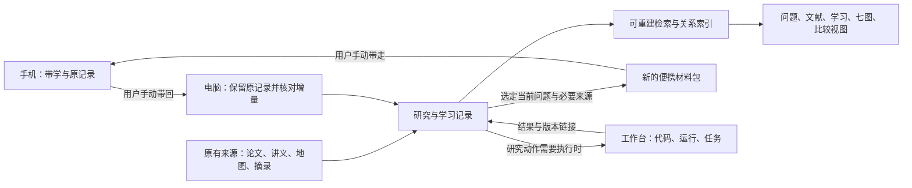

# 手机接续与科研台落地实施方案

日期：2026-09-08。关联：TASK-20260908-002。版本：v0.1。

**本轮交付：本地手机带学包、人工交接手册，以及基于现有实现的电脑端建设方案。手机学习尚未实际发生，独立科研台应用尚未开发或部署。下文的技术栈、目录和施工批次是可评审的建议，不改写旧设计为已批准。**

用户最新约束：“手机端，但是和现在不是一个账号，我会考虑直接拿文件过去的，不要上传”。本轮仅本地制作文件；不上传、配对账号或设置自动同步。

**后续审查入口（2026-09-08）：**用户要求先审现有搭建再设计。现已完成 [08 搭建审查](08_科研台搭建审查与融合取舍.md) 和 [融合设计 v0.2](../../../../decisions/2026-09-08__research__research-desk-fusion-design.md)。本篇保留手机接续方案；技术选型、来源接入和实施顺序以后者为当前提案入口，尚未采纳或实施。本篇 §5 的五层名称同时按原文订正。

## 1. 先让学习可以继续，再用真实记录建设软件

手机负责解释、读材料、手推、提出问题和记录理解变化。电脑负责保存来源、核对返回记录、代码运行、资料检索、关系维护和科研台实现。两端通过用户手动携带的普通文件交接。

先让一轮“带学—保存—带回—继续”成立，同时把它作为科研台第一条实际使用流程。这样能够明确需要哪些对象和交互，而不必等完整的图库、论文库和自动化平台建成才开始学习。

本轮不新增每天的学习比例，也不要求四线轮流打卡。T／R／F／E 共用记录；已有进度直接复用，当前不知道的能力保留未知。

## 2. 现在可以带走的材料

文件目录：[本地手机包](../../../../exports/2026-09-08__research-desk-mobile/00_手机端开始这里.md)，也可直接带走 [ZIP 包](../../../../exports/科研台手机带学包_20260908_v0.1.zip)。目录里有四份 Markdown：

| 文件 | 内容 | 首次是否需要 |
|---|---|---|
| 00 手机端开始这里 | 已确认背景、T/R/F/E、带学方法、菌丝网、启动语与未知 | 先读这一份即可 |
| 01 首轮带学单元 | 递归输入／返回；关系与路径；P／O 教学短探 | 没有当前课堂材料时可直接使用；不必全做 |
| 02 带回电脑模板 | 原话、提示、理解变化、来源与下一步 | AI 在自然停点整理 |
| 03 完整学习安排 | 06 v1.1 的便携正文快照 | 需要完整背景时再读 |

用户可手动带整个 ZIP 或选择 Markdown。包内必要正文不依赖本机路径；没有夹带六份历史原文、论文 PDF、密封答案、凭据或其他聊天档案。03 的来源说明列出原件名称，但不把列出名称说成已附原件。

首次若最近课堂材料在手，就继续那一个问题；若没有，可从“数叶子的递归小树”开始。该例是本次教学构造，不是 EdgeIM 原算法。随学习取得原文后再对应具体接口和差异。

## 3. 当前电脑端有哪些实物

本轮直接检查 MAS 仓库，HEAD 为 `da66308fb34abb8f93c40be07de119231914c7e2`。表中“已检查”只对应列出的动作，不能据此声称整个工作台或论文库已验收。

| 资产 | 本轮证据与能力 | 需要补上的部分 |
|---|---|---|
| `research/map/` 原文 | L0/L1/L2、W1–W7、方法、团队、工业、开源、比较等既有资料；入口和 W5 计划已回读 | 已有覆盖不等于全部事实最新；新旧视角仍需按来源映射 |
| `tools/scripts/map_to_yaml.py` | 使用 solver 执行 `--check` 成功：40 流派、33 团队、170 论文记录、5 课题、19 增量行；41 张规范表中解析 25、跳过 16 | v0 跳过问题×方法等矩阵；部分关联由词元或结构包含推导；170 条记录不等于 170 篇全文已核真 |
| `research/map/data/map_explorer.html` | 315562 bytes；源码提供关键词、波次、待验证筛选，流派／团队／论文联动、详情与来源定位文本；HTML 内嵌数据，无外部资源标签 | 本轮没有运行浏览器交互测试；来源位置是显示文本，不等于点击直达 PDF 页；没有学习记录编辑与菌丝关系写回 |
| `research/map/data/*.yaml` | 由原文单向生成；本轮只读，未重新生成 | 不能把手机返回记录直接写进这些派生文件；下次生成会覆盖 |
| 五份七图主文件 | 在原 EdgeIM 训练目录中；方法／谱系／迁移共用 `RESEARCH_MAPS.md` | 已有文字与模板，未形成跨论文的统一记录索引；本轮不迁移原文件 |
| `tools/dashboard/hub/wbmap.py` 与 `/wbmap` | 读取的是 `docs/workbench-map-20260822.html`，是工作台全图；本轮 GET `/wbmap` 返回 200 | 不能当科研地图浏览器或独立科研台；没有学习记录接入能力 |
| 本机 8899 | `/wbmap` 有 HTTP 响应；尝试 `/api/health` 为 404 | 不据不存在的健康路由判服务故障，也不将单路由响应说成整体运行验收；未启动或重启服务 |
| 独立科研台方案 | 独立产品＋开放文件桥接方向已确认；三源提案和阶段 0 合同仍是提案 | 技术栈、对象写入、索引、统一检索和界面需要具体实施 |

当前 W5 生成快照标注 2026-08-14；本轮只读解析统计与其计数一致，不等于快照全部内容已与今天原文逐字一致。旧 README／runbook 中的日期性设想不作为已发生的入组、活动或研究事实。

## 4. 最小架构选择

| 方案 | 能解决什么 | 主要代价 | 建议 |
|---|---|---|---|
| A：普通文件＋现有编辑器与 W5 浏览器 | 马上带学、记录、检索正文、查看旧地图 | 回链与增量归档仍由人／助手维护 | 现在开始用 |
| B：普通文件为权威正文＋可重建本地索引＋独立科研台界面 | 跨来源搜索、问题和会话联动、关系与比较、导入导出 | 需实现小型本地应用及明确写入归属 | 推荐作为第一版软件 |
| C：先建多账号云同步、图数据库和全自动抽取 | 大规模在线协作和复杂自动化 | 账号、来源合并、维护与冲突成本高；与当前人工携带需求不匹配 | 暂不纳入首版 |

B 的具体建议：Python 处理已有 Markdown／YAML，SQLite 存放可重建全文索引和关系查询结果，普通本地网页提供界面。关系本身由带 ID 的文件记录保存；数据库不是唯一副本。暂不引入向量库或单独图数据库。若现有环境不支持所需全文索引能力，实施前报告差异并选定方案，不自动安装依赖。

独立指研究对象、页面入口和索引独立；第一版可在当前仓库拥有独立模块，不强迫立即拆新仓。执行任务仍由工作台负责。后续是否拆仓，根据共享代码、运行方式和维护边界再决定。

### 4.1 谁保存什么



| 内容 | 权威归属 | 第一版怎样使用 |
|---|---|---|
| PDF、工作簿、历史聊天、讲义、摘录原件 | 原有来源文件 | 注册来源和位置，保留原件；按需要选取上下文 |
| 领域地图正文 | 现有 `research/map/` Markdown | 读取现有来源定位；W5 YAML 作为已有派生索引适配 |
| 用户作答、提示、反馈 | 收到的原对话／产物 | 原样保存；只有摘要时明确标注摘要，不补造成原话 |
| 问题、笔记、具体能力观察、关系、比较与决策 | 科研台可读写的普通记录文件 | 文件中保存稳定 ID 和来源引用；索引按文件重建 |
| 任务状态、代码、运行输出与验收 | 工作台原任务及产物 | 科研台保存链接和所支持的结论，不复制整套执行状态机 |
| 搜索数据库、图布局、计数和筛选结果 | 派生索引与界面 | 可删除重建；不反过来成为原始事实 |
| 手机包 | 选定记录的有日期快照 | 带走副本；返回增量先核对，不覆盖电脑当前状态 |

### 4.2 对象怎样少而够用

一份 `LearningSession` 保存问题、原话／产物引用、提示、反馈、理解变化与下一步。它可同时关联 T 和 F，不复制两份正文。只有实际需要复用时，才把概念、方法或主张提为独立对象。

| 对象 | 最小内容 | 来源要求 |
|---|---|---|
| Source | ID、名称、类别、版本说明、当前位置 | 指向真实取得的材料；记录章节／页码等适用定位 |
| Question | ID、具体问题、当前解释／未知、下一步、相关对象 | 不把尚未回答的问题写为结论 |
| LearningSession | ID、日期、问题、原记录引用、观察、下一步 | 观察写明提示条件与范围 |
| Concept／Method | ID、当前定义／机制说明、适用例子、来源 | 不要求一次建立百科词条 |
| Claim | ID、主张与适用范围、证据引用、当前判断 | 原文自报、个人推论、实际验证分别标识 |
| Relation | 起点、类型、终点、依据、当前判断 | 定义“前置／类比／支持／反例／历史延续／实际复用”，不留无含义的边 |
| Comparison | 问题、被比较对象、维度、每格依据、未知 | 比较同一目标、设定与量纲；不靠一个总分压平 |
| Decision／ExecutionLink | 选择、原因、待检查内容、关联工作台任务 | 有实际结果后再写支持／否定关系 |

身份 ID 与路径分开；改名或搬目录不重造身份。沿用已存在的论文／团队 ID；ID 不同但疑似同物时保留待核别名，不按标题直接合并。新同名记录可用可读后缀区分，不新增日常 hash 清单。

正文中只填相关字段；空白表示没有这类证据。调度、能力表现和研究证据分别保存。“目前先不做”不等于不会，“看过”不等于能用，“能做小例”不等于论文结论得到证明。

### 4.3 建议的实现写域

以下目录是待实施布局，本轮没有据此创建数据库、产品模块或迁移资料：

```text
research/desk/
  records/             # 原件登记、问题、会话整理、概念、关系、比较
  intake/              # 手机返回原记录及其接收说明
  exports/             # 以后由记录生成的便携快照
  derived/             # 可重建索引；不手改
tools/research_desk/    # 独立读写与索引模块，复用已明确的解析接口
```

当前先用本轮 `progress/exports/` 手机包和 runbook，不把导出包当长期权威库。首次真实返回可以先按手册归档到 `progress/intake/research-desk-mobile/`；未来迁入产品时保留来源引用，不复制出两个并行权威库。

现有地图源文件与五份七图主文件暂保留原位置，通过来源与关系映射接入。产品参数如资料根、索引位置和运行端口应进入仓库约定的显式参数文件；实施前列出具体参数，不夹带新的隐藏配置路径。

## 5. 五层与七图怎样实际融合

五层组织导航尺度，七图回答观察问题，T／R／F／E 表示当前工作目的。它们引用同一组记录，既不互相替代，也不形成多套必须填写的台账。

| 导航层 | 现有资产／新记录 | 七图怎样查看 |
|---|---|---|
| WORLD / FIELD | `GRAND_MAP`、L0/L1/L2、W1/W2/W7、团队、工业／开源与跨领域问题 | 同层内切换全域与细分领域，提供方法和谱系的来源 |
| RESEARCH MAPS | 七图主文件、有含义的关系、比较与迁移记录 | 七种观察视角引用共同对象，并回链实践与来源 |
| ACTIVE TRACKS | T/R/F/E 当前问题、候选与下一步 | 选定问题的局部知识／方法视图；不要求一条线等另一条全部完成 |
| EVIDENCE/PRACTICE | 学习原话、反例、代码、执行结果、反馈 | 能力表现、迁移是否发生、哪些主张得到支持或修正 |
| ARTIFACTS | 可复用笔记、例子、代码、比较、研究结果与交流材料 | 轨迹中的产物和使用历史；不是必须发表才算产物 |

七图的第一版呈现：Knowledge 显示概念与前置；Method 显示方法及适用条件；Genealogy 显示有来源的前后工作；Transfer 显示对应、失效与实际复用；Competency 显示具体动作和提示；Identity/Fit 显示跨次实践的兴趣反馈；Trajectory 按时间连接这些记录。后两者没有足够样本时显示已有样本，不生成完整画像。

例如一次递归带学，产生一条会话和一个未解问题。会话引用用户原话，关联递归、函数和树；以后用于另一算法时加“实际复用”证据。知识和能力视图都引用同一会话。没有历史来源时，不为这次教学新增思想谱系边。

## 6. 第一版界面怎样服务实际使用

优先完成三个工作面，再从使用需要增加其余面：

| 工作面 | 用户进来要做的事 | 第一版必要交互 |
|---|---|---|
| 继续学习／研究 | 找到上次问题、状态和下一步 | 当前问题、最近记录、T/R/F/E 标签；点击进入同一对象 |
| 来源与记录 | 看一段原文和自己的理解变化 | 来源定位、原记录／整理区分、相关问题、增量编辑与保存 |
| 查找与连接 | 找到以前学过的内容并复用 | 关键词搜索、对象类型筛选、带类型的相邻关系列表、回到证据 |
| 比较与领域 | 比较论文／方法／团队 | 先复用已有 W5 浏览器和 Markdown 比较表，再加入带来源的比较对象 |
| 七图与成长 | 从另一视角查看同一批记录 | 先做可读的关系列表与时间线；图形布局后补 |
| 执行桥接 | 从研究问题进入实际工作 | 工作台任务与结果链接；正式执行状态仍在工作台 |

新的来源／关系默认为候选，界面说明依据。具体核对在接收和编辑动作中完成，不让用户在每次正常学习前逐页填合规表。共同白板、PDF 深度批注、自动实体抽取和雷达更新在有明确使用样本后再排优先级。

## 7. 施工顺序与验收样本

| 批次 | 具体交付 | 可观察的完成条件 | 当前状态 |
|---|---|---|---|
| 0：跨账号接续 | 本地手机包、原记录返回格式、电脑接收手册 | 新账号仅凭所带内容能知道目标和下一步；实际学习后能带回原记录 | 材料已准备；真实使用待发生 |
| 1：来源与会话 | 一个问题、适量必要来源、一条真实会话的记录与引用 | 可从“上次学到哪”找到原话、提示、来源和下一动作；重开工具仍可继续 | 待实施；无需先批量导入所有历史 |
| 2：检索与菌丝 | 上述记录的搜索、概念与有类型关系、能力观察 | 搜索旧概念能找到具体使用例子；在第二个问题引用旧证据，不复制正文 | 待实施 |
| 3：科研切片 | 一个具体研究问题、方法比较、来源支持的主张与执行链接 | 从疑问走到材料比较和下一检查；执行结果能回链支持或修正判断 | 待实施；不以创新成功作为软件验收条件 |
| 4：扩展既有地图 | 适配 W5、七图、工作簿／操作符；逐项消化 BR-11 等原欠账 | 映射与推导来源明确，旧资料可定位，人工裁定不被生成覆盖 | 待实施；不因本方案关闭原任务 |

第一条完整使用流程建议：用户在手机上完成一次真实的小推演 → AI 整理并保留原话 → 用户带回 → 电脑核对 → 生成一条会话与一条具体能力观察 → 连接一个概念 → 搜索找到它 → 新窗口使用下一步继续。后续再用 P 或 O 的新例验证复用。

软件验收使用这些具体文件和操作，不仅看页面截图。新包由同一记录生成，关闭页面后原文件仍可读；更换前端不丢来源和作答；索引可从记录重建。实际测试选择随实现确定，本轮没有新增测试、运行教学或改实验。

## 8. 手动交接怎样处理变化

接收时保留原记录，再对照“离开电脑时的包—电脑现在的记录—手机返回的新增内容”。同一问题的两个不同判断要看原文与时间，不能把最后收到的一份当唯一真相。

同一返回件重复出现时，只引用已存原件。部分章节相同但新添了一段作答时，追加新证据和来源。只有摘要而无原对话时可以用于导航，但不能据此认定独立作答。旧游标和新课堂位置冲突时，先定位用户实际完成的步骤，再分别处理训练计划与当前教学。

日常记录不增加 hash 工作流；包名、版本、原文和明确引用足以支撑当前人工交接。共享任务 INDEX 继续使用仓库既有 ledger CAS，这是已有台账写法，和新产品日常记录分开。

详细重复使用步骤见 [电脑端交接手册](../../../../runbooks/research-desk-mobile-handoff.md)。

## 9. OpenAI 产品能力与当前边界

本轮实际读取官方 [Projects and chats](https://learn.chatgpt.com/docs/projects) 与 [Remote connections](https://learn.chatgpt.com/docs/remote-connections)，其说明：项目可组织聊天、文件和 instructions，但 ChatGPT project 不直接读取电脑目录；Remote 手机连接桌面主机要求相同账号与 workspace。

本用户另一账号、手动带文件，所以本方案使用自包含文件。用户手机的具体菜单、文件额度与下载交互没有核实，包不依赖这些功能；文字复制也可接续。没有创建 Project、上传资料、绑定 Remote、调用外部模型、开放网络端口或安装依赖。

## 10. 与旧方案的关系、风险和下一步

这是对 06 的实施接续，以及独立科研台三源方案的具体增量：补手机原记录入口、LearningSession 第一条使用流程、七图／五层映射、权威归属与软件批次。它不代表 W5 v1 已实现，也不把旧阶段 0 的所有字段和门槛自动采纳。旧 proposed 合同的普遍 hash 要求与当前仓库默认规则不同，正式设计修订时应一并收拢，避免两套流程并存。

需要观察的实际问题：用户是否能凭包直接开学，收尾是否太繁琐；手机与电脑游标能否衔接；旧数据的候选关系是否被错当事实；一次学习能否留下可复用证据；跨资料检索是否真正比原文件搜索方便。根据首轮使用修改字段和界面，不根据卡片数量评价效果。

**电脑端下一项建议工作已收窄：实现批次 1 的“当前问题＋来源＋真实学习记录”切片，随后接批次 2 的检索与关系。** 等待第一份手机记录期间，可用清楚标识的演示记录检查界面流程；演示记录不进入用户能力统计。该建议的具体架构可先依据本档审阅，当前没有声称代码已完成。

本轮改动影响本任务文档、本地导出包和任务 INDEX 唯一本任务行；撤回只撤这些新增文件及反向入口，不改原资料、训练答案、原研究任务或工作台运行时。无 commit／push。

## 11. 关联入口

- [03 科研台版本、设计与资产](03_科研台当前版本进度_整体设计与资产详版.md)
- [04 构想与未整合事项](04_待整合的学习科研体系_构想与近期任务详版.md)
- [05 科研任务具体情况](05_科研任务盘点与具体情况详版.md)
- [06 论文与 AI 带学整体安排](06_论文与AI带学_基础线及科研菌丝网整体安排.md)
- [独立科研台方向](../../../../decisions/2026-09-05__research__independent-research-desk-design-alignment.md)
- [三源改进提案](../../../../decisions/2026-09-05__research__research-desk-three-source-improvement-proposal.md)
- [阶段 0 语义合同](../../../../decisions/2026-09-05__research__research-desk-stage0-semantic-contract.md)
- [W5 数据规则](../../../../../research/map/data/SCHEMA.md)、[W5 浏览器](../../../../../research/map/data/map_explorer.html)、[W5 v1 设计](../../../../../research/map/w5_design_sprint_20260813/W5_V1_PLAN.md)
