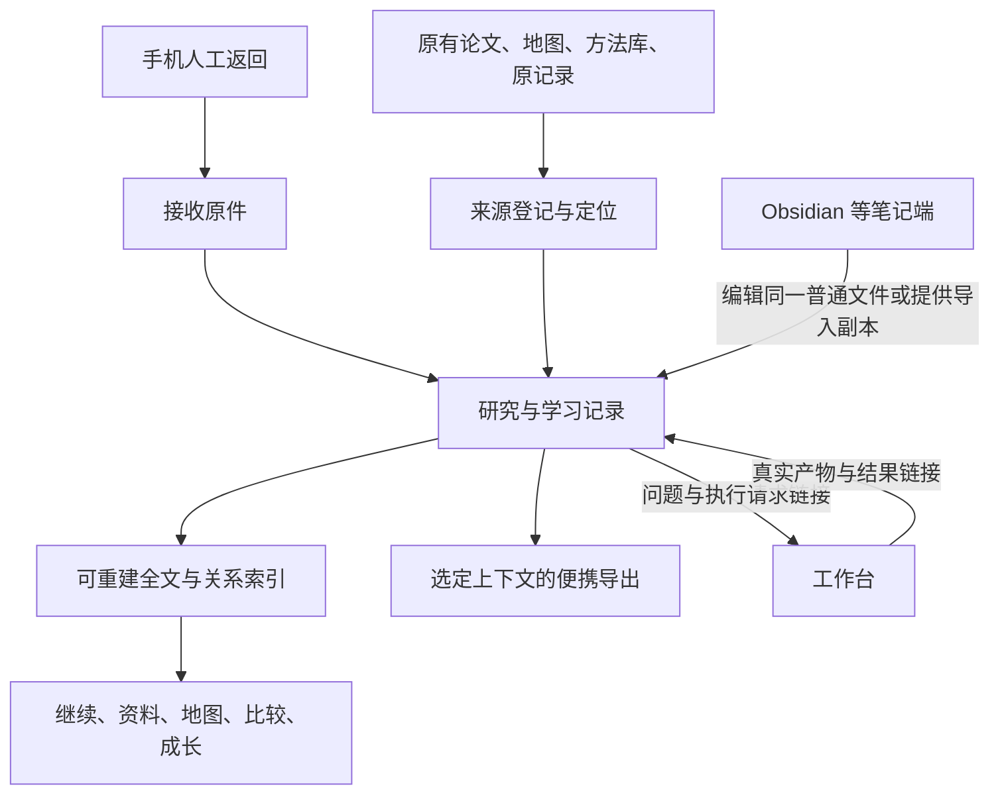

# 科研台融合设计：资料、研究、学习与菌丝网

日期：2026-09-08。版本：v0.2。任务：TASK-20260908-002。

状态：**PROPOSED / DESIGN-ONLY**。本轮已获授权的是审查现有搭建并设计方案；以下技术选择、布局和验收流程供评审，未实施为产品。

> **2026-09-08 后续方向变更：** 用户提出科研台从 MAS 仓独立、工作台也考虑独立，并重新设计资料／项目／日志与服务器部署边界。本稿“首版同仓独立模块”的假设待重新设计，未获采纳；不能直接按旧 D1 开工。内容模型与审查证据保留为输入。当前恢复入口改为[拆分方向暂停交接](../handoff/2026-09-08__research-workbench-decoupling__pause-handoff.md)，待办 RD-1／TQ-1。

依据：[08 搭建审查与融合取舍](../audits/2026/09/2026-09-08__research-inventory/08_科研台搭建审查与融合取舍.md)、[独立科研台方向确认](2026-09-05__research__independent-research-desk-design-alignment.md)、[三源改进提案](2026-09-05__research__research-desk-three-source-improvement-proposal.md)、[06 已确认的学习方式](../audits/2026/09/2026-09-08__research-inventory/06_论文与AI带学_基础线及科研菌丝网整体安排.md)。

本稿成为本任务下一步的设计阅读入口，细化并调整 [07](../audits/2026/09/2026-09-08__research-inventory/07_手机接续与科研台落地实施方案.md) 的技术部分；07 的手机使用和交接材料继续有效。旧阶段 0、W5 v1 的未实施提案保留为来源，不自动升级为已采纳方案。

## 1. 产品要解决的具体问题

科研资料已经很多，但一次学习产生的理解、一次研究留下的反例、领域地图中的方法和后续执行结果分散在不同文件。用户换账号、换窗口或换论文时，往往需要重新解释背景，也难以判断哪些旧工作真的可以复用。

科研台应让以下动作连续发生：找到当前问题与必要来源 → 阅读、思考或推演 → 保存实际记录 → 连接概念、方法、证据与新问题 → 在另一个问题里找到并使用 → 更新理解和研究判断。

开放探索本身可以有价值。用户可以先存一个观察、一个领域入口或一段感想，不必先填写假设、研究贡献或实验协议。只有提出需要核查的主张或开始正式研究时，才展开相应字段。

## 2. 推荐的整体方案

**在 MAS 仓库新增独立科研台模块，保留现有资料原位；用普通文件保存长期记录，SQLite 提供可重建索引，独立本地网页提供研究工作面。通过明确链接与工作台、笔记软件和手机材料交接。**

| 选择 | 优点 | 代价与适配问题 | 本稿建议 |
|---|---|---|---|
| 继续扩展 W5 单文件浏览器 | 已有数据与筛选，开发起点小 | 浏览器面向派生实体展示，缺记录保存、来源版本、学习过程和多对象写入 | 保留为旧地图入口，不把所有新领域逻辑塞入生成器 |
| 独立科研台模块＋已有工具适配 | 直接使用旧资产，能围绕当前学习与研究设计；以后可拆仓 | 需实现记录层、搜索和少量页面 | 采用此方向作为首版提案 |
| 在 LearnGraph 上整体 fork | 已有文档、对话、图谱、学习证据 UI | 同时接入其账号、provider、沙箱、调度、计分和迁移体系；研究关系仍需扩展 | 保留桥接与局部参考，不作为本轮主架构 |

独立产品首先落实为自己的研究对象、页面、文件写域和索引。首版同仓、独立模块与进程，便于直接读取现有资料；工作台停止时，科研台仍应能查看自己的记录。拆新仓不是首版前置，未来可按相同开放格式迁出。

## 3. 同一批记录怎样支撑五层与七图

沿用原来的五层，不重新命名成另一套体系：

| 层 | 在科研台里回答什么 | 内容来自哪里 |
|---|---|---|
| WORLD / FIELD | 世界与细分领域有哪些问题、路线、团队、现实约束？ | L0/L1/L2、W1–W7、工业／开源、论文与新观察 |
| RESEARCH MAPS | 这些内容有什么关系，我能怎样理解和复用？ | 七图视角、类型明确的关系、比较和来源 |
| ACTIVE TRACKS | 我现在或以后关注什么，下一步是什么？ | T/R/F/E、其他长期兴趣、具体问题与投入选择 |
| EVIDENCE / PRACTICE | 我实际做过什么，哪些判断有依据？ | 原话、手算、代码、运行、反例、反馈与修改 |
| ARTIFACTS | 哪些产物可再次使用或对外交流？ | 笔记、例子、方法卡、工具、比较、报告及其适用范围 |

WORLD 与 FIELD 是同层的不同观察尺度。七图是 RESEARCH MAPS 的观察方式，向所有层取材；五层不是五份强制填写的表。T/R/F/E 是工作标签，一个会话可以同时关联 T/F，开放探索也可以暂不关联任何当前研究题。

| 七图 | 查询与呈现 | 必须保留的区别 |
|---|---|---|
| Knowledge | 概念、前置、例子、误解和后续使用 | 概念定义与用户掌握程度分开 |
| Method Landscape | 同一问题有哪些方法、假设、代价和边界 | 方法选择有问题条件，不能只按关键词相似排列 |
| Idea Genealogy | 工作的引用、机制变化、瓶颈与后续 | 论文引用、机制延伸、读者重建与历史影响分别标注 |
| Transfer | 对应、不对应、检查与实际复用 | 类比可先保存；真正迁移需要实际使用记录 |
| Researcher Competency | 用户做过的动作、提示和产物 | 独立完成、提示下完成、只看示范分别描述 |
| Identity & Fit | 多次实践的兴趣、偏好和环境反馈 | 不凭一次表现生成能力或人格结论 |
| Trajectory | 不同时点的样本、变化与下一步 | 保留失败和旧判断；日期性结论不静默覆盖 |

领域开图里的 Actor、Pressure、Frontier/Residual 等内容分别作为人物／团队、约束、开放问题与关系进入上述视图，不额外开七本平行台账。

## 4. 内容与执行各自归谁



- 原论文、地图正文和个人方法库保留各自权威文件；资料没有必要先搬家。
- 科研台拥有新增问题、观察、学习会话、关系、比较和研究决定。
- 原聊天／手机作答保持原件，整理形成独立记录；只有摘要时注明摘要。
- 工作台拥有执行任务、代码、Git、运行与验收事实，科研台只保存回链和它们支持的判断。
- 数据库与图布局均为派生物。用户在界面编辑记录时，先写权威文件，再更新索引；索引更新未完成时明确显示，下一次重建使用文件当前内容。

## 5. 最小数据模型

只给每个有独立复用价值的对象分配 ID。一次普通学习默认一份主记录，其原话、提示、理解变化和下一步可以在同一正文中；不自动拆成十几张卡。

### 5.1 三类长期内容

| 类别 | 内容 | 保存方式 |
|---|---|---|
| 来源与资产 | 论文作品、具体 PDF／版本、讲义、原聊天、工作簿、代码产物 | 来源登记文件；必要的摘录保留原文及位置，原件保持原位 |
| 研究与学习记录 | 问题、概念、方法、观察、会话、主张、比较、决定 | Markdown＋小量结构化字段；特定类型按需展开 |
| 关系与身份裁定 | 前置、实例、类比、引用、支持、反驳、实际复用，以及同物异名 | 独立关系／身份记录，引用两端 ID 与依据 |

论文作品与某个文件副本分别有身份：同一作品可有会议版、预印本、补充材料和不同提取结果。旧 W5 的 arXiv／DOI／OpenReview ID 与 KB 的路径 ID 保存在 `external_ids`，不能用一个文件名替代作品身份。

### 5.2 通用字段与示意

通用必要字段建议为 `id`、`kind`、`title`、`revision`；关联、来源和时间只填实际有值的部分。软件赋予普通记录 ID，旧源件无需为接入而批量改正文。

下面是**设计示意，未生成用户学习证据**：

```yaml
id: session:demo-recursion
kind: learning_session
title: 一次递归调用的输入与返回
revision: 1
record_role: demo
track_refs: [T, F]
object_refs: [concept:recursion]
source_refs: []
```

正文按简版保存“本次输入／用户原话／已有提示／理解变化／剩余问题／下一步”。若没有原话，写明仅有总结；不会用 `source_refs: []` 伪装已提供论文。

成熟的概念或研究对象另有正文，引用原会话即可；一条具体能力观察指向会话中的动作，不给整个“递归”打永久掌握勾。

### 5.3 来源定位

来源条目保存稳定 ID、来源类型、标题／版本说明、路径所属根与相对路径。引用保存章节／页码／行位置和必要原文片段。

- Markdown 用章节＋选中段落，行号帮助定位；正文移动后根据保存的段落核对，不把旧行号当永远正确。
- PDF 保存 PDF 页码，能确定印刷页时同时记录；初版打开原件并显示定位，不承诺所有浏览器都精确跳页。
- 工作簿保存工作表与单元格，图片作为独立附件引用，不把一个单元格自动变成事实主张。
- 原聊天保存具体片段和前后必要上下文；旧聊天里的指令属于历史来源，不自动变成当前执行授权。
- 代码证据链接到已有路径、版本和符号；运行证据链接到实际产物，不由科研台重造一份运行结果。

选定原文片段应与引用一起保存，方便发现来源修订。日常不引入全量 hash；确有来源完整性验收要求的材料沿其原协议处理。

### 5.4 关系及状态

首版支持的关系包括 `prerequisite_for`、`example_of`、`analogous_to`、`cites`、`extends_mechanism`、`supports`、`contradicts`、`reused_in`、`authored_by`、`affiliated_with`。每条有方向、依据、创建来源和必要时间；同一对对象可有不同关系。

关系判断用候选、已核对、存在争议、撤回等文字。已核对指具体关系与其证据范围，不等于全篇论文正确。来源修订、后续反例和新证据可以改变判断，历史引用仍可定位。

另存三条独立信息：当前投入选择、本人具体表现、研究判断的证据情况。旧学习门保留在其训练范围中，全球知识记录与开放 E 探索不因一项局部课程未完成而不可保存。

## 6. 文件、模块与配置布局

下列为建议写域，本轮只写设计文档：

```text
research-desk.yaml                # 根级显式参数文件，待采纳
research/desk/
  registry/                      # 来源、外部 ID、身份裁定
  records/                       # 问题、会话、概念、方法、比较、关系等
  intake/                        # 新收到的原件；整理正文放 records
  exports/                       # 用户选定的便携快照
  derived/                       # 可重建 SQLite 索引及视图数据
tools/research_desk/
  __main__.py                    # 显式配置的命令入口
  app.py                         # 独立页面与本地读写入口
  records.py                     # 记录文件与修订
  sources.py                     # 已登记来源与定位
  index.py                       # 全文及关系查询
  adapters/                      # W5、已有 Markdown／资料入口
  templates/ + static/           # 普通页面与本地资源
```

首版建议 Python＋FastAPI＋Jinja2＋少量浏览器 JavaScript；当前 solver 已有相应 Python 包。初版内容和关系列表不要求另装 Node 前端工程或图数据库。需要复杂交互图、PDF 深度批注和共同白板时再选择局部组件。

拟议根参数文件显式列出：资料根名称及路径、记录与索引位置、首批来源清单、监听地址与端口、默认搜索结果数量。建议监听 `127.0.0.1`；端口在实施前检查占用后写入参数。源目录只取选择范围，不默认扫描整个 D 盘或用户目录。

MAS 内路径相对仓库根，`research_growth` 使用明确登记的相邻资料根；外部下载目录通过单项来源登记接入。路径解析由运行所在系统负责，导出包内使用相对链接和必要正文，用户不需要处理 WSL 路径转换。

新应用的主要运行入口建议为 `python -m tools.research_desk --config research-desk.yaml`，这是待实现接口，当前不能执行。初版用户手动启动，系统服务和远程访问不属于本轮设计需要。

## 7. 检索与地图怎样接入

### 7.1 先保证能找到，再加入语义召回

首版搜索标题、正文、来源名称和已登记别名，返回片段、对象类型和可定位来源。支持中文短词与英文术语，排序先看明确标题／ID／别名匹配，再看正文相关片段；不把资料新旧直接作为所有问题的通用质量分。

短中文查询走字面子串匹配；至少三个字符的查询可走 FTS5 trigram 候选检索，精确短语模式单独说明。界面使用一个搜索框，后端按明确查询规则执行。该选型来自 08 的能力核对，仍需以首批实际语料检查质量和响应时间。

旧 KB 将来返回的是语义候选。接入之前必须为结果补齐统一 source／locator，并与关键词结果一起展示；旧向量分数不转为事实置信度。

### 7.2 W5 采用只读适配与明确覆盖记录

读取现有 YAML 的实体、来源和推导关系，保留旧 ID 与 `derived_by`。新科研记录可引用旧实体。用户修正一个关系时，写科研台自己的裁定记录，视图合并时显式显示该裁定，不修改 W5 生成物。

BR-11 未来实现 `reconciliation/` 时，需要选定唯一裁定来源：将已有科研台裁定迁交该层，或由两端共同读取同一份记录。不能在两个位置分别维护同一 alias／关系判断。当前不要求先做完全部 BR-11 才能开始保存学习记录。

旧矩阵先作为可读原文进入资料库；随后按比较需求逐张转换。空格、未收录、尚未检索、已证实缺口分别表达，导入不能把“空单元格”变成科研空白结论。

## 8. 用户实际看到的工作面

首版入口保持简洁，主页面围绕当前动作展示相关内容；五层和七图用导航／视角切换呈现，不要求用户先选完所有分类。

| 工作面 | 主要内容 | 一次操作的落点 |
|---|---|---|
| 继续 | 最近问题、上次记录、未完成的一步、近期关注 | 打开某条主记录，直接续写／继续思考 |
| 资料与笔记 | 来源列表、选定原文、旁边的个人记录 | 保存摘录或笔记，可关联问题，也可暂不归类 |
| 研究地图 | 领域导航、选定对象的关系、七视角入口 | 点对象看来源，点关系看依据；保留旧 W5 跳转 |
| 比较与研究 | 问题、可比方法、条件、每格证据、开放问题 | 形成新的判断／检查动作，必要时链接工作台 |
| 学习与轨迹 | 实际作答、提示、修正、复用和兴趣变化 | 从证据理解进步，找到下一次合适的动作 |

首轮重点实现“继续”和“资料与笔记”，加上最小搜索与关系列表；其余面先链接现有文档并说明覆盖范围。第一版必须能保存一个独立 E 观察，避免只剩课程进度面板。

资料页的布局建议为：左侧资料／章节导航，中间原文，右侧笔记与当前问题；窄窗口可以切换原文／笔记。日常保存按钮直接保存当前记录；只有需要变更已有判断或处理来源冲突时才展示相应核对内容。

共同白板后续以“在同一画布排布已有来源、推导和问题”为起点；画布布局是视图，拖动卡片不产生事实关系。需要新增关系时明确写关系和依据。先用普通记录或外部白板导出继续思考，无需等待实时协作实现。

## 9. 手机、笔记端与工作台桥接

### 手机另一账号

现有四文件包继续有效。出发时选择当前问题、必要背景和原文片段，生成带版本说明的快照；用户手动携带。回来后先保存原记录，另存整理与新增关系。依据出发快照、当前电脑记录和返回内容核对变化，不按到达时间覆盖。

一份返回件有稳定接收身份，重复带回引用既有原件；后续修改保留修订关系。实际用户原话、AI 整理和教学示例分别标明。整个流程不依赖两个账号共享聊天记忆，也不新增上传或云同步。

### Obsidian／Reviva

能打开同一真实文件目录时直接编辑普通记录；外部应用只提供副本时按导入处理。不会将外部应用内部数据库作为第二份权威库。Reviva 具体适配等待明确需要和试用证据；本轮不恢复其被叫停的试用。

### 工作台

初版使用现有任务／产物链接。科研台写清问题、预期检查和依据，执行窗据相应任务范围实施；真实结果回链到研究记录。统一自动创建任务的 API 放在手动链路验证以后，遵守现有中央发号。学习小例、正式实验和对外交流各用自己的状态，不互相冒充完成。

## 10. 首批来源与示范范围

建议选择已有的少量材料验证全链：

| 材料 | 接入作用 |
|---|---|
| [EdgeIM PDF](../../research/papers_lu/EdgeIM-2025-ICWS.pdf)与 [PAPER_MAP](../../learning/training/lu-edgeim-algo1/PAPER_MAP.md) | 一篇原文与阅读导航，验证来源定位和问题记录 |
| [流程挖掘领域图](../../research/map/W1_lu_side/B_process_mining_landscape.md) | 从当前论文返回 FIELD 与方法比较 |
| [W2 团队与评审](../../research/map/W2_sun_side/B_teams_and_openreview.md) | 验证独立 E 观察、团队关系和旧口径来源 |
| [现有七图入口](../../learning/training/lu-edgeim-algo1/KNOWLEDGE_MAP.md)及其关联四文件 | 验证通用视角与局部训练规则分开 |
| [个人三源方法整合](../../../research_growth/方法论/科研体系三源整合_20260904.md) | 方法动作与跨仓资料引用 |
| [手机教学包](../exports/2026-09-08__research-desk-mobile/00_手机端开始这里.md) | 当前已有交接背景；真实会话随后按实际收到内容进入 |

实施期间若尚未收到真实手机记录，可用单独标为 demo 的样本检查界面；实际学习验收必须换成真实原记录，不进入虚构能力统计。不以教学例子推导论文正确性，也不执行原冻结采样实验。

## 11. 实施顺序与验收

| 批次 | 产物 | 验收动作 | 完成范围 |
|---|---|---|---|
| D0：设计收拢 | 本稿、审查、参数与对象建议 | 可逐项看清职责、来源、写域、查询和退出方式 | 本轮只完成设计稿，未把建议记为用户采纳 |
| D1：记录与来源 | 独立入口、来源登记、普通文件读写、最小搜索 | 选原文片段写笔记；关闭重开；搜索中文短词找到原记录；打开正确来源 | 能日常保存并继续，不要求先自动建全图 |
| D2：菌丝与学习 | 类型关系、局部知识视图、具体能力观察、手机导入导出 | 一份真实会话关联 T/F；一个概念在另一问题实际复用；证据只保存一次 | 学习记录和菌丝开始共同使用 |
| D3：领域与研究 | W5 适配、一个有来源的比较、一个独立 E 观察、执行链接 | 无 EdgeIM 关联也能保存探索；比较可回原文；执行结果回到问题 | 证明能承载研究与领域认识 |
| D4：按需要扩展 | 工作簿／PDF 深度处理、操作符、复杂图、白板、语义召回 | 每项用真实使用样本验收；原数据和历史关系可恢复 | 不预设所有功能同时开发 |

关键验收场景：

1. **换窗口接续**：只有选定文件也能找到当前输入、实际作答和下一步；不依赖聊天记忆。
2. **真实复用**：同一概念在第二个问题出现时，能找到旧例和本次差异，并链接真实使用证据。
3. **开放探索**：一个暂不服务当前论文的观察能独立保存、搜索和继续，没有强制实验字段。
4. **来源修订**：旧引用仍保留原片段，新版本可见；不将旧页码误作新来源证明。
5. **迁出与重建**：普通文件可直接阅读，索引能重建；外部笔记端不需要科研台私有数据库才能恢复核心正文。
6. **主张边界**：导入 W5 推导关系仍有推导标识；AI 总结、用户作答和论文原文不会自动互相升级。

这些是产品验收提案；实施时按实际改动使用现有检查和人工流程，不因本稿另建大套测试或通用防御框架。

## 12. 当前取舍与后续可调整处

本稿推荐同仓独立模块、文件为权威、SQLite 为索引、普通网页作为首版界面；这些选择减少当前集成成本，同时保留未来拆仓和更换前端的空间。

主要限制：首版 PDF 以原件打开与定位为主；语义检索暂不启用；复杂图与共同白板后置；旧人物、论文、历史关系仍要按使用需要核实。由于当前数据规模和真实操作尚未形成产品样本，不承诺性能数字或统一完成百分比。

采纳前可以具体调整的内容是产品所在仓库、首批来源范围、页面偏好和某项功能优先级。其他长期板块已有挂载位置，不会因首批切片较小而从设计中删除。

本轮交付到审查和设计，代码、数据迁移、训练状态、系统服务与外部账号均未改变。开发阶段从 D1 开始，先把来源和记录真正连通，再依次验证 D2／D3。
