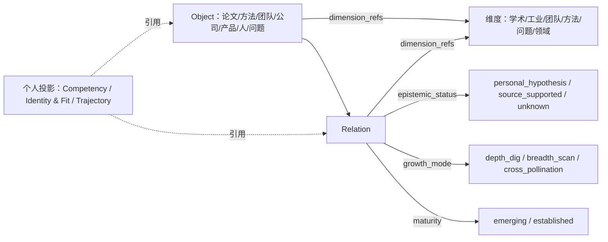

# 知识网络架构 v0.2：多维度整合方案

日期：2026-09-11（晚，续v0.1同日讨论）
状态：PROPOSED / DESIGN-ONLY —— 本稿是对三份既有分层清单的整合建议和schema增量提案；不修改已冻结的[RD-2第一波合同](rd2-construction-v0.3/CONTRACTS.md)、[DATA_CONTRACT.md](rd2-first-build-v0.2/DATA_CONTRACT.md)，不改动C00–C03已交付代码。
关联：[v0.1](2026-09-11__research__knowledge-network-architecture-v0.1.md)（当晚讨论记录，本稿执行其"下一步"）、[Canvas/Graph需求v0.4](2026-09-08__research__research-canvas-graph-requirements-v0.4.md)、[指导库融合规格v0.1](2026-09-08__research__guidance-library-integration-spec-v0.1.md)、[施工蓝图v0.1](2026-09-08__research__research-desk-construction-blueprint-v0.1.md)、[RD-2追踪表v0.3](rd2-construction-v0.3/TRACEABILITY.md)、[学习台设想](three-desks-v0.1/LEARNING.md)、[菌丝网原始构想](../../research/papers_lu/plan-rewrite-inputs-20260906/inputs/紫占盘用途和科研菌丝网构想，进组计划方向的第一次更改（9.5），9.6有新的.md)

## 0. 这份文档做什么、不做什么

v0.1记录了当晚讨论的核心洞察（菌丝网＝科研地图的两种状态、思路B、工业维度的收束策略）和五步"明天早上"的下一步。本稿完成前四步：读取现有设计文档、判断复用与缺口、给出具体整合方案、提出schema增量。第五步（RD-2重组方案，即C04该怎么改）留在本稿末尾作为待用户批准的建议，不在本稿内直接修改任何已冻结合同文件。

本稿新增的字段、维度清单、命名建议均为提案，需要用户确认后才进入CONTRACTS.md或DATA_CONTRACT.md的正式修订流程（比照9-10日SourceRef那次amendment的做法：只加字段、写清楚旧产物未回填，不重写已跑通的代码）。

## 1. 现状：三份从未对账的分层/分视角清单

现有文档里，"从多个角度看科研内容"这件事被至少写了三遍，彼此没有显式对照过：

| 来源 | 出处 | 清单 | 性质 |
|---|---|---|---|
| 原Map设计（八层） | [Canvas v0.4 §1.1](2026-09-08__research__research-canvas-graph-requirements-v0.4.md)、[施工蓝图v0.1 §3](2026-09-08__research__research-desk-construction-blueprint-v0.1.md) | 分区图、脉络图、团队图、成果横向对比、困难清单、动向雷达、SOP/taste、领域工程实践 | 偏"这个领域长什么样"的报告产出 |
| 七图 | [three-desks/README.md §6](three-desks-v0.1/README.md) | Knowledge、Method Landscape、Idea Genealogy、Transfer、Competency、Identity & Fit、Trajectory | 前四个是世界内容视角，后三个是个人与内容的接触记录 |
| 六维度 | [v0.1](2026-09-11__research__knowledge-network-architecture-v0.1.md) | 学术、工业、作者、时间、领域、问题 | 本轮新提议，此前未与前两份对照 |

对照后能看出两件此前没被指出的事：

1. **"学术"这条线被独立写了三遍**：脉络图＋成果横向对比＋动向雷达（八层）≈ Method Landscape＋Idea Genealogy（七图）≈ 学术维度（六维度）。三个说法描述的是同一件事的不同切面，不是三件独立的事。
2. **"工业"这条线几乎是真空**：八层里只有半条"领域工程实践"沾边；七图里完全没有；六维度是本轮第一次正式提出。这是本次讨论已经独立发现三次的同一个缺口（Canvas v0.4节点类型清单没有company/product；关系类型白名单没有工业应用关系；七图没有工业视角）。这个缺口是本次整合要真正补的地方，不是又提一遍就算数。

## 2. 结构调整：世界维度 vs 个人投影

七图的后三个（Competency、Identity & Fit、Trajectory）和前四个性质不同：前四个描述"世界"（论文、方法、团队本身的关系网），后三个描述"我"跟这些世界节点接触之后留下的记录（我碰过哪个节点、在什么帮助条件下、留下什么证据）。

这个区分不是新发明——[LEARNING.md §3](three-desks-v0.1/LEARNING.md)的"能力证据"层（能解释/推导/实现/判错/迁移的具体样本）已经是这三个个人投影的实际字段设计，只是没有被显式接到"这是七图里的三个"这句话上。

处理方式：Competency/Identity & Fit/Trajectory不再算作与学术/工业/团队并列的"维度"，而是**个人投影**——一种从世界节点/边指回来的引用记录（LEARNING.md已有的Attempt/Feedback/能力证据字段承担这个角色）。这样"世界维度有几个"这个问题不再混进这三个不对等的东西。

## 3. 整合后的维度清单（世界维度）

| 维度 | 合并自 | 当前状态 |
|---|---|---|
| 学术 | 八层(脉络图/成果对比/动向雷达) + 七图(Method Landscape/Idea Genealogy) | 有实质内容 |
| 工业 | 六维度新提 | 空，本次整合要补的缺口 |
| 团队/作者 | 八层(团队图) + 六维度(作者维度) | 有研究团队基础，公司/产品的人未接入 |
| 方法 | 指导库A–F（尤其B审查、F系统性科研）+ 七图Method Landscape部分 | 见§7，建议指导库整体接入这一维度 |
| 问题 | 六维度新提，呼应原Map的L2交叉带/候选问题 | 概念已有(L2)，未显式抽成维度 |
| 领域 | 六维度新提，呼应八层L0/L1 | 概念已有，未显式抽成维度 |

时间不列入此表——见§4。

## 4. 时间：不是一层，是属性（未决，需你确认）

时间维度和其他五个性质不一样：学术/工业/团队/方法/问题/领域各自有独立的节点和内容（论文、公司、人、方法、问题本身），但"时间"没有自己的实质内容——它是给其他任意一个维度的节点和边附加的一个属性（这条边/节点是什么时候确立的），用来在维度内部做发展脉络排序，不足以单独撑起一套节点关系。

倾向：时间作为节点/边的属性字段（如`established_at`），不作为第七个维度。**但这是我的判断，不是定论**——如果你想让"时间"承载比"排序"更多的东西（比如"某个时期特有的技术范式"作为独立可关联的节点），那就需要单独维度，需要你说清楚具体想往里面装什么，我不能替你猜。

## 5. 边的属性：growth_mode，和已有的epistemic_status平行

C00–C03已经实现的Relation自带`epistemic_status`（`personal_hypothesis`/`source_supported`/`unknown`）——这是"这条边有多可信"。这次讨论新增的是"这条边怎么长出来的"，两者独立、不互相推断：

- `growth_mode: depth_dig`——深挖时长出来的边，需满足菌丝网原始设计的四条判据之一（必要前置／改变判断／反复出现／能形成实验，见[菌丝网原始构想](../../research/papers_lu/plan-rewrite-inputs-20260906/inputs/紫占盘用途和科研菌丝网构想，进组计划方向的第一次更改（9.5），9.6有新的.md)），不定期触发，来自实际学习/阅读会话。
- `growth_mode: breadth_scan`——广度扫描长出来的边，判据是"落在declare过的watch范围内"，固定周期触发（你确认过的周30分钟、Google Alert入口、公司/产品粒度）。
- `growth_mode: cross_pollination`——深挖和广度扫描各自独立长出的两条边在同一节点相遇时的候选新边，**不继承任何一边的判据**，独立走既有Proposal流程决定要不要正式确认（呼应你此前"两坨菌丝接上不该自动算数"的判断）。

这三个值和维度是正交的——一条学术维度的边可以是depth_dig，一条工业维度的边也可以是depth_dig，维度和生长方式互不决定对方。

## 6. 维度怎么落到schema：dimension_refs，不叫layer

**一个命名冲突需要现在防住**：[指导库融合规格v0.1 §3](2026-09-08__research__guidance-library-integration-spec-v0.1.md)已经在用`layer`这个字段表示A–F六层（导航/审查/实验/迁移/观察/系统性科研）。如果这次整合的六个维度也叫"layer"，会重演P1/P2那次命名碰撞。

建议：本次新增维度统一用`dimension_refs`（不用`layer`），中文统一说"维度"，把"层"这个字留给已经存在的两个用法（Map八层、指导库六层A–F）不变。

Object和Relation都可以带这个字段：

```json
{"kind": "concept", "attrs": {"dimension_refs": ["academic", "industry"]}}
{"kind": "relation", "attrs": {
  "from_ref": "obj-a", "to_ref": "obj-b",
  "relation_type": "method_analogy",
  "epistemic_status": "personal_hypothesis",
  "dimension_refs": ["academic"],
  "growth_mode": "depth_dig",
  "maturity": "emerging",
  "basis_refs": [], "state": "active"
}}
```

一个节点可以同时挂多个维度（比如一个学者既在学术维度也在工业维度）——这是多层网络的标准做法，不需要为每个维度复制一份节点。

新增两个节点kind：`company`、`product`——这不是新发明，[DATA_CONTRACT.md §2](rd2-first-build-v0.2/DATA_CONTRACT.md)本来就写了"团队/产品/论文等后续类型可引用"，现在只是把"后续"具体接上。



## 7. 方法维度：指导库不需要单独系统，是这张网的一个维度

之前讨论把指导库整合当成单独的问题（G1-a到G1-e五个小任务，见指导库规格§9）。整合后可以更简单：指导库的每一条`guidance_item`本来就有`trigger.object_kinds`和`trigger.tags`，本质上已经是"这类节点该关联到这条方法"的候选边。把guidance_item当成方法维度里的一种节点，指导库现有的`source_refs`/`acceptance`/`provenance_status`字段原样保留，只是多一个`dimension_refs: ["method"]`。

这样G1-a到G1-e五个任务不用改，指导库原有A–F六层结构也不用动——只是多了一条"这些条目其实是这张网里方法维度的节点"的接入说明。

## 8. 科研地图＝菌丝网：maturity字段，不是两个对象

延续v0.1的核心洞察：地图和菌丝网是同一网络的两种成熟度状态，不是两个系统。落到schema：给Relation加`maturity: emerging | established`（新字段，不和已有的`state: active/withdrawn`冲突——`state`说的是这条边现在有效还是被撤回，`maturity`说的是这条边现在是刚长出来的试探性连接还是已经沉淀确认的稳定关系）。

`emerging`的边是"菌丝"——刚建立、少被引用确认；`established`的边是"地图"——被多次引用、写进过matrices/radar这类汇总资产。**这只是概念对应**，不代表现在就要把matrices/radar改成自动生成视图——那是更大的技术改动，本稿不提议现在做，只提议先把这条概念线钉住，以后要不要生成化再单独决策。

## 9. 和已有Map Estate/施工蓝图的关系

[施工蓝图v0.1 §3](2026-09-08__research__research-desk-construction-blueprint-v0.1.md)把Map Estate和Mycelium列成两个分开保留的对象。按§8的整合，这里建议修正为：Map Estate是原始材料本身（论文/matrices/radar这些文件不会消失，仍是来源），"地图"和"菌丝网"说的是这些材料背后那张关系网络的成熟度状态，不是第二套并行对象。**这处修正需要过一次用户确认才能反馈回蓝图文档本身**，本稿不直接改蓝图正文。

## 10. 仍然打开的决策点（需要你的判断，不是我能替你定的）

1. 时间是否真的不该单独成维度（§4）——如果你想装的内容比"排序"更多，需要单独维度。
2. `cross_pollination`是否要加进Relation的`relation_type`白名单（目前白名单是`references`/`prerequisite`/`method_analogy`/`historical_influence`/`complements`/`goal_member`/`result_of`），还是复用现有类型＋新`growth_mode`值就够——这直接影响是否要动CONTRACTS.md的白名单，是个决策面变更。
3. `maturity`从`emerging`提升到`established`的判据是什么（引用次数？时间跨度？人工确认？）——这个我完全没有依据替你定，不能瞎猜一个阈值。
4. 团队/作者维度要不要扩展到工业界的人（比如某公司的技术负责人），还是先只做公司/产品这两种节点，人先不进这一批。

## 11. 建议的下一步

本稿仍是纸面设计，不改代码、不改CONTRACTS.md/DATA_CONTRACT.md正文。建议顺序：

1. 你先给§10四个决策点一个初步倾向（不用现在完全想清楚）；
2. 确认后，本稿内容整理成对CONTRACTS.md的正式amendment（照9-10日SourceRef那次的先例：只加字段、写清楚"此前产物未回填"，不重写已跑通的代码）；
3. amendment作为C04开工前的输入，交给下一个执行窗口；不在本窗口直接开工C04。

---

**用户原话（保留脉络）**：

> "所以我是说它应该是多层网的形式（）"

> "所以我们应该整合一下了"
