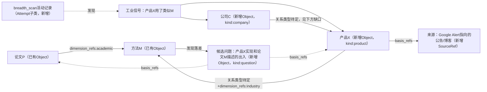
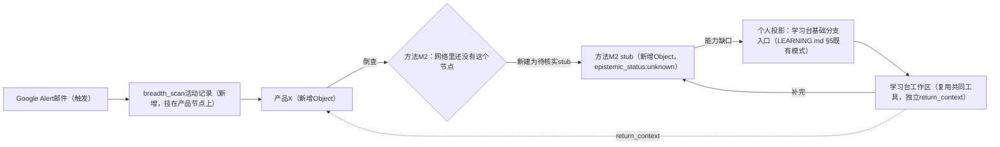
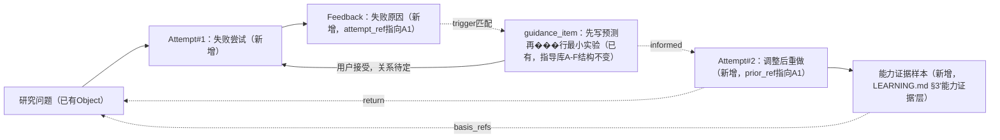

# 知识网络架构 v0.3：三条场景走查（独立版）

日期：2026-09-11（续v0.1/v0.2同日讨论）
状态：PROPOSED / SCENARIO-WALKTHROUGH —— 本稿是**我方独立产出**，用来检验v0.2提案（`dimension_refs`/`growth_mode`/`maturity`）在具体场景下站不站得住。按用户安排（"两边各自独立画，你来对比"），本稿不参照、不模仿另一路（Astra）同步产出的对照版本，比较留到下一轮，本稿不预判对照结果。不改CONTRACTS.md/DATA_CONTRACT.md正文，不改C00-C03代码。

关联：[v0.1](2026-09-11__research__knowledge-network-architecture-v0.1.md)、[v0.2](2026-09-11__research__knowledge-network-architecture-v0.2.md)、[DATA_CONTRACT.md](rd2-first-build-v0.2/DATA_CONTRACT.md)、[CONTRACTS.md](rd2-construction-v0.3/CONTRACTS.md)、[TRACEABILITY.md](rd2-construction-v0.3/TRACEABILITY.md)、[LEARNING.md](three-desks-v0.1/LEARNING.md)、[指导库融合规格v0.1](2026-09-08__research__guidance-library-integration-spec-v0.1.md)

## 0. 先应用这轮已经认下的自我修正

动笔画场景前，先把这次讨论里已经承认的三处v0.2问题带进来，不在场景图里假装v0.2原文没问题：

1. **工业缺口重新定性**：核实`TRACEABILITY.md` R02行原文——"学术／工业独立联动"——已经排了C03入口／C04深化工位。不是真空，是**需求已存在、尚未具体化到节点类型/关系类型/七图投影**这三处实现。本稿场景图会具体指出"具体化"缺的是什么，不再重复"三重独立确认的真空"这个过头说法。
2. **`maturity`字段本稿不用**。改用已有的`state`(active/withdrawn) + `basis_refs`，场景里出现"这条边有多稳"的地方，用文字描述依据和争议，不引入新标量。
3. **`growth_mode`不再是Relation的永久字段**。改挂在发现/活动记录上——复用已有的`Attempt`对象类型（DATA_CONTRACT.md §2已定义"Attempt/Feedback | Object子类"），场景B里具体测试这条是否走得通。

## 1. 场景A：论文机制深挖 → 撞见工业应用 → 候选问题成形

用户正在深挖论文P的方法M的机制（学术维度的depth_dig活动）。广度扫描（Google Alert，每周30分钟那条既定节奏）带来一条信号：公司C的产品X用了类似M的思路。用户点开细看，发现产品X的实际实现和论文M的描述有出入，把这个出入存成候选问题。

| 项目 | 内容 |
|---|---|
| 复用对象 | 论文P、方法M（学术维度已有节点，不重建） |
| 新增记录 | breadth_scan活动记录（挂在M的发现上）；公司C、产品X（新kind）；产品X→方法M的relation；候选问题Q |
| 跨越层 | 学术（P、M）→ 工业（C、X）→ 问题（Q），三层在一次会话里连续跨越 |
| 依据落点 | Q的`basis_refs`同时指回P（学术依据）和X的来源SourceRef（工业依据）——不能只挂一边 |
| 用户点击动作 | 打开M节点 → 看到breadth_scan提案（AI生成的pending Proposal，`add_relation`类型）→ 用户审核 → 接受，生成X→M的正式relation → 用户手动追加"候选问题"节点，从Q反向basis_refs勾连P和X |
| 结果回哪 | Q作为M节点的一条新出边出现，用户回到M的深挖工作区时能直接看到候选问题，不需要单独去问题列表里找 |

**本场景暴露的具体缺口**：
- `产品X → 方法M`需要什么`relation_type`？现有白名单（references/prerequisite/method_analogy/historical_influence/complements/goal_member/result_of）里，`result_of`语义上或许已经够用（"产品X是应用方法M之后的结果"）——**这一点我没有把握，只是猜测语义相容，不是确认过的结论**，需要在C04之前明确判断是复用`result_of`+`dimension_refs:industry`，还是新增专门类型。
- `公司C → 产品X`（谁生产了谁）在现有七个类型里**没有一个语义贴合**——这是本场景走出来的一个相对确定的真缺口，不是猜测。
- `SourceRef`的anchor目前按kind分流只覆盖`workbook_cell/workbook_range/workbook_image`（见DATA_CONTRACT.md §2）——Google Alert指向的网页公告/博客**不属于任何现有anchor kind**，这是工业维度一旦有真实数据就会立刻撞上的具体缺口，不是假设性的。

## 2. 场景B：工业动向切入 → 倒查方法谱系 → 反哺自己基础学习

用户周例行扫描邮件时看到一条产品公告（breadth_scan活动），想搞清楚这背后用的什么方法。倒查发现方法本身涉及一个用户还没掌握的基础概念，于是在学习台开一个独立基础分支去补，补完后带着结果回到最初的产品节点。

| 项目 | 内容 |
|---|---|
| 复用对象 | 无——这是从一条全新的工业信号起步；唯一复用的是"学习台基础分支"这个已有交互模式（LEARNING.md §5原文已写"科研探索发现能力缺口时，可以在学习台开独立基础分支，回去时保留原位置"） |
| 新增记录 | breadth_scan活动记录；产品X；方法M2的stub节点（`epistemic_status:unknown`，因为是倒查猜测，未核实）；学习台的独立基础分支workspace |
| 跨越层 | 工业（X）→ 方法（M2 stub）→ 个人投影（能力缺口→学习分支），三层里第三层不是世界维度，是v0.2 §2已经定性的"个人投影" |
| 依据落点 | M2 stub的`basis_refs`暂时只能指向产品X的公告来源，因为方法本身还没找到权威学术出处——这条边必须保持`epistemic_status:unknown`，不能因为"看起来像"就标`source_supported` |
| 用户点击动作 | 从产品X节点发起"倒查方法"→ AI提案一个方法stub → 用户发现自己不熟悉 → 点"开学习分支"（工作台/学习台既有能力）→ 学习台workspace自带`return_context`指回产品X → 补完后回到X |
| 结果回哪 | `return_context`把用户带回产品X节点，而不是留在学习台——这是LEARNING.md和CONTRACTS.md §4"View增加return_context"这条已有设计的直接落地场景，不是新发明 |

**本场景暴露的具体缺口**：
- `Attempt`对象目前的语义描述（DATA_CONTRACT.md/LEARNING.md两处）都偏"学习尝试"取向（用户做了什么、帮助条件、产物、反馈）。这次的breadth_scan活动本质是"看了一封邮件、记两句"，字段密度天差地别。**本稿倾向不到必要不新增类型**——先尝试用`Attempt`+一个能区分"这是扫描记录还是学习尝试"的字段（比如复用`growth_mode`本身的值：`breadth_scan`活动记录 vs 没有这个字段的普通Attempt），如果实践中发现两者需要的必填字段差异太大导致同一张表要塞进两套不相关的必填项，再考虑拆出新kind。这是留白，不是本稿的最终判断。
- Mstub这种"倒查出来但还没找到权威来源"的方法节点，本身合不合法？答案是合法——DATA_CONTRACT.md §4第1条"自由捕获仅要求非空正文或一个引用，不要求来源完整"已经覆盖这种情况，本场景只是把这条既有规则第一次具体走了一遍。

## 3. 场景C：学习失败 → 调用指导 → 调整 → 留证据 → 回到原问题

用户在做一个研究问题相关的实验尝试，失败了。系统根据失败的性质（比如没有先写预测就直接跑）匹配到一条指导条目，用户看了调整做法，重做一次，把新证据留下，带着结果回到最初的研究问题。

| 项目 | 内容 |
|---|---|
| 复用对象 | 研究问题Q3（已有）；guidance_item本身（指导库既有条目，不新建，不改layer/A-F结构） |
| 新增记录 | Attempt#1（失败）；Feedback（失败原因）；Attempt#2（调整后重做，引用Attempt#1）；能力证据样本 |
| 跨越层 | 问题 → 方法（指导库，v0.2 §7定性为方法维度的节点）→ 个人投影（能力证据），指导条目本身不产生新的世界维度内容，只是被引用了一次 |
| 依据落点 | 能力证据的`basis_refs`指回Q3，形成"这个问题现在有一条具体证据"的可查链路；Attempt#2的`prior_ref`指回Attempt#1，保留失败-调整的完整过程，不是只留成功记录 |
| 用户点击动作 | Attempt#1失败后写Feedback → 系统按`trigger.object_kinds`/`trigger.tags`匹配出guidance_item并生成pending提案 → 用户点开guidance_item看内容 → 接受"参照这条调整" → 重做产生Attempt#2 → 系统或用户手动生成能力证据样本 |
| 结果回哪 | Attempt#2完成后回到Q3，Q3现在能看到"失败过一次、参照了哪条指导、重做后的证据"完整链条，不是只显示最终成功结果 |

**本场景暴露的具体缺口（这是本稿和v0.2 §7差异最大的地方）**：

v0.2 §7原提议"指导库不需要单独系统，只是多一个`dimension_refs:["method"]`标签"。走完这个场景后，**这条本身站不住**：光靠`trigger.object_kinds`/`tags`的自动匹配，只能证明"系统曾经推荐过这条指导"，证明不了"用户真的看了、接受了、这条指导真的起了作用"。这三者是不同的事实，尤其"推荐了但用户没采纳"和"采纳了确实有效"如果不分开记录，以后没法回答"这条指导条目实际帮助过谁"这种问题。

本稿认为需要的最小补丁是：guidance_item和Attempt/Feedback之间需要**一条正式relation**（而不是新对象、不是新层），语义类似"这次尝试参照了这条指导"。这条relation放进现有`relation_type`白名单里目前也没有贴切的类型——`prerequisite`语义上偏"顺序依赖"，不是"这次具体用了这条建议"。这是本稿新发现的一个具体缺口，和Astra那边提到"指导整合需要usage record"的方向一致，但本稿给出的落点更小：一条relation+复用已有Feedback字段记效果，不需要为此新增对象类型。

## 4. 三张场景图共同暴露的东西（汇总，不下结论）

- **`relation_type`白名单目前对"工业采用"（场景A）和"指导采用"（场景C）都没有专门类型**——这是两个独立场景走出来的同一类缺口：白名单目前覆盖的是"学术内容之间"的关系（引用/前置/类比/影响/互补/目标成员/结果），没有覆盖"世界对象之间的商业/组织关系"和"活动记录引用指导内容"这两类。是否新增类型还是复用现有类型+`dimension_refs`/tag区分，这直接决定要不要动CONTRACTS.md白名单，是决策面变更，本稿不替你选。
- **`SourceRef`的anchor不覆盖网页类来源**——场景A一旦有真实的Google Alert数据就会立刻撞上，这是三个场景里最快会变成实际阻塞的一个。
- **`growth_mode`放在`Attempt`还是新类型上，取决于breadth_scan活动和depth_dig活动的必填字段差异有多大**——本稿倾向先共用、加字段区分，场景B里没有走到"必须拆"的地步，但也没有走到足够多次去确认"一定不用拆"。
- **三个场景都没有用到`maturity`或独立Event对象**——本稿这三个具体例子里，用现有Object+Relation+已有的Attempt/Feedback就说清楚了，没有出现"必须要一个独立Event对象才能表达"的情况（场景A的"公司+产品+方法+论文"用三条独立relation说清楚了，没有信息丢失）。这和之前转述的"应该做成事件对象"的判断不一致，具体差异是场景选得不够刁钻、还是判断本身有分歧，需要等对照另一路实际画出的版本后才能说清楚——本稿不预判。

## 5. 下一步

- 等另一路独立产出的三张场景图；两版对齐后由我来对比，标出真分歧（同一场景下产生不同必要设计）和假分歧（只是命名或表达方式不同），交给用户做最终判断。对比工作留到后续任务号，不在本稿内进行。
- 三处具体缺口（工业/指导两类relation_type、SourceRef网页anchor）建议在决定C04范围时一并考虑，不需要现在就定，但不应该在C04实际动工时才第一次发现。
