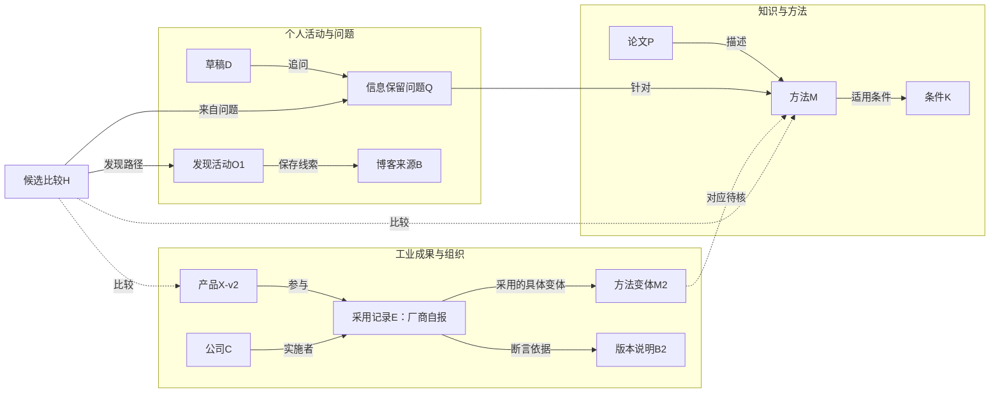
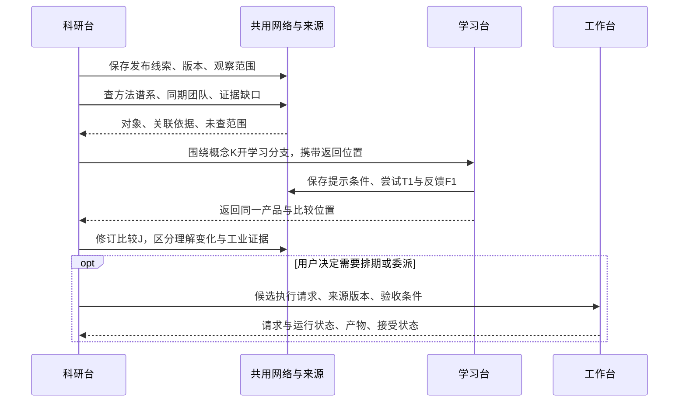
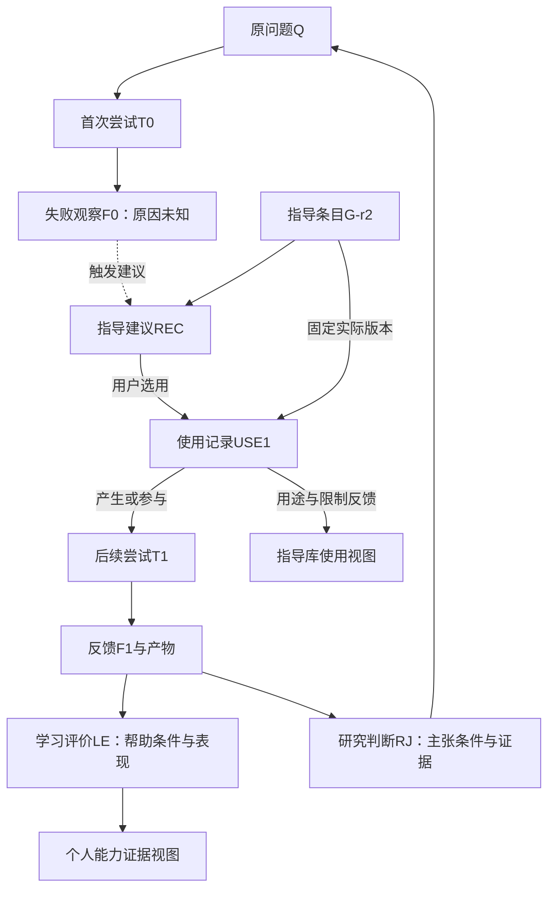

# 共用多层网络：Astra路线三场景设计 v0.1

日期：2026-09-11。任务：TASK-20260911-006。状态：PROPOSED / DESIGN-ONLY / READY-FOR-COMPARISON。

本文完成用户安排的“两边各自独立画”中本窗口这一份，交由Fable作后续对比；不修改施工合同、应用或来源资料。Astra为对话中的规划路线称呼，实际执行为当前Codex窗口，不据此声明模型SKU。

**独立性边界**：本窗口已经看到用户粘贴的Fable过程及结论摘要，也参与了前置共同讨论，因此不是严格盲审。编写本文未打开Fable的v0.3场景稿正文；下列场景是本窗口自行构造的另一份设计，不预判对方版本优劣。本文不是v0.2的正式替代或实现回执。

## 1. 设计约束和读图方式

目标不是再定一张字段清单，而是回答：用户从什么地方进入；已有对象怎样复用；发生什么需要新记录；不同层怎样连通；结果分别回哪一台；怎样撤回错误解释。

全部示例均为DEMO：论文P、方法M、产品X、公司C、博客B、指导G以及人物U不表示真实工业应用或用户能力事实。不把EdgeIM与某个工业产品的相似比喻升级为真实联系。

七组关系是逻辑组织，不要求七个数据库或服务：

| 编号 | 关系层 | 回答的问题 |
|---|---|---|
| L-K | 知识与机制 | 概念、条件与机制如何联系？ |
| L-E | 问题与证据 | 哪条主张在什么条件下被什么支持／限制？ |
| L-M | 方法与迁移 | 方法有哪些对应、替代、改进和不适用处？ |
| L-O | 人物与组织 | 谁与谁在何时、何种角色下参与？ |
| L-A | 成果与应用演化 | 哪个版本实现／采用／替换了什么？ |
| L-G | 指导与实践 | 哪条指导如何被某次活动选用、调整和评价？ |
| L-P | 个人学习与研究发展 | 我在哪些条件下做到了什么、下一步为何值得做？ |

学术／工业是可独立进入的观察范围，均可跨上述各层。时间是跨层查询轴，发布／采用／转向等又是可引用事件。关系层、观察维度、操作方式、显示形式分别定义，不以统一layer字符串混用。

同实体共享ID不等于同一句话共享真假：同一方法可被两份来源作出矛盾描述。身份对齐只统一实体；来源断言、我们的判断、个人学习评价都保留各自依据。

图中的实线表示示例中明确记录的关系；虚线表示待核关联或候选行动。图上“支持”只是此DEMO中记录了支持依据，不是现实事实。复杂行为画为事件／活动，简单事实仍可用边。所有字段名和边名都是表达需求的候选，未新增正式白名单。

## 2. 场景A：论文深挖，遇到疑似工业采用

### A1 起点与用户操作

用户在学习台读论文P的方法M，想弄懂“压缩后究竟保留哪些信息”。学习进程中看到产品X的博客B声称使用“类似摘要”。目标是判断有没有值得比较的技术联系，当前不要求排实验或确认产品采用了P。

| 步骤 | 用户看到／操作 | 新写入或复用 | 回流与不变量 |
|---|---|---|---|
| A1 | 在原段旁保存疑问Q及当前解释 | 复用P/M来源，保存Q和草稿D | 可不分类；原文不变，自己的草稿独立 |
| A2 | “向外看看”→工业→保存博客B | 保存来源线索S-B与发现活动O1 | 即使未查证也可先存；没有自动采用边 |
| A3 | 系统或人提示M与X可能有关 | 新建候选比较H，引用M、X、S-B、Q | AI推荐只为proposal；点击不是确认真值 |
| A4 | 并排比较条件、实现差异、输出与来源 | 更新比较记录H，允许“目前只像” | 方法层出现个人联想，不声称工业落地 |
| A5 | 进一步查到确切版本说明（DEMO假设） | 建立采用记录E，关联X-v2、M变体、组织C、证据B2 | 显示“厂商自报”，不能等同独立验证 |
| A6 | 回原论文／全局专题 | 原Q保留；专题出现比较与采用记录，原学习继续点恢复 | L-P理解证据不因工业记录增加而升级 |

### A2 跨层对象图

### A3 为什么采用事件值得成为记录

采用记录至少区分参与产品版本、采用对象、采用程度、条件、发生时间、获知时间、来源断言以及后续更正。简单“X引用P”无法表达“只用了某模块”“v3已经替换”“厂商说用了但无代码证据”。

**节奏建议**：现在在概念设计中保留事件模式，并用这一张合成记录检验；第一条真实采用案例进入C04时再固定必需字段。不先建通用事件平台、不为每个事件类型建模块，也不等真实案例进入系统后才承认需要版本和依据。实现可复用现有Object/Revision，是否需要新kind由实际合同差异决定。

### A4 场景验收与反例

1. 只发现相似用词时，能保存线索并回论文；没有“工业已采用”的结论。
2. 博客删改后，用户仍知道当时看的是哪个来源版本／摘录、何时看到；没有保存快照则明确证据无法原样复核。
3. 厂商更正“不是M，只是另一种摘要”时，新更正引用旧断言，旧记录保留；相关研究判断标需复核，不自动删掉用户已完成的学习记录。
4. Map显示“工业联系待核／有来源自报”，菌丝工作面可沿H继续；两者看到同一ID和依据，不以maturity分家。

## 3. 场景B：工业动向倒查方法谱系，回到基础学习

### B1 起点与动作

用户在科研台工业观察范围看到产品X-v3发布，想知道技术路线为何变化、同期其他团队在做什么。这里只是观察，不预设必须转成研究任务。

| 步骤 | 用户操作 | 对象／事件 | 跨层结果 |
|---|---|---|---|
| B1 | 手动保存发布页及当前观察范围 | 来源S3、发布事件R3、观察活动O2 | L-A记录版本；广度扫描模式属于O2 |
| B2 | 打开“方法与前驱” | 引用方法M3、旧版本X-v2及各来源 | L-M展开，不从发布时间自动推出继承 |
| B3 | 打开“谁在做／同期对照” | 引用组织C、人U及角色时期；同目标下比较X与Y | L-O与L-E联动；缺人员资料标未知，不挡产品观察 |
| B4 | 遇到前置概念K不懂，点击“开学习分支” | 新学习活动L1，保存返回X-v3与原比较视图 | 复用K，不复制一张“学习版K” |
| B5 | 完成提示下尝试T1，记录反馈F1 | L-P证据：帮助条件、产物、反馈、未检查项 | 不修改K的世界定义、不增加研究通过状态 |
| B6 | 返回工业比较并修订自己的理解 | 比较J新增revision，引用T1提供的理解过程及原工业来源 | 个人尝试可以解释认识变化，不能替代工业证据 |
| B7 | 若需要跑实验才“安排执行” | 创建候选请求REQ，未来工作台产生RUN／回执 | 请求、运行和接受独立；本场景稿不启动真实实验 |

### B2 三台往返图

### B3 时间与路径不是一个字段

- 发布发生时间、我们收录时间、某技术版本有效期分别保存；来源只写月份时保留粒度，不伪造具体日。
- 同期对照是按问题和时间窗口选出的比较视图，不自动写“相互影响”关系。
- 技术前驱／影响需要来源支持或标明个人假设；先后出现只能支持时间排序。
- “我为什么转向这个问题”属于个人研究轨迹；“公司为什么换方案”需要公司或其他可核来源，二者不能混写。

### B4 验收与反例

1. 两家公司同用一个术语，不自动合并方法实体；先保存可能同义／待消歧。
2. 同一人从团队A转公司C，旧任职的时期保留；不把所有旧论文都投影为C的成果。
3. 返回原产品时恢复版本、筛选和选中比较项；用户无需复制ID。
4. 只想看工业动向、不想学前置时，可以挂起L1并继续观察；没有学习成绩惩罚或自动待办。
5. 深挖后重新看到同一发布页可增加O3活动，不重复产品／发布实体；关系拥有多条发现和核验来源，不永久选一个growth_mode。

## 4. 场景C：学习失败，调用指导，再回研究问题

### C1 起点与用户操作

用户在学习台尝试解释方法M，为问题Q构造小例子，得到错误结果。目标是理解并修正错误；错误暂不意味着论文有问题，也不强迫必须产生研究贡献。

| 步骤 | 用户操作 | 记录 | 必须区分 |
|---|---|---|---|
| C1 | 保存首次尝试T0、失败观察F0 | 原草稿、输入条件、帮助条件、反馈 | 原因可以未知，不补编归因 |
| C2 | 看到“预测优先／最小例子”等指导推荐 | 建议REC，引用指导G-r2及触发依据 | 推荐不等于用户选用或有效 |
| C3 | 用户选择G并调整步骤 | 使用记录USE1：G-r2、本次活动、用途、调整、操作者 | 选用也不等于已完成；允许取消或部分执行 |
| C4 | 根据指导产生T1和F1 | 新尝试与产物；USE1引用对应过程 | 不覆盖T0；“后来成功”不证明指导单独造成成功 |
| C5 | 保存个人学习评价LE与研究判断RJ | LE评本人在何帮助下做到什么；RJ评Q相关主张与边界 | 同一产物可被两者引用，但评价分别接受／修订 |
| C6 | 回到原研究专题或保持纯学习 | 继续点、过程引用、可选下一问题 | 不自动升级mastery或研究状态，不自动调度 |

### C2 指导—实践—两类评价图

### C3 指导库如何融合

保留指导条目、配方、推荐、使用、反馈五种含义；它们可以复用现有对象及引用，不要求五套后台。G是帮助我们做研究的方法，M是被研究的方法，两者均进入网络但不合并类型。一个算法也可能被写成教学指导，此时保留两个不同用途的对象并关联来源。

已有指导规格§8.1已明确guidance/items、recipes、uses和版本回链，因此“需要使用记录”是继承已有需求，不是本轮首次发现。新增工作是确定它如何被网络查询、工作区操作和个人／研究评价共同引用。

“活动引用指导”的边只能表达有关联；它不能代替USE1里的实际版本、采用程度和效果反馈。任何一次原始讨论不必先造使用记录，只有用户明确选用时才出现USE1。

### C4 验收与反例

1. 推荐G1/G2/G3，用户只选G2：只G2产生使用记录，其余仍是建议；隐藏建议不删除知识来源。
2. 用户说“试了一半，不适用”：使用事实保留，未完成／不适用可见，不被成功次数统计吞掉。
3. 指导升级到G-r3：USE1仍引用r2；不把旧活动改写成用了新方法。
4. T1在强提示下成功，独立复测T2失败：两条证据并存，不互相覆盖；概念M仍可有可靠来源。
5. 用户发现代码bug而非论文反例：RJ修订归因，原失败保留；网络不会自动将M标为被反驳。
6. 来源无法打开或推荐模块关闭：用户过程、USE1和继续点仍能读取。

## 5. 三场景共用架构：写入权威与查询语义

### 5.1 同一实体，多个有依据的观察

| 记录 | 主写入者／权威 | 跨台怎么调用 |
|---|---|---|
| 来源及原文版本 | 原资料及来源登记 | 阅读与定位；网页线索可以先记录可用性未知 |
| 领域实体与关系 | 共用内容服务；人明确保存／接受提案 | 图、列表、矩阵读取同一ID与证据 |
| 发现／观察活动 | 当前工作区的活动记录 | 保存怎么遇到、比较或核验，不自动成为学习成绩 |
| 采用／发布等事件 | 带来源的领域记录 | 不同层展示参与对象、条件和时间；厂商断言与核实分开 |
| 指导选用与反馈 | 实践活动及其USE记录 | 指导库看适用效果，学习／科研看本次过程 |
| 学习评价／研究判断 | 各自领域记录 | 可共用产物；无自动互认 |
| 任务／运行／交付接受 | 工作台任务事实源 | 网络引用请求与回执，不复制一套调度状态机 |
| 位置／缩放／返回上下文 | View | 不改变关系、事实或个人评价 |

不能把所有观察活动塞成一次Attempt。Attempt适合带目标／输入／尝试／产物的行动；偶然看到发布页可以是轻量observation。二者可共享一部分存储，但不用“我做了一次尝试”假装“我看见了一条信息”。是否新增kind待差异表，不先冻结。

### 5.2 科研台和学习台调用网的最小请求

概念请求包含`中心引用、用户意图、关系层选择、领域／时间范围、证据可见性、返回上下文`。概念响应包含`节点／关系／关联记录、依据、未查／不可达面、可展开方向、返回信息`。这些是接口语义，不是已选HTTP字段。

例如同一个M：学习默认展开条件K、已有尝试和可选指导；科研默认展开问题、比较方法、采用事件和团队。用户能改默认范围，不按“活动归学习还是科研”做单选路由。

“还能往深处挖”的提示分三类：已有连接可展开、只有待核线索、该方向尚未查。后两类不能伪装成系统已经知道邻居；按钮分别是“展开”“查看线索”“拟定探索问题”。记录节点数量不代表搜索覆盖。

### 5.3 跨层需要的桥

跨层不只是把同一节点画两次。需要四种可解释连接：

1. 身份桥：同一P/M/X的多个视图引用同一实体；不确定同义先待消歧。
2. 依据桥：一项研究判断引用来源段落、事件断言或可见产物；支持／反驳针对具体主张和条件。
3. 实践桥：指导USE、学习活动、实验活动连接领域内容与个人证据。
4. 行动桥：候选问题在明确安排后才进入工作台，运行回执回原活动，不直接改世界关系或个人成绩。

Map和菌丝工作面复用这四种桥：前者优先看组织、覆盖、争议与变化；后者优先看邻域、待核联系和生长方向。不引入maturity作为二者分界。

## 6. 与现有合同的差异：提案与已核事实分开

| 位置 | 本轮核到的事实 | 本文需要补的合同／不能下的结论 |
|---|---|---|
| [第一波合同§3](rd2-construction-v0.3/CONTRACTS.md) | 白名单七种关系；依据及epistemic_status已设计 | 组织角色、事件参与、来源断言和指导使用的表达要补，不能把所有语义硬塞result_of |
| [第一波合同§2](rd2-construction-v0.3/CONTRACTS.md) | 已含registered_asset及text_excerpt，不只有工作簿anchor | 外部URL线索、来源版本／可用性与网页段落定位尚需明确；“完全不认非工作簿”不成立 |
| [当前_source_refs](/mnt/d/MyResearch/research-desk/app/research_service.py:72) | 静态读到workbook、registered_asset、text_excerpt分支；未知kind未见统一拒绝 | 不等于网页可在UI录入／解析／回查。应核来源登记→界面→导出全链，不凭校验函数是否接受就说支持或必报错 |
| [指导规格§8.1](2026-09-08__research__guidance-library-integration-spec-v0.1.md) | 已写items/recipes/uses以及使用版本回链 | 接入网络需真实USE动作；不是仅加dimension_refs或一条used边 |
| [三台职责](three-desks-v0.1/README.md) | 学习／研究评价、工作台协调权威已区分 | 扩展时继续保留；共用网络不等于共用一套评分或任务状态 |

以上源码只作定点静态核验，本轮未重跑C00–C03测试、未核所有新路由。没有断言“加字段不用改代码”或确认21/21。事件／观察记录首先可用现有Object/attrs探索；接入前仍需检查校验、查询、编辑、导出和旧版本兼容。

## 7. 留给Fable的比较表：按同一行为比较

| 比较问题 | 本稿取舍 | 真分歧判据 |
|---|---|---|
| 深挖发现与工业采用是不是一条边？ | 发现活动、候选比较、采用断言分开 | 能否表达“只像但未采用”和后续更正 |
| 是否现在造事件平台？ | 现在定记录语义与样例；首个真实案例固定必要字段 | 维护成本与可丢失的版本／条件信息 |
| growth_mode归属？ | 多次发现／深挖活动，不强制全是Attempt | 同一关系多次认识的历史能否诚实表达 |
| 多层是否只是筛选？ | 各层不同关系与动作，事件／使用／证据跨层 | 切层后能否完成不同的问题而不复制事实 |
| 时间怎么处理？ | 发生／记录／有效期及事件，允许未知和粗粒度 | 能否处理迟获知、任职变动和技术替换 |
| 指导是否用了、是否有效？ | 推荐、选择、实际过程、反馈分开 | 不适用、半途退出、版本升级能否保存 |
| 同一产物的两种评价？ | 个人表现与研究判断分别有依据 | 提示成功不等于掌握，跑通不等于主张成立 |
| 怎么回原工作？ | 中心、范围、版本、选中、继续点随View恢复 | 是否需要用户抄ID或靠长聊天找回 |
| SourceRef缺口？ | 网页全链合同待补；不把未知kind校验当网页支持 | UI、来源登记、定位、变化／失效和导出是否覆盖 |

命名不同、图形布局不同、使用Object还是同义kind并非自动构成架构分歧。若一边有某事件、另一边只有边，应比较实际保留信息与更正操作，再判断是否等价。

## 8. 本轮完成与下一步

已完成三场景、两张对象图和一张三台流程图、逐步读写与返回路径、跨层桥、负例验收、现有合同差异及比较问题。场景可供讨论，不代表任何实际来源已核实或功能通过运行测试。

下一步由用户把此文件交给Fable，与其独立稿按§7逐项对比；交一张“共同结论／真实分歧／尚缺实例”表。真实分歧再由用户选择，之后才形成合同amendment。本文不暂停或启动其他Sol窗口，不修改其授权；未对C04下发新指令。
