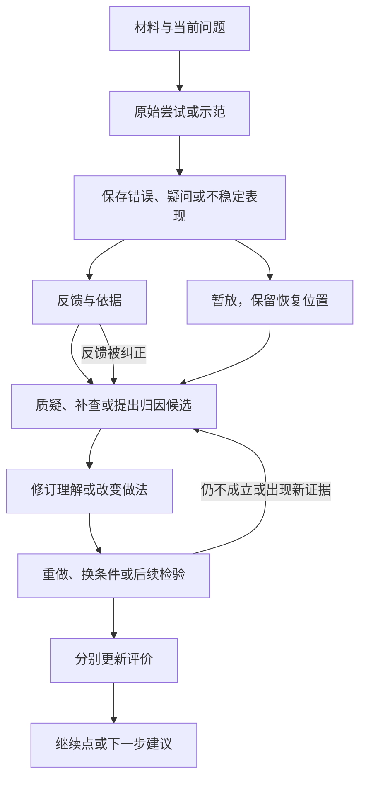

# 纠错本与能力增长：完整过程保留方案 v0.1

日期：2026-09-12。任务：TASK-20260912-001。

状态：讨论整合稿。用户认可保留整套思路；本稿保存共识和设计建议，具体交互、字段与自动分类尚未冻结，不代表C06已施工或验收。

关联：[学习台设想](three-desks-v0.1/LEARNING.md)、[小满参考的结构提炼](../audits/2026/09/2026-09-11__kaoyan-deep-review/STRUCTURE.md)、[及时反馈补充](2026-09-11__research__learning-feedback-xiaoman-reference-note.md)、[Astra三场景](2026-09-11__research__knowledge-network-scenarios-astra-v0.1.md)。

## 1. 要保留的整体

用户希望考研学习、科研与工程实践分别评价，同时重视能力增长，尤其是科研和工业实践能力。先有真实可用的纠错本，再从案例中形成分类；保留整个过程而非只存最终正确答案。

完整过程包括：材料与问题、原始尝试、当时条件和帮助、反馈与依据、用户质疑、归因候选、修订或补救、后续尝试、各自评价、下一步以及未解决之处。关系要能追溯、能恢复，历史不因后来改对而消失。

保存的是已有的可见材料、推演、对话片段和产物。无需记录每个按键、强制上传全部私人对话，或追索模型隐藏思维。用户可选择保留范围；纸笔页、代码位置也可引用，不要求重抄。

## 2. 两本分开使用，评价分别成立

考研纠错本、科研与工程纠错本提供不同入口和评价方式。同一次活动、材料或产物可以被两边引用；各自的解释和评价保留，修订不互相覆盖。不为了两个入口复制出两套知识网络。

| 评价面 | 回答什么 | 不能替代什么 |
|---|---|---|
| 考研学习 | 哪里失分，限时独立作答能否改正，是否理解与保留 | 不能直接代表研究或工程能力 |
| 科研工作 | 问题是否值得追，论证与证据是否成立，实验是否支持结论 | 学到很多不能使失败结论成立 |
| 工程与工业实践 | 能否实现、调试、测量和交付，怎样处理性能/成本/可靠性等约束 | 了解公司和产品动态不能替代实践能力 |
| 个人能力增长 | 在什么条件下，我能独立做到什么，哪些依赖帮助或未验证 | 成果正确不能自动证明由我独立完成 |

这是评价面的区分，不增加四个台或要求四套数据库。科研与工程本内可按具体任务展开不同标准；统一总分暂不设计。

“分开算”也不等于按主题自动路由。阅读论文可能主要产生个人学习证据；同一次反例构造可以同时产生学习证据和研究证据。

助手执行偏离需求、工具流程错误应记录到工作流改进中。责任归属另记，不能将助手失败转成用户能力缺陷。此类记录可与同一活动关联，不因此再建一个顶层台。

## 3. 一条记录怎样生长

图表达可发生的连接，不是必须逐步填完的流程。首次保存只需正文或引用；每个阶段都能暂放。不能因缺少正确模型、根因或识别线索而拒绝记录。

### 3.1 允许进入的情况

- 已确认错误。
- 结果正确但理由可疑。
- 原题会做，换条件就不会；熟题能做，独立新题未检验。
- 结果与预期不同，还不知道哪里出问题。
- 用户质疑反馈，尚未判定谁对谁错。

### 3.2 保留的内容按需要补

| 内容 | 作用 | 填写边界 |
|---|---|---|
| 原材料、原尝试及版本 | 看清当时实际发生什么 | 尽量复用已有引用；原稿不被范文覆盖 |
| 题目条件、帮助与参与者 | 区分独立操作、提示、示范、协作 | 可未知，不把未记录默认成独立 |
| 反馈、来源与依据 | 知道哪一步被指出、为何 | 反馈可错，可质疑和更正 |
| 当时解释与归因候选 | 保留理解如何变化 | 候选不是已证实根因 |
| 后来的修订与行动 | 知道改变了什么 | 正确模型允许继续被修订 |
| 后续尝试与结果 | 检查修正是否成立、是否保留或迁移 | 改稿、熟题重做、新情境验证分别描述 |
| 继续点与未解决处 | 降低中断后的恢复成本 | 不强制产生任务或排期 |

归因、材料类别、反馈可靠程度、处理进展和能力评价不是同一个轴。具体字段名、状态机及存储模式由真实案例再验证。

## 4. 什么算“解决”

“有了新解释”“本题修正”“研究结论得到支持”“工程修复通过”“我能独立迁移”分别成立。页面可以显示已经检验到哪里、哪些仍未知，避免一个“已掌握”按钮覆盖全部判断。

- 考研：在明确帮助与时间条件下，用新题或变化题检查；熟题重做有价值，但不当作全部迁移证据。
- 科研：针对具体主张、条件及依据检验；反例可能推翻旧结论，也可能打开新问题。
- 工程：按故障复现、改动及任务验收观察结果；修复有效与个人能独立修复分别记。
- 方法改进：保留建议、采纳、实际使用及后续观察；一个步骤成功不足以证明方法普遍有效。

新证据可以重新打开记录。暂放不等于解决，也不持续催促。正常学习与成功案例也进入能力回顾，纠错本不是能力证据的唯一来源。

## 5. 分类从案例中长出来

初期按材料、目标、时间、未解决项找回记录即可。用户可加标签，允许多标签与修改，不要求每条选一个根因类型。

后来系统可提出关联：展示原记录和相似依据，让用户决定是否合并归类。区分同一知识主题、相似表现与相同错因；不能把“同章连续低分”直接解释为“第三次犯同一种认知错误”。

两个概念保留区别：

- 重复薄弱信号：哪些材料或技能值得回来检查。例如某章多轮表现较低，还要考虑难度、轮次和帮助条件。
- 下次识别线索：在具体解题或工作中，什么时候应启动某种检查。例如自己添加了原题没给的连续性条件时，回到题设核对。

系统可以从前者提出后者的候选，但须有案例和检验支持；不强迫用户为每次失败填写recognition cue。

不预先把考研条目分成“过关就废弃”与“真正能迁移”。当前考试收益与将来迁移分别描述；迁移未知就留未知。

## 6. 失败记录怎样被使用

不设全局经验价值分、不按所谓低信息量删除原记录。一条记录是否够用，要相对于本次用途判断。

| 使用方 | 所需证据 | 可以输出 |
|---|---|---|
| 回顾与恢复 | 原尝试、问题、继续点 | 回到当时位置，指出重复现象 |
| 复测建议 | 技能/题目、结果、轮次、间隔和帮助 | 建议检查保留或迁移 |
| 指导推荐 | 具体卡点、候选原因、以往使用反馈 | 提出可试的方法，不自动诊断根因 |
| 置信度回顾 | 作答前自报与可比较结果 | 指出判断偏差；事后感受不冒充预测 |
| 讲解调整 | 哪种说明之后，在何种条件下做到了什么 | 调整下一次提示与例子 |

“反馈详细”不等于“反馈可靠”。二元反馈有其用途；错误定位还需依据。CoE等论文的效果与数值未在本稿核验，不用来替代我们自己的应用标准。

## 7. 与整体架构连接

| 部分 | 职责与连接 |
|---|---|
| 共用内容与多层知识网 | 复用概念、方法、来源和产物引用；记录与相关节点连接，不将个人错误直接写成世界事实 |
| 学习台 | 承载考研、基础、科研训练等实际学习；展示尝试、纠错、能力证据和学习建议 |
| 科研台 | 对同一活动的研究问题、主张、条件、证据及取舍独立评价；允许从失败发展新问题 |
| 指导库 | 提供方法及使用记录，连接这次为何选用、是否用过、哪里不适用、之后观察 |
| 工作台 | 管理需要的排期、委派、依赖、资源、执行回执与恢复；常规作答/反馈直接进行 |

工业实践包含实现与交付能力，不能只接公司/产品观察。两本分别评价不意味着科研学习搬出学习台。地图与菌丝探索可从同一网络打开相关案例；这份稿不新增全局关系白名单或通用事件平台。

## 8. 界面过程建议

当前材料/草稿旁提供“留进纠错本”，把已有引用和反馈关联过去；无需另抄一份。用户只需补当下最重要的疑问。

单条详情可分为“当时—后来—再检查”，展开可见原记录、版本和依据；默认呈现当前继续点。纠错本总览先支持继续未解决项、按资料或目标找回、查看待检验修正。

状态评分、时长和细分类可以简化或停用；历史仍可查，未记部分显示覆盖未知，不自动记零。提醒可忽略或关闭；已授权的常规学习步骤不重复确认。

## 9. 两个走查样例与反例验收

以下为设计样例，不冒称用户真实尝试。

**考研样例：** 原推导得到某个结论；AI指出错误；用户发现反馈漏了题设条件；补查后更正反馈；换题独立完成。原尝试、错误反馈及其更正、后续能力证据均可找回。不能永久把它计成用户的能力缺陷。

**科研/工程样例：** 对某方法的实现输出异常；初步怀疑算法不成立，复现后定位到实现问题；修复后结果通过当前任务检查，研究主张仍需另外的对照与条件检验。若修复主要由助手完成，记录协作结果，不自动赋予用户独立实现能力。

| 场景 | 验收应看到什么 |
|---|---|
| 只有一句“结果不对” | 可立即保存，不要求根因或完整分类 |
| 反馈后来被推翻 | 原反馈及更正关系可查，责任不自动归用户 |
| 提示下成功，独立新题失败 | 两次条件和证据并存，评价能修订 |
| 同一活动进入两本 | 共用材料/产物，各自评价，不重复抄写或互相覆盖 |
| 推荐了方法却没用 | 与真正使用及后续有效性分开 |
| 同章多次失败 | 可提出待核关联，不自动断言同根因 |
| 用户暂停记录或提醒 | 历史仍可用，不催补、不把缺失算成零 |
| 中断再回来 | 能找到原材料位置、当前解释与继续点 |
| 成功迁移或主动发现风险 | 能进入能力回顾，不必先制造一条错误 |

## 10. 已收敛与待验证

已收敛方向：整套过程可追溯；评价分开而材料共用；低门槛保存；反馈可纠正；分类可选且可修订；补救要接回后续观察；能力证据覆盖成功与失败；仪表可退场。

待验证：具体界面、哪些内容自动关联、轻量观察怎样接现有Attempt/Feedback/Revision、历史引用如何锁定版本、各评价的最小字段、关联提示的主动程度、提醒节奏、归类与复测规则。

下一步只选一条用户认可的考研案例和一条科研/工程案例，走“进入—存疑—修订—再检验—回来继续”的完整过程。用既有草稿或工作产物即可，不批量扫描旧日志，不先校准复杂评分模型。之后再给C06形成有具体样例和验收条件的增量方案。

本稿保留讨论与下一步，不覆盖冻结合同、不启动应用施工、不改既有私有记忆、不commit/push。Fable/Sol可从本稿接续，须区分以上共识、建议和未验证项。
