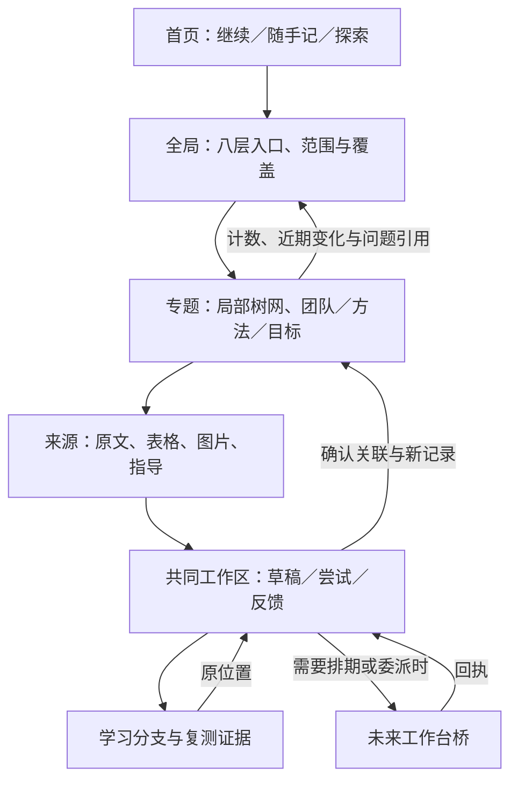

# RD-2 详细施工手册 v0.3

2026-09-11 · TASK-20260911-001 · 施工计划，不是实现回执。

## 1. 目标、权威与原成果

用户要的是可持续探索、连接、学习、形成研究议程的工作空间。已有导航解决“材料在哪”，P1解决“保存与接续”；本轮首先补“从地图和资料进入工作，产物能回到地图”。不推翻现有底座。

权威顺序：当前用户指令 → 本入口限定的执行波次 → 本手册及 CONTRACTS/ACCEPTANCE → 三台职责 → 旧需求原文。旧回执描述历史事实，不能覆盖新需求；旧编号必须带文档命名空间。冲突只记录具体条目，不把全库重审作为前置。

既有技术证据：three-desks-v0.1 的 P1 回执报告浏览器120/120、Legacy25/25、后端17/17；本手册编制没有重跑。P1用户验收仍开放。应用无独立 Git 仓的状态已核；实施者仅核自己涉及的文件是否变化。

三台边界：科研台负责领域探索、问题形成、路线与研究判断；学习台负责个人能力形成；共同工作区提供阅读／草稿／尝试／反馈；工作台管理任务、依赖、资源、交付接受和恢复。普通阅读、手推、编辑不经调度。一次活动可同时支持学习与研究，两种评价独立。

## 2. 用户会看到的结构

第一波 UI：

| 工作面 | 必须可见 | 主动作 |
|---|---|---|
| HOME | 继续／挂起、随手记录、探索地图、搜索资料 | 一步进入已有工作区；不把新旧继续列表混成同一状态源 |
| GLOBAL | 学术／工业两线、八层入口、领域尺度、来源波次、当前实现／覆盖状态 | 选定范围进入专题；进入旧Map来源；查看本轮确认的变化 |
| TOPIC | 中心问题／对象、关系类型、树网、内容列表、来源、返回路径 | 点选、按类型展开／折叠、建立关系、进入原工作区 |
| WORKSPACE | 原段与草稿、尝试／反馈、当前专题、指导引用入口、继续点 | 保存、明确连到目标、挂起、返回原专题 |

普通界面使用中文含义与标题；ID、revision、导出引用详情放可展开信息区。图旁提供同一对象集合的列表，窄屏可以用列表操作；桌面至少显示可点击的节点和带类型的边。第一波不自建拖拽共同画布、不做3D。

七图是视角：Knowledge、Method Landscape、Idea Genealogy、Transfer、Researcher Competency、Research Identity & Fit、Research Trajectory。可共享数据，不能把七个标签指向完全相同的无差别列表并声称已实现。

## 3. 波次、依赖与开始条件

| 包 | 对用户的增量 | 前置 | 当前执行级别 |
|---|---|---|---|
| C00 | 可靠数据位置说明、可回退的本轮版本 | 当前代码与配置 | 第一波可执行 |
| C01 | 搜到资料即可开始，摆脱手填ID | C00 | 第一波可执行 |
| C02 | 人工关系、AI提案、同对象多目标引用 | C01对象及来源稳定 | 第一波可执行 |
| C03 | 全局—专题—工作区—全局往返 | C02 | 第一波可执行，交付后停 |
| C04 | 搜索计划与覆盖、学术／工业路线的实际比较 | C03使用反馈 | 后续详细包，待下发 |
| C05 | 指导库配方与本次使用回链 | C03；指导来源可定位 | 后续详细包，待下发 |
| C06 | 基础／课程与能力证据的学习闭环 | C03；C05非硬依赖 | 后续详细包，待下发 |
| C07 | 失败、转向、成果继承与地图维护 | C04、C05；学习投影用C06 | 后续详细包，待下发 |

第一波允许连续跑四包；每包相关验收通过再依赖其结果。自评可作为下一包技术前置，但不得改名独立验收。必要项未测或失败时停止依赖它的包，可继续不依赖部分。用户反馈门在C03之后，不能让尚未获得的反馈被模拟数据替代。

### C00：维护说明、隔离配置和版本基线

问题：应用 MAINTENANCE.md 称runtime可删，config.local.json却把记录及导出指向runtime/rd2-demo。修正文档，不删除、不迁移现有记录，也不修改原配置。说明“看实际配置的数据根，不能凭目录名决定可删”。

步骤：

1. 核 app/research_desk.py、research_service.py、record_store.py、static 三文件、相关测试和 README/MAINTENANCE 当前状态。记录拥有的文件清单。
2. 当前应用未独立版本化时，对拟改文件保存before，列新增文件，最终生成可读changes.patch。已成为独立仓则记录该仓基线和scoped diff；不git init或采收他人工作。
3. 生成本轮 config.build.json，复用现有配置字段：research_data_root、research_export_root、runtime_root、log_root分别指向验收根的data、exports、runtime、logs。来源只读，host=127.0.0.1，port选择未占用端口并记录。
4. README和MAINTENANCE补当前权威数据、启动、停止、备份与恢复说明。SQLite使用一致快照；用新建演示记录在另一新目录恢复，并核对象、历史、关系和继续点。此时无关系，C02后补同一恢复场景。
5. 给未来长期使用列路径候选和迁移步骤，明确未执行。备份与维护不建新服务或自动轮转平台。

产物：before、config.build.json、CONTRACT_DELTA的基线节、修订维护文档、C00验收。完成前不把沙盒称正式个人库。

### C01：自然来源入口与返回

步骤：

1. 在现有搜索结果／资产详情／指导来源详情增加“开始记录”和“加入已有工作区”。选择器显示标题及来源，内部携ID，不要求用户输入。
2. 工作簿用现有表选择与单元格／范围控件；保留Sheet18→sheet12.xml。文字预览选择原段后可以开始；第一波支持已登记Markdown/TXT及工作簿文本。
3. PDF／图片可引用整个已登记资产并打开原件；没有解析器时明确“整份来源，尚未定位段落”，不得伪造页码、OCR或原文选区。
4. 新建和加入沿现有Workspace/View/entries事务。SourceRef沿真实source_id，asset_id单列；源文字只读，用户草稿独立。
5. 保存出发上下文：来源／专题、筛选、选中项与已有view。返回恢复原位置；退出前未保存沿P1处理。
6. 工作区内随时打开来源和原专题；来源不可用仍能看自己已存的记录，不偷偷换同名资料。

样例：Sheet1!R6、Sheet18!A14:A43及一个已登记、非受保护答案的MD/TXT材料。Sol仅从catalog定向选一份，记录实际ID；不可读则记partial，不用虚构“论文已接入”。

产物：自然入口、来源控件、返回状态；C01验收。新增来源接口和anchor的具体合同见CONTRACTS。

### C02：关系、提案与多处引用

步骤：

1. 用现有对象承载relation/proposal/decision，避免同时再建一个关系权威库。正式关系、提案生命周期均由ResearchService明确动作维护。
2. 用户选两个对象、类型，可附“我的未验证联想”，直接建立关系；不要求每次联想已有论文证据。确认保存不等于科学命题为真。
3. 支持 references、prerequisite、method_analogy、historical_influence、complements、goal_member、result_of。反馈继续沿attempt_ref，避免新增一份反馈权威。
4. AI提案先支持添加关系、添加TODO、添加标记三种。使用显式DEMO提案验证；接受必须事务写决定＋产物＋提案状态，重复接受返回同一产物。
5. 同一个对象连到两个目标／专题，移除一个归属只撤回该关系。查看撤回历史可恢复原关系，不硬删对象。
6. 草稿线保存在View.draft_edges；人工确认类型后才成为正式边。View位置、折叠、选中不改变语义。第一波通过按钮连线；拖拽协作另包。
7. 关系依据与否定／修改解释可查；旧revision冲突保留用户输入，接受过期提案须重新比较目标后明确提交。

产物：有类型的关联编辑区、提案待处理区、原子状态动作、历史与选择导出适配；C02验收。不得通过直接改SQLite种出一套“假装从界面创建”的演示。

### C03：三尺度地图贯通与完整范围入口

步骤：

1. 全局保留原八层、L0/L1/L2与W1–W7身份；学术和工业独立入口。八层每层显示“来源／覆盖日期与范围／可用动作／缺口”，不能拿资产数当覆盖率。
2. 选择一个已有真实主题作贯穿样例。优先现有Map中的EdgeIM相关方向；只引用公开或已登记非受保护材料，个人作答用DEMO。至少包含问题、资料、概念／方法、两个目标、一次尝试反馈、待确认提案。
3. 用原生SVG或现有无需新增安装的能力显示专题局部图；节点点选、按边类型展开／折叠、换中心、返回原中心都可用。布局与正式关系分别保存，不承诺自动语义聚类或自由拖拽。
4. 从专题进入来源／工作区，新增并明确关联记录后，返回专题和全局能看到它。只是随手保存、尚未确认归属的内容留在自由记录区，不自动入图。
5. 八层各有不同观察目的，至少“脉络／团队／方法比较”允许通过同一主题查看对应类型的记录或明确数据缺口；其余层可打开对应旧来源和当前工作入口，标清“来源接入／交互待完善”。不能宣称八层动态适配全部完成。
6. 七图给出不同投影定义、实际对象去向和状态。Knowledge读取概念与依赖；Method读取类比／互补；Genealogy读取来源支持的历史关系；其余沿TRACEABILITY后续包显示待完善，不伪造熟练度与个人身份得分。
7. 桌面与窄屏走同一条路径；用户不需要复制ID或读施工文档。导航保留来源与用户记录区别，工作台区域只显示尚未接入的真实状态。

产物：可操作GLOBAL/TOPIC/WORKSPACE、贯穿样例、需求状态、使用指南、技术与产品路径回执。第一波结束后停；C03不是完整七图／工业知识库／学习评价系统完成。

### C04：搜索方案与学术／工业探索

后续包；启动前纳入第一波用户指出的入口摩擦，冻结本包小主题与资料范围。分C04a搜索计划、C04b路线比较，两步各自交付。

C04a：支持从空主题创建目标、已有认识、查询词／实际prompt、渠道、时间范围、排除条件、已查／未查／不可达、候选结果、下一步。沿companion-survey四份brief提炼“模块×渠道、广度→枢纽引用链→增量”，不重跑人机恋主题。来源可人工录入；无网络工具时交计划与本地引用，不称已联网检索。

C04b：学术记录与工业记录分别维护。学术区看团队、同期工作、方法谱系与论证；工业区看产品／实现版本、公开时间、部署约束、成本证据、失败／停运和路线变化。企业论文可同时引用，不复制正文。宣传、作者自报、独立实测与未知分开。

产物：搜索计划编辑器、覆盖表、一次有依据的学术／工业对照；已知来源可回原文，候选问题能回专题。不要把相似度当方法迁移、把零命中当全球空白、把团队转向原因靠猜测补齐。

验收：AC04；本包不接自动爬虫、联网API、来源定时任务或自动生成选题评分。新外部搜索另获具体范围后执行。

### C05：指导库从“能找到”到“用过后能回看”

承接已有G1-a–e，不重建新理论。分C05a来源对账、C05b配方与调用、C05c一次实际使用。

来源对账只读pengsida、CCF、W6、Supervisor等已登记位置；保存原文／本地摘录／二次适配／待补的关系，BR-15已有OCR／访谈任务不重复开。pengsida保留阅读、创新、实践、写作、协作、系统性科研六面。

先做论文定位、轻类比→迁移审计、资产继承三条配方。每条包含适用问题、步骤、原来源／版本、限制和退出方式。工作区能选用、隐藏、记录用途／不适用处／反馈；用途引用本次活动，而非只给旧条目增加“used=true”。

学习模式先允许用户尝试或请求讲解；协作研究模式可存AI草稿并明确来源。指导关闭后记录仍可读。没有真实用户反馈时C05c保持USER-OPEN，演示只证明功能。

产物：来源差异表、三配方、侧栏调用、使用记录与原版本回链。验收AC05；不强制时长、不修改原学习门禁或受保护答案。

### C06：学习台专有闭环

分C06a基础／课程组织、C06b学习证据、C06c返回与建议。考研、科研训练、兴趣是同一学习系统的不同目标范围。

课程／目标记录范围、资料和章节；学习前置、课程顺序、个人本次路线有不同关系，不把概念图强制当课程树。允许没有论文／项目的基础分支。

尝试可记录题目／输入条件、first或repeat、提示／独立／AI示范、本人产物、反馈、复测／迁移引用；全部围绕实际动作逐步填写，不增加必填问卷。熟练度先显示证据，不生成数值模型。探索覆盖单独显示。

从论文发现前置问题，开学习分支后能返回原段。一次活动可同时引用学习评价与研究判断，两者有独立依据和修订。下一步建议可忽略／修改／挂起，不自动进日程。

产物：独立基础入口、课程范围视图、帮助条件与复测证据、两种评价、往返。验收AC06；kaoyan只作待核经验来源，不直接采用作者时间比例或自动掌握算法。

### C07：失败、转向、成果继承和主动维护

分C07a过程回看、C07b下一问题、C07c维护。保留当时草稿、失败观察、反馈、后来解释和修改原因；外部公开草稿、我们的教学重建、模型可见回答分开，不索取隐藏思维。

结果关联原问题、使用的版本与方法、已否定解释、仍未知处和下一问题。失败原因可以未知，失败案例可供另一主题引用，不复制整套日志。把对自身工作流的优化也作为普通研究对象，比较条件与观察，不凭未核CoE数字改变Agent上下文策略。

维护由用户主动打开：待整理记录、来源失效、待核关系、可能过期的搜索范围、挂起分支。展示谁／何时／依据何版本改了什么；人工重连与撤回保留历史。索引重建不能覆盖决定、草稿和用途记录。不要增加默认提醒或后台无限搜索。

产物：过程时间线、成果继承、待维护列表、一次纠错回流。验收AC07。

## 4. 专项包，不能顺带实施

| 专项 | 开工需要 | 必交产物与验收 |
|---|---|---|
| X-CANVAS | 用户指定飞书／Miro账号与可上传样本 | 同样本板、导出、ID映射；拖拽／连线／折叠／协作／提案；移动不改语义。采用何者依据实测 |
| X-3D | 选表达目的、可用渲染器及许可 | 同对象2D/3D切换、选中遮挡、固定布局／相机恢复；高度／模糊有明确含义，不编能力分 |
| X-DISPATCH | 核旧工作台当前接口／权威及写域 | 请求→run→验收→原活动；重复请求不重复派发；断连显示未发送；普通读写不受阻 |
| X-TASKQUAY | 本地沙盒范围与服务配置 | 一次真实委派与回执；不因进程存活判成功。Tunnel／ChatGPT接入单独选型 |
| X-REPO | 代码／样例／资料入仓范围 | 独立版本化、排除私人内容、可审差异；不把外层HEAD当应用版本 |
| X-DESKTOP | 真实日常摩擦与选定产品形态 | 启动／关闭／本地文件／离线／升级／恢复实测；Cursor继续用于代码审查，CLI继续执行 |
| X-DEPLOY | 正式数据、访问者、成本、备份／恢复／同步冲突合同 | 一次恢复演练、迁移清单、部署回执；不默认采购或开放公网 |

## 5. 实施写域、版本、回执和接续

应用允许范围：app/research_desk.py（路由）、research_service.py（领域动作）、record_store.py（必要查询与事务）、static/{index.html,app.js,styles.css}；可按职责新增一个map_view.js与一个domain_views.js并登记静态路由，不拆框架。已有tests只按本包声明风险扩展相关检查，不建新测试框架。允许README.md、MAINTENANCE.md的当前使用／维护说明修订。

验收根：`/mnt/d/MyResearch/research-desk/acceptance/c03-<唯一标识>/`，放config.build.json、data/、exports/、runtime/、logs/、before/、changes.patch、evidence.json、必要截图。分包沿同一受控演示库接续；重启和恢复用其派生的新演示库，不拷真实库。以后波次另取验收根。

文档根：本目录`sol-delivery/<唯一标识>/`，仅允许写自己的：

- RECEIPT.md：首行complete/partial/blocked，包、实际身份与未知、基线、修改文件、逐项结果、限制、自评／独立、未完成、下一步。
- CONTRACT_DELTA.md：实际接口／attrs字段、版本兼容、输入输出例子、相对本合同的必要差异；先写承重部分再改相关代码。实现细节可自主定，不再开启总体架构讨论。
- USAGE.md：准确配置／端口／启停方式、首屏入口、无ID操作路线、冲突、备份恢复及数据位置。提供新用户入口与DEMO样例入口，不后台自动污染用户库。
- REQUIREMENT_STATUS.md：R01–R27逐项，入口／产物／验收ID／证据／覆盖程度／后续包；“原资料未改”和“已融合使用”分开。

共享台账由编制／接收主控维护；Sol仅写自己回执及自己获准的任务记录，不改旧验收、上位合同、CROSSWINDOW或整库TODO。身份不可核不冒充；模型effort未知按适用本地规则不发起无人值守批量，把未知记录后交用户在场执行，不凭昵称或配置推断。

中断或上下文不足：先更新同一RECEIPT的当前包／最后成功动作／改动文件／配置与服务PID／下一条命令／未通过项。恢复只读该回执、本包章节与受影响源码。服务已结束则明确已停止；只停止自己启动的服务，不碰8899和他窗服务。

回退先保留新记录及一致备份，只撤自己的源码差异；不通过删除数据恢复旧程序。新增字段旧P1应保留未知attrs；若新类型旧版不能展示，USAGE说明最低阅读版本与导出途径。导出是快照，不承诺可回导或整库恢复。

费用控制：每包先复用已核来源；相同失败外网条件不反复访问。明确下包依赖后再读材料。一次相关检查通过，无新变更不重复全套检查；C03最后做一次完整回归与产品路径检查。
