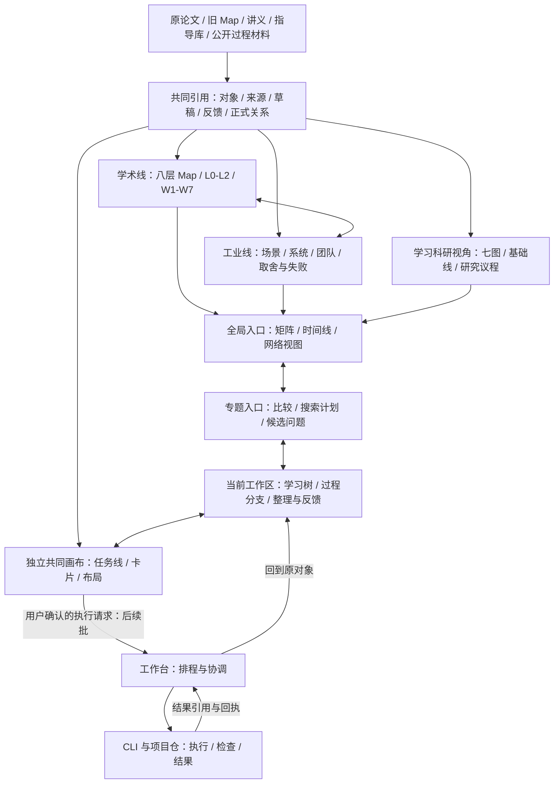

# 科研台首批施工包 v0.2：页面、样例与开工选择

> **后续规划已整理：[三台总体方案](../three-desks-v0.1/README.md)**。WB-1两份文档和B1a后端已另有回执，不能再按下文早期“尚未施工/先WB-1”恢复。学习台作为主要深入工作入口、科研台探索与判断、工作台调度的分工见新包；用户要求规划完即停，未来计划不自动执行。本稿及其旧选择保留为历史施工输入。

2026-09-10 · TASK-20260910-001 设计续段 · RD-2 · 会话 01a08005-01ad-7921-b696-1cd455f6434b。
状态：DESIGN-DELIVERED / REVIEW-PENDING / APPLICATION-NOT-CHANGED。

> **用户已要求暂停，执行交接从[SOL_START_HERE.md](SOL_START_HERE.md)开始。** 当前只落盘方案，不继续开发；第一包是工作簿Sheet1/18的有界真实来源样例，文档写域、验收、约束与后续代码选择均已明确。

本轮用户要求继续把设计收敛为具体施工包；另提出 Understand-Anything 自用立体化，并提供官网及 demo。三维形式、桌面壳、存储方案尚未选定。“继续”授权本轮设计，不把下列候选当作已经批准的应用改动。

本包承接[开发合同 v0.1](../2026-09-10__research__research-desk-first-development-contract-v0.1.md)，细化交互、数据和施工依赖；遇到差异，以本包明确列出的**待审变更**为新建议，旧决定不被自动撤销。

## 1. 本次交付与边界

| 文件 | 可以审什么 |
|---|---|
| 本页 | 三个页面、完整操作过程、三维候选与待选事项 |
| [REQUIREMENTS.md](REQUIREMENTS.md) | 原需求逐项来源、功能去向、批次及验收，区分用户需求与助手实现提案 |
| [DATA_CONTRACT.md](DATA_CONTRACT.md) | 对象、关系、布局、版本、提案确认、存储与接口样例 |
| [sample.json](sample.json) | 完全虚构的闭合样例，可供后续实现者用同一份输入对照 |
| [IMPLEMENTATION.md](IMPLEMENTATION.md) | 执行顺序、具体候选写域、分工、验收、回退与回执格式 |
| [REFERENCE_REVIEW.md](REFERENCE_REVIEW.md) | 一个只读执行位的定向核验结果、网络阻塞和主控纠正 |
| [WORKBOOK_INTEGRATION.md](WORKBOOK_INTEGRATION.md) | 工作簿18表的真实登记、逐表用途、图片/重复边界与真实来源接入验收 |

应用 `research-desk` 的导航/搜索首版已经存在；本包没有增加编辑、图谱、三维或工作台功能。纸面场景可走查不等于运行验收通过。所有样例均是演示，不能写回学习成绩、真实论文结论或工业案例库。

## 2. 完整结构：内容、视角与入口



八层、七图、L0/L1/L2、W1–W7 各有含义，**不能叠成一串三维高度层**。L2 原本是交叉带，也不等于“当前工作区”。工作区可从任何尺度的论文、项目、基础问题或兴趣出发。

首批把八层与七图原件接入导航，并走通一份真实可编辑样例；不把仅有入口的矩阵、雷达、指导库适配称作已实现。全量动态接入在 B3，逐项验收见需求表。

## 3. 三张低保真页面

### P1 全局：我在看哪个范围，还能向哪里探索

```text
科研台   [继续上次] [随手保存] [搜索对象、来源、旧资料]
主入口   学术线 | 工业线 | 学习与个人位置 | 共同画布 | 资料库
范围     当前：全部关注领域   [L0/L1/L2] [来源波次 W1-W7] [覆盖说明]
视角     分区 / 脉络 / 团队 / 成果对比 / 困难 / 动向 / SOP / 工程实践
┌──────────────────────────┬────────────────────────┐
│ 当前视角主区              │ 当前选中：某个问题域    │
│ [矩阵] [时间线] [关系图]   │ 来源与更新范围          │
│                          │ 代表问题 / 团队 / 工业侧│
│ 领域 A ─── 交叉带 ─ 领域 B│ [进入专题] [展开邻居]   │
│        ↘ 候选问题          │ [形成搜索计划草稿]      │
│ 未覆盖区域明确显示        │ [加入我的关注]          │
├──────────────────────────┴────────────────────────┤
│ 继续点：DEMO 工作区 · 静置分支：2 · 待审提案：1      │
│ 个人视角：知识 / 方法 / 谱系 / 迁移 / 能力 / 适配 / 轨迹│
└───────────────────────────────────────────────────┘
```

动作：选领域只改变当前选择；“进入专题”保留来源视角和筛选；切到工业线仍可沿同一问题寻找对应实践。对某分区没有资料时显示当前覆盖为空，不推断领域空白。网络图的坐标不决定学术归属。

原件入口首批可用；“形成搜索计划”首批只保存草稿引用，渠道执行与覆盖维护在 B3。无法使用的按钮明确标“后续”，点击进入范围说明，不呈现成功回执。

### P2 专题：围绕一个问题横向、纵向展开

```text
全局 / DEMO：结构摘要保留什么？                     [返回原位置]
[问题×方法] [团队与同期] [工业实践] [谱系] [菌丝] [搜索与盲区]
┌──────────────────────────────┬────────────────────────┐
│         集合 ─ 结构摘要        │ 选中：Q1               │
│           ╲      │            │ 问题：保留边能恢复次数吗│
│ 计数比较 ─── Q1 ── 演示资料    │ 来源：演示，无真实引文  │
│           ┆                  │ [进入工作区] [展开…]   │
│      迁移候选（虚线）          │ 展开：前置 / 前身 / 同期│
│                              │ 方法类比 / 互补 / 工业 │
├──────────────────────────────┼────────────────────────┤
│ 视图 [2D] [3D：候选] [固定位置]│ [加入目标] [保留分支]  │
│ 已确认边 3 / 待审边 1         │ 指导：选一条方法并记录用法│
└──────────────────────────────┴────────────────────────┘
搜索与盲区：目标｜查询/渠道｜已查范围｜未查范围｜依据｜下一步
```

“展开”首先展示已知有来源的邻居；没有材料时可以留下疑问或搜索草稿，不自动发动 Agent。类比可先记一句模糊联想，只有要把它用于研究判断时才补对应、不对应和检查条件。方法相似、历史继承、共同目标下互补是三种关系。

目标归属、语义连接、画布位置分别操作。拖动后位置可固定；拉出一条线先选“保留草稿线 / 建立语义关系 / 加入目标”。用户主动确认可建立正式关系，AI 候选仍进入提案区。完整拖拽属于画布试验/选型后的范围，首批表单操作不能冒充拖拽验收。

### P3 当前工作区：学习、尝试、反馈和接续

```text
专题 / DEMO 工作区                  已保存 r3   [导出] [挂起]
┌──────────────────┬──────────────────────┬────────────────────┐
│ 本次展开路线      │ 来源 | 草稿 | 过程历史 │ 关联 / 指导 / 提案  │
│ Q1 当前疑问       │ 草稿 D1（演示）       │ 引用：演示材料 S1   │
│ ├ 前置：集合      │ “同一边重复三次，     │ 前置：集合、计数    │
│ ├ 前置：计数      │   摘要是否能还原？”   │ 方法：比较替代表达  │
│ └ 尝试 A1        │                      │ [记录这次怎样使用]  │
│   ├ 预测 / 草稿   │ [保存] [新尝试]       │ 迁移候选 P1         │
│   └ 反馈 F1      │ [记反馈] [追加新解释] │ [接受/修改/拒绝/稍后]│
│ [独立基础单元]    │ 当时草稿与后来解释分开 │ [加入目标] [记待办] │
├──────────────────┴──────────────────────┴────────────────────┤
│ 继续点：下一次比较重复次数不同的两个输入；原因未明可保留未知  │
│ 分支：进行中 / 静置 / 已结束；学习表现：尚未记录，不自动评分  │
└────────────────────────────────────────────────────────────┘
```

选择学习前置时可成为临时中心，再回到 Q1。基础单元可独立创建，不强制挂论文。指导引用需带“本次用在何处”的可选记录，后续能据失败或反馈评估指导适用性。挂起只需保存当前位置；继续说明可选，不强迫写长交接。

手机另一账号使用手动导出包：选中的原文/引用、草稿、明确演示或真实记录身份、继续点；不自动上传，导入修改须展示差异并由用户确认。

## 4. 一条贯通样例与四类入口

样例见 [sample.json](sample.json)，全部为合成数据。即便样例标注“human_demo”，也不代表用户作答或实际学习记录。

| 步骤 | 用户操作 | 可观察结果 |
|---|---|---|
| 1 | 只写“保留边能还原次数吗？” | 保存 Q1；分类、标题、goal 均非前置 |
| 2 | 从 Q1 新建工作区，引用 S1 | Q1 身份不变；S1 显示演示身份 |
| 3 | 展开集合/计数并写 D1 | 前置分支可折叠；不自动改掌握状态 |
| 4 | 添加尝试 A1 和反馈 F1 | F1 指向具体尝试；D1 当时内容可回溯 |
| 5 | 看 AI 的迁移候选 P1，选择稍后 | 正式图不出现该边，待审层可见 |
| 6 | 修改说明后接受 P1 | 决定和正式边一起保存，返回同一个结果 ID |
| 7 | 把 Q1 引用到目标 G1，再从该目标移除 | 只撤回目标归属；Q1、草稿与专题引用仍在 |
| 8 | 在专题固定两个节点位置，回工作区挂起 | 位置、选择、折叠与继续点可分别恢复 |
| 9 | 关闭重开，经全局继续点进入 | 回原工作区；当前解释与原草稿分开 |
| 10 | 导出选定内容，再打开成果对应的过程 | 能看到来源、尝试、反馈和未知项，无本人能力分 |

四条入口都共用上述对象：随便逛逛→自由记录；带问题搜索→方案草稿与覆盖；论文/项目学习→局部路线与反馈；想法研究→候选解释、证据设计、结果回流。后两者也可转回纯兴趣或基础，不强迫产生论文或科研任务。

## 5. 立体化建议及现有选择

用户提出“立体”是新方向，尚未选择三维关系网、山海地形或两者切换；也未撤回“飞书/Miro先验证共同画布”的决定。

建议先验证**同一对象、同一关系、同一侧栏的 2D/3D 切换**：旋转/缩放、选中、邻居展开、节点固定、相机恢复、回到工作区。代码实现需待参考和技术路径确定；本包只有纸面设计。

- 2D 与 3D 共享语义和对象，布局分别保存；从一个视图切到另一个保持当前选择，不承诺二维坐标自动变成有研究含义的高度。
- 山海地形为后续可视化候选：探索覆盖、个人熟练度、时间等维度需各有证据与图例；未知单列，不当零分。不用生成卡片数量推断掌握。
- 深度遮挡时能从邻居列表选择；用户固定的节点不因展开被随意重排；提供回到选中对象与恢复默认视角。二维阅读/编辑始终可用。
- Understand-Anything 官网/demo/raw 在本执行环境均未取得内容；不能声称它已有上述交互或可直接换渲染器。详见核验回执。

## 6. 三项可审选择

| 选择 | 本包建议 | 对施工的影响 |
|---|---|---|
| 日常主入口 | 独立桌面作为长期主入口候选，先验证共用界面；手机先手动文件包 | 桌面壳、进程与更新机制仍要定，不假设已有网页即最终产品 |
| 新编辑数据 | 本地 SQLite，JSON 交换、Markdown 导出；原资料原位 | 取代 v0.1 每对象 JSON 的首选建议，用事务保存提案与关系；待审 |
| 三维范围 | 先做小样本的 2D/3D 探索验证，再决定纳入产品；共同编辑仍沿已选画布试验 | 不把 3D 兴趣直接升级为整套自建画布或撤销外部试验 |

读写闭环与完整地图演进分批进行。独立桌面、三维、服务器都不会成为“今天能先保存问题”的前置，但也不能被悄悄从后续设计删除。

## 7. 当前进度

已交：本包三页草图、追踪表、闭合样例、数据/API 草案、施工分包与验收；一个只读执行位完成本地需求对账和工作簿接入范围核验，网络参考核验为 partial。主控抽查原 Map 八层、L0-L2、Graph 规格、七图和工作簿来源；补18表用途及表名/XML/资产ID映射。工作簿的内容融合与实际使用仍未完成。
未交：UA 源码/交互实测、具体技术选型签收、实际可运行原型、应用新功能、产品验收。下一步是审本页三项选择及样例，再按 IMPLEMENTATION 下发对应写域；不再从头盘点全部材料。
