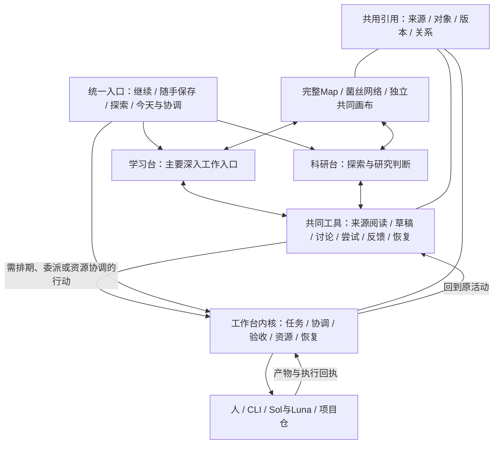

# 科研台、学习台与工作台：现状和总体方案 v0.1

记录时间：2026-09-11 UTC / 2026-09-10 America/Los_Angeles。
关联：TASK-20260910-001 设计续段、RD-2；旧工作台实现沿其独立任务线管理。
状态：DESIGN-UPDATED / C00-C03-CONTROLLER-ACCEPTED / USER-ACCEPTANCE-OPEN。

> P1及RD-2第一波C00–C03均已由Sol实施并获主控独立复跑通过。当前入口为[用户体验说明](../rd2-construction-v0.3/sol-delivery/20260911-sol-c03-113925/USAGE.md)；AC03-12仍由用户实际使用关闭，其余包不自动启动。

用户要求：“感觉差不多？……整理一下具体的情况和方案……写一下工作台和学习台的设想”；随后“继续？写完先”。本包落实文档，不把总体方向的认可当作全部字段、平台和代码施工已批准。

## 1. 从这里读

| 文档 | 内容 |
|---|---|
| 本页 | 当前完成范围、三台职责、共同底座、旧方案差异、未决事项 |
| [WORKBENCH.md](WORKBENCH.md) | 总调度、工作台界面、执行请求与回执、预算、权限、维护和验收 |
| [LEARNING.md](LEARNING.md) | 学习台作为主要深入工作入口：材料、练习、过程、反馈、能力证据和科研回流 |
| [NEXT_STEP.md](NEXT_STEP.md) | 当前用户验收入口、P1技术结果与后续包边界 |
| [SOL_P1_EXECUTION.md](SOL_P1_EXECUTION.md) | P1原实施合同；完成证据从文件顶部进入回执 |
| [RD-2施工手册v0.3](../rd2-construction-v0.3/SOL_START_HERE.md) | C00–C03原施工合同、主控验收和当前用户体验入口 |

原[施工包v0.2](../rd2-first-build-v0.2/README.md)的来源、样例和B1a实施记录继续有效。本包更新三台职责及后续工作顺序；不覆盖旧工作台冻结契约，不要求立即移动代码或资料。

## 2. 当前做到哪里

以下以本次定向只读核验和既有回执为依据；不重新跑应用测试、不探服务。状态快照与旧回执时间分别说明。

| 部分 | 已有证据 | 仍未完成/未核 |
|---|---|---|
| 科研台资产导航 | 现有扫描、搜索、来源/原件定位、工作簿抽取；旧导航回执见research-desk/HANDOFF | 当前全量资产新鲜度未重扫，导航不能代表内容已利用 |
| P1共用工作区 | B1a后端上已实现来源/自由捕获、草稿、Attempt/Feedback、历史/冲突、挂起发现恢复与选择下载；[实施回执](sol-delivery/p1-20260910-sol/RECEIPT.md)及[主控验收](sol-delivery/p1-20260910-sol/CONTROLLER_ACCEPTANCE.md)报告P1 120/120、Legacy 25/25、后端17/17 | 用户实际使用验收、真实长期数据位置与版本采收仍开放；B2关系/提案和3D未实现 |
| 工作簿WB-1 | Sheet1/18已有两份独立映射与[比较表](../rd2-first-build-v0.2/sol-delivery/COMPARISON.md)；P1已接Sheet1!R6及Sheet18!A14:A43准确原段 | 两资产adapted=false/used=false仍不代表用户私下从未用过；其余表的逐批语义融合与真实使用回执仍缺 |
| 学习台 | 已有学习方法、七图、诊断/门禁原材料；通用Attempt/Feedback后端可作为候选基础 | 独立课程覆盖、复测、迁移证据、学习总览和个性化推荐未形成产品 |
| 原科研Map | 原八层、L0-L2、W1-W7、七图及配套资料有明确来源 | 全部动态接入、维护回流、正式语义关系和共同画布仍未完成 |
| 旧工作台v2 | [WP0交接](../../handoff/2026-09-01__workbench-v2-wp0-codex-execution__handoff.md)保存当时隔离实施与TECH/CONTROLLER通过记录 | 异构审/接受/采收等在该回执中开放；本次未核当前worktree合并或8899运行，不声称今天已经部署 |
| 外部参考 | UA官网/demo、virtualxiaoman/kaoyan已由用户明确指定；前轮有界访问失败 | 未获得其源码/许可与真实交互；新讨论中助手对其描述不升级成已核功能 |

当前MAS仓HEAD核到`b76ccafcf350ce70922fb827d35981142caa76c1`，仅用于定位本轮文档检查，不证明独立research-desk代码已提交或被该仓管理。

## 3. 已对齐的方向与本包提案

会话中已基本对齐：学习台作为日常深入做事的主要入口；科研台保留全景、探索、问题形成和研究判断；工作台管安排与协调；来源、知识网络和可复用工具共用。原用户选择继续有效：先自由保存后确认连接、工业线独立联动、AI关系/TODO/标记先提案、画布先飞书/Miro试验、手机另一账号手动带文件、并发最高2。

P1已按[SOL_P1_EXECUTION](SOL_P1_EXECUTION.md)实施并完成主控技术验收；当前用全新沙盒做用户验收。其他活动/请求字段、推荐机制、物理目录、桌面壳和三维范围仍是后续提案。原[0911讨论](</mnt/d/Alkaid/Desktop/0911关于科研台学习台的讨论.md>)末尾的RESOLVED属于该文件里的助手结论，不是本包认定用户确认的凭据。本文遵循本会话后续实际对齐，不按历史助手语气强度冻结设计。

## 4. 职责和拓扑

| 工作面 | 主要目的 | 自己判断的状态 | 典型动作 |
|---|---|---|---|
| 学习台 | 将外部知识转成可使用的个人能力；主要精加工入口 | 做过什么、帮助条件、错误、重建/复测/迁移证据 | 精读、练习、手推、实现、讨论、整理和复测 |
| 科研台 | 认识领域、形成并推进问题、作出有依据的研究选择 | 来源与争议、未知、假设、竞争解释、研究进展 | 搜索设计、脉络/团队/方法比较、工业观察、证据设计与解释 |
| 工作台 | 在时间、资源和依赖约束下协调行动 | 计划/进行/等待/交付/接受，执行身份与预算 | 盘点、排期、分配执行者、接续、回执与交付 |

“主要入口”是界面重心，不限制工具：科研台也可以打开推演/编辑/实验工作区；学习台可从基础、课程、论文、项目、兴趣直接进入，无须先有科研任务。HOME与工作台首页合为一个入口，工作台的完整协调职责保留；任务详情、验收和恢复仍可从入口展开。

工作台作为行动调度底座；内容/关系底座提供共享引用。两者职责不同，知识不必隶属于任务系统。自由探索、静置、未成形联想可以永远没有任务或截止日期。

普通阅读、编辑、手推和已授权的常规步骤直接在共同工作区进行，不必经过调度或逐次批准。学习、科研可用“估计—行动—观察—更新”帮助分析，但不因此预先统一所有字段；独立隐藏变量只是一项参考。新增工作面要检查：独特操作是否长期反复、是否需要不同反馈验收、独立后能否减负、现有页面是否够用。按真实使用证据判断，不机械等待固定周数。

## 5. 对象、活动、任务与状态权威

共享一份来源/产物，不把所有相关活动塞成同一个对象。例如一个任务可包含两次练习、三个Agent运行和一份比较稿，它们各有ID并相互引用。

| 事实 | 权威归属 | 跨台怎样使用 |
|---|---|---|
| 原文/图片/讲义 | 原资料及来源登记 | 各台用稳定ID、版本和锚点引用 |
| 草稿/可见讨论/尝试/反馈 | 内容记录；B1a可承担其一部分 | 学习、科研共同打开，保留作者和当时认识 |
| 个人学习表现 | 学习活动与相应评价证据 | 科研台可看适用范围；工作台只看行动需求，不代评分 |
| 研究关系/判断 | 有依据和修订的研究记录 | 学习台可用于背景与练习；接受AI提案不等于本人掌握 |
| 任务/依赖/资源/交付接受/恢复 | 工作台协调事实源 | 管执行版本、验收者、资源冲突、重跑与恢复；各台引用，运行结束不等于接受 |
| 执行命令/版本/结果 | 项目仓与执行回执 | 回到具体请求/活动；错误归因另作判断 |
| 布局/相机/折叠/当前选择 | 视图状态 | 不改变正式语义或目标归属 |

知识联系、学习前置、个人练习路线、目标归属分别有类型。内容相似不自动成为方法类比，方法类比不自动成为学习门禁，“我不会”不自动成为领域空白。

一次构造反例可以同时产生“我能否独立构造”的学习证据和“原主张在哪些条件下失败”的研究认识。活动和产物共享引用，两种评价分别记录、分别修订；不强制把活动单选路由给某一台，也不自动认定两种评价已成立。知识图提供共同表征；下一步学什么、下一步查什么分别由学习与科研逻辑建议。P1只支持共用记录与观察角度，正式评价模型留到后续。

## 6. 完整科研范围的接续

原Map八层全部保留：分区图、脉络图、团队图、成果横向对比、困难清单、动向雷达、SOP与taste、领域工程实践。L0全域/L1细分/L2交叉带与W1–W7来源波次继续分开；科研台覆盖选题前的开放观察、同期团队和路线、公开失败/草稿/评审、问题选择与成果继承。

七图是共享内容的七种视角：Knowledge、Method Landscape、Idea Genealogy、Transfer、Competency、Identity & Fit、Trajectory。学习台主要维护个人学习证据；知识、方法和研究成长视角可跨台打开。指导库pengsida、CCF、W6、Supervisor、操作符与学徒制材料进入实际使用场景，保留原来源；不因拆台只剩几张来源卡。

学术线/工业线独立且相互引用；企业论文与产品实践可以分属不同观察面。人机恋搜索是历史方案范例，其prompt、渠道、范围、盲区与回流规则用于提炼新任务书，不自动重跑主题。探索度和熟练度独立，3D/地形只决定表达，不能替代这些语义。

## 7. 存储、目录与维护

先明确模块职责，不马上创建三套服务。建议应用代码/脱敏样例、长期内容/附件、项目仓/实验产物、执行回执、运行日志/缓存/机器配置按生命周期分开。跨模块用ID和可解析来源引用；项目原件不为统一而整库复制。

**两个SQLite权威不同**：B1a的desk.sqlite3保存新对象/视图与修订；旧WP0的SQLite是任务日志派生索引，其交接规定task log为唯一事实源。不能因为都用SQLite直接合并库或互相重建。B1a已经实施的局部存储事实应保留；三台整体的物理部署和长期权威分工仍需后续合同。

草稿、失败、反馈和决定是长期内容，不按HTTP日志轮转。界面日常保存应在本地可用；调度服务暂时不可用时允许继续保存，实际派发明确显示未发送。首次实现按单应用模块化推进，未来服务器只接具体已验证的能力。

## 8. 旧方案差异与当前未决

- 科研台专属阅读/草稿/反馈工具改为共同能力，学习台成为主要深入工作入口；无需立即改类名或移动文件。
- 旧工作台WP5的学习投影与未来学习台可能重叠：新提案建议学习解释归学习台，工作台保留任务/截止/回执；正式修改旧契约前单列差异，不静默覆盖。
- 旧Sol入口“下一步先WB-1”已被WB-1、B1a与P1交付取代；当前先按[NEXT_STEP](NEXT_STEP.md)完成用户实际使用验收。
- 三台产品职责基本对齐；P1沿现有本地网页交付，桌面壳、3D形式、全局自动排程程度、长期同步/备份位置另定，不作为P1开工前置。
- 不开展复杂学习统计/自动推荐，先积累有用活动与反馈；新参考源码/学习科学引文仍需定向核验，不能为开工再开启无界综述。

## 9. 本包完成标准

三台职责与共享边界已明确，P1代码、隔离自验和主控复跑已完成。当前完成条件是用户从干净沙盒实际走通一条记录与恢复流程并留下意见；技术通过不自动升级为真实学习、研究或全项目完成。
