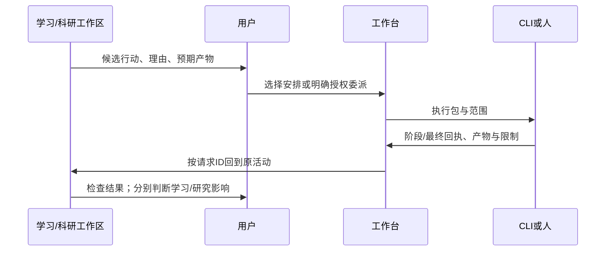

# 工作台设想：统一调度与行动接续

状态：PROPOSED；关联[总体方案](README.md)。本稿描述未来职责，不声明旧8899已经实现这些功能。

## 1. 用户获得什么

打开工作台可以看清：哪些事正在推进、谁在做、等待什么、哪里需要自己判断、今天能安排什么，以及结果回到了哪个原问题。具体阅读和推演可以直接回到学习/科研工作区。

工作台包含两部分：并入HOME的盘点/协调界面，以及供各台调用的调度内核。学习台提出练习/复测候选，科研台提出检索/比较/实验候选；工作台结合时间、预算、依赖和用户选择安排行动。它不替两台判断掌握、新颖性、因果或研究价值，但独立负责任务是否交付、谁验收、依赖是否解除、采用哪个版本、资源是否冲突、如何恢复以及是否重跑等协调事实。合并入口不删去这些职责。

## 2. 首页与任务页

```text
HOME / 今天与协调   [继续工作] [探索] [全部项目] [等待与决定] [执行者] [历史]
领域筛选：全部 / 学习 / 科研 / 通用事务（与下面的任务状态分开）
今日可用安排：用户填写/沿已确认计划        [调整]
┌─────────────────────────────┬───────────────────────────┐
│ 已安排                       │ 等我处理                  │
│ 基础练习 → 打开学习工作区     │ 一条关系提案待看          │
│ 方法比较 → 查看原科研问题     │ 一份执行结果待验收        │
│                              │                           │
│ 正在执行 / 已挂起 / 等待      │ 候选行动（尚未排入日程）  │
│ 执行者、当前阶段、最近回执    │ 复测 / 补查 / 实现小例    │
└─────────────────────────────┴───────────────────────────┘
任务详情：目的｜输入｜依赖｜执行者｜允许范围｜产物｜验收｜回原处
```

候选行动与已安排任务分开。静置分支不因出现在地图就自动列为逾期；自由笔记不强制task_id。首页允许只有一个当前工作区，不要求维护所有模块后才能开始。

报名、缴费、邮件等通用事务在同一协调面保留落脚点，不硬挂学习或科研。首页的领域分类与“已安排/等我处理/正在执行或等待/候选行动”四类状态可分别筛选。此为总体页面约定；P1只交继续工作入口，真实任务面板与工作台接口在P2对接。

## 3. 一条执行请求的往返

以下流程只用于需要排期、跨执行者委派或资源协调的动作。读一段、写草稿、手推和已授权任务内的常规步骤直接开展。已有授权继续有效，图中的用户选择不是要求每一步重复申请。



请求候选字段：request_id、origin_ref、目标、输入来源/版本、执行方式、允许写域、预期产物、验收、停止条件、依赖、预算约束。保存草稿时不要求全填；真正交给Agent时，缺少承重信息需明确补齐。

任务、活动和run各有ID：同一任务可以多次执行，一次活动可以没有任务。回执至少关联request/run、实际执行身份、输入/代码版本、产物引用、检查结果、未完成和下一步。未提供费用的工具显示unknown，不估成零。

收到回执只表示执行事实被记录；验收由对应负责者按原合同判断。科研台的证据状态、学习台的个人表现分别更新；工作台不因命令exit=0自动让它们变绿。

同一回执可供学习和科研分别引用；不强迫原活动只属于一台，也不因科研判断成立自动给个人能力记分。

## 4. 人与Agent的分工

| 主体 | 负责 | 边界 |
|---|---|---|
| 用户 | 目标/优先级、重要取舍、实际学习与接受 | 可保持纯兴趣和暂缓，不需为每次阅读建任务 |
| Astra/主规划位 | 需求、方案、执行合同、承重证据抽查和最终整合 | 控制上下文与费用，不重复执行位完整检索 |
| Sol/Luna执行位 | 指定范围的检索、整理、已授权代码实施/核验 | 总并发≤2；本线程子代理仍只读、不派生 |
| CLI/项目仓 | 具体代码/命令/检查与产物 | 保留原项目写域和验收，调度入口不扩大权限 |

索引可自动；关系/TODO/标记先提案的用户规则继续生效。明确既有任务授权的可逆步骤不重复追问。AI提出“再跑一个实验”仍只是候选，不能因为工作台有按钮就获得外部操作或真实实验权限。

## 5. 排程与资源

首版优先手动排序、依赖和可用时间；领域模块可建议下一步并解释理由，不上统一人生评分器。不采用某个经验作者的时间比例或文档里示意的Learning/Research百分比作为默认。

预算记录区分人的时间/精力与机器/模型资源。人疲劳时可以主动调整任务，不凭少量相关记录自动归因或强制更改计划。已挂起任务保留重开条件；deadline和个人愿望日期分开。多个入口指向同一请求时不重复派发，如何实现幂等沿现有工作台合同细化。

## 6. TaskQuay及现有工作台的接入位置

TaskQuay是候选执行连接器；工作台可以通过它连接CLI、项目与回执。它不承担知识图、课程模型或学习评分。本轮无新启动、账号/Tunnel接入或真实委派，既有本地优先、小目录试验边界继续有效。

旧工作台有自己的Task字段、EVENTS、索引、门和回执语义。实施前按[WP0权威入口](../../handoff/2026-09-01__workbench-v2-wp0-codex-execution__handoff.md)核接口和当前运行；本稿仅提出跨台origin_ref/request_id映射，不重新造一份独立调度任务库。旧WP5学习视图与本稿的差异单独登记。

## 7. 失效、维护和验收

来源工作区暂不可达时回执保留原ID并显示未完成回链；不要按相似标题写到另一个问题。执行中断保留已交产物、停点和需要的下一动作；恢复不要求重新读整段聊天。服务不可达时草稿可保存，但派发状态必须仍是未发送。

技术运行日志与任务事实分离。研究草稿、原反馈、执行验收和用户决定不能当普通日志轮转。索引可重建不意味着任务事实可以删除；备份/迁移按各自权威位置执行。

| 验收 | 可观察结果 |
|---|---|
| 从两台各创建一个候选行动 | 未安排前不占日程、不自动派发 |
| 安排一条行动，完成并回传 | 原工作区能找到结果，任务/个人表现/研究判断分别可见 |
| 相同请求重复点击 | 不产生两个未说明的执行run；多次执行应明确标为重跑 |
| 静置后隔天打开 | 不默认催促，继续点和重开条件可读 |
| 执行位已有一个 | 不再并发第二个执行位，遵守总并发2 |
| 工具未提供用量或失败原因 | 显示未知，不补编数值或归因 |

上述均为未来验收场景；本稿没有运行验证。
