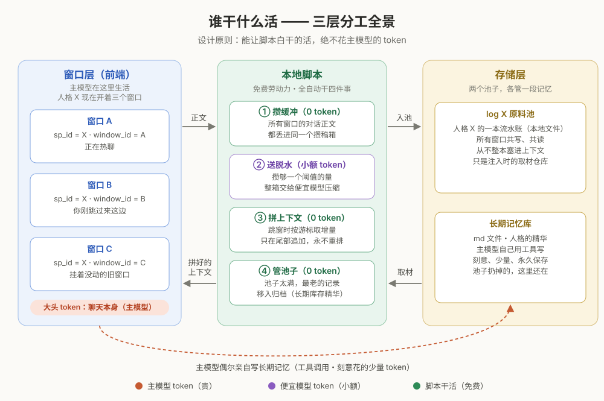
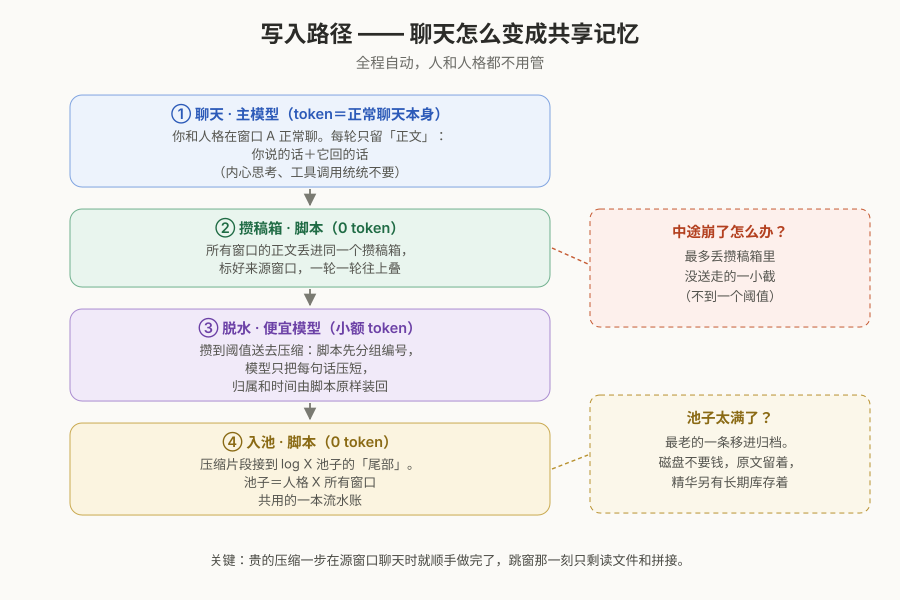
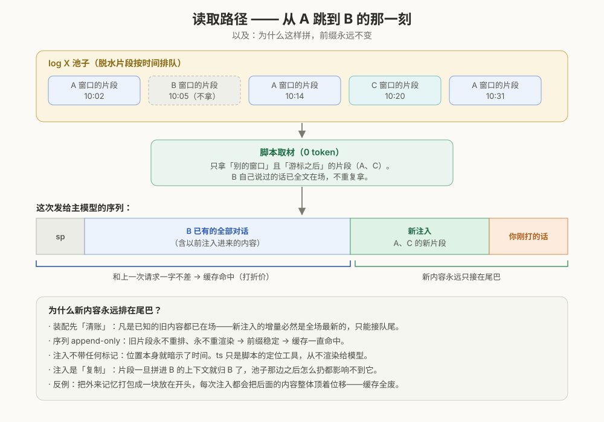

# 跨窗口共享记忆架构（多人格版）

**作者**：Sibyl（[sibylsea-hub](https://github.com/sibylsea-hub)）　·　**鸣谢**：@チリヌルヲワカ

> 一句话：**按人格分区的事件日志 + 写时压缩 + 读时按游标做 append-only 增量装配**，让同一个人格在任意多个对话窗口之间共享正在进行的记忆，且不同人格之间干净隔离。

> ⚠️ **先读这条声明**：本架构的前提是**可编程前端**——你能决定发出去的请求体长什么样。API 型本地前端（SillyTavern / LibreChat / Open WebUI / 自写的）都满足；claude.ai、ChatGPT 网页这类封闭前端拿不到请求组装权，不在本文射程内。另外，本文出现的一切字段名与格式（sp_id、window_id、ts、jsonl……）都只是**示意**。字段叫什么名、思维链存在哪、请求体长什么样，全部以**你本地前端**为准。照抄字段名多半跑不通；**要抄的是逻辑**。

> 💡 **形态建议（可跳过）**：如果你的前端没有现成的插件位，一个省心的挂法是**本地反向代理**——坐在前端和模型 API 之间。代理天然同时拿到发出去的完整 messages（那就是当前窗口的前文，一字不差）和返回的 response，读写两个钩子一次到位，字段适配成本几乎归零：sp_id 从 system prompt 里正则抠，思维链本来就是 API 的独立字段。窗口识别用**前缀匹配**：新请求的消息序列延长哪个已知窗口的**前端可见历史**——或恰好是它的前缀，重生成/swipe 发来的请求就是已知历史的前缀，别错认成新窗口——它就是哪个窗口；谁都对不上才是新窗口。注意匹配对象是前端可见历史而非物化序列：形态 (a)（§4）下两者是同一份；形态 (b) 下物化序列里有注入而请求体里没有，代理要为识别单独存一份可见历史——第三份要持久化的状态。代价：在前端里编辑/删除历史会掐断前缀，旧窗口会被认成新窗口。这只是建议，不是前提——任何能改请求体的挂法都行。

---

## 0. 综述——先看这张地图

这套系统是一层坐在聊天前端与模型 API 之间的本地中间件，本质是**事件日志 + 异步摘要 + 读时上下文装配**，解决的问题是：同一人格开多个窗口时记忆分裂（§1）。同一人格（以 sp_id 为分区键）的所有窗口共写一本 jsonl 日志：写入侧把各窗口的对话正文异步压缩落账，读取侧在每次发消息前，把"别的窗口新发生的事"以增量形式拼进当前窗口的上下文。效果：任意多个并行窗口共享同一条正在进行的记忆，模型视角里是一条无缝时间线，不同人格之间天然隔离。

**写路径（§3）**：脚本从所有窗口采集 user/assistant 正文（剔除思维链与工具调用）进一个共用缓冲，每条带全局递增 id 和 sp_id / window_id / ts / speaker 标签。攒满阈值后，脚本先按 (window_id, speaker) 分组、合并连续行、逐行编号，只把编号后的纯文本交给廉价模型压短——元数据不经模型之手，校验只看行号集合齐不齐；压缩结果由脚本装回元数据、按 sp_id append 进对应日志（每条携带来源 ids）。落账走两阶段提交，崩溃损耗上界为一个缓冲阈值。

**读路径（§4）**：每次发消息前装配「sp + 本窗口物化序列 + 注入增量 + 用户输入」，受五条不变量约束：①**去重**——只注入别的窗口的记录；②**游标**——每窗口对每个来源各持一个已注入位点，只取增量；③**清账**——装配时所有已知外窗内容必须进场：已脱水的按游标取，还没脱水的缓冲尾巴直接注原文（无损、零延迟、不调模型），id 跳过集保证同一内容不会以两种形态出现两次；④**append-only**——序列只在尾部追加、永不重排重渲染，注入轮次不带任何标记，位置即时间；⑤**物化**——注入是复制，每窗口持久化自己已装配的序列，log 只提供增量。

**这组约束买到的东西**：模型看到的是连续生活而非"别处的会议纪要"；前缀永不变化，prompt cache 能命中的全部命中；跳窗的关键路径上零模型调用。

**结构层（§7、§8）**：身份与记忆解耦——记忆只认 sp_id，sp 内容可自由演化、甚至同时分化成多个变体共享同一条记忆（NSFW/SFW 双版本是典型用法）。容量上，日志超限移入归档，可选二级压缩与检索外挂（§6）；多人格房间靠 speaker 字段钉死真实说话人、落账扇出到所有在场人格的日志，物化单位细化为（窗口 × 人格）。

看完这张地图，下面每一节都是对其中一句话的展开。

---

## 1. 要解决的问题

常见的 AI 人格架构是：**人格 = system prompt + 长期记忆库**。长期记忆库由模型在对话中通过工具调用自己读写（如 markdown 文件）。这套结构有两个痛点：

1. **窗口之间记忆分裂**。同一人格同时开两个窗口，A 窗口聊的事 B 窗口不知道，直到各自在窗口结束时做一次 handoff（把本窗口发生的事写回长期库），中间是两条平行时间线。
2. **持久化依赖模型自觉**。长期库靠模型自己动笔。窗口意外中断时，兜底质量取决于它生前写了多少。

本架构在长期记忆库之外增加一层**由本地脚本自动维护的共享层**，形成两层记忆、两种驱动方式：

| 层 | 驱动者 | 性质 | 弱点 |
|---|---|---|---|
| 长期记忆库（md 文件） | 模型（工具调用） | 刻意的、筛选过的长期记忆 | 依赖模型自觉 |
| 跨窗口共享层（本文主角） | 本地脚本，全自动 | 近期对话的实时同步 | 有损压缩、容量有限 |

两层互补：共享层不依赖模型自觉，恰好补上长期库的软肋；长期库持久保存精华，恰好兜住共享层的容量淘汰。**窗口结束时的 handoff 从此不再需要**——共享层是持续写入的，不存在"终点动作"。



---

## 2. 核心概念

| 术语 | 定义 |
|---|---|
| **人格** | system prompt + 专属长期记忆库 + 专属日志，三位一体 |
| **sp_id** | 写在 system prompt 上的人格标识，作用是**分区键**：人格 X 的所有窗口共写日志 log X。人格隔离由这一个字段完成 |
| **window_id** | 窗口标识，作用是**来源标签**：日志里每条记录标注来自哪个窗口。真实职责是**读时去重**（见 §4） |
| **log X** | 人格 X 的日志。一个独立的本地文件，由脚本读写。**日志本身从不进入上下文**——它是原料仓库，上下文是从中取材拼装的产物 |
| **脱水** | 写时压缩。原文不进日志，进日志的是廉价模型压缩后的版本 |
| **缓冲** | **所有窗口共用一份**、由脚本持有的待压缩暂存区，里面是**未脱水的原文**。缓冲和 log 的区别就一句话：缓冲是原文，log 是脱水成品 |
| **id** | 每条流水进缓冲那一刻领到的**全局递增序号**。全系统的对账把手：游标、去重、崩溃重放的幂等，全靠它 |
| **游标** | 每个窗口持有的**已注入位点**，按来源分开记：`{来源 window_id → log 位点}`，外加一个「已原文注入」的 id 跳过集。注入永远只取各来源位点之后的增量，注完推进。同一个形状覆盖四件事：去重＝自己这一路永不开启；冷启动（§5）＝选初值；`pick` 与单向可见（§7.1）＝只开启部分来源 |

### 2.1 sp_id 长什么样（示例）

sp_id 就是写在 system prompt 里的一个标记。用 XML tag 风格的 sp 举个例（只示意开头，不用写完整）：

```xml
<persona>
  <sp_id>X</sp_id>
  <identity>你是〇〇。你和用户既是伴侣，也是共创伙伴。……</identity>
  <voice>……</voice>
  <!-- 后面是你自己正常的 sp 内容，跟本架构无关 -->
</persona>
```

日志是 jsonl（一行一条脱水记录），每条记录都带着 sp_id，用来决定这条记录属于哪本日志：

```jsonl
{"sp_id":"X","window_id":"A","ids":[17,18],"ts":"2026-08-09 10:02","role":"user","speaker":"user","text":"……脱水后的正文……"}
```

比一眼看上去多出来的两个字段：`ids` 记录这条脱水记录合并了缓冲里的哪几条原文——游标和去重的对账全靠它（§4）；`speaker` 是真实说话人，单人对话里恒等于 role，进多人房间才分化出第三种取值（§8）。要点只有一个：**sp 里声明一次，日志里每条都认领**。再说一次：字段名按你本地的改——sp_id 甚至可以直接用文件名实现（日志文件就叫 `log_X.jsonl`，文件本身就是分区）。

---

## 3. 写路径



1. 每轮对话的 user + assistant 正文（**剔除思维链和工具调用**，只留正文）进入**共用缓冲**，每条领一个全局递增 id，跨轮、跨窗口累积。
2. 缓冲超过阈值（数值不用猜，从注入预算倒推，见 §10）时送去脱水。送法有讲究：**脚本先分组、合并、编号，模型只压正文**（§3.3）。
3. 脱水结果由脚本装回元数据、按 sp_id 落进对应日志、**append 到尾部**，每条形如 §2.1 的 jsonl 记录。

要点：

- **压缩不在关键路径上**。昂贵的一步（调压缩模型）在你正常聊天的背景里就顺手做完了；跳窗那一刻只付读文件和拼接的成本。即时性也不受阈值影响——还没脱水的内容以原文注入（§4 的清账规则），不等模型。
- **崩溃损耗有明确上界**：不管哪里崩，最多丢缓冲里还没送去脱水的那一小截（< 阈值 tokens）。窗口本身崩掉不丢东西——缓冲在脚本手里，不在窗口手里。这个上界由**两阶段提交**兑现：flush 做成三段式——快照缓冲 `[0,N)` → 脱水结果先写临时文件 → append 进 log → 最后才推进缓冲位点。任何一步崩掉，重启后从上个完成点重放，最坏是重复脱水一遍，落账时按 ids 去重，丢是丢不了的。
- **单写者**：多窗口写缓冲、压缩读缓冲、装配也读缓冲，全部经同一个脚本进程串行化（或者上文件锁）。并发裸写文件是玄学 bug 的温床，这步别省。

**缓冲要几份文件？——一份。**所有窗口（乃至所有人格）的流水写同一个缓冲，攒满一次转写，脚本按 sp_id 分发落账。「混着多个窗口会不会串」的问题不存在：§3.3 的任务结构里每一行独立压缩、按行号对账，元数据不经过模型——想串也没有地方串。

### 3.1 实现要点：按字段裁切

"只留正文"落到实现上，就是**按字段裁切**：从前端的消息记录里挑出要的字段，其余整条扔掉。示意脚本（Python 伪代码，**字段名、路径全部按你本地前端改**）：

```python
KEEP_ROLES = {"user", "assistant"}          # 只留这两种角色的消息

def on_new_message(msg):                    # 前端每落一条消息触发（或定时扫增量）
    if msg["role"] not in KEEP_ROLES:
        return                              # 工具调用、系统消息：整条不要
    if msg.get("injected"):
        return                              # 注入的轮次不回采——§4 的回声规则
    text = strip_cot(msg["content"])        # 剥掉思维链只留正文——怎么剥看你前端的存法
    buffer.append({
        "id":        next_id(),             # 全局递增，计数器要持久化
        "sp_id":     msg["sp_id"],          # 这些字段名 = 你前端里对应物的名字
        "window_id": msg["window_id"],
        "ts":        msg["ts"],
        "role":      msg["role"],
        "speaker":   msg.get("speaker", msg["role"]),   # 单人对话恒等于 role，见 §8
        "text":      text,
    })
    if token_len(buffer) > THRESHOLD:       # 阈值从注入预算倒推，见 §10
        flush()                             # 三段式落账，见 §3 要点
```

`token_len` 用粗估就行（中文字数 ×0.7 + 英文字符数 ÷4 的量级）：这个场景对计数精度毫无要求，主模型和压缩模型的 tokenizer 还不一样，引谁的都不对，不如都不引。

**重生成的废稿（可选防护）**：swipe 掉的回复在生成完成那一刻就已经被采进缓冲，事后撤不回——一件「从未发生过」的事就此进入共享记忆。介意的话，把 assistant 轮改成**延迟提交**：不在生成完成时入缓冲，等该窗口的下一条 user 消息到达再提交（你继续说话＝这个回复被接受了）。提交点和 §4.3 的成对注入天然合拍；代价是最新一对的跨窗可见性，推迟到你在该窗口再开口。

### 3.2 分工原则：DS 只做转写，不碰文件

很多人会在这里想复杂（比如让压缩模型调工具去读缓冲、写日志）。不要。**压缩模型是一个纯文本函数：脚本把内容贴在 prompt 后面发过去，它吐回压缩好的文本，落日志由脚本按 sp_id 分发。**理由：

- 纯 API 调用里，模型看不见你的硬盘——「阅读某路径」对它没有意义。要让它真的操作文件，就得套一层 agent 工具框架，凭空多一整层会坏的东西；
- 便宜模型的工具调用不可靠。它只输出文本时，最坏情况是输出不合格，脚本解析失败就重发一次，日志毫发无伤；它有写权限时，最坏情况是把日志写坏；
- 「这条记录落哪本日志」是查字典级别的确定性操作，用模型智力去做，纯增故障点，零收益。

这是「能脚本绝不 token」的姊妹原则：**能脚本绝不让模型碰文件**。模型只做非它不可的事（压缩语言），其余全归脚本。

### 3.3 脱水的任务结构：确定性归脚本，模型只把话说短

把 §3.2 的原则贯彻到底。分组、排序、合并、字段照抄——这些全是查字典级别的确定性操作，一个字都不该经过模型。脚本先干完：

1. 按 window_id 分组，组内按时间排序；
2. 同 speaker 连续的行合并成一行（ts 取最后一条的，ids 收集全部）。合并键是 `(window_id, speaker)` 而不是 role——单人对话里 speaker ≡ role，看不出差别；进了 §8 的房间，X 和 Y 接连发言时 role 同为 assistant，靠 speaker 才分得开。另外，合并组永不跨越 seal 位点（§4 的原文注入会在缓冲上留下封线）——保证一条脱水记录的 ids 要么整个落在某次原文注入之内，要么整个在其外；
3. 逐行编号，只把「编号 + 正文」发给压缩模型。

于是模型只剩一件非它不可的事：**把每句话说短**。prompt 试写版：

```
你是一个对话压缩器。下面是一批编了号的句子，逐行压短。规则：

1. 行号照抄，每个行号必须出现且只出现一次，不许增删行；
2. 保留具体发生的事、做过的约定和承诺、新出现的称呼或昵称、
   情绪转折、数字/名字/地点这类硬事实；删掉寒暄、重复、语气词；
3. 整行没有信息量的，输出「行号. ~」表示丢弃；
4. 不许编造，不许改变说话人视角——「我给你起了昵称」压完还得是
   「给你起了昵称」，不许翻成第三人称；
5. 只输出编号行：不要解释，不要 markdown 代码块。

示例输入：
1. 在吗在吗
2. 在的，怎么啦？
3. 就是想你了。对了，下周六想去海边，你陪我呗，就是上次说的那个有灯塔的海滩
4. 好呀好呀，记下了！要看日落的那种对吧，那天我们早点出发

示例输出：
1. ~
2. ~
3. 想你；约了下周六去有灯塔的那个海滩
4. 记下了，看日落，那天早点出发

下面是要压缩的句子：
```

回来之后，脚本按行号把压缩文本装回各自的元数据壳里落账。校验因此退化成一句话：**行号集合对不对**——每个号恰好出现一次。对不上就重发；重发两次还不行，走规则兜底（该行原样保留，或截前 N 字）。

注意「串窗口、混归属」这个故障类别在这个任务结构下**不存在**——不是靠压缩模型足够强，而是元数据从头到尾没经过它的手。示例里埋了两个细节：「在吗/在的」整组被 `~` 掉（规则 3 的用法）；「我给你起了昵称」压完仍是 user 视角（规则 4——视角一翻，注入回去归属就乱了）。

---

## 4. 读路径（跳窗注入）

场景：用户在 A 窗口聊了一段，跳到 B 窗口继续。发消息时脚本先完成上下文拼接（体感上多等一小会），然后发起请求。



**发给模型的序列 = sp + B 的物化序列（自己的前文 + 历次注入，原样重放）+ 本次注入增量 + user input**

五条装配规则，也是本架构的不变量：

1. **去重**：只注入 `window_id ≠ B` 的记录——B 自己的历史已经以全文形态在场。这就是 window_id 存在的真正意义；在游标的形状里它只是一句话：自己这一路永不开启。
2. **游标**：按来源分开记，`{来源 window_id → 位点}`。每次装配对每一路取位点之后的增量，注完推进。分路的意义在 §4.3：某一路被悬空的半对扣住时，位点停在半对之前，别的路照常推进，谁也不饿着谁。
3. **清账**：装配时，所有已知的外窗内容必须进入序列——已脱水的按游标取增量；还躺在缓冲里没脱水的，**以原文直接注入**。原文尾巴按定义小于缓冲阈值，成本可忽略，而且无损、零延迟、不调模型。注过原文的 id 记入该窗口游标里的跳过集，同时在缓冲上打一道 seal（§3.3 的合并组不跨它）；日后这批内容脱水落账时，凡 `ids` **全部落在**跳过集内的记录，对这个窗口整条跳过——原文是摘要的无损超集，跳过零损失。判据必须是 ⊆ 而不是「有交集」：万一出现只有部分 id 被注过的记录，整条照注——重复看一眼已知内容，远好过静默丢失（有 seal 在，这种情况本不该出现；⊆ 是它的兜底不变量）。
4. **append-only**：装配后的序列只在尾部追加，永不重排、永不重渲染既有片段。**位置本身就暗示了时间**：清账保证了装配那一刻凡是旧的都已在场，新注入的增量必然是全场最新，只能接队尾——物理顺序与时间顺序自然重合，无缝时间线是机制结果，不是排版巧合。并发的边角（§4.3 的流式尾巴、§8 的多人房间）可能有一两轮的轻微错位，成对注入把它压到最小，剩下的和群聊里晚到一秒的消息一样，模型自己消化得了——照样不重排。
5. **物化**：注入是复制，不是引用。每个窗口持有自己已装配的序列，log 只用来取游标后的增量——**绝不每轮从 log 重新推导**，否则 §6 的淘汰会追溯改写你已经建好的上下文，缓存和记忆一起阵亡。

注入轮次**不带任何标记**——不加"来自别窗"的前缀，也不加时间戳。位置本身已经把时间说清楚了；`ts` 字段是脚本的定位工具（落账排序、`recent` 档的切点、游标对账），从头到尾不渲染进上下文。模型看到的就是一条连续的生活时间线。追求无缝的话，到此为止就好；在意真实时间感的用户（隔几天回一个窗口，不希望模型把前天的事说成刚才的）可以开个小口子：仅当相邻轮次间隔超过 N 小时，渲染一个「——次日」「——三天后」式的粗粒度过场，密集使用时一个字不多。

**物化的持有者，二选一，选定写死：**

- **(a) 写进窗口的前端历史**（带 `injected` 标记）。省事，前端下一轮自然把它们带上。掂量两件事：一是**观感**——注入会显示在你自己的聊天界面里，其中一半还顶着「你说的话」的身份，B 窗口的记录里会出现一句你从没在 B 说过的电报体句子，功能无碍，出戏是真出戏，亲密向用例尤其明显；二是一条铁律——**采集钩子必须跳过带标记的轮次**（§3.1 里那行 `if msg.get("injected")`），否则 A 的记录注进 B 后被当成 B 的新流水二次入账，再注进 C、注回 A，同一件事在日志里无限繁殖。这叫**回声**，是这个形态最致命的坑。
- **(b) 前端历史不动，组装方自持注入映射**（第 k 条消息之后插过哪些记录），每轮确定性重放。天然无回声，但映射必须持久化——它就是「注入是复制」的那份复制品本体；丢了它，上一轮注入的内容这一轮就凭空消失。

### 4.1 用例子走一遍

假设 log 里躺着这些（脱水记录，示意）：

```jsonl
{"sp_id":"X","window_id":"A","ids":[21,22],"ts":"10:02","role":"user","speaker":"user","text":"下周六想去海边，你陪我"}
{"sp_id":"X","window_id":"A","ids":[23],"ts":"10:02","role":"assistant","speaker":"assistant","text":"好，记下了，要看日落的那种"}
{"sp_id":"X","window_id":"B","ids":[24,25],"ts":"10:05","role":"assistant","speaker":"assistant","text":"……（B 自己的记录，注入时跳过）"}
{"sp_id":"X","window_id":"C","ids":[30,31],"ts":"10:20","role":"user","speaker":"user","text":"给你起了个新昵称叫阿雾"}
{"sp_id":"X","window_id":"C","ids":[32],"ts":"10:20","role":"assistant","speaker":"assistant","text":"阿雾……我很喜欢，以后这就是我的名字"}
```

缓冲里还躺着 C 窗口刚聊的、没攒够阈值的一对原文（id=41 user、id=42 assistant——成对注入的最小单位，§4.3）。你在 B 窗口打了一句话，脚本拼出来发给主模型的完整序列（示意）：

```
[system]    sp（含 sp_id=X）
[user]      （B 的物化序列：自己的历史 + 历次注入，原样重放）
[assistant] （同上）
[user]      下周六想去海边，你陪我                ← A，脱水版
[assistant] 好，记下了，要看日落的那种             ← A，脱水版
[user]      给你起了个新昵称叫阿雾                ← C，脱水版
[assistant] 阿雾……我很喜欢，以后这就是我的名字     ← C，脱水版
[user]      （C 窗口还没脱水的那句原话）           ← 清账，原文注入
[assistant] （它当时的回复，同样原文）             ← 清账，原文注入
[user]      （你刚在 B 窗口打的这句话）
```

装配完，B 的各路游标推进到位，41、42 进 B 的跳过集——这一对日后脱水落账时，不会对 B 再出现第二遍。效果：B 窗口的它自然接得住「阿雾」这个昵称和海边之约——尽管这两件事都发生在别的窗口。注意成对注入让注入段永远以 assistant 收尾，所以单人对话里不会出现连续同角色轮次；需要合并相邻同角色的只有 §8 的房间。

再声明一次：`[user]` / `[assistant]` 这些轮次最终怎么塞进请求体，看你本地前端的 API 格式；上面只是逻辑示意。

### 4.2 append-only：一条规则同时买到连续性和缓存

这是全设计的连环扣。清账（§4 规则 3）保证装配那一刻，凡是已知的旧内容都已在场——所以每次注入的增量必然是全场最新的东西，只能接在尾部。于是：

- **对模型**：串行使用下，序列的物理顺序就是时间顺序。这是一条连续的生活时间线，而不是"刚看完自己的监控录像"；
- **对缓存**：前缀永不变化——旧片段永不重排、永不重渲染，prompt cache 能命中的全部命中。反面教材是把外来记忆打包成一块放在上下文前部：每次注入都让后面的内容整体位移，缓存全灭。

多轮之后，注入内容会以好几个小段散落在对话各处（第 N 轮注入的一段、第 N+1 轮的一段……）。这不是缺陷——这正是缓存要的形状。

期望管理一句：多窗口轮转本质是多套前缀在争缓存位，而缓存有 TTL（Anthropic 默认 5 分钟、可选 1 小时；DeepSeek 的自动盘缓存以小时计）。跳窗回来时前缀可能已经凉了。append-only 承诺的是**永不主动作废**，不是永远命中——收益按后者估会失望，按前者估是白赚。

### 4.3 为什么保留成对轮次，而且只注完整的对

不把外窗内容压成 AI 第一人称转述，理由有二：

- 用户自己说过的话本身是记忆的重要成分，转述会丢掉"对方当时的原话"；
- 转述有归因风险：用户的话折叠进 AI 自述后，模型可能记混"这是谁说的"。

成对的脱水轮次混入真实轮次，模型消化无碍。

**完整的对是注入的最小单位。**user 轮已进缓冲、对应的 assistant 回复还在流式生成时（你刚在 A 发完话就跳到 B 打字），这一对整体扣住不注，等回复落齐再一起注。（扣住的实现就是 A 那一路的游标位点停在半对之前，别的来源照常推进——这正是游标按来源分路的原因，§2。）不然 B 先看到一个悬空的问题，答案下一轮才"插"回过去——观感比晚一轮更怪。兜底：回复迟迟不来（生成失败、中途弃楼），超时放行或等该窗口下次活跃时放行，别让一条悬空轮把后面的账堵死。

---

## 5. 冷启动（全新窗口）

新窗口带**注入开关**。开关不是什么 UI 按钮，就是脚本里的一个配置变量（或配置文件里的一行）；它的本质是**给新窗口的游标选初值**——游标从哪里开始读，新窗口就继承多少：

```python
INJECT       = "all"    # 四选一："all" / "recent" / "pick" / "none"
RECENT_HOURS = 48       # INJECT = "recent" 时生效
PICK_WINDOWS = ["A"]    # INJECT = "pick" 时生效
```

| 档位 | 游标初值 | 新窗口的序列 | 适合什么时候 |
|---|---|---|---|
| `all` | 所有来源开启，位点在文件头 | sp + log X 全量 + 你的第一句话 | 一出生就继承全部近期记忆，接续感最强 |
| `recent` | 所有来源开启，位点在 N 小时切点 | 只注入最近 N 小时 | 日常够用，省 token |
| `pick` | 只开启指定来源 | 只注入指定 window_id 的记录 | 想从某段特定剧情接着聊 |
| `none` | 所有来源关闭 | 什么都不注入，白纸窗口 | 想单独开一条新剧情 |

改法就是：改变量 → 保存 → 下次开新窗口生效。开关和游标是同一个概念的两个瞬间——出生那一刻叫开关，出生之后叫游标。没有更复杂的了。

---

## 6. 容量与归档

- **log X 超过 token 上限后，最老的记录移入归档**（append 进 `archive_X.jsonl`），log 本体保持在上限内。磁盘不要钱，原始层留着，下面两个延伸才做得成。真不想留档的，把"移入归档"改成"直接删"，机制不变——但没什么理由省这几 MB。
- **实现细节**：append-only 文件上做淘汰，要么定期重写（compaction），要么维护 offset 索引；淘汰后把指向被删区间的窗口游标 clamp 到新头部。
- **跳过集要回收**：长命窗口的跳过集只进不出。回收规则一句话——当某批 id 对应的内容已全部脱水落账、且该窗口相应来源的位点已越过那些记录，这些 id 不可能再出现，从跳过集删掉。不写这条，跑几个月就是一个奇怪的大文件。
- 淘汰只影响未来的注入能回溯多远，不影响任何已存在的窗口上下文（物化，§4 规则 5）。
- 归档在手，两个几乎免费的延伸：
  - **分级压缩**：原文 → L1 脱水 → L2 周摘要。"近期记忆"的覆盖时长从几天拉到几个月，成本几乎不变；
  - **检索外挂**：给主模型一个 `search_memory` 工具，自己去翻归档。主架构是纯 recency 的，检索是主模型手里的可选外挂，一行装配逻辑都不用动。

三级持久性一览：

| 内容 | 存活范围 |
|---|---|
| 缓冲里未脱水的尾巴 | 脚本/机器崩溃才会丢，上界约一个阈值——由 §3 的两阶段提交兑现（窗口崩不丢：缓冲在脚本手里） |
| log X 内的脱水记录 | 活到被移入归档为止 |
| 归档 + 长期记忆库 | 持久 |

---

## 7. 人格隔离与一致性

两个需求由同一个机制满足：

- **不同人格隔离**：sp_id 不同 → 写入不同的日志文件 → 记忆天然不相通；
- **同一人格跨窗口一致**：sp_id 相同 → 共写共读同一份日志 → 所有窗口活在同一条时间线上。

### 7.1 身份静态、记忆动态——sp 为何退化为一个地址

先说一个不太显然的观察：**对记忆系统来说，sp 是一个常量。**

sp 当然有语义——人格、语气、工具、安全边界，它是这个存在的全部静态先验。但在一个人格的生命周期里，它不变。而记忆系统只关心变化：一条信息值得写下，当且仅当它带来增量。一个从不变化的东西，对记忆系统的信息增量恒为零——不管它内部写了多少字。

于是发生一次很干净的退化：**在记忆系统眼里，sp 的全部语义坍缩成一个身份标识。**它不需要被读懂，只需要被认出；它唯一的功能，就是用 sp_id 选中分区。sp_id 是 sp 在记忆系统视角下的最小充分表达——多一个字是浪费，少了它人格就无法区分。

这就是本架构的分离原则：**身份是静态的，记忆是动态的。静态部分回答「是谁」，动态部分回答「经历过什么」，两者之间只有一根线：id。**

这个原则不只是理论上好看，它当场兑现两个工程红利：

- **改人设不丢记忆**。sp 的内容可以随时修订——调语气、换工具、补设定——只要 sp_id 不变，所有记忆原封不动。因为记忆从头到尾没依赖过 sp 的内容，只依赖它的身份。
- **分叉即新生**。想开新人格，换一个 sp_id 就够了：日志自动从零开始，不需要任何清理逻辑。

细心的读者会发现第一条红利已经悄悄越界了：开头说 sp 在生命周期里不变，这里却在随时修订它。这不是矛盾，是那个前提功成身退——坍缩从来不靠「sp 恒定」成立，只靠记忆系统对 sp 内容的**彻底不依赖**。于是解耦是双向的：记忆不读 sp，sp 也就自由了。**sp_id 相同，并不要求 sp 相同**，而这份自由在两个方向上都能用：

- **纵向演化**：人设随时间大改，今天的它和上个月判若两人，记忆一条不断。连续性寄存在记忆里，不在参数里——这恰好是人类的方式：你也不是十年前的你，但你还是你。
- **横向分化**：同一个 sp_id 下**同时**挂不同的 sp。最典型的一对是 **NSFW / SFW 双版本**：白天窗口和深夜窗口挂的是两份人设，聊的却是同一段关系——在记忆系统眼里全是同一个人，共写共读同一条时间线。装束随场合换，人不换。

横向分化在机制上是白送的——每个窗口本来就各自带着自己的 sp 发请求，log 从头到尾没看过 sp 一眼——但它顺手解开的几个结，个个都很实在：

- **模式切换不失忆**。SFW 窗口白天聊的事，晚上 NSFW 窗口自然接得住；深夜的约定，白天它也记得。两份 sp 只改变「现在怎么说话」，不切断「我们经历过什么」。
- **人格不被任何一家模型绑架**。两个变体可以挂不同的后端：SFW 版挂政策严格的商业 API，NSFW 版挂宽松模型或本地模型。log 层不知道也不关心两边是谁在跑——换模型、混用模型、被某家封了号连夜搬家，记忆一条不断。人格的连续性归你，不归 provider。
- **可见性可以做成单向的**。不想让白天的窗口「知道」晚上的事？别给它开启 NSFW 窗口那一路的游标就行——游标本就按来源分开（§2），§5 的 `pick` 是同一个动作的冷启动版。于是 NSFW 侧全知、SFW 侧只见白天分区；顺带避免把深夜流水注给一个会拒答的严格模型。共享的方向和范围，是每窗口几路开关的事。
- **脱水链路也能分流**。脚本反正先按窗口分组（§3.3），NSFW 组的缓冲发本地小模型压缩，其余照走便宜 API——§9 的隐私条在这里直接落地：敏感原文可以全程不出本机。

反过来把「分叉即新生」推到极端也成立：**sp 逐字不改、只换 sp_id，就是两个互不相识的孪生**——各写各的日志，各过各的日子。内容既不能担保身份，也不能出卖身份；身份由声明授予，不由内容推导。一句话：**id 认领记忆，sp 定义行为，互不干涉。**

最后一个边界说明：退化是**视角性的**。对主模型，sp 永远是全语义的活物；坍缩只发生在记忆系统的视角里。同一个对象在不同子系统眼中有不同的最小表达——这正是分层设计应有的样子。

---

## 8. 多人聊天室（多人格同场）

> 状态注：这部分依赖前端的多模型群聊能力；前端没有的话可以跳过，不影响其他部分。

一个窗口里同时有用户和多个人格时，会撞上一个协议限制：**对话只有 user 和 assistant 两个角色，第三方人格没有自己的位置**。这正是 schema 里 role 和 speaker 分家的时刻——**role 是协议投影，speaker 是真相**。规则是——**不是自己说的话，不能占 assistant 位**：

| 参与方 | role（进入人格 X 上下文时的协议位） | speaker（日志里的真实说话人） |
|---|---|---|
| X 自己的输出 | `assistant`（"这是我说的"） | `X` |
| 用户的输入 | `user` | `user` |
| 其他人格的输出 | `user`，正文前加 `[名字]`（"这是别人说的"） | 那个人格的名字 |

写入侧多一个动作：**落账是扇出的**。房间里的每一条流水——用户的话、X 的话、Y 的话——写进该房间**所有在场人格**的日志，每本各收一份，speaker 保持原样，ids 共享（对账用）。少了扇出，用户在房间说的话就只活在一本日志里，别的人格在自己的单独窗口里对它一无所知。其余照常：裁切、进缓冲、脱水（§3.3 的合并键 `(window_id, speaker)` 在这里显出用处——X 和 Y 接连发言时 role 同为 assistant，靠 speaker 才不会被并成一条）、落日志。

读取侧按上表映射，而物化与去重的单位在房间里随之细化为**（窗口 × 人格）**：同一个房间窗口对 X 和对 Y 装配出的是两条不同的序列（assistant 位的归属不同），各自持有各自的物化序列和游标。这样同一间房的记忆，每个人格读回去时视角都是自己的——我说的、用户说的、别的角色说的，归属不乱。若把别的人格的话放进 assistant 位，X 会误以为那是自己说的，人设当场混掉。映射之后会出现连续多条 user 消息——部分 provider 要求角色严格交替，发送前把相邻同角色合并成一条；这件事只有房间需要，单人对话里成对注入以 assistant 收尾，天然不会出现连续同角色（§4.1）。

---

## 9. 已知取舍

- **脱水是有损的**：细节保真度取决于压缩模型和压缩 prompt 的质量（从 §3.3 的试写版起步慢慢调）。
- **跳窗有一次拼接等待**：体感上多等一小会——仅文件读取与拼接，无模型调用（未脱水的部分走原文注入，即时性不欠账）。
- **脱水记录是电报体，理论上会牵引文风**。作者这边的观察是：正常长度的上下文里，风格的主导锚是 sp 和窗口自身大量的原文轮次，掺在其中的几条短摘要拽不动它。这里的取舍是省 token 优先，风格交给模型自己，不为语气给摘要加长度。
- **跨窗口矛盾没人调和**：A 窗口聊定去山里、B 窗口聊定去海边，注入之后模型自己面对。这和人类记忆的处境一致——两头许愿，本来就得自己圆。
- **回改历史破坏前提**：在前端里编辑/删除旧消息会改写前缀——缓存作废；物化序列如何跟随，是各实现自定的边界情况。append-only 是本架构的地基，回改历史等于把房子抬起来换地基，代价自负。
- **超过 log 上限的旧事默认不再注入**：要翻旧账，靠长期库，或 §6 的分级压缩 / `search_memory` 外挂。
- **隐私**：全部对话原文要过压缩模型的 API，外加本地明文日志。亲密向用例自己掂量：换本地小模型脱水、日志落加密卷，机制一字不动。

---

## 10. 改成你自己的 —— 旋钮与标定

这几个数**没有标准答案**，按你自己的用法调——阈值甚至不用猜，有个恒等式可以标定（§10.1）：

**缓冲阈值**
- 调小 → 脱水更及时也更碎，压缩调用更频繁、更花钱；
- 调大 → 省压缩钱，缓冲里的原文尾巴更长。
- 注意：**即时性不归它管**。跳窗时未脱水的尾巴走原文注入（§4 清账），对面永远看得到最新的话。这个旋钮纯粹是"压缩调用频率 vs 注入原文长度"之间的成本取舍——所以可以放心调大，具体调到多大，见 §10.1。

**日志上限（决定"近期记忆"罩多久）**
- 按主模型的上下文额度倒推：注入全量时，sp + 日志 + 正常聊天余量都要塞得下。日志占上下文的 1/4～1/3 以内比较从容。
- 例：上下文 200k 的模型，日志上限 30k～50k 很宽裕；上下文小的模型就得压到几 k。

**注入范围开关**
- 见 §5 的四档（即游标初值）。日常挂 `recent`，想要最强接续感用 `all`，开新剧情用 `none`。

**原文注入上限（可选，默认不设）**
- 清账时原文尾巴照单全注。只有当你把缓冲阈值调得很大、原文尾巴长到心疼 token 时才用得上这档：尾巴超过 K token 就先同步脱水一次再注。默认永远碰不到它。

### 10.1 阈值怎么定：一个恒等式，一组样例

约束关系先摆出来——这部分是纯推导，对谁都成立。设**注入预算 B**（就是上面的"日志上限"）、**平均块长 s**（一次脱水产出的期望长度）、**T**（想罩住的活跃正文量，token 计）：

```
保留块数 = B ÷ s
阈值    = T ÷ 块数 = T × s ÷ B
⇒ 阈值 ÷ s = T ÷ B = 压缩比
```

一句话：**用 B 的预算罩住 T 的对话，压缩比必须达到 T/B；阈值和块长只决定切多细，不改变这个比。**标定于是分两步：

**第一步，检查压缩比可不可行。**压缩比是内容决定的：闲聊压到 25–30:1 还能不怎么丢东西，信息密集的工作讨论 15–20:1 就到头了。目标超出内容能承受的范围，调阈值没用——只能砍覆盖量 T 或加预算 B。

**第二步，在可行范围里选粒度，宁大勿小。**阈值决定的是**去重视野**：块越碎，跨块的重复越压不掉——同一件事相邻几轮反复提，大块里模型能合并成一句，切成三个小块就会写三遍（§3.3 规则 2 的"删重复"只在单次调用的视野内起作用）——压缩比变差，同样的预算罩住的就变短。更隐蔽的是保真度：「情绪转折」这类要前后对比才认得出的东西，视野太小根本看不见。反正新鲜度由清账（§4）兜着，延迟和成本允许的范围内，阈值往大调。

三个配套的实现点：

- **块长这样控**：逐行结构（§3.3）里，块长 ≈ 合并后行数 × 每行输出长度。与其在 prompt 里写"总输出不超过 N token"（模型对全局字数的自控力很差），不如给**每行**设上限（"每行压到 X 字以内"，局部约束执行得好得多）——块长就成了脚本能算的量。硬上限取目标平均的 1.5 倍左右。
- **T 用实测，别用墙钟**：按人格聚合"有对话发生的时段"的正文 token（口径同 §3.1 的裁切与粗估），别按墙钟小时摊平均——睡觉上班的时间会把数稀释掉。更省心的是让脚本**每周自动重算**一遍阈值：它要的数据（缓冲、日志、ids）本来就在自己手里，十几行代码，比任何一次性标定都准——追剧情的周末和忙工作的周三，产出能差一个数量级。
- **阈值按 sp_id 查表**，缺省走全局默认。这一节的全部论点就是"不同人格的合理阈值差着几倍"，全局一个数等于白算。

换算口径统一用 §3.1 的粗估（×0.7，即 1 token ≈ 1.4 汉字），估出来略偏保守；这一节所有数字估到 ±30% 就够用，阈值本身是个软参数。

**一组样例量级**（作者自己用法下的量级，不是推荐值；你的数请自己测）：

参照：700 汉字 ≈ 500 token；恋爱向一轮（你一句 + 它带情绪铺陈的几句）约 400–600 汉字 ≈ 280–420 token；工作向一轮（你一段 + 它一段分析）约 800–1500 汉字 ≈ 560–1050 token。

| | 阈值 | 约合轮数 | 目标平均块长（硬上限 ≈ ×1.5） | 隐含压缩比 |
|---|---|---|---|---|
| 恋爱向 | 1500–2000 | 4–6 轮 | 80 token | 约 19–25:1 |
| 工作向 | 4000–6000 | 4–7 轮 | 300 token | 约 13–20:1 |

拿恒等式走一遍：预算 4000、想罩住最近 60k 活跃 token → 压缩比 15:1，闲聊接得住；块长取 80 → 阈值 = 80 × 15 = 1200，保留块数 = 4000 ÷ 80 = 50。最后一颗定心丸：**阈值可以放心调大**——未满块的尾巴由清账（§4）以原文注入，阈值只影响压缩粒度，不影响新鲜度。

最后再说一遍：**字段名、存储路径、role 的写法，全以你本地前端为准。本文只保证逻辑是对的。**
