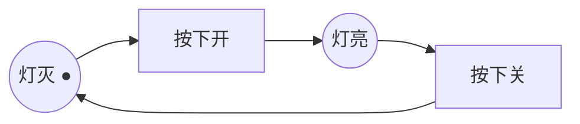
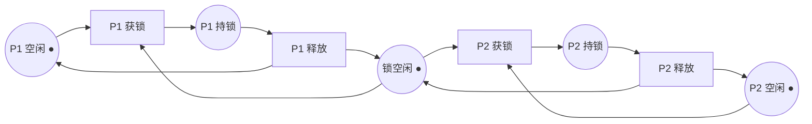

# Petri 网基础 · 通用教学材料（EX-02 前置学习用）

> 用途：满足 BRIEF §0 输入白名单第 2 项（"Petri 网基础材料：任一教材/教程的库所-变迁-token-不变式章节"），供 EX-02 题面第 1 步（0-20 min 学习段）使用。
> **边界声明**：本材料为通用教学内容，全部示例与训练对象协议无关；不含对 cross-window-memory 的任何分析、建模示例或结构暗示。EX-02 建模请独立完成。

---

## 1 · 六个核心概念

| 概念 | 记号 | 一句话 |
|---|---|---|
| 库所 place | 圆圈 ○ | 状态/条件/资源的"容器" |
| 变迁 transition | 方框 ▢ | 事件/动作，唯一能改变状态的东西 |
| 弧 arc | 有向边 → | 只连"库所↔变迁"，**库所之间不能直接连**（画出库所→库所就不是 PN 了） |
| token | 圆点 ● | 放在库所里的"筹码"；它代表什么由你定义（一条消息？一个权限？一个进程？）——**说不清 token 语义 = 模型作废** |
| 标识 marking | 向量 M | 每个库所里各有几个 token 的快照 = 系统全局状态 |
| 激发 firing | — | 变迁的输入库所 token 够数 → **使能**；激发时从每个输入库所取走 token、向每个输出库所放入 token |

关键直觉：**库所是名词，变迁是动词**。系统演化 = 标识经一串激发变成新标识。

## 2 · 三种基本结构（会认才会画）

- **顺序**：`○→▢→○→▢→○`，动作依次发生。
- **冲突/选择**：一个库所同时是两个变迁的输入——token 只有一个时，两个变迁**争抢**，只能有一个激发（谁先不确定：这就是非确定性）。
- **并发**：一个变迁输出到两个库所（fork），两条支路独立推进，最后由一个需要两路 token 的变迁汇合（join）。**并发交错**：两条支路的中间变迁激发次序任意，模型天然枚举全部交错——这正是拿 PN 审并发协议的价值。

## 3 · 两个通用小例

### 例 A · 开关灯（最小循环，讲使能/激发）

初始标识：`灯灭=1, 灯亮=0`。只有"按下开"使能；激发后 token 移入"灯亮"，此时只有"按下关"使能。任意时刻两库所 token 之和恒为 1。

### 例 B · 两进程抢一把互斥锁（讲冲突 + 不变式）

"锁空闲"只有 1 个 token，被两个"获锁"变迁争抢（冲突结构）→ 任何可达标识下 P1、P2 不可能同时持锁。

## 4 · 不变式（invariant）——从"画图"到"证性质"的桥

- **P-不变式（token 守恒律）**：某组库所的 token 加权和在**任意激发下不变**。例 B 中 `锁空闲 + P1持锁 + P2持锁 ≡ 1`（锁要么空闲要么恰被一人持有）——互斥性质不是"看起来对"，是**算出来恒成立**。
- **可达性表述**：安全性质常写成"从初始标识出发，**不存在**到达坏标识（如 P1持锁=1 且 P2持锁=1）的激发序列"。
- 两种表述形态（EX-03 会用到）：**不变式**（"任意可达标识下恒有…"）与**可达性**（"坏状态不可达"）。拿到一句自然语言承诺，先问：它是守恒律，还是坏状态排除？

## 5 · 建模自查五问（EX-02 第 3 步"存疑区"的尺子）

1. 每个库所的 token **代表什么**？（一个 token = 一条消息 / 一个写权 / 一个窗口？必须唯一明确）
2. 每条弧为什么存在？（激发时到底**取走/放入**什么）
3. 并发点在哪？图上是否真用了 fork/join 或多 token，还是只画了顺序流程图？
4. 冲突点在哪？谁在争抢哪个库所的 token？
5. 你想验证的性质，能写成"某组库所 token 的守恒式"或"某坏标识不可达"吗？写不出来 = 模型表达力缺口（诚实标注，这是发现不是失败）。

## 6 · 最常见的三个新手错误

1. **画成流程图**：库所连库所、箭头当"然后"用。每条弧必须是 库所↔变迁。
2. **token 语义漂移**：同一库所的 token 一会儿代表消息、一会儿代表权限。一个库所一种语义。
3. **并发画成顺序**：两件可交错的事画成先后固定——这会让你**漏掉全部交错场景**，而交错恰是并发协议出事的地方。

---
*材料性质：通用教学（对应任意 PN 教材第一章内容）；生成于 2026-08-12，主控备料，未含训练对象协议的任何分析。*
