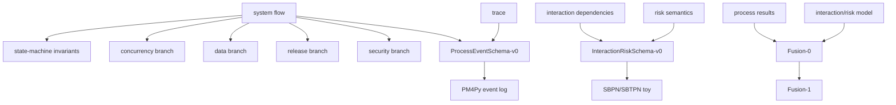

# EvoAgent Learning Map

## Why this case matters

EvoAgent is used here as a learning case for turning a concrete multi-agent system implementation into transferable engineering and research lessons. The case matters because it can connect four layers that learners often study separately:

1. control/data/feedback flow in an agent system;
2. state-machine, concurrency, data, release, and security constraints;
3. process-mining representations such as PM4Py event logs;
4. formal or semi-formal interaction-risk models such as SBPN/SBTPN toys.

This map is navigation only. It does not create the full curriculum, and it does not claim that current-source verification has already been completed.

## What this case cannot prove

This case cannot prove that a research transfer is valid without source-backed evidence, tests, and novelty review. It also cannot prove production readiness, real P0 counts, or fusion innovation from structure alone. Process structure can organize observations, but it is not itself evidence of risk propagation or research novelty.

Evidence labels used in this case:

- `DOC-CLAIM`: stated by documentation or plan, not independently checked.
- `STATIC-CONFIRMED`: confirmed by reading current source symbols.
- `TEST-CONFIRMED`: confirmed by tests.
- `RUNTIME-CONFIRMED`: confirmed by an observed run.
- `PRODUCTION-VALIDATED`: validated in production-like use with operational evidence.
- `RESEARCH-HYPOTHESIS`: proposed research mapping, not yet validated.
- `UNVERIFIED`: not verified yet.

## Entry diagnosis D0-D6

### D0 — full control/data/feedback flow

- Question: Can you reconstruct the full control flow, data flow, and feedback flow from user input to agent output and state update?
- Rubric:
  - L0 heard of it: can name control flow, data flow, and feedback flow as different views.
  - L1 can explain: can explain the major nodes and handoffs without reading code line by line.
  - L2 can implement or verify: can draw the flow and verify each edge against current source or runtime evidence.
- Where to read if below L1: [01_VERTICAL_SLICE.md](01_VERTICAL_SLICE.md), [SOURCES.md](SOURCES.md).
- Reconstruction task: Draw a one-page flow diagram with every edge labeled as control, data, or feedback and with an evidence label for each edge.

### D1 — state-machine invariants

- Question: What states exist, what transitions are allowed, and what invariants must remain true before and after each transition?
- Rubric:
  - L0 heard of it: can define state, transition, and invariant.
  - L1 can explain: can describe why invalid transitions create hidden failure modes.
  - L2 can implement or verify: can encode or audit transition rules and check invariant preservation.
- Where to read if below L1: [01_VERTICAL_SLICE.md](01_VERTICAL_SLICE.md), [02_PATTERN_CARDS.md](02_PATTERN_CARDS.md), [SOURCES.md](SOURCES.md).
- Reconstruction task: Write a state table with allowed transitions, forbidden transitions, and one invariant per state.

### D2 — why thread locks do not protect multiple processes

- Question: Why can a thread lock protect threads in one process but fail to protect shared resources across multiple processes?
- Rubric:
  - L0 heard of it: can distinguish thread and process.
  - L1 can explain: can explain that ordinary in-process locks do not coordinate independent process memory spaces.
  - L2 can implement or verify: can identify the shared resource boundary and propose or test a cross-process coordination mechanism.
- Where to read if below L1: [03_FAILURE_AND_EVIDENCE.md](03_FAILURE_AND_EVIDENCE.md), [SOURCES.md](SOURCES.md).
- Reconstruction task: Build a failure sketch showing two processes entering a critical region guarded only by separate in-process locks.

### D3 — retry vs idempotency vs resume

- Question: How do retry, idempotency, and resume differ, and why does checkpoint existence not by itself prove true resume?
- Rubric:
  - L0 heard of it: can define retry, idempotency, and resume at a vocabulary level.
  - L1 can explain: can explain how retry can duplicate side effects, idempotency can absorb duplicates, and resume requires reconstructable progress state.
  - L2 can implement or verify: can design a test that kills execution mid-step and verifies resumed behavior without duplicate or skipped effects.
- Where to read if below L1: [01_VERTICAL_SLICE.md](01_VERTICAL_SLICE.md), [03_FAILURE_AND_EVIDENCE.md](03_FAILURE_AND_EVIDENCE.md), [SOURCES.md](SOURCES.md).
- Reconstruction task: Create a three-column example comparing a naive retry, an idempotent operation, and a true resume path.

### D4 — trace to case/activity/event

- Question: Can you map a raw system trace into case, activity, timestamp, and event attributes?
- Rubric:
  - L0 heard of it: can name case, activity, and event.
  - L1 can explain: can explain why process mining needs event-log structure rather than arbitrary logs.
  - L2 can implement or verify: can transform a trace into a PM4Py-compatible event log and validate required fields.
- Where to read if below L1: [01_VERTICAL_SLICE.md](01_VERTICAL_SLICE.md), [tracks/PROCESS_RISK_PILOT.md](tracks/PROCESS_RISK_PILOT.md), [SOURCES.md](SOURCES.md).
- Reconstruction task: Convert three raw trace lines into a table with case id, activity, timestamp, actor, and payload summary.

### D5 — Petri Net place/transition/token semantics

- Question: What do places, transitions, and tokens mean, and how do they represent process state and movement?
- Rubric:
  - L0 heard of it: can identify place, transition, and token in a diagram.
  - L1 can explain: can explain firing semantics and how token movement changes marking.
  - L2 can implement or verify: can build a toy Petri Net and trace reachable markings for a small process.
- Where to read if below L1: [tracks/PROCESS_RISK_PILOT.md](tracks/PROCESS_RISK_PILOT.md), [02_PATTERN_CARDS.md](02_PATTERN_CARDS.md), [SOURCES.md](SOURCES.md).
- Reconstruction task: Draw a three-transition Petri Net and list the marking after each transition fires.

### D6 — why process structure is not risk propagation

- Question: Why does discovering a process model not automatically explain how risk propagates through agent interactions?
- Rubric:
  - L0 heard of it: can distinguish process order from risk causality.
  - L1 can explain: can explain that risk semantics require interaction dependencies, threat meaning, and propagation rules beyond event order.
  - L2 can implement or verify: can define a minimal interaction-risk schema and test a toy propagation example.
- Where to read if below L1: [tracks/PROCESS_RISK_PILOT.md](tracks/PROCESS_RISK_PILOT.md), [03_FAILURE_AND_EVIDENCE.md](03_FAILURE_AND_EVIDENCE.md), [SOURCES.md](SOURCES.md).
- Reconstruction task: Take one process edge and add the missing risk semantics: dependency, risk type, propagation condition, and evidence label.

## Mastery levels

- L0 heard of it: recognizes the vocabulary but cannot reconstruct the mechanism.
- L1 can explain: can explain the mechanism in their own words and identify what evidence would be needed.
- L2 can implement or verify: can rebuild the mechanism, test it, or verify it against current source/runtime evidence.

A learner should not mark a topic complete at L1 or L2 without a reconstruction artifact. Reading notes alone are not mastery evidence.

## Knowledge dependency graph

Text form:

- system flow leads to state, concurrency, data, release, and security branches.
- system flow plus trace leads to `ProcessEventSchema-v0`, then a PM4Py event log.
- interaction dependencies plus risk semantics lead to `InteractionRiskSchema-v0`, then an SBPN/SBTPN toy.
- process results plus the interaction/risk model lead to `Fusion-0`, then `Fusion-1`.

## First vertical slice

The first vertical slice should be one small, source-backed lesson that connects system reconstruction to process-risk representation without pretending that the whole curriculum is complete.

Minimum slice:

1. choose one concrete execution path;
2. reconstruct its control/data/feedback flow;
3. map at least three events into `ProcessEventSchema-v0`;
4. explain one concurrency or resume failure mode;
5. state which evidence labels are still `UNVERIFIED`;
6. stop before making research-transfer claims unless evidence and novelty review exist.

Usability gate for the vertical slice:

- a learner can follow it without opening unrelated chapters;
- every source-backed claim has an evidence label;
- every unverified claim is marked `UNVERIFIED` or `RESEARCH-HYPOTHESIS`;
- at least one reconstruction task is completed.

## Four ways to read

### Understand the system

Read to reconstruct what the system does: entry points, execution path, state changes, failure handling, and outputs. The guiding question is: “Can I redraw the system without copying the source?”

- Route: [00_LEARNING_MAP.md](00_LEARNING_MAP.md) → [01_VERTICAL_SLICE.md](01_VERTICAL_SLICE.md) → [03_FAILURE_AND_EVIDENCE.md](03_FAILURE_AND_EVIDENCE.md) → [SOURCES.md](SOURCES.md).
- Reconstruction checkpoint: redraw the selected execution path, label its state changes and failure edges, and attach an evidence label to every source-backed edge.

### Learn reusable patterns

Read to extract patterns that transfer beyond EvoAgent: state machines, idempotent effects, cross-process coordination, schema design, and evidence labels. The guiding question is: “What would still matter if the implementation were replaced?”

- Route: [01_VERTICAL_SLICE.md](01_VERTICAL_SLICE.md) → [02_PATTERN_CARDS.md](02_PATTERN_CARDS.md) → [LEARNING_LEDGER.md](LEARNING_LEDGER.md).
- Reconstruction checkpoint: restate one pattern as problem, invariant, mechanism, boundary, and test; do not mark it transferable until the boundary is explicit.

### Study failures and evidence

Read to separate plausible failure stories from verified failures. The guiding question is: “What evidence would change this from a concern into a confirmed finding?”

- Route: [01_VERTICAL_SLICE.md](01_VERTICAL_SLICE.md) → [03_FAILURE_AND_EVIDENCE.md](03_FAILURE_AND_EVIDENCE.md) → [SOURCES.md](SOURCES.md) → [LEARNING_LEDGER.md](LEARNING_LEDGER.md).
- Reconstruction checkpoint: write one failure chain with trigger, violated invariant, observable consequence, current evidence level, and the next test needed.

### Explore research transfer

Read to generate research hypotheses about process mining, interaction risk, and formal modeling. The guiding question is: “What must be verified before this becomes a publishable claim rather than an analogy?”

- Route: [01_VERTICAL_SLICE.md](01_VERTICAL_SLICE.md) → [tracks/PROCESS_RISK_PILOT.md](tracks/PROCESS_RISK_PILOT.md) → [SOURCES.md](SOURCES.md) → [LEARNING_LEDGER.md](LEARNING_LEDGER.md).
- Reconstruction checkpoint: map one event into both the process and interaction-risk views, then record a kill criterion; keep the transfer at `RESEARCH-HYPOTHESIS` until evidence and novelty review exist.

## Stop conditions against framework-building procrastination

Stop and return to the first vertical slice if any of the following happens:

1. creating more chapter skeletons before the vertical slice usability gate is complete;
2. calling reading complete without a reconstruction artifact;
3. calling research transfer validated without evidence or novelty review;
4. spending more time on framework structure than on one source-backed lesson.

These stop conditions are part of the learning design. The case should make the learner better at reconstructing mechanisms, not better at producing empty scaffolding.
