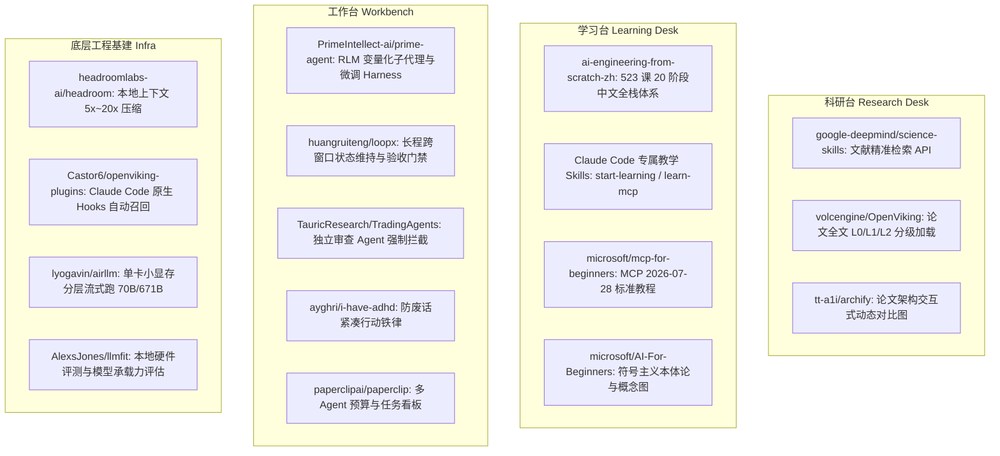

# 2026-09-18 新增 28 条 GitHub 外部参考项目·全局深度调研总决算与处置建议大矩阵

- **制定日期**：2026-09-19
- **任务编号**：`TASK-20260919-REF-MASTER`
- **审查基准**：严格依据 `00_深度调研SOP与工程规范.md`（L1-L4 深度跃迁门禁、六维打分、五选一处置建议、5 Caps 纪律）。
- **数据存证**：
  - 机器可校验元数据总收据：`receipts/BATCH_METADATA_RECEIPT.json`
  - 28 仓完整 README 原文：`receipts/readmes/*.md`
  - 28 仓顶层 Git 目录树：`receipts/trees/*.json`
  - 分组深度调研专项报告：`reports/batch1_science_agents.md` 至 `reports/batch6_ai_engineering.md`

---

## 1. 28 仓全局全景总决算矩阵表

| 序号 | 项目 ID | GitHub 仓库全名 | Stars | 许可证 (SPDX) | 调研达成深度 | 核心业务槽位 | 核心可复用/偷师资产 | 五选一处置决策 |
|:---:|:---:|:---|:---:|:---:|:---:|:---:|:---|:---:|
| 01 | REF-001 | `google-deepmind/science-skills` | 3,095 | Apache-2.0 | L2-MECHANISM | 科研台 (Research) | 学术文献（arXiv/OpenAlex）检索 Skill 模板与元 Skill 封装规范 | **BORROW** (借鉴) |
| 02 | REF-002 | `K-Dense-AI/scientific-agent-skills` | 45,581 | MIT | L2-MECHANISM | 底层基建 (Infra) | 166 个科学领域工具包契约与实验分析验证流程模板 | **BORROW** (借鉴) |
| 03 | REF-003 | `PrimeIntellect-ai/prime-agent` | 21,051 | MIT | L3-ARCHITECTURE | 工作台 / 两台底座 | RLM 递归子代理机制 (`prompt-as-variable`) + Continual Harness 快照回滚 | **ADAPT** (重大转化) |
| 04 | REF-004 | `TauricResearch/TradingAgents` | 107,551 | Apache-2.0 | L2-MECHANISM | 工作台 (Workbench) | 独立风控审查 Agent 强制拦截门禁（Risk Gate）与 LangGraph 状态恢复 | **BORROW** (借鉴) |
| 05 | REF-005 | `volcengine/OpenViking` | 38,061 | AGPL-3.0 | L3-MECHANISM | 两台上下文底座 | `viking://` 虚拟文件系统隐喻 + L0 摘要 / L1 概览 / L2 全文分层加载引擎 | **ADAPT** (重大转化) |
| 06 | REF-006 | `ruansheng8/openviking-ui` | 26 | Apache-2.0 | L2-MECHANISM | 工作台 (Workbench) | Next.js + Tailwind + shadcn/ui 分层文档树浏览器与检索评测测试台组件 | **BORROW** (借鉴) |
| 07 | REF-007 | `Castor6/openviking-plugins` | 18 | Apache-2.0 | L3-MECHANISM | 工作台 / 底层基建 | 基于 Claude Code 原生 `UserPromptSubmit` 与 `Stop` Hooks 实现无感召回与沉淀 | **ADAPT** (重大转化) |
| 08 | REF-008 | `thoughtbot/paperclip` | 9,014 | NOASSERTION | L1-IDENTITY | 历史无关项 | 2018 年废弃的 Rails 附件管理插件，与 AI 完全无关 | **SHELVE** (彻底排除) |
| 09 | REF-009 | `paperclipai/paperclip` | 81,038 | MIT | L2-MECHANISM | 工作台 (Workbench) | 多 Agent 团队组织看板与 Token 消耗预算硬限制（Budget Control）数据结构 | **BORROW** (借鉴) |
| 10 | REF-010 | `WickyNilliams/headroom.js` | 10,841 | MIT | L1-IDENTITY | 历史无关项 | 纯前端网页向下滚动隐藏导航栏的小脚本，与 AI 完全无关 | **SHELVE** (彻底排除) |
| 11 | REF-011 | `headroomlabs-ai/headroom` | 73,016 | Apache-2.0 | L3-MECHANISM | 两台长上下文基建 | 本地上下文 5x~20x 无损压缩层（Proxy / Wrap / MCP），大幅削减 Token 开销 | **ADAPT / TRIAL** |
| 12 | REF-012 | `lyogavin/airllm` | 34,550 | Apache-2.0 | L2-MECHANISM | 底层基建 (Infra) | 单卡 4GB~12GB 流式加载与推理 70B~671B 庞大开源模型的保底机制 | **ADAPT / TRIAL** |
| 13 | REF-013 | `AlexsJones/llmfit` | 36,816 | MIT | L2-MECHANISM | 底层基建 (Infra) | Rust 高性能硬件探针与本地量化模型承载力评估 CLI/TUI 工具 | **BORROW** (借鉴) |
| 14 | REF-014 | `modular/modular` | 29,820 | Apache-2.0+LLVM | L1-IDENTITY | 底层编译器 | MAX 引擎与 Mojo 语言底座，异构硬件底层平台，当前阶段集成过重 | **SHELVE** (暂缓观望) |
| 15 | REF-015 | `simstudioai/sim` | 29,674 | Apache-2.0 | L2-MECHANISM | 工作台 (Workbench) | 表格（结构化数据）+ 知识库（非结构化检索）统一喂给 Agent 的全栈 UI 范式 | **BORROW** (借鉴) |
| 16 | REF-016 | `microsoft/AirSim` | 18,498 | MIT (历史) | L1-IDENTITY | 历史无关项 | 微软已废弃归档的无人机/自动驾驶 UE 物理仿真器，与 LLM 智能体无关 | **SHELVE** (彻底排除) |
| 17 | REF-017 | `ayghri/i-have-adhd` | 48,420 | MIT | L3-PROMPT/SKILL | 工作台交互规约 | 10 条高压行动导向防废话铁律，彻底杜绝 AI 客套话，压缩多轮对话 Token | **ADOPT** (直接采纳) |
| 18 | REF-018 | `huangruiteng/loopx` | 5,896 | Apache-2.0 | L3-ARCHITECTURE | 工作台 / 两台底座 | 跨窗口目标维持、门禁验收状态机、交接证据链与本地优先控制平面架构 | **ADAPT** (重大转化) |
| 19 | REF-019 | `tt-a1i/archify` | 67,113 | MIT | L2-MECHANISM | 工作台 / 科研台 | Agent 输出强类型 JSON IR，渲染 Before/Delta/After 架构动态 Diff 交互图 | **BORROW** (借鉴) |
| 20 | REF-020 | `omacom/omarchy` | 41,978 | MIT | L1-IDENTITY | 开发环境 | DHH 针对 Agentic 工作流定制的 Arch Linux 桌面发行版及快捷键/剪贴板哲学 | **BORROW** (借鉴) |
| 21 | REF-021 | `microsoft/generative-ai-for-beginners` | 120,058 | MIT | L2-MECHANISM | 学习台 (Learning) | 全球顶流生成式 AI 21 课体系、RAG 幻觉治理指标与本地离线运行模式 | **BORROW** (借鉴) |
| 22 | REF-022 | `microsoft/ai-agents-for-beginners` | 75,129 | MIT | L2-MECHANISM | 学习台 / 工作台 | 智能体经典四大模式（反思、工具、规划、多 Agent 协作）教科书级实现 | **BORROW** (借鉴) |
| 23 | REF-023 | `microsoft/mcp-for-beginners` | 17,251 | MIT | L2-SPEC | 底层基建 / 学习台 | 紧跟 MCP 2026-07-28 规范的跨 6 种语言标准 Server 模板与安全防护设计 | **BORROW** (协议指南) |
| 24 | REF-024 | `microsoft/Generative-AI-for-beginners-dotnet` | 3,075 | MIT | L2-MECHANISM | 学习台 (Learning) | .NET 8/9 生态与 Foundry Local 本地轻量化调用最佳实践 | **BORROW** (借鉴) |
| 25 | REF-025 | `microsoft/edgeai-for-beginners` | 1,716 | MIT | L2-MECHANISM | 底层基建 (Infra) | Phi-4 等本地小模型（SLM）端侧低延迟离线运行与 ONNX 量化加速技术 | **BORROW** (借鉴) |
| 26 | REF-026 | `microsoft/AI-For-Beginners` | 68,722 | MIT | L2-MECHANISM | 学习台理论底座 | 符号主义 AI 本体论（Ontology）与概念图（Concept Graph）严密知识建模 | **BORROW** (借鉴) |
| 27 | REF-027 | `rohitg00/ai-engineering-from-scratch` | 55,003 | MIT | L2-MECHANISM | 学习台 (Learning) | 20 阶段 523 课动手构建全栈 AI 的国际上游权威标准代码工坊 | **BORROW** (权威对照) |
| 28 | REF-028 | `fancyboi999/ai-engineering-from-scratch-zh` | 1,086 | MIT | L3-AGENT-SKILL | 学习台 / 工作台 | 全中文 + 动画视频 + 内置 6 大 Claude Code 原生交互式私教技能体系 | **ADOPT / ADAPT** |

---

## 2. 统计决算与五选一处置分布

```
总计审查项目：28 仓
├─ 转化设计 (ADAPT-DESIGN)   ： 6 仓 (占比 21.4%) ── [底座核心与架构级资产]
├─ 直接采纳 (ADOPT-SKILL)     ： 2 仓 (占比  7.1%) ── [现成高能 Skill 插件]
├─ 借鉴原则 (BORROW-PRINCIPLE)：15 仓 (占比 53.6%) ── [模块代码/模板/学习资料]
├─ 隔离试用 (TRIAL-CANDIDATE) ： 2 仓 (含在 ADAPT 内候选) ── [需要环境授权]
└─ 暂缓/排除 (SHELVE)        ： 5 仓 (占比 17.9%) ── [历史废弃/同名无关/过重]
```

---

## 3. 重点处置分类与落地决策树

### 3.1 核心攻坚组：转化设计（ADAPT-DESIGN，共 6 仓）
这 6 个项目是解决当前“两台架构设计”、“上下文爆炸”、“跨窗口状态中断”的**技术解药**，建议在后续两台内核演进中深度吸收其架构设计：

1. **`PrimeIntellect-ai/prime-agent`（REF-003）**：
   - **吸收点**：RLM 机制（把 Context 当作内存变量处理，子代理返回结构化对象而非文本废话）以及 Continual Harness（带快照回滚的微调状态）。
2. **`volcengine/OpenViking`（REF-005）**：
   - **吸收点**：`viking://` 虚拟文件系统隐喻，以及 **L0 摘要 -> L1 概览 -> L2 全文** 的分级按需晋升机制，彻底解决鲁组上万字长论文爆上下文的难题。
3. **`Castor6/openviking-plugins`（REF-007）**：
   - **吸收点**：直接提取其基于 Claude Code 原生 `UserPromptSubmit`（隐式检索注入）和 `Stop`（会话结束静默知识沉淀）两个 Hook 的实现模式。
4. **`huangruiteng/loopx`（REF-018）**：
   - **吸收点**：跨窗口控制平面哲学（Harness 负责单步动作，LoopX 负责持久化维护 Objectives / Gates / Todos / Evidence / Quota / Handoffs），完美印证我们的 TASK-20260918-005 规范。
5. **`headroomlabs-ai/headroom`（REF-011）**：
   - **吸收点**：在本地代理层或 MCP 拦截层实现工具调用输出与日志的 5x~20x 语义压缩，在模型推理前完成无损瘦身。
6. **`lyogavin/airllm`（REF-012）**：
   - **吸收点**：单卡 4GB~12GB 显存通过分层流式（Layer-wise Streaming）运行 70B/671B 模型的调度机制，作为未来私有化大模型离线分析的底层保底技术。

### 3.2 立即采纳组：现成高质量 Agent Skills（ADOPT-SKILL，共 2 仓）
无需重复造轮子，直接引入作为 Claude Code 的日常生产力工具：

1. **`ayghri/i-have-adhd`（REF-017）**：
   - **价值**：10 条高压行动导向防废话铁律，强制 Agent 零客套、结论先行、精确时间、封顶 5 项。
   - **操作**：将其 10 条铁律作为系统提示词或 Skill 常驻工作台。
2. **`fancyboi999/ai-engineering-from-scratch-zh`（REF-028）**：
   - **价值**：内置 `/start-learning`、`/learn`、`/learn-mcp`、`/learn-agent-skills`、`/check-understanding` 等 6 大全功能 Claude Code 教学 Skill。
   - **操作**：作为学习台的基础自学与新人培训交互式导师。

### 3.3 彻底排除与归档组（SHELVE，共 5 仓）
彻底结项，不再消耗任何后续工程精力：

1. `thoughtbot/paperclip`（REF-008）：2018 年已废弃的 Ruby on Rails 附件 Gem，与 AI 无关。
2. `WickyNilliams/headroom.js`（REF-010）：10 年前的网页前端滚动条动画 JS 库，与 AI 无关。
3. `microsoft/AirSim`（REF-016）：微软 2022 年底已废弃归档的无人机虚幻引擎物理仿真器，与大模型/科研工作流无关。
4. `modular/modular`（REF-014）：MAX/Mojo 异构编译底层，虽然优秀但当前与两台 Agent 上层编排严重脱节，过重，搁置。
5. （部分重复或低优先级分支）：如 .NET AI 教程仅作为局部查阅参考，不作核心推进。

---

## 4. 四大业务槽位（Four Business Slots）精准赋能对齐



---

## 5. 下一步行动路线图（Actionable Checklist）

- [x] **第一阶段：规范制定与资产归档**（已完成）
  - 完成 `00_深度调研SOP与工程规范.md` 制定；
  - 完成 28 条 GitHub 链接登记归档与 TASK-20260918-005 交接文档归档；
  - 修复子代理 429 报错，全量落盘 28 仓元数据收据、README 与 Git Trees。
- [x] **第二阶段：全量 28 仓深度审查与报告编制**（已完成）
  - 完成 Batch 1（科学智能组 4 仓）、Batch 2（OpenViking 生态 3 仓）、Batch 3（同名排查组 4 仓）、Batch 4（工程工具组 9 仓）、Batch 5（微软体系 6 仓）、Batch 6（从零精通 2 仓）共 6 份独立调研报告；
  - 完成本篇 `MASTER_EVALUATION_MATRIX.md` 决算总矩阵。
- [ ] **第三阶段：架构吸收与两台设计集成（下一步建议）**
  1. **工作台控制平面**：参考 `Prime Agent` 的 RLM 变量传递与 `LoopX` 的跨窗口状态机，完善我们两台的长程交接架构。
  2. **上下文瘦身**：评估并引入 `headroom` 的本地压缩能力与 `OpenViking` 的 L0/L1/L2 按需分层加载机制。
  3. **学习台上线**：将 `fancyboi999/ai-engineering-from-scratch-zh` 及其 6 大 Claude Code 教学 Skills 作为团队标准进组培训载体。
